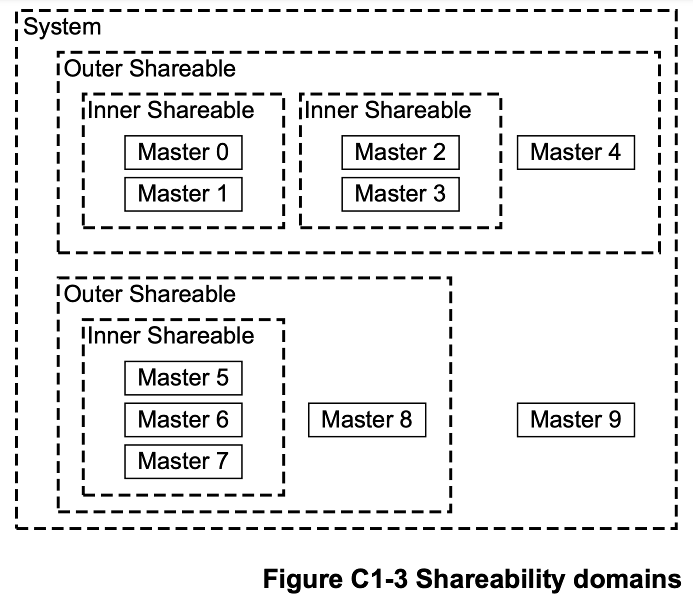
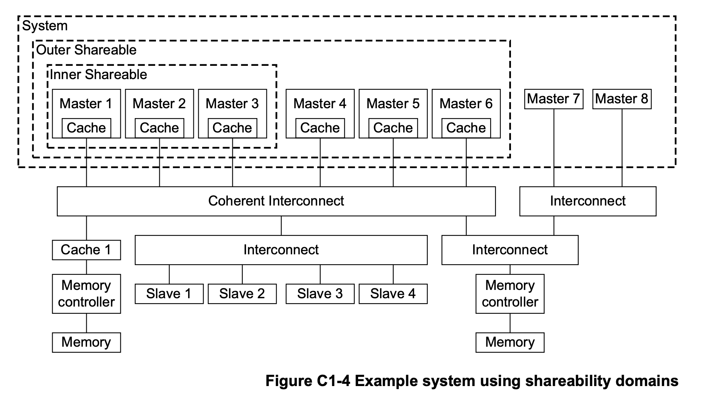

+++
Sources = [
"https://developer.arm.com/documentation/100941/0101/Memory-attributes",
"https://documentation-service.arm.com/static/65fdad3c1bc22b03bca90781?token=",
"https://krinkinmu.github.io/2024/01/14/aarch64-virtual-memory.htmlhttps://krinkinmu.github.io/2024/01/14/aarch64-virtual-memory.html",
"https://developer.arm.com/documentation/ihi0022/e/",
"https://community.arm.com/arm-community-blogs/b/architectures-and-processors-blog/posts/memory-access-ordering---an-introduction",

]
authors = [
"Michael Shalitin",

]
math = true
date = "2025-01-11"
categories = [

]
series = [

]
title = "Domains"
+++

## מבוא

הגישה לנתוני זיכרון עלולה להיות איטית יותר ולדרוש יותר כוח במערכות שבהן יש חומרת cache קוהרנטית, בהשוואה למערכות ללא מנגנון זה. כדי לצמצם את העלות הזו, נהוג לשמור על קוהרנטיות רק בין חלק מהרכיבים, תוך דאגה שהם ממוקמים קרוב פיזית זה לזה בתוך המעבד. לשם כך, ארכיטקטורת ARM מחלקת את המערכת לדומיינים, מה שמאפשר להגביל את הדרישה לקוהרנטיות רק לאזורים שבהם היא באמת נחוצה.

המורכבות של פרוטוקולי קוהרנטיות cache משתנה בהתאם לחלקים של המערכת שבהם יש לשמור על סנכרון. בהתאם למבנה המערכת, פרוטוקול קוהרנטיות יכול להיות פשוט או מסובך.

יש כל מיני מערכות שמסוגלות לתמוך במספר פרוטוקולים שונים של קוהרנטיות, בהתאם לחלקים במערכת שבהם שומרים על סנכרון.

## Shareability
### זיכרון רגיל Shareable

למיקומי זיכרון רגיל קיימת תכונת Shareability אשר יכולה להיות באחת מהקטגוריות הבאות:

- ניתן לשיתוף Inner: תכונה זו חלה בתוך דומיין השיתוף Inner בלבד.
- ניתן לשיתוף Outer: תכונה זו חלה על דומיין השיתוף Inner וגם ה-Outer.
- לא ניתן לשיתוף: המיקום אינו תומך בשיתוף בין רכיבים שונים.
- מערכת (System): כמו השם שלו, הוא כולל את כל רכיבי המערכת.

תכונות השיתוף הללו נועדו להגדיר את דרישות הקוהרנטיות של הנתונים הנמצאים במיקום זה, והחומרה נדרשת לאכוף את הדרישות הללו. עם זאת, תכונות השיתוף אינן משפיעות על דרישות הקוהרנטיות הקשורות לשליפת הוראות.

הערות:
	- מתכנני המערכת יכולים להשתמש בתכונת השיתוף כדי להגדיר אילו מיקומי זיכרון רגיל דורשים שמירה על קוהרנטיות. עם זאת, אין להניח שציון מיקום כ-Non-Shareable מאפשר לתוכנה להסיק שהמיקום אינו עקבי בין יחידות עיבוד שונות במערכת זיכרון משותף. הנחות כאלו אינן ניידות בין מערכות עם ריבוי מעבדים, אשר עשויות להשתמש באופן שונה בתכונת השיתוף.
	- כל יישום של מערכת עם ריבוי מעבדים עשוי לכלול cache שמשותף באופן טבעי בין יחידות עיבוד שונות.

לכל טרנזקציה של גישה לזיכרון במערכת מוקצה מצב shareability שמבוסס על מספר גורמים:

- תכונות הזיכרון: מאפייני האזור שאליו מתבצעת הגישה, שנקבעים על פי טבלאות תרגום ה-MMU.
- קונפיגורציית ה-core: התצורה של הליבות, שעשויה להשתנות בין ליבות שונות באותו cluster.
- יישום Interconnect: האופן שבו המעבדים מחוברים ביניהם משפיע גם הוא על קוהרנטיות.
- אינטגרציה של Interconnect: ההשפעה של מערכות interconnect המחברות בין המעבדים והמערכות המחוברות אליהן.

### שיתוף Inner ושיתוף Outer

בארכיטקטורת ARM, המערכת מחולקת באופן מופשט לדומיינים של שיתוף Inner ושיתוף Outer.

- דומיין שיתוף פנימי (Inner Shareable Domain): זהו דומיין הכולל קבוצה של יחידות עיבוד שצופות יחד באותם נתונים, ודורשות שהנתונים יישארו עקביים ביניהן כאשר נעשות גישות למיקומים בעלי תכונת השיתוף Inner.

- דומיין שיתוף חיצוני (Outer Shareable Domain): דומיין זה כולל קבוצה של יחידות עיבוד אשר הנתונים שלהן צריכים להיות עקביים ביניהן כאשר הן ניגשות לנתונים בעלי תכונת השיתוף Outer.
#### דגשים:
- כל יחידת עיבוד משתייכת רק לדומיין שיתוף Inner אחד.
- כל יחידת עיבוד משתייכת רק לדומיין שיתוף Outer אחד.
- כל יחידות העיבוד השייכות לאותו דומיין שיתוף Inner, הן גם חברים באותו דומיין שיתוף Outer. כלומר, דומיין השיתוף Inner הוא תמיד תת-קבוצה של דומיין השיתוף Outer.

הרעיון שהדומיין שיתוף Inner הוא תמיד תת-קבוצה של דומיין השיתוף Outer יוצר היררכיה ברורה בין ה-agent-ים ודומייני השיתוף השונים.

הרעיון מאחורי ההיררכיה הזו הוא שכאשר ה-agent-ים נמצאים בתוך דומיין שיתוף Inner, התקשורת ביניהם עשויה להיות מהירה יותר וחסכונית יותר בצריכת האנרגיה. לעומת זאת, שמירה על סנכרון בין כל ה-agent-ים בדומיין השיתוף Outer היא הכרחית על מנת להבטיח פעולה תקינה ומסודרת.

למשל, אם אנו יודעים שטווח זיכרון מסוים משמש רק על ידי agent-ים הנמצאים באותו דומיין שיתוף פנימי, נוכל לסמן את אותו טווח כניתן לשיתוף פנימי, ובכך לייעל את הגישה אליו.

בצד השני של הספקטרום, כאשר טווח זיכרון משמש מכשירים השייכים לדומיינים שיתוף Inner-ים שונים, אך הם נמצאים באותו דומיין שיתוף Outer, עלינו לסמן את אותו טווח כניתן לשיתוף Outer.

#### הערות נוספות:

- כל גישה לנתונים ממיקומים Non-cacheable תמיד מתבצעת בצורה קוהרנטית עבור כל רכיבי עיבוד, ולכן מיקומים כאלה תמיד מטופלים כשייכים לדומיין השיתוף החיצוני.

- דומיין Inner צפוי להיות הקבוצה של יחידות העיבוד שנשלטות על ידי מערכת הפעלה אחת או hypervisor אחד, ובנוסף הארכיטקטורה מניחה שכל יחידות העיבוד המשתמשות באותה מערכת הפעלה או באותו hypervisor יהיו תחת אותו דומיין Inner.

#### דוגמה לשימוש בתכונות Shareability

במערכת שבה יש תת-מערכת עם שני cluster-ים של יחידות עיבוד, קיימת דרישה להבטחת שיתוף וזיכרון קוהרנטי במצבים שונים, כדלקמן:

- בתוך כל cluster: ה-cache-ים של יחידות העיבוד ב-cluster שקופים ומשותפים עבור כל גישה למיקומי זיכרון שמוגדרים כ-Inner Shareable. המשמעות היא שבתוך אותו cluster, כל יחידת עיבוד רואה את אותו מידע באופן עקבי כאשר נעשות גישות למיקומים אלה.

- בין ה-cluster-ים:

	- ה-cache-ים אינם חייבים להיות קוהרנטיים כאשר מדובר בגישה למיקומי זיכרון עם תכונת השיתוף Inner בלבד. כלומר, נתונים עשויים להיות שונים בין ה-cluster-ים עבור תכונה זו.
	- עם זאת, הם כן קוהרנטיים כאשר מדובר בגישה למיקומי זיכרון עם תכונת השיתוף Outer. זאת אומרת שכל גישה למיקומים אלה תבטיח שהנתונים יהיו זהים ועקביים בין ה-cluster-ים.

במערכת כזו, כל cluster מוגדר כדומיין שיתוף Inner משלו, בעוד שכל הרכיבים בתת-המערכת שייכים לאותו דומיין שיתוף Outer.

##### הרחבת התרחיש למערכות מורכבות יותר:

מערכת יכולה לכלול שתי תת-מערכות כאלו. אם ה-cache-ים המאוחדים של אחת מתת-המערכות אינם שקופים לגישות מתת-המערכת השנייה, הדבר מוביל לכך שהמערכת תהיה מחולקת לשני תחומי שיתוף Outer נפרדים.

##### יתרונות רמות השיתוף:

שימוש בשתי רמות של שיתוף (פנימי וחיצוני) מאפשר למתכנני מערכות להוריד את עלויות הביצועים והאנרגיה עבור מיקומי זיכרון משותפים שלא נדרשים להיות חלק מדומיין השיתוף החיצוני.

### דומיין System

דומיין System הוא דומיין הרחב ביותר, שמשפיע על כל המערכת. פעולה המוגדרת על דומיין System תשפיע על כל ה-agent-ים במערכת: הן על אלו שאינם ניתנים לשיתוף, והן על הדומיינים ה-Inner-ים וה-Outer-ים הניתנים לשיתוף.

### זיכרון רגיל Non-shareable

במקרה של מיקומי זיכרון רגילים עם תכונת Non-shareable, המשמעות היא שהזיכרון צפוי להיות נגיש על ידי יחידת עיבוד אחת בלבד.

כאשר מיקום זיכרון מסומן כלא משותף, החומרה אינה נדרשת להבטיח קוהרנטיות בין רכיבי עיבוד שונים שניגשים לאותו מיקום בזיכרון, אלא אם הזיכרון non-cacheable.

עבור מיקומים Non-shareable, אם קיימים רכיבי עיבוד נוספים במערכת הזיכרון המשותפת (כגון יחידות עיבוד אחרות), תוכנה חייבת להפעיל הוראות לתחזוקת ה-cache על מנת למנוע בעיות קוהרנטיות שעלולות להתרחש כתוצאה משימוש ב-cache במהלך תקשורת בין רכיבי עיבוד אלה. בנוסף לתחזוקת ה-cache, יש צורך גם בפעולות מחסום זיכרון כדי להבטיח שהזיכרון ייגש בצורה מסודרת ולמנוע בעיות עקב חוסר קוהרנטיות בזיכרון.

### הוראות תחזוקת cache

המפרט עבור הוראות תחזוקת cache מתאר מה הפעולות שכל הוראה מבטיחה לבצע במערכת. עם זאת, המפרט אינו מגביל אפשרויות אחרות שעשויות להתרחש כל עוד הן עומדות בדרישות הבסיסיות של התנהגות ה-cache, התנהגות ה-cache באיפוס, וטעינת ה-cache מראש.

כלומר, כתוצאה מהפעלת הוראת תחזוקת cache, ייתכנו תופעות לוואי כמו:

- כל מיקום בזיכרון ה-cache עשוי להיות מנוקה.
- כל מיקום שאינו נעול ב-cache עשוי לעבור תהליך של clean ו-invalid.

ארכיטקטורת Arm ממליצה למזער ככל האפשר את תופעות הלוואי הללו, כדי לשפר את הביצועים. כמו כן, מומלץ בחום לוודא שתופעות לוואי הנגרמות מפעולות תחזוקה המבוצעות במצב אבטחה מסוים, לא ישפיעו באופן מהותי על הביצועים במצב אבטחה אחר.

#### דומיין חריג להוראת `IC IVAU`:

במערכת מרובת מעבדים, כאשר נעשה שימוש בפקודת `IC IVAU` עבור מיקום זיכרון non-cacheable, ההוראה משודרת רק בדומיין Inner Shareable של יחידת העיבוד שמריצה את ההוראה הזו. זהו חריג מהכלל הכללי שבו מיקומי זיכרון non-cacheable מטופלים כזיכרון Outer Shareable בחלקים אחרים של הארכיטקטורה.

### דומיינים ב-AMBA ACE

עוד דרך להבין את הרעיון של דומיינים ו-shareability היא לבדוק את הנושא בדרך יותר ארכיטקטונית עם פרוטוקול קוהרנטיות שמשתמש באותם הרעיונות והפרוטוקול AMBA ACE של Arm עושה את זה.

הערות:
	- הפרוטוקול כבר אמור לצאת משימוש אבל אני מציג בעזרתו בגלל שהוא מספיק טוב כדי להדגים את הרעינות האלה.
	- הפרוטוקול נועד לשימוש במערכות SoC שלמות ולא ב-core או במספר מעבדי SMP, וכנראה שבמעבדים כאלה יש פתרונות קצת שונים אבל עדיין אני אסביר בעזרתו בגלל שהוא מספיק טוב כדי להדגים את הרעינות האלה.

פרוטוקול ACE מתבסס על מושג המכונה shareability domains שהוא קבוצה של רכיבי מאסטר (הכוונה במאסטר זה רכיב עיבוד) שמאפשר לרכיב מאסטר אחד להחליט אילו רכיבי מאסטר אחרים לכלול כשהוא מייצר טרנזקציות קוהרנטיות או מחסום (מחסום זיכרון).

במסגרת טרנזקציות קוהרנטיות, רכיב מאסטר עושה שימוש בדומיין השיתוף כדי לקבוע אילו רכיבי מאסטר אחרים עשויים להחזיק בעותק של הכתובת ב-cache המקומי שלהם. רכיב ה-interconnect מנצל מידע זה על מנת לקבוע, עבור כל טרנזקציה נתונה, אילו רכיבי מאסטרים נדרשים לבצע snooping כדי להשלים את הטרנזקציה בצורה נכונה.

לגבי טרנזקציות מחסום, רכיב מאסטר עושה שימוש בדומיין השיתוף כדי לקבוע אילו רכיבי מאסטרים אחרים צריכים להיות מודעים למחסום שנקבע, כך שניתן לקבוע סדר בין פעולותיהם. הדומיין של טרנזקציית המחסום קובע גם את הצורך בהתפשטות של טרנזקציית המחסום, כמו גם את המאפיינים הנדרשים של המחסום כדי לקבוע את הסדר הנדרש בין הרכיבים.

פרוטוקול ACE מגדיר את הרמות השונות של דומיין השיתוף בצורה דומה ל-Arm:

- דומיין Non-shareable: דומיין זה כולל רכיב מאסטר יחיד בלבד.

- דומיין Inner Shareable: דומיין זה יכול לכלול מספר רכיבי מאסטר נוספים.

- דומיין Outer Shareable: דומיין זה כולל לפחות את כל רכיבי המאסטר שנמצאים בדומיין השיתוף הפנימי, אך יכול לכלול גם רכיבי מאסטר נוספים.

- דומיין System: דומיין זה כולל את כל רכיבי המאסטר הנמצאים במערכת כולה.

למרות שיכולים להתקיים מספר דומיינים מסוג Non-shareable, Inner Shareable ו-Outer Shareable במערכת, נדרשת קביעה עקבית לגבי רכיבי המאסטר הכלולים בכל דומיין. דוגמה לכך ניתן לראות באיור C1-3, שבו מאסטר 0 נמצא בדומיין שיתוף Inner עם מאסטר 1. לכן, על מאסטר 1 להיות גם הוא חלק מהדומיין שיתוף Inner של מאסטר 0.

בנוסף, יש להדגיש כי דומיינים מוגדרים כך שאינם חופפים זה לזה. עבור כל רכיב מאסטר בדומיין Outer Shareable, כל יתר רכיבי המאסטר בדומיין Inner Shareable שכולל את אותו רכיב מאסטר חייבים להיות חלק מאותו דומיין Outer Shareable.

כאשר מדובר בטרנזקציות שצריכות להיות גלויות לכל יתר רכיבי המאסטר במערכת, יש להשתמש בדומיין System. חשוב לציין שטרנזקציות בדומיין System יכולות לכלול רכיבי מאסטר שאין להם cache-ים קוהרנטיים בחומרה, ולכן אסור לאחסן טרנזקציות אלו בשום רמה.

האיור C1-4 מציג מערכת לדוגמה מנקודת המבט של מאסטר 1:

- ה-cache של מאסטר 1 מהווה זיכרון cache מקומי.
- ה-cache-ים של מאסטרים 2 עד 6 הם cache-ים עמיתים ל-cache המקומי של מאסטר 1.
- ה-cache-ים של מאסטרים 1 עד 3 נמצאים בדומיין Inner Shareable.
- ה-cache-ים של מאסטרים 1 עד 6 נמצאים בדומיין Outer Shareable.
- ה-Cache 1 מהווה cache ב-downstream.

