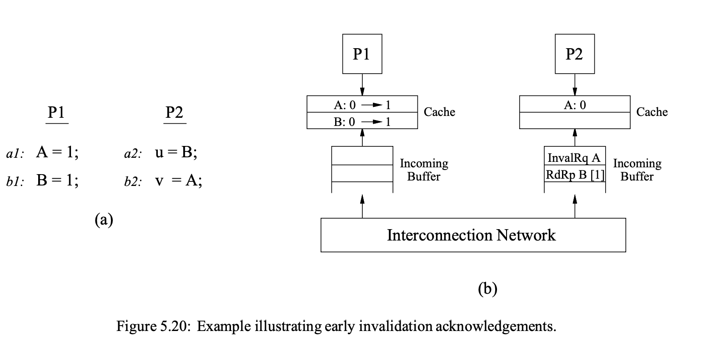

+++
Sources = [
"https://krinkinmu.github.io/2024/01/14/aarch64-virtual-memory.html",
"http://infolab.stanford.edu/pub/cstr/reports/csl/tr/95/685/CSL-TR-95-685.pdf",
"https://documentation-service.arm.com/static/65fdad3c1bc22b03bca90781?token=",

]
authors = [
"Michael Shalitin",

]
math = true
date = "2025-01-11"
categories = [

]
series = [

]
title = "Early Write Acknowledgment"
+++

## מבוא

בדרך כלל, אנו מצפים שבקשות invalidate יאושרו רק לאחר שכל העותקים הישנים של ה-cache line יוסרו מהיררכיית ה-cache של המעבד. בכך, האישור מעיד על כך שהכתיבה הסתיימה במלואה ביחס למעבד מסוים. עם זאת, כדי לצמצם את ההשהיה שנוצרת במהלך אישור כתיבות, במיוחד במערכות עם היררכיות cache עמוקות, נעשה שימוש באופטימיזציה נפוצה. אופטימיזציה זו מאשרת את בקשת ה-invalidate ברגע שהיא נכנסת לתור היררכיית ה-cache, עוד לפני שכל העותקים הישנים נמחקים בפועל.

גישה זו לא רק מקצרת את זמן ההמתנה אלא גם מפשטת את ניהול מצבי deadlock בעת עיבוד בקשות invalidate בהיררכיית ה-cache, מאחר שתשובת האישור לא מגיעה מתוך ההיררכיה עצמה. עם זאת, יישום שגוי של אופטימיזציה זו עלול להוביל לבעיות, מכיוון שתשובת האישור לא תמיד תייצג את השלמת הכתיבה ביחס למעבד היעד בצורה מדויקת.

כדי לפשט את הדיון על אופטימיזציה זו, נוסיף הגדרה של קבוצת אירועים פיזיים חדשים שקשורים לפעולת כתיבה. פעולת הכתיבה כוללת מספר אירועי השלמה עבור כל אחד מהמעבדים במערכת. לכל כתיבה, מוגדר גם אירוע התחייבות (commit) לכל מעבד, שמסמן את הרגע שבו הכתיבה מאושרת, בין אם במפורש ובין אם בעקיפין, והיא מתבצעת לפני אירוע ההשלמה עבור המעבד במקרים שבהם מתבצע אישור מוקדם.

בואו נבחן תרחיש שבו מתבצעים אישורי invalidate מוקדמים. כאשר P1 כותב ל-A, מתבצעת בקשת invalidate שנשלחת ל-P2. הבקשת invalidate נכנסת לתור ב-P2, ותשובת אישור מופקת. בשלב זה, הכתיבה ל-A נחשבת למחוייבת, אך היא עדיין לא הושלמה ביחס ל-P2, כלומר, P2 עדיין יכול לגשת לערך הישן של A.

בעוד שבקשת invalidate נותרת בתור, P1 יכול להמשיך ולהנפיק את הכתיבה שלו ל-B, ובמקביל, P2 יכול להנפיק את בקשת הקריאה שלו ל-B. האיור 5.20(b) מתעד את מצב ה-buffer של P2 בשלב זה, כאשר בקשת ה-invalidate עבור A ותשובת הקריאה עבור B (עם ערך ההחזרה של 1) נמצאות בתור.

בעיה מרכזית בתרחיש זה היא שהאפשרות לתת לתשובת הקריאה לעקוף את בקשת הביטול בתור, דבר שיתאפשר ביישום רגיל, עלולה להפר את מודל SC. הסיבה לכך היא ש-P2 יכול להמשיך לקרוא את הערך הישן של A מתוך ה-cache שלו לאחר שכבר השיג את הערך החדש עבור B.

## ARM

ב-Arm העיקרון של Early Write Acknowledgement עוסק במצב שבו כותבים לרכיב שממופה לזיכרון של device, ייתכן שתרצה להמתין עד שהכתיבה תושלם במלואה, וההתקן עצמו יאשר את הכתיבה.

האישור המוקדם קובע שהכתיבה צריכה להיות מאושרת על ידי ההתקן עצמו ולא על ידי גורם מתווך כלשהו, כמו buffer ביניים או רכיב בין המעבד להתקן. למשל, ניתן לחשוב על bus מורכב כדוגמת PCIe, שבו ה-bus עצמו הוא רכיב מורכב, אך הוא יכול גם להכיל מכשירים אחרים בתוכו שמחוברים אליו, כולל התקני bridge או hub שמיועדים להעברת הודעות ואמורים להיות שקופים למשתמשי ה-bus.

כאשר אנחנו מציינים שאנחנו לא רוצים אישור כתיבה מוקדם, הכוונה היא לכך שאף אחד מהתקני הביניים הללו (למשל bus העצמו, hub-ים ,bridge-ים וכו') לא יאשר את הכתיבה בעצמם. במקום זאת, הם רק יעבירו את המידע להתקן היעד, וכאשר התקן זה יאשר את קבלת הכתיבה, הם יחזירו את התגובה.

צריך להדגיש שתכונת Early Write Acknowledgement משפיעה רק על המיקום שממנו מתקבל אישור הכתיבה מנקודת הקצה, והיא אינה משפיעה על סדר ההגעה של פעולות הכתיבה לנקודת הקצה.
### הוראות מחסום

במקרים רגילים, כאשר כותבים משהו בזיכרון, בדרך כלל לא נדרש להמתין לאישור הכתיבה (לפחות לא בצורה מפורשת). עם זאת, בארכיטקטורת ARM ניתן להמתין לאישור זה באמצעות הוראת המחסום `DSB` שגורמת להמתנה שהכתיבה תתפשט במלואה ותגיע להתקן היעד בצורה מפורשת.

