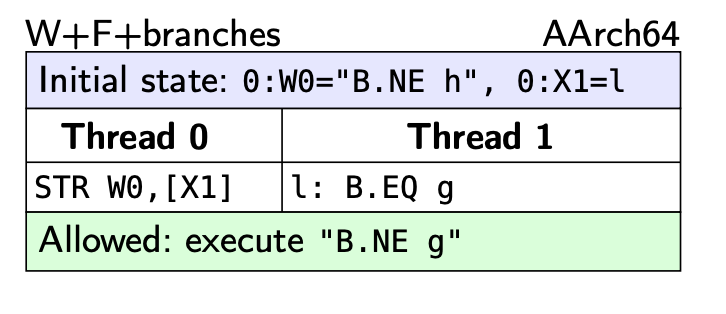

+++
Sources = [
"https://lwn.net/Articles/256433/",
"https://github.com/torvalds/linux/blob/v5.10/Documentation/core-api/atomic_ops.rst",
"https://www.joelfernandes.org/resources/lkmm_herd7.pdf",
"https://mirrors.edge.kernel.org/pub/linux/kernel/people/paulmck/LWNLinuxMM/StrongModel.html",
"https://preshing.com/20130618/atomic-vs-non-atomic-operations/",
"https://krinkinmu.github.io/2024/04/20/arm-synchronization.html",
"https://github.com/torvalds/linux/blob/master/tools/memory-model/Documentation/explanation.txt",
"https://pages.cs.wisc.edu/~markhill/papers/primer2020_2nd_edition.pdf",
"https://developer.arm.com/documentation/ihi0050/latest/",
"https://www.amd.com/content/dam/amd/en/documents/processor-tech-docs/programmer-references/24593.pdf",
"https://inria.hal.science/hal-02509910/document",
"https://developer.arm.com/documentation/ddi0406/c/Application-Level-Architecture/Application-Level-Memory-Model/Memory-types-and-attributes-and-the-memory-order-model/Atomicity-in-the-ARM-architecture?lang=en#CHDHGEIE",
"https://developer.arm.com/documentation/ihi0022/e/",
"https://docs.kernel.org/core-api/local_ops.html",

]
authors = [
"Michael Shalitin",

]
math = true
date = "2025-01-11"
categories = [

]
series = [

]
title = "Atomic"
+++


## מבוא

כאשר מספר thread-ים מנסים לשנות בו-זמנית את אותו מיקום בזיכרון, המעבדים אינם מבטיחים תוצאה ספציפית כלשהי כתוצאה מהפעולה.

כשאנחנו אומרים שעדכון מסוג RMW, כמו למשל `atomic_inc(&x)`, הוא אטומי, הכוונה היא לכך שמיקום הזיכרון (במקרה הזה, `x`) לא ישתנה בין שלבי הקריאה והכתיבה שמרכיבים את הפעולה האטומית. במילים אחרות, אם שני מעבדים מבצעים את `atomic_inc(&x)` במקביל, יש לוודא שהערך הסופי של `x` יהיה הערך ההתחלתי בתוספת 2.
אין מצב שבו ניתן יהיה לקבל רצף אירועים כזה:

- מעבד 0: קורא את `x` ומקבל 13;
- מעבד 1: קורא את `x` ומקבל 13;
- מעבד 0: כותב 14 ל`x`;
- מעבד 1: כותב 14 ל`x`.

כשהערך הסופי של `x` שגוי (14 במקום 15).

בדוגמה זו, התוספת שביצע מעבד 0 מתבטלת למעשה מכיוון שהיא התרחשה בין שלב הקריאה לשלב הכתיבה של מעבד 1. כלומר, הבעיה היא שהכתיבה של מעבד 0 מתבצעת בסדר הקוהרנטיות של `x` בין הכתיבה שממנה מעבד 1 קורא לבין הכתיבה שביצע מעבד 1.

הסבר לדוגמה הזאת בהקשר של מעבדים מודרנים , הוא שאם מיקום בזיכרון נמצא במצב Share (בפרוטוקול ממשפחת MESI) ושני thread-ים מנסים להגדיל את הערך בו-זמנית, pipeline הביצוע לא חייב להמתין עד שה-cache line תהיה זמינה במצב Exclusive כדי לקרוא את הערך הנוכחי מה-cache ולבצע את ההוספה. במקום זאת, הוא עשוי לקרוא את הערך שכבר קיים ב-cache, וברגע שה-cache line הופכת לזמינה במצב Exclusive, הערך המעודכן נכתב בחזרה לזיכרון. אולם, במצב בו שתי הקריאות מה-cache מתבצעות בו זמנית, ייתכן שאחת מהתוספות תאבד והערך לא יתעדכן כראוי.

כדי למנוע מצבים כאלו, מעבדים מספקים פעולות אטומיות. פעולות אלו מבטיחות שלא ייקרא הערך הקודם עד שניתן יהיה לבצע את הפעולה באופן שבו התוספת למיקום בזיכרון תיראה כאילו בוצעה באטומיות. בנוסף להמתנה לסינכרון בין ה-cores או בין מעבדים שונים, ישנם מעבדים אשר מאותתים להתקנים נוספים על ביצוע פעולות אטומיות על כתובות מסוימות בזיכרון. כל אלו גורמים לפעולות אטומיות להיות איטיות יותר.

## סוגי פעולות אטומיות

### Bit Test

פעולות אלה קובעות או מנקות ביט מסוים בזיכרון באופן אטומי ומחזירות סטטוס המצביע על האם הביט היה מוגדר לפני השינוי או לא.

### Load Lock/Store Conditional (LL/SC)

פעולות אלו פועלות בזוג: הוראת ה-load המיוחדת משמשת להתחלת הפעולה, וה-store הסופי יצליח רק אם המיקום בזיכרון לא השתנה בזמן שבין ה-load ל-store. הפעולה מחזירה אינדיקציה להצלחה או לכישלון, כך שהקוד יכול לנסות שוב במידת הצורך.
כלומר המתכנת בעצמו צריך לבצע בנפרד שתי פעולות: אחת קריאת הערך והשניה היא הכתיבה של הערך החדש.

### Compare-and-Swap (CAS)

זו פעולה שמבצעת השוואה בין הערך הנוכחי בזיכרון לערך שנמסר כפרמטר. אם הם זהים, הערך בזיכרון מתעדכן לערך חדש שניתן כפרמטר נוסף.

### פעולות אריתמטיות

פעולות אריתמטיות אטומיות זמינות בעיקר בארכיטקטורות x86 ו-x86-64, שבהן המעבדים יכולים לבצע פעולות אריתמטיות ולוגיות ישירות על מיקומי זיכרון. לעומת זאת, בארכיטקטורות RISC לא קיימת תמיכה בפעולות מסוג זה, ולכן הזמינות שלהן מוגבלת.

כאשר משתמשים בפעולות אריתמטיות אטומיות, המעבד שומר על פעולות ה-load וה-store הדרושות כאחת. כלומר, הוא מוודא שכל בקשות ה-cache המופעלות בו-זמנית ייחסמו עד שהפעולה האטומית תסתיים, מה שמבטיח את תקינות הנתונים.

כתוצאה מכך, יש חשיבות רבה לתכנן את רמת ההפשטה של המכונה כך שניתן יהיה להשתמש בפעולות אריתמטיות ולוגיות אטומיות כשצריך. עם זאת, אין להשתמש ב-CAS באופן גורף כמנגנון אחיד לכל המצבים.

### 


פעולת זיכרון עשויה שלא להיות אטומית, אפילו כאשר היא מבוצעת באמצעות הוראת מעבד בודדת. לדוגמה, בארכיטקטורת ARMv7 קיימת הוראה בשם `strd`, שמאחסנת את התוכן של שני רגיסטרים בגודל 32 ביטים לתוך מיקום זיכרון אחד בגודל 64 ביטים. עם זאת, ביצוע זה אינו בהכרח אטומי, כלומר ייתכן שכתיבות אחרות יוכלו להתערב באמצע הפעולה.

ברוב המעבדים המודרנים של x86 יש הרבה פעולות קריאה וכתיבה שמתבצעות באופן רגיל כאטומיות בתנאים מסויימים, פעולות של loads ו-stores בודדות שהן cacheable, ומיושרות באופן טבעי של עד quadword הם אטומיים.
אם אין יישור, לא ניתן להבטיח שהפעולה תתבצע כאטומית, כלומר ייתכנו כתיבות אחרות שיתערבו בתהליך.
יותר מדוייק להגיד שפעלות שהן single-copy atomicity יהיו אטומיות.

## cas

הדגמה של הרעיון של cas:

```c {linenos=inline}
long cas(long *mem, long old, long new);
```

1. משווה את `old` לערך כרגע ב-`mem`.
2. אם הם שווים, `new` נכתב ל-`mem`.
3. ללא קשר, הערך הנוכחי ב-`mem` מוחזר.

כדוגמה לשימוש, כך עשוי להיראות עדכון מונה אטומי:

```c {linenos=inline}
void example_atomic_inc(long *counter)
{
    long old, new, ret;

    while (1) {
        old = *counter;
        new = old + 1;

        ret = cas(counter, old, new);
        if (ret == old)
            break;
    }
}
```

## rmw

ניתן להגדיר פעולה אטומית כפעולה שבה מתבצעת קריאה, שינוי וכתיבה של אותו מיקום בזיכרון בצורה אטומית. כלומר, הפעולה מתבצעת בשלמותה כך שלא ניתן להפריד בין השלבים, ולא יכולה להתרחש כתיבה ממעבד אחר בין שלב הקריאה לשלב הכתיבה. במילים אחרות, פעולת ה-RMW (קיצור של read modify write) מתבצעת כיחידה אחת בלתי ניתנת לפירוק, כך שהקריאה והכתיבה מתבצעות יחד כאילו הן פעולה בודדת, ללא התערבות חיצונית.

### פעולה אטומית בעזרת פרוטוקול קוהרנטיות

ביצוע פעולה אטומית על עותק של נתון השמור ב-cache line יכול להתבצע באופן מקומי במידה וה-cache line מצוי במצב בעלות בלעדית, כלומר מצב Unique (בפרוטוקול AMBA CHI). מצב זה מתייחס למצב שבו ה-cache line נמצא בבעלות בלעדית (כלומר במצב Unique, הכוונה היא לא כמו Owned של MOESI) של ה-CPU המבצע את הפעולה האטומית.

אם ה-cache line נמצא במצב Share, בעלות בלעדית על ה-cache line יכולה להתבצע באמצעות אחת מהטרנזקציות הבאות ב-AMBA CHI:

- טרנזקציית ReadUnique: פעולת קריאה שמביאה ל-state של Unique על ה-cache line.
- טרנזקציית CleanUnique: פעולה לניקוי ה-cache line ולקבל אותו Unique.
- טרנזקציית MakeReadUnique: פעולה שמשנה את המצב של ה-cache line למצב Unique.

השמות של הטרנזקציות הם לפי AMBA CHI אבל הרעיון תקף לכל פרוטוקול קוהרנטיות מבוסס invalidation.

## memory model

לסלי למפורט (Leslie Lamport) אמר, "הגישה למיקום זיכרון יחיד בריבוי מעבדים מקובלת להניח שהיא אטומית. אטומיות כזו היא פיקציה; גישה לזיכרון מורכבת ממספר פעולות חומרה, וגישות שונות עשויות להתבצע במקביל". המשמעות היא שכתוצאה מכך, העובדה שההוראות בתוכנית נכתבות בסדר מסוים לא מבטיחה שהמעבדים המבצעים אותן אכן יבצעו אותן בדיוק באותו סדר.

למרות שזה עשוי להיראות לא אינטואיטיבי, יש לכך היגיון כאשר לוקחים בחשבון שמעבדים יכולים לנסות לייעל את הביצועים שלהם. הם עשויים לשנות את סדר הפעולות כדי להגיע לאותה תוצאה בדרך מהירה או יעילה יותר. עם זאת, כשיש מספר מעבדים או ליבות שפועלות באופן עצמאי, קשה לצפות במדויק מה תהיה התוצאה הסופית של הביצוע המקבילי. גם אם לא הייתה התערבות של סידור מחדש מצד המעבד, ריצה של תוכנית על ליבות מרובות ללא סנכרון נכון עשויה להוביל לתוצאות בלתי צפויות או בלתי ניתנות לחיזוי.

מכאן החשיבות של סנכרון נכון בין המעבדים. הסנכרון מאפשר לקבוע אילו פעולות יכולות להתרחש במקביל ואילו חייבות להתבצע בסדר מסוים. תהליך זה מוודא שהמעבדים יודעים מתי יש לשמור על הסדר המקורי של הפעולות ומתי ניתן לשנות אותו כדי להבטיח תוצאות עקביות ומדויקות.

מודל הזיכרון מייצג פעולה אטומית של RMW כשני אירועים עוקבים: ראשית מתבצעת קריאה R, ולאחר מכן כתיבה W. מה שמבטיח את האטומיות של הפעולה הוא העובדה שבין הקריאה לכתיבה, אין אפשרות לכתיבה אחרת לאותו מיקום בזיכרון על ידי אף מעבד אחר. במילים אחרות, מערכת הזיכרון מבטיחה שהכתיבה האחרונה שהתבצעה לפני שלב הכתיבה W בסדר הקוהרנטיות, היא הכתיבה שממנה הקריאה R קוראת את הערך שלה, כלומר קשר rf.

אפשר לתאר את זה על ידי המודל האופרטיבי של הקרנל: המודל דואג לכך שהכתיבה W תגיע לנקודת הקוהרנטיות שלה מיד לאחר השלמת הקריאה, ולא במועד מאוחר יותר באופן שרירותי, כפי שקורה בכתיבה רגילה. תוצאה מכך היא שכתיבה עתידית לא תוכל "להתגנב" לפני הכתיבה W בסדר הקוהרנטיות. שמירה על רצף זה מונעת התגנבות של כתיבות אחרות, ובכך מבטיחה את אטומיות הפעולה.

למרות שהמודל מתאר זאת במונחים של נקודת קוהרנטיות יחידה, הדרישה האמיתית היא שבכל רגע נתון תהיה נקודת קוהרנטיות אחת לכל משתנה ספציפי. דרישה זו מתממשת באמצעות cache line שמחזיקה את המשתנה, ושיכולה לעבור ממקום למקום לפי הצורך. בנוסף, משמעות הדבר היא שהמערכת יכולה להשיג scalability על ידי כך שלכל cache line תהיה נקודת קוהרנטיות משלה, דבר המאפשר פעולה תקינה גם במערכות גדולות ומורכבות. במערכות חומרה המיועדות להתרחבות כזו, התהליך מסתמך על מנגנוני store buffers לשמירה על סדר הפעולות.

במערכות זיכרון, קיימת אפשרות לסדר את הכתיבות לערכים במשתנה שמטופל על ידי פעולה אטומית מסוג RMW. לדוגמה, אם מעבד מתחיל בתהליך של פעולת RMW ומבצע את שלב הקריאה, ובאותו זמן מעבד אחר מנסה לכתוב לאותו משתנה, אך הכתיבה של הפעולה האטומית עדיין לא הושלמה, מערכת הזיכרון יכולה לשנות את הסדר הקוהרנטי של הפעולות. במצב כזה, המערכת תעדיף להשלים תחילה את הכתיבה של פעולת ה-RMW האטומית ורק לאחר מכן תבצע את הכתיבה של המעבד האחר. גישה זו מאפשרת שמירה על אטומיות הפעולה, תוך מניעת הצורך בתיאום מסובך ויקר בין המעבדים.

לחילופין, קיימת גם אפשרות שתת-מערכת הזיכרון תגרום לכישלון של הכתיבה בפעולה האטומית בתנאים כאלו. בארכיטקטורות שמיישמות גישה זו, פעולות RMW מתבצעות כלולאת תוכנה, שבה המעבד חוזר ומבצע שוב את הקריאה הראשונית אם הכתיבה נכשלת.

האטומיות של פעולות אלו נובעת מהדרישה שכתיבה ממעבד אחר לא תוכל להתערב בסדר הקוהרנטיות בין הכתיבה שממנה פעולת ה-RMW קראה לבין הכתיבה של ה-RMW עצמו.

המודל הזיכרון של לינוקס (LKMM) מגדיר קשר ישיר בין אירוע הקריאה של הוראת ה-RMW לבין אירוע הכתיבה שלה, תוך הבטחה שלא תתרחש כתיבה מתערבת באמצע. המודל כולל בדיקה "אטומית" שמחייבת כי הקשר הזה יהיה ריק.

### פעולות אטומיות עם SC

כדי שפעולת  RMW תהיה אטומית תחת מודל SC, פעולות הקריאה והכתיבה שמהן מורכבת ה-RMW חייבות להופיע ברצף הנדרש לפי SC. באופן רעיוני, יישום הוראות אטומיות במיקרו-ארכיטקטורה אינו מסובך, אך עיצובים פשוטים עלולים להוביל לביצועים ירודים בהוראות אטומיות.

יישומים מתקדמים של RMW משתמשים בהבנה ש-SC דורש רק את המראה של סדר כולל עבור כל הבקשות.

כדי ליישם RMW אטומי, השלב הראשון הוא להשיג את הבלוק במצב Modified ב-cache אם הבלוק אינו נמצא כבר במצב זה. לאחר מכן, הליבה צריכה לבצע את פעולות הטעינה והאחסון של הבלוק ב-cache שלה ללא צורך בהודעות קוהרנטיות או נעילת bus, כל עוד היא ממתינה לכל בקשת קוהרנטיות נכנסת עבור הבלוק עד לאחר פעולת ה-store. המתנה זו אינה מסכנת את האטומיות מכיוון שה-store מובטחת להשלים.

יישום אופטימלי נוסף של RMW עשוי לאפשר יותר זמן בין ביצוע חלק ה-load וחלק ה-store מבלי להפר את האטומיות. לדוגמה, אם הבלוק נמצא במצב קריאה בלבד ב-cache, חלק ה-load של ה-RMW יכול להתבצע באופן ספקולטיבי מיידי, בעוד שבקר ה-cache מוציא בקשת קוהרנטיות לשדרוג מצב הבלוק לקריאה-כתיבה. כאשר הבלוק מתקבל במצב קריאה-כתיבה, חלק ה-store של ה-RMW מתבצע. כל עוד הליבה שומרת על אשליה של אטומיות, יישום זה תקין. כדי לוודא שהאשליה של האטומיות נשמרת, הליבה צריכה לבדוק אם הבלוק הטעון סולק מה-cache בין חלק ה-load לחלק ה-store.

### פעולות אטומיות עם TSO

הבעיות הקשורות ליישום הוראות RMW אטומיות ב-SC דומות לאלו המופיעות במודל TSO. ההבדל העיקרי בין המודלים הוא ש-TSO מאפשר לקריאות להיות מסודרות לפני כתיבות קודמות, אם הכתיבות הללו הוזנו ל-store-buffer.

בהקשר ל-RMW, המשמעות היא שחלק הכתיבה (store) עשוי להיות מאוחסן ב-store-buffer.

כדי להבין כיצד ליישם RMW אטומי ב-TSO, ניתן לדמות את ה-RMW כקריאה המגיעה מיד לאחריה כתיבה. לפי כללי הסידור של TSO, חלק ה-load של ה-RMW לא יכול לעבור (כלומר, להיות מסודר לפני) loads מוקדמות יותר. בתחילה, אולי ייראה שפעולת ה-load של ה-RMW יכולה לעבור stores מוקדמות יותר ב-store-buffer, אך זה לא חוקי. אם חלק ה-load של ה-RMW היה עובר store מוקדמת יותר, אז החלק ה-store של ה-RMW היה צריך לעבור גם את אותה store מוקדמת יותר, כיוון שה-RMW הוא פעולה אטומית שמקשרת בין שני החלקים. מכיוון ש-TSO אוסרת על stores לעבור זו על פני זו, חלק ה-load של ה-RMW אינו יכול לעבור גם כתיבה מוקדמת יותר.

בנוסף, כדי להבטיח שחלק ה-store יוכל להתבצע מיד לאחר חלק ה-load, יש צורך בהשגת הרשאות קוהרנטיות לקריאה-כתיבה עבור חלק ה-load. זאת בניגוד להרשאות קריאה בלבד שמספיקות עבור loads רגילות. בנוסף, כדי לשמור על אטומיות ה-RMW, בקר ה-cache עשוי להידרש לשמור על הרשאת קוהרנטיות לבלוק בין פעולת ה-load ל-store.

יישום אופטימלי של RMW אפשרי במקרים מסוימים. לדוגמה, אין צורך לנקז את ה-store buffer כל עוד מתקיימות התנאים הבאים:

1. כל ערך הנמצא ב-store buffer חייב להיות מלווה בהרשאת קריאה-כתיבה ב-cache, והרשאה זו חייבת להישמר ב-cache עד שסיום ה-RMW מתבצע.
2. הליבה צריכה לבצע בדיקות ספקולציות של load. באופן לוגי, כל ה-stores וה-loads הקודמים צריכים להתחייב כיחידה אחת מיד לפני ה-RMW.

### הוראות אטומיות עם XC

ישנן מספר שיטות ליישום הוראות RMW אטומיות במערכות התומכות ב-XC, והיישום המדויק תלוי כיצד המערכת מיישמת את XC. בסעיף זה, נניח שמערכת ה-XC כוללת ליבות המתוזמנות באופן דינמי, שכל אחת מהן מחוברת למערכת הזיכרון באמצעות store buffer שאינו FIFO מתלכד.

לפני ביצוע הוראה אטומית, הליבה צריכה לנקז את ה-store buffer שלה, לקבל את הבלוק עם הרשאות קוהרנטיות לקריאה-כתיבה, ולאחר מכן לבצע את חלק ה-load וחלק ה-store של ההוראה האטומית. כאשר הבלוק נמצא במצב קריאה-כתיבה, חלק ה-store מתבצע ישירות ל-cache, תוך עקיפת ה-store buffer. אם יש חלון זמן בין ביצוע חלק ה-load לחלק ה-store, אסור לבקר ה-cache לפנות את הבלוק; אם תגיע בקשת קוהרנטיות נכנסת, יש לדחות אותה עד שסיום חלק ה-store של ה-RMW.

שיטה זו, המנוגדת לפתרון ה-TSO, היא פשוטה אך שמרנית יותר ועשויה לפגוע בביצועים. יש לציין כי ניקוי ה-store buffer אינו נדרש במערכת ה-XC, מכיוון שהיא מאפשרת גם לחלק של ה-load וגם לחלק של ה-store של ה-RMW לעבור stores מוקדמות יותר. לכן, ניתן להשיג את ההרשאות הקוהרנטיות לקריאה-כתיבה לבלוק ולבצע את חלק ה-load וחלק ה-store מבלי לוותר על הבלוק בין שתי הפעולות.

ישנם יישומים נוספים של RMW אטומיים, אך לא נדון בהם כאן.

### מודל TSO לעומת XC

במודל TSO, הוראת RMW האטומית משמשת לצורך רכישת מנעול, בעוד ש-store משמשת לשחרור המנעול. עם זאת, במודל XC המצב מורכב יותר. במודל XC, אין מגבלה אוטומטית על סדר הפעולות של ה-RMW ביחס לפעולות שנעשות בתוך הקטע הקריטי. כלומר, ה-RMW יכול לעבור מחדש על פעולות אחרות בקטע הקריטי ללא הגבלה. כדי למנוע בעיה זו, רכישת מנעול באמצעות RMW חייבת להיות מלווה במחסום כדי להבטיח שהפעולה תתבצע בסדר הנכון. באופן דומה, שחרור המנעול במודל XC אינו מוגבל מראש ולא מבטיח שלא יקרה סדר מחדש של פעולות שקדמו לו בקטע הקריטי. כדי למנוע בעיה זו, יש להוסיף מחסום לפני שחרור המנעול, כדי להבטיח שהשחרור יתבצע בסדר הנכון.


### LKMM
 

ה-LKMM דורש שכל העדכונים האטומיים יעמדו בכלל הבא: כאשר `R` ו-`W` הם האירועים של קריאה וכתיבה שמרכיבים פעולה אטומית של RMW, ו-`W` הוא האירוע של הכתיבה שממנו `R` קורא, אסור שיהיו כל פעולות אחסון שמתרחשות בין `W` ל-`R` בסדר הקוהרנטיות.

זה נכתב בקובץ `tools/memory-model/linux-kernel.cat` ([קישור](https://elixir.bootlin.com/linux/v6.4.11/source/tools/memory-model/linux-kernel.cat#72)) של הקרנל בצורה הבאה:


```ocaml {linenos=inline}
(* Atomic Read-Modify-Write *)
empty rmw & (fre ; coe) as atomic
```

הביטוי `fre ; coe` מחבר כל קריאה של משתנה נתון לכתיבה מאוחרת יותר של אותו משתנה, כאשר לפחות כתיבה אחת מתערבת בוצעה על ידי thread אחר.

בגלל שפעולות אטומיות בפועל מתנהגות כמו פעולת קריאה ולאחר מכן פעולת כתיבה שאסור שביניהם יהיה כתיבה אז הכתיב הפורמלי הוא:

$$
\begin{aligned}
R_{a} - \textrm{atomic read} \\
W_{a} - \textrm{atomic write} \\
\\
R_{a} \to_{\textrm{fre}} W_{1}  \ ; \ W_{1} \to_{\textrm{coe}} W_{a} \\
\Downarrow \\
R_{a} \to W_{a} \\
\\
\textrm{rmw} \ \cap \ R_{a} \to W_{a}
\end{aligned}
$$

והחיתוך בין ה-rmw לפעולת הקריאה והכתיבה צריך להיות ריק בגלל שהוא קיים רק כשיש פעולה -$W_{1}$ שמתרחשת בין -$R_{a}$ ל-$W_{a}$ (הוא קיים עם אופרטור הרצף בבדיקה כאן).

אפשר לנסחת זה ככה: $R \to_{\textrm{rmw}} W$  וזה אומר שכש- `W'` הוא כתיבה לפני `W` אז **לא קורה** ש-`R` קורא מתוך הכתיבה `W'`. ולכן הביטוי הזה יוצר קבוצה ריקה:

$$

\begin{aligned}
R \to_{\textrm{fr}} W' \ \wedge W' \ \to_{\textrm{co}} W
\end{aligned}
$$
 
ב-LKMM, הקשר `rmw` מחבר את אירועי הקריאה והכתיבה המרכיבים כל עדכון אטומי. זהו חלק מהאקסיומה של אטומיות במודל ה-LKMM, אשר מבטיחה את הקוהרנטיות של הפעולה האטומית.

בנוסף, עדכוני `rmw` אטומיים ממלאים תפקיד נוסף במודל ה-LKMM: הם יכולים ליצור "רצפי `rmw`". רצף `rmw` הוא סדרת עדכונים אטומיים שבה כל עדכון קורא מהעדכון הקודם לו. כאשר אנו מייצגים את הרצפים האלו באמצעות אירועים, זה מתואר כך:

$$
W_{Z_{0}} \to_{\textrm{rf}} R_{Y_{1}} \to_{\textrm{rmw}} W_{Z_{1}} \to_{\textrm{rf}} ...\to_{\textrm{rf}} R_{Y_{n}} \to_{\textrm{rmw}} W_{Z_{n}}
$$

במשמעות זו:

- ה-`Z0` הוא אירוע store כלשהו ו-n יכול להיות כל מספר (גם 0). 
- ה-`rf` מייצג קשר של read-from שבו הקריאות `Y1`, `Y2`, וכו' מתבצעת מתוך הכתיבה `Z0`, `Z1`, וכו'.
- ה-`rmw` מייצג את הקשר בין קריאה לכתיבה באותם עדכונים אטומיים.

הרצפים האלו מבטיחים שהאופי האטומי של העדכונים נשמר, כך שכל עדכון יכול לעקוב אחרי העדכון הקודם שלו בסדר הנכון.

היחס $W_{Z_{0}} \to_{\textrm{rmw-sequence}} W_{Z}$ נותן אינדיקציה לכך ש-`Z0` ו-`Zn` הם stores לאותו משתנה.

לרצפי `rmw` יש תכונה מיוחדת במודל הזיכרון LKMM: הם יכולים להרחיב את הקשר `cumul-fence`. כלומר, אם יש לנו את הקשרים הבאים:


- $W_{U} \to_{\textrm{cumul-fence}} W_{X} \to_{\textrm{rmw-sequence}} W_{Y}$
- $W_{U} \to_{\textrm{cumul-fence}} W_{Y}$

כשחושבים על זה במונחים של המודל האופרטיבי, $W_{U} \to_{\textrm{cumul-fence}} W_{Y}$ אומר שהכתיבה `U` מתפשטת לכל מעבד לפני שהכתיבה `X` עושה זאת. אז העובדה ש-`X` ו-`Y` מקושרים על ידי רצף rmw פירושה ש-`U` מתפשטת גם לכל מעבד לפני ש-`Y` מתפשט. באופן אנלוגי, רצפי rmw יכולים גם להרחיב את הקשר `w-post-bounded`.

(הרעיון של רצפי rmw ב-LKMM דומה, אבל לא ממש זהה לזה של רצפי release במודל הזיכרון C11. הם נוספו ל-LKMM כדי לתקן באג לא ברור; בלעדיהם, עדכונים אטומיים עם סמנטיקה של מחסומים-מלאים לא תמיד הבטיחה סדר חזק לפחות כמו עדכונים אטומיים עם סמנטיקה של מחסום release).


## Single-copy atomicity

פעולה נחשבת ל-single-copy atomicity אם היא עומדת בשני התנאים הבאים:

1. לאחר מספר פעולות כתיבה באותו גודל לאותו מיקום זיכרון, הערך במיקום הזיכרון חייב להיות הערך שנכתב על ידי אחת מפעולות הכתיבה. כלומר, לא ייתכן שחלק מהערך במיקום הזיכרון יגיע מפעולת כתיבה אחת וחלק אחר יגיע מפעולת כתיבה אחרת.

2. כאשר מבוצעת פעולת קריאה ופעולת כתיבה באותו גודל ובאותו מיקום זיכרון, הערך שמתקבל על ידי פעולת הקריאה יהיה אחד מהשניים:
	
	- הערך של מיקום הזיכרון לפני ביצוע פעולת הכתיבה.
	- הערך של מיקום הזיכרון לאחר ביצוע פעולת הכתיבה.

	לא ייתכן שהערך של פעולת הקריאה יהיה מעורב, כלומר חלקו יגיע מהערך במיקום הזיכרון לפני פעולת הכתיבה וחלקו יגיע מהערך לאחר פעולת הכתיבה.


כאשר גישה למיקום זיכרון לא single-copy atomicity, היא מבוצעת כרצף של גישות קטנות יותר. כל אחת מהגישות הקטנות הללו היא single-copy atomicity, כגודל האטומיות שהארכיטקטורה מספקת.

ה-single-copy atomicity לא מגדיר את הרגע המדויק שבו הנתונים מתעדכנים. החשיבות היא לוודא שאף מעבד לא יוכל לראות מצב של נתונים מעודכנים חלקית. לדוגמה, כאשר נתונים כמו רשימות מקושרות עשויים להיות מבוססים על יסודות אטומיים של 32 ביטים, עדכון אטומי חייב להבטיח שהערך של 32 הביטים יתעדכן במלואו בו-זמנית. אין לקבל מצב שבו מעבד אחד רואה עדכון של 16 ביטים בלבד ואחר כך רואה את יתר ה-16 ביטים מאוחר יותר.

רוב הארכיטקטורות מספקות single-copy atomicity ברמה מסוימת אבל לא תמיד.

מקרה בעניין ב-arm שכן מספקת single-copy atomicity בצורה מסויימת אבל רק למידע רגיל ולא להוראות.
למשל ב-AArch64 ב-branch-ים מותנים,  ביצוע fetch הוא לא single-copy atomicity: כלומר הביצוע יכול להיות מעורב עם מידע ישן ומידע חדש בו זמנית.



כדי לספק את שלמות הנתונים צריך להכניס מחסומים ולבצע פעולות cache maintenance מתאימות.


## דרכי יעול בלינוקס

בלינוקס כדי ליעל פעולות אטומיות יש את `local_t`שהוא סוג מיוחד של משתנה שמטפל באטומים מקומיים.

הפעולות האטומיות המקומיות נועדו לספק פתרון מהיר ויעיל למימוש מונים במעבד, תוך צמצום עלויות הביצוע הנלוות לפעולות אטומיות סטנדרטיות. ב-x86, פעולות אלה משיגות את הביצועים המוגברים על ידי הסרת קידומת ה-LOCK, אשר נדרשת בדרך כלל לסנכרון בין מעבדים, וכן על ידי ביטול הצורך במחסומי זיכרון.

שימוש במונים אטומיים מקומיים מאפשר להימנע מהשבתת interrupt-ים לצורך הגנה מפני הפרעות מצד מטפלי interrupt-ים, ומספק קוהרנטיות למונים גם במקרים של NMI handlers. תכונות אלו הופכות את השימוש בפעולות אלה לרלוונטי במיוחד עבור מעקב וניטור ביצועים.

חשוב לציין כי הפעולות האטומיות המקומיות מבטיחות אטומיות אך ורק עבור שינויים שמתבצעים על ידי אותו המעבד שבבעלותו הנתונים. לכן, יש לוודא שמעבד יחיד הוא זה שמבצע כתיבה למשתנים מסוג `local_t`. לשם כך, משתמשים בנתונים פרטיים לכל מעבד ומוודאים שהשינויים מתבצעים מתוך קונטקסט preemption safe. עם זאת, קריאה למשתני `local_t` אפשרית מכל מעבד אחר, אך ייתכן שקריאות אלו יחשפו את הנתונים מחוץ לסדר (out of order), בעקבות כתיבה של זיכרון אחר מהמעבד שבבעלותו הנתונים.

### יישום עבור ארכיטקטורה ספציפית
כדי לממש פעולות אטומיות מקומיות בארכיטקטורה מסוימת, ניתן לבצע התאמות קלות לפעולות האטומיות הסטנדרטיות. בדרך כלל, זה כולל שמירה של גרסת ה-uniprocessor שלהן בלבד. ביישום זה, המשמעות היא הסרה של קידומת ה-LOCK (בארכיטקטורות כמו i386 ו-x86_64) והסרה של מחסומים שנדרשים עבור מערכות SMP .


