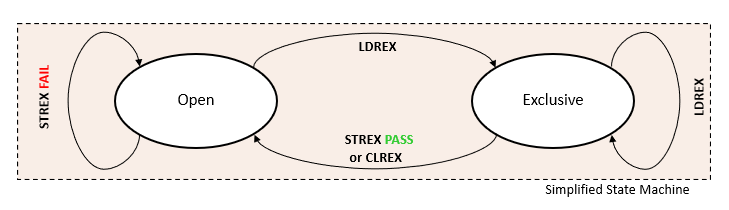

+++
Sources = [
"https://lwn.net/Articles/256433/",
"https://en.wikipedia.org/wiki/Load-link/store-conditional",
"https://homepages.inf.ed.ac.uk/s1343145/USENIX2020.pdf",
"https://arxiv.org/pdf/2207.09341.pdf",
"https://developer.arm.com/documentation/107565/0101/Memory-system/Exclusive-accesses?lang=en",
"https://developer.arm.com/documentation/ddi0487/latest/",
"https://developer.arm.com/documentation/den0024/a/Multi-core-processors/Multi-processing-systems/Exclusive-monitor-system-location",
"https://developer.arm.com/documentation/102202/0300/Atomic-accesses",
"https://krinkinmu.github.io/2024/04/20/arm-synchronization.html",

]
authors = [
"Michael Shalitin",

]
math = true
date = "2025-01-11"
categories = [

]
series = [

]
title = "Exclusive"
+++

## Load Lock/Store Conditional (LL/SC)

### Load-Lock/Store-Conditional

ה-Load-Lock ו-Store-Conditional נקרא גם Load-Link/Store-Conditional הן צמד הוראות המשמשות ב-multithreading כדי להשיג סנכרון בין thread-ים.

ההוראה Load-Lock (או בקיצור LL) משמשת לקרוא את הערך הנוכחי במיקום זיכרון,  ההוראה רושמת באופן פנימי (למשל ב-arm המידע נשמר ב- exclusive monitors) את מיקום הזיכרון לצורך גישה בלעדית, בעוד שההוראה Store-Conditional (או בקיצור SC) נועדה לשמור ערך חדש באותו מיקום זיכרון, אך רק אם לא התרחשו שינויים באותו מיקום זיכרון מאז ההוראת ה-LL התואמת הקודמת.

אם התבצע שינוי כלשהו במיקום הזיכרון מאז ההוראה LL, ההוראה SC תיכשל באופן מובטח, גם אם הערך שנקרא על ידי LL נשמר כפי שהיה. בכך, השימוש בצמד ההוראות LL/SC מספק אבטחת סנכרון חזקה יותר מאשר הוראת CAS, שלא מזהה שינויים אם הערך הישן הוחזר ([בעיית ABA](https://en.wikipedia.org/wiki/ABA_problem)).

עם זאת, ביישומים מעשיים, הוראות LL/SC עשויות להיכשל גם כאשר לא התרחשו עדכונים במקביל לאותו מיקום זיכרון. כל אירוע חריג בין ההוראות, כמו context switch, ביצוע הוראת LL נוספת, או אפילו בפלטפורמות רבות, ביצוע פעולות load או store נוספות, עלול לגרום לכישלון שגוי של ההוראה SC. יישומים ישנים יותר עלולים להיכשל גם אם יש עדכונים שמועברים דרך ערוץ הזיכרון. תופעה זו נחשבת ל-LL/SC חלש על ידי חוקרים, מכיוון שהיא מפרה את העבודה של מספר אלגוריתמים תיאורטיים המתבססים על LL/SC. חולשה זו היא יחסית, ולפעמים ניתן להשתמש ביישומים חלשים עבור אלגוריתמים מסוימים.

במקרים שבהם מתבצע שימוש בהוראות SC והיא נכשלת צריך לחזור על כל רצף ההוראות LL/SC כדי לנסות שוב.

חשוב לציין שהוראות LL/SC תואמות בעיקר לארכיטקטורות RISC כמו ARM או MIPS.

### השוואה בין LL/SC ל-CAS

למרות זאת, צמד ההוראות LL/SC ניתן להשוואה להוראת CAS במובן שניתן לממש כל פרימיטיבי של סנכרון בעזרת אחת מהן.

בדרך כלל, מעבדים עוקבים אחרי הכתובת שנקראה בהוראת LL ב-cache line או ביחידה אחרת. כל שינוי בחלק כלשהו של cache line (בין אם על ידי הוראת SC של ליבת מעבד אחרת או פשוט על ידי פעולה רגילה של Store) מספיק כדי לגרום להוראת SC להיכשל.

לרוב הפלטפורמות, ההוראות LL/SC מסופקות בגרסה חלשה (weak), מה שאומר שהן לא תמיד מספקות את הביצועים האופטימליים.

ל-LL/SC יש שני יתרונות עיקריים על פני CAS כאשר מדובר בתכנון ארכיטקטורת load–store:

1. **הפרדת קריאה וכתיבה:** בהוראות LL/SC, הקריאה והכתיבה הן הוראות נפרדות, מה שתואם לפילוסופיית התכנון ולארכיטקטורת ה-pipeline של המעבד.

2. **שימוש בשני רגיסטרים בלבד:** שתי ההוראות (LL ו-SC) דורשות שימוש בשני רגיסטרים בלבד (אחד לכתובת ואחד לערך), דבר שמתאים טבעית לארכיטקטורות עם שני אופרנדים נפוצים. לעומת זאת, הוראת CAS דורשת שלושה רגיסטרים (אחד לכתובת, אחד לערך ישן ואחד לערך חדש) ומכילה תלות בין הערך שנקרא לערך שנכתב. עבור ארכיטקטורת x86, שהיא ארכיטקטורת CISC, אין דרישה זו, אך שבבים מודרניים עשויים לתרגם הוראת CAS למיקרו-פעולות נפרדות של LL/SC בתוך המעבד.

### מימוש הוראות LL/SC

כאשר מבוצעת הוראת LL, הערך שנמצא במיקום הזיכרון נטע באותו הזמן לרגיסטר של המעבד. כחלק מהליך זה, הערך נטען גם ל-cache L1d של המעבד. הוראת SC שנעשית מאוחר יותר תצליח רק אם הערך ב-L1d לא שונה. איך המעבד מזהה את השינוי הזה? התשובה טמונה בפרוטוקול MESI. אם מעבד אחר מבצע שינוי במיקום הזיכרון, העותק של הערך ב-L1d של המעבד הראשון מתבטל. כאשר המעבד הראשון מבצע את הוראת SC, הוא יגלה שעליו לטעון מחדש את הערך לתוך L1d, דבר שהמעבד צריך לזהות ולבצע באופן אוטומטי.

באופן כללי, יישום הוראות LL/SC כמעט ואינו דורש משאבים נוספים כאשר נעשה שימוש בפרוטוקול קוהרנטיות cache כמו MESI.

## גישות בלעדיות (Exclusive Accesses)

במעבדי Arm מסורתיים, השימוש בדגל נעילה (כמו במימוש של מנעולים כמו mutex) נעשה באמצעות הוראת `SWP`. הוראה זו מאפשרת גישה אטומית לקריאה ולכתיבה של הדגל, ומונעת מצב בו שני תהליכים ינעו את המשאב במקביל. כדי לשפר את המנגנון הזה, הוצגו הוראות גישה בלעדיות בצמדים כגון `LDREX`/`STREX`, `LDREXB`/`STREXB`, ו-`LDREXH`/`STREXH`.

הוראות Load-Exclusive ו-Store-Exclusive פועלות כצמד להבטחת גישה אטומית לזיכרון בכתובת מסוימת. השימוש הנפוץ בצמד הוראות זה, כאשר ניגשים לכתובת זיכרון x שאינה invalid, פועל כך:

1. הוראת Load-Exclusive: הוראה זו קוראת ערך מכתובת הזיכרון x ומסמנת אותה לגישה בלעדית.

2. הוראות Store-Exclusive: הוראה זו מנסה לכתוב ערך חזרה לכתובת הזיכרון x, אך היא תצליח רק אם אף מעבד, תהליך אחר או thread לא ביצע כתיבה לכתובת x מאז הפעולה של Load-Exclusive. לאחר ניסיון הכתיבה, ההוראה מחזירה ביט סטטוס שמציין אם הכתיבה הצליחה.

הוראת Load-Exclusive מסמנת בלוק קטן של זיכרון לצורך גישה בלעדית, כשהגודל של הבלוק המסומן נקבע על פי יישום המערכת. כל פעולה של Store-Exclusive לכתובת כלשהי בתוך אותו בלוק מסומן תבטל את הסימון.

### דוגמה ב-arm להוראות בלעדיות

ההוראה `ldxrb` היא פעולת טעינה בלעדית בגודל של byte לרגיסטר. ההוראה מבצעת קריאה של byte מכתובת בזיכרון, שמצוין על ידי הכתובת `[x0]`, ומעבירה את המידע שנקרא לרגיסטר `w9`.

ההוראה `stxrb` היא פעולת אחסון בלעדית בגודל של byte. ההוראה מבצעת כתיבה של byte שנמצא ברגיסטר `w8` לכתובת בזיכרון שמסומנת על ידי `[x0]`. עם זאת, הפעולה `stxrb` תצליח רק אם תוכן הזיכרון בכתובת `[x0]` לא שונה מאז שבוצעה הוראת `ldxrb`.

האם הכתיבה הצליחה או נכשלה מתועד ברגיסטר `w10`. אם הכתיבה הייתה מוצלחת, הרגיסטר יכיל את הערך 0, ואם היא נכשלה, הוא יכיל את הערך 1.

הוראות `ldxrb` ו-`stxrb` משמשות יחד ליצירת צמד פעולות לצורך ביצוע רצף בלעדי.

## exclusive monitor

המוניטור הבלעדי הוא הרכיב שאחראי על שמירת המידע על פעולות exclusives, והוא פועל כמו מכונת מצבים עם שני שלבים: לאחר האיפוס, היא נמצאת במצב Open. כאשר מבוצעת הוראת `LDREX`, מכונת המצבים עוברת למצב Exclusive. הוראת `STREX` תוכל לכתוב בהצלחה למיקום הזיכרון (שסומן כדגל נעילה) רק אם מכונת המצבים נמצאת במצב בלעדי.

הכתיבה הבלעדית באמצעות הוראת `STREX` עלולה להיכשל במצבים הבאים:

- הוראת `LDREX` לא בוצעה לפני הוראת `STREX`.
- הוראת `CLREX` בוצעה, מה שמנקה את המצב הבלעדי.
- התרחשה פעולת context switch, שכתוצאה ממנה נמחק המצב הבלעדי.

הוראות הגישה הבלעדיות מאפשרות יצירת פעולות אטומיות בתוכנה והן אינן מחייבות את החומרה לנעול את bus הזיכרון, מה שמפחית משמעותית את ההשפעה על זמן התגובה ל-interrupt.

### מיקום מערכת המוניטור הבלעדי

במערכות מרובות ליבות טיפוסיות, ישנם כמה מוניטורים בלעדיים. כל ליבה במערכת מצוידת במוניטור מקומי, ולעיתים יש גם מוניטור גלובלי אחד או יותר. השימוש במוניטור ספציפי תלוי במאפייני השיתוף של זיכרון ובנתוני ה-cache הקשורים למיקום המשמש להוראות load או store בלעדיות.

החומרה של כל ליבה כוללת מוניטור מקומי שצופה בפעולות הליבה. כאשר הליבה מבצעת גישת load בלעדית, המוניטור המקומי מתעד זאת. לאחר מכן, כאשר הליבה מנסה לבצע גישת store בלעדית, המוניטור המקומי בודק אם התקיימה קודם לכן גישת load בלעדית מתאימה. אם לא, פעולת ה-store תיכשל. הארכיטקטורה מאפשרת לכל מימוש להגדיר את רמת הבדיקות שהמוניטור מבצע.

### המוניטור המקומי והגלובלי במערכת מרובת ליבות

המוניטור המקומי בליבה משמש כאשר מיקום הזיכרון המשמש לגישה הבלעדית מסומן כלא Shareable, כלומר, כאשר thread-ים פועלים על אותה ליבה בלבד. המוניטור המקומי יכול גם לטפל בגישות מסומנות כניתנות לשיתוף פנימי, לדוגמה, כאשר mutex מגן על משאב משותף בין thread-ים ב-SMP הפועלים על כל ליבה בתוך אותו תחום שיתוף. כאשר thread-ים פועלים על ליבות שונות שאינן קוהרנטיות, מיקום ה-mutex המסומן כ-normal ו-non-cacheable ידרוש שימוש במוניטור גישה גלובלי.

לא בכל מערכת יש מוניטור גלובלי, או שלעיתים הוא זמין רק עבור אזורי כתובת מסוימים. אם מתבצעת גישה בלעדית למיקום שבו אין מוניטור מתאים, התנהגות המערכת מוגדרת לפי המימוש, ויש כמה אפשרויות לתגובה:

- ההוראה עשויה לגרום ל-External Abort.
- ההוראה יכולה לגרום ל- MMU fault.
- ההוראה יכולה להיות מטופלת כפקודת `NOP`.
- ההוראה הבלעדית יכולה להיות מטופלת כהוראת `LDR`/`STR` רגילה, כאשר הערך המוחזק ברגיסטר תוצאת הוראת ה-store הבלעדית הופך לבלתי ידוע.

### ה-exclusive monitor הגלובלי

כשהוראת Load-Exclusive מבוצעת על זיכרון Shareable, היא מבצעת קריאת ערך מהזיכרון, ומסמנת את כתובת הזיכרון הפיזית כגישה בלעדית עבור המעבד המבקש. בנוסף, פעולה זו עשויה לגרום להסרת סימן הגישה הבלעדי מכתובת זיכרון אחרת שסומנה קודם לכן על ידי אותו מעבד.

הוראת Store-Exclusive מבצעת store מותנה בזיכרון, והיא תצליח רק אם התנאים הבאים מתקיימים:

- הכתובת הפיזית אליה ניגש המעבד מסומנת כגישה בלעדית עבור אותו מעבד.
- גם המוניטור המקומי וגם המוניטור הגלובלי של המעבד נמצאים במצב של גישה בלעדית.

אם הכתובת שמסומנת כגישה בלעדית עבור מעבד אחר, מצב המוניטור הגלובלי של אותו מעבד ישתנה למצב של Open Access.

אם הכתובת אינה מסומנת כגישה בלעדית עבור המעבד המבקש, הכתיבה לא תצליח והמצב של המוניטור הגלובלי לא ישתנה ויישאר במצב Open Access עבור המעבד המבקש.

במקרה של הצלחה ערך של 0 יוחזר לרגיסטר היעד והמצב הסופי של המוניטור הגלובלי עבור המעבד יהיה תלוי מימוש.

במקרה של כישלון ערך של 1 יוחזר לרגיסטר היעד.

ניתן להסתמך על כך שזוג ההוראות Load-Exclusive ו-Store-Exclusive יצליחו בסופו של דבר רק אם הן מבוצעות על אותו מרחב כתובות וירטואלי.

כשיש exception והמעבד חוזר ממנו, המוניטור המקומי מנוקה באופן אוטומטי. כתוצאה מכך, אין צורך בביצוע הוראת `CLREX` כחלק מתהליך של ה-context switch במרבית המקרים.

### דוגמאות לביצוע של המוניטור הגלובלי

ה-exclusive monitor נדרש להקליט את פרטי הטרנזקציה עבור הרצף הבלעדי, כך שהוא יודע את טווח הזיכרון אליו ניגשים ואת זהות המעבד שמבצע את הגישה.

בקטע הזה נעבוד עם מערכת המכילה 2 מעבדים והגישות לזיכרון נעשות במקומות shareable עם אפשרות לגישה בלעדית.
#### 2  גישות מוצלחות

הסעיף הזה מתאר דוגמה לשני רצפי גישה בלעדיים מוצלחים.

הטבלה הבאה מתארת ​​את הטרנזקציות השונות ברצף. כל הטרנזקציות בטבלה הן גישה בלעדית:

| Transaction number | Read or write | CPU ID | Address  | Result  |
| ------------------ | ------------- | ------ | -------- | ------- |
| 1                  | R             | 0      | `0xA000` | -       |
| 2                  | R             | 1      | `0xB000` | success |
| 3                  | W             | 0      | `0xA000` | -       |
| 4                  | W             | 1      | `0xB000` | success |

רצף הטרנזקציות המוצג בטבלה הקודמת מתקדם באופן הבא:

1. מעבד עם המזהה`0` מבצע קריאה בלעדית מהכתובת `0xA000`. המוניטור הבלעדי שומר את המזהה והכתובת של הטרנזקציה הזו בטבלה שלו.
2. מעבד אחר עם המזהה `1` מבצע קריאה חדשה בלעדית מהכתובת `0xB000`. שוב, המוניטור שומר את הפרטים של הטרנזקציה החדשה הזו בטבלה. ברגע זה בדוגמה שלנו קיימים שני רצפים בלעדיים נפרדים.
3. המעבד עם מזהה `0` עושה כתיבה לכתובת `0xA000`. המוניטור הבלעדי בודק את הפרטים של הטרנזקציה הזו בטבלה, ובגלל הרשומה הקיימת עם מזהה `0` וכתובת `0xA000`,  הגישה מצליחה (מזוהה בטבלה על ידי SUCCESS) המשמעות היא שאף מעבד אחר לא ניגש למיקום הזיכרון הזה, והזיכרון מעדכן אותו בערך החדש שהוא מקבל. המוניטור מסיר את המזהה והכתובת עבור טרנזקציה הזאת מהטבלה שלו, מכיוון שרצף הגישה הבלעדי עבור מיקום כתובת זה הושלם כעת.
4. לבסוף, המעבד  עם מזהה `1` מבצע כתיבה חדשה בלעדית לכתובת `0xB000`. המוניטור בודק את הפרטים של הטרנזקציה הזו בטבלה שלו. שהוא רואה רשומה קיימת עם מזהה `1` וכתובת `0xB000`, והגישה מצליחה. המשמעות היא שאף מעבד אחר לא ניגש למיקום הזיכרון הזה, והזיכרון מעדכן אותו בערך החדש שהתקבל. שוב, המוניטור הסיר את המזהה והכתובת עבור טרנזקציה זו מהטבלה שלו, מכיוון שרצף הגישה הבלעדי עבור מיקום כתובת זה הושלם כעת.

#### גישה אחת מצליחה ואחת נכשלת

הסעיף הזה מתאר דוגמה לשני רצפי גישה בלעדיים, כאשר הראשון מצליח והשני נכשל.

הטבלה הבאה מתארת ​​את הטרנזקציות השונות ברצף לדוגמה. כל הטרנזקציות בטבלה הן גישה בלעדית:

| Transaction number | Read or write | CPU ID | Address | Result  |
| ------------------ | ------------- | ------ | ------- | ------- |
| 1                  | R             | 0      | 0xA000  | -       |
| 2                  | R             | 1      | 0xA000  | SUCCESS |
| 3                  | W             | 0      | 0xA000  | -       |
| 4                  | W             | 1      | 0xA000  | FAILED  |

רצף הטרנזקציות המוצג בטבלה הקודמת מתקדם באופן הבא (שלבים 1 ו-3 זההים למקרה הקודם):

1. המעבד  עם מזהה `0` מבצע קריאה בלעדית מהכתובת `0xA000`. המוניטור שומר את המזהה והכתובת בטבלה שלו.
2. מעבד אחר עם המזהה `1` מבצע קריאה חדשה בלעדית מאותה כתובת כמו הטרנזקציה הראשונה, `0xA000`.
3. המעבד עם מזהה `0` עושה כתיבה לכתובת `0xA000`. המוניטור הבלעדי בודק את הפרטים של הטרנזקציה הזו בטבלה, ובגלל הרשומה הקיימת עם מזהה `0` וכתובת `0xA000`,  הגישה מצליחה (מזוהה בטבלה על ידי SUCCESS) המשמעות היא שאף מעבד אחר לא ניגש למיקום הזיכרון הזה, והזיכרון מעדכן אותו בערך החדש שהוא מקבל. המוניטור מסיר את המזהה והכתובת עבור טרנזקציה הזאת מהטבלה שלו, מכיוון שרצף הגישה הבלעדי עבור מיקום כתובת זה הושלם כעת.
4. לבסוף, המעבד עם מזהה `1`  מבצע שוב טרנזקציה חדשה בלעדית כתיבה לכתובת `0xA000`. המוניטור בודק את הפרטים של הטרנזקציה הזו בטבלה שלו. לא מוצא רשומות עם הכתובת `0xA000`, ולכן הגישה נכשלת (מזוהה בטבלה על ידי FAILED). וזה אומר שבוצעה פעולת כתיבה קודמת במיקום זיכרון זה אשר עדכנה את הנתונים. במקרה זה, הזיכרון לא יכול לעדכן את מיקום הזיכרון בערך החדש. מצב זה הוא כשל גישה בלעדי. במקרה זה, על המעבד להפעיל מחדש את רצף הגישה הבלעדי המלא, החל בקריאה הבלעדית ולאחר מכן בכתיבה הבלעדית שוב.

### ה-Granularity של המוניטור הבלעדי (ERG)

ה-Exclusives Reservation Granule (ERG) הוא מידת הפירוט שבה המוניטור הבלעדי עוקב אחרי גישות. גודל ה-ERG מוגדר לפי המימוש, אך בדרך כלל הוא שווה לגודל של cache line. זהו המרחק המינימלי בין כתובות שעל המוניטור להבחין ביניהן. הצבת שני mutex-ים בתוך אותו ERG עלולה לגרום ל-false sharing, כלומר, הוראת `STXR` על mutex אחד יכולה לנקות את התג הבלעדי של mutex אחר באותו ERG. מצב כזה לא ימנע מהתוכנה לפעול בצורה נכונה מבחינה ארכיטקטונית, אך הוא עשוי לפגוע ביעילותה.
