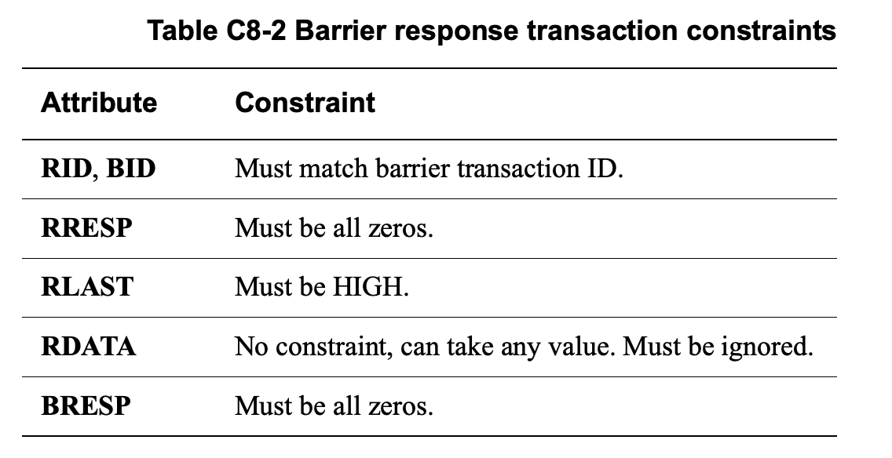

+++
Sources = [
"https://developer.arm.com/documentation/ihi0022/e/",

]
authors = [
"Michael Shalitin",

]
math = true
date = "2025-01-11"
categories = [

]
series = [

]
title = "AMBA ACE Barrier ?"
+++

### טרנזקציות מחסום בפרוטוקול ACE

פרוטוקול ACE תומך בטרנזקציות מחסום אשר משמשות להבטחת סדר והבחנה של טרנזקציות במערכת. המחסומים מסייעים ביצירת יחסי סדר בין פעולות, כדי להבטיח ביצועים ותאימות צפויה בין רכיבי המערכת.

לצורך שימוש בטרנזקציות מחסום, רכיב מאסטר משתמש במאפייני דומיין השיתוף כדי להגדיר עם אילו רכיבים אחרים יש צורך לסנכרן את המחסום וכדי להקים יחסי סדר מוגדרים. הגדרת הדומיין של טרנזקציית המחסום מגדירה את מידת הפצת המחסום במערכת, ואילו מאפייני המחסום עצמם מכתיבים את יחסי הסדר הנדרשים.

טרנזקציות מחסום בפרוטוקול ACE מיועדות לספק ערבויות לגבי הסדר וההבחנה של טרנזקציות במערכת. קיימים שני סוגי מחסומים עיקריים:

- **מחסומי זיכרון:** מחסום זיכרון נועד להבטיח שאם רכיב מאסטר אחר בדומיין יכול לצפות בטרנזקציה מסוימת לאחר המחסום, הוא גם יוכל לראות את כל הטרנזקציות שהתרחשו לפני המחסום. זה מאפשר יצירת סדר בין טרנזקציות עבור תצפית סדורה של פעולות בזיכרון.

- **מחסומי סנכרון:** מחסום סנכרון קובע נקודה שבה כל רכיבי המאסטר בדומיין המתאים יכולים לצפות בכל הטרנזקציות שקדמו למחסום. במחסומים אלה, במיוחד בדומיין המערכת (system domain), נדרש שכל הטרנזקציות שהונפקו לפני מחסום הסנכרון יגיעו ליעדי ה-slave שלהן לפני סיום המחסום, מה שמבטיח סנכרון מלא במערכת.

טרנזקציית מחסום מורכבת משלב address ושלב response, אך אינה כוללת העברת נתונים בפועל. כדי להנפיק מחסום, המאסטר צריך לשדר טרנזקציה בערוץ כתובת קריאה (read address) ובערוץ כתובת כתיבה (write address). המחסום יכול לאכוף סדר בין טרנזקציות, מכיוון שהמאסטר אינו רשאי לשדר טרנזקציות קריאה או כתיבה הבאות לאחר המחסום, עד לקבלת תשובה על המחסום גם בערוצי הנתונים לקריאה וגם בערוצי התשובה לכתיבה.

#### טרנזקציות Read Barrier

רכיב מאסטר מנפיק טרנזקציית מחסום קריאה בערוץ הכתובת לקריאה ותגובה מוחזרת בערוץ הנתונים לקריאה. לא מתרחשת העברת נתונים.

תהליך התקדמות הטרנזקציה עבור Read barrier במאסטר היוזם מתבצע כך:

1. הטרנזקציה נשלחת בערוץ ה-AR.
2. בערוץ ה-R מתבצעת העברה יחידה, המהווה את התגובה (אין נתונים בטרנזקציה זו).
3. המאסטר מציין את השלמת טרנזקציית ה-Read barrier על ידי איתות RACK.

#### טרנזקציות Write Barrier

רכיב מאסטר מוציא מחסום כתיבה בערוץ הכתובת לכתיבה ותגובה מוחזרת בערוץ תגובת הכתיבה. לא מתרחשת העברת נתונים.

תהליך התקדמות הטרנזקציה עבור Write barrier במאסטר היוזם מתבצע כך:

1. הטרנזקציה נשלחת בערוץ ה-AW.
2. התגובה מתקבלת בערוץ ה-B (ללא העברת נתונים).
3. השלמת טרנזקציית ה-Write barrier מסומנת על ידי המאסטר באמצעות איתות WACK.

### שימוש במחסום סנכרון עם תקשורת איתות פס צדדי

מחסום סנכרון בפרוטוקול ACE יכול להשתלב עם סוגים שונים של תקשורת איתות פס צדדי (sideband signaling) כדי להבטיח סנכרון יעיל בין רכיבי המערכת. לדוגמה, אם רכיב מאסטר כותב מערך נתונים לזיכרון, הוא עשוי להפעיל מחסום סנכרון לפני יצירת interrupt המודיעה על זמינות ערך. עם סיום מחסום הסנכרון, מובטח שהערך המעודכן ייראה על ידי כל רכיבי המאסטר בדומיין המתאים, מה שמאפשר תיאום מלא בין רכיבי המערכת לצפייה במערך המעודכן.
### צימוד טרנזקציות מחסום בערוצי כתובת קריאה וכתיבה

רכיב מאסטר נדרש להנפיק טרנזקציות מחסום כזוג, אחת לכל ערוץ: מחסום אחד בערוץ הכתובת לקריאה ומחסום נוסף בערוץ הכתובת לכתיבה. התוצאה היא סדר טרנזקציות מוגדר בכל ערוץ: כל טרנזקציה שנשלחה בערוץ כלשהו לפני טרנזקציית המחסום נחשבת כפעולה שהתרחשה **לפני המחסום**, גם אם היא ניתנת לאחר המחסום המקביל בערוץ הכתובת השני. כל טרנזקציה בערוץ נחשבת **לאחר המחסום** רק כאשר מתקבלות תגובות המחסום גם מערוץ הקריאה וגם מערוץ הכתיבה, מה שמבטיח תיאום וסנכרון מדויק בין הטרנזקציות במערכת.

### איתות טרנזקציית מחסום

פרוטוקול ACE, כדי לתמוך ביישומים שונים כמו הבטחת QoS תוך שימוש בטרנזקציות מחסום, מספק שני סוגים של טרנזקציות שאינן מחסום (non-barrier):

- **טרנזקציות המושפעות מטרנזקציות מחסום:** טרנזקציות אלו חייבות לכבד את הסדר שנוצר על ידי טרנזקציות המחסום, כלומר הן נדרשות להתבצע בסדר שבו נקבע מחסום.
- **טרנזקציות שאינן מושפעות מטרנזקציות מחסום:** סוג זה של טרנזקציות אינו חייב להישמר בסדר מסוים, והוא נפוץ במיוחד עבור זרמי נתונים בזמן אמת (real-time data streams), בהם הסדר אינו קריטי בהשוואה לתזמון.

המפרט ממליץ כי כברירת מחדל כל הטרנזקציות יושפעו מטרנזקציות מחסום, אלא אם כן הן מסווגות כלא-מושפעות, לצרכים ספציפיים כמו זרמי נתונים בזמן אמת.

### האות AxBAR

האות **AxBAR** (המונח מתיחס גם למחסום בערוץ הכתובת לקריאה וגם בערוץ הכתובת לכתיבה) מיועד להבחין בין טרנזקציות מחסום וטרנזקציות רגילות, ומסייע בקביעת סדר ביצוע הטרנזקציות. במצבי עבודה רגילים, AxBAR מציין אם הטרנזקציה מחויבת להישמר בסדר שנקבע על ידי מחסומים, או שניתן להתעלם מדרישות הסדר של טרנזקציות מחסום. כך מתאפשר גמישות בניהול עומסים שונים במערכת.

עבור טרנזקציות מחסום, האות AxBAR מציין אם מדובר במחסום זיכרון או מחסום סנכרון, כדי להבטיח שמירה על הסדר הרצוי בהתאם לסוג המחסום.

### איתות AxDOMAIN

האות **AxDOMAIN** משמש לקביעת רמת ההפצה של טרנזקציית מחסום, ומסווג את הדומיינים שבהם טרנזקציית המחסום תהיה בתוקף.

- דומיין **Non-shareable:** במצב זה, המחסום תקף רק עבור הטרנזקציות בזרם הטרנזקציות הנוכחי של המאסטר שהפעיל אותו, ואין צורך לשמור על סדר טרנזקציות כאשר זרם הטרנזקציות משתלב עם זרמים אחרים במערכת.

- דומיין **Inner Shareable:** המחסום חל על כל הטרנזקציות שמבוצעות על ידי מאסטרים באותו דומיין Inner Shareable. המשמעות היא שכל מאסטר בתוך הדומיין מחויב לשמור על סדר הטרנזקציות ביחס לטרנזקציות המחסום.

- דומיין **Outer Shareable:** המחסום תקף לכל הטרנזקציות שמבוצעות על ידי כל המאסטרים בדומיין Outer Shareable. ברמה זו, נדרש לשמור על סדר הטרנזקציות בין כל רכיבי המאסטר באותו דומיין חיצוני, מה שמבטיח עקביות רחבה יותר בין מספר רב של מאסטרים.

- דומיין  **System:** המחסום חל על כלל הטרנזקציות במערכת. עבור מחסום סנכרון ברמת מערכת, טרנזקציית המחסום נחשבת מושלמת רק כאשר כל הטרנזקציות שהונפקו על ידי המאסטר לפני המחסום הגיעו לנקודת הקצה (endpoint) שלהן.

---

### איתות תגובת מחסום

כל טרנזקציות מחסום חייבות להשלים עם תגובה: 

- תגובות לטרנזקציות מחסום שהונפקו בערוץ הכתובת לקריאה מסומנות בערוץ נתוני הקריאה.

- תגובות לטרנזקציות מחסום שהונפקו בערוץ הכתובת לכתיבה מסומנות בערוץ תגובת הכתיבה.

כדי להבטיח התאמה בין תגובות המחסום לטרנזקציות שהונפקו, לכל תגובה חייב להיות מזהה AXI תואם לטרנזקציית המחסום. בתגובה לטרנזקציית מחסום, המערכת רשאית להחזיר רק תגובה מסוג `OKAY` כתוצאה תקינה; אין לקבל תגובות אחרות עבור טרנזקציות מחסום.

**הערות בנוגע לאותות המוגדרים על ידי המשתמש:** אותות המוגדרים על ידי משתמש, כגון AxUSER, RUSER, WUSER ו-BUSER, אינם נכללים בטרנזקציות מחסום, ולכן עליהם להיות אפסים עבור טרנזקציות מחסום, כפי שממליץ המפרט.

## תגובות מחסומים וגבולות

כדי ש-interconnect יוכל לספק תגובה לטרנזקציית מחסום, עליו לעמוד במגבלות המיקום ביחס לגבולות הדומיין. מיקומו של ה-interconnect ביחס לגבולות והוא קובע האם עליו לשמור את סדר הטרנזקציות שנדרש במחסום ולהגיב בהתאם.

מיקומו של כל interconnect במערכת ביחס לגבולות הדומיין משפיע על יכולתו לספק תגובה לטרנזקציות מחסום.

מערכת יכולה לכלול שני סוגי גבולות עיקריים:

### Domain Boundary (גבול דומיין)

גבול דומיין הוא ממשק שנמצא במורד הזרם של כל רכיבי המאסטר בדומיין, המגדיר את המעבר החיצוני שלהם אל חלקים אחרים במערכת. כדי שממשק ייחשב כגבול דומיין, עליו לעמוד בתנאים הבאים:

- **כתובת אחידה:** כל כתובת שעוברת בממשק חייבת להיות נגישה לכל המאסטרים בדומיין באותו אופן, כך שסט הכתובות המשותף יהיה זהה לכל המאסטרים.
- **מעבר אחיד:** כל גישה של מאסטרים בכתובות אלה חייבת לעבור דרך הממשק.

אם רכיב מאסטר כלשהו עובר בממשק כדי לגשת לכתובת מסוימת, אז מאסטר אחר באותו דומיין לא יכול לגשת לאותה הכתובת מבלי להשתמש באותו הממשק.

באיור C8-1 מודגם מבנה של גבולות דומיין במערכת, כאשר לדוגמה, הממשק ל-slave 6 משמש כגבול דומיין חיצוני, הנמצא מחוץ לטווח הגישה של מאסטרים 0, 1, ו-2. כלומר, הוא נמצא מעבר לכל רכיבי המאסטר בדומיין החיצוני שיכולים לגשת אליו.

### Bi-section Boundary (גבול דו-קטעי)

גבול דו-קטעי הוא ממשק הנמצא במורד הזרם של תת-קבוצה מסוימת של מאסטרים בתוך הדומיין, ולא כולל את כל רכיבי המאסטר בדומיין. התנאים לממשק שישמש כגבול דו-קטעי הם:

- **כתובת תואמת בתת-קבוצה:** כל כתובת שעוברת דרך הממשק צריכה להיות נגישה באופן אחיד על ידי כל רכיב מאסטר בתת-קבוצה זו.
- **מעבר אחיד בתת-קבוצה:** כל גישה של המאסטרים בתת-הקבוצה לכתובות אלו חייבת לעבור בממשק.
- **הגבלת גישה:** מאסטרים בדומיין שאינם בתת-הקבוצה אינם יכולים לגשת לכתובות אלו דרך הממשק.
- **התאמה בין מאסטרים:** כאשר מאסטר מחוץ לתת-הקבוצה ניגש לכתובת, אז כל כתובת שנגישה לו חייבת להיות נגישה גם למאסטרים שבתת-הקבוצה דרך אותו ממשק.

> **הערות:**
> 	- באופן כללי, הממשק יכול להיחשב כגבול דו-קטעי אם כל התקשורת בין קבוצת מאסטרים מסוימת לשאר המאסטרים שאינם בקבוצה עוברת בממשק זה.
> 	- כאשר כל המאסטרים בדומיין הם חלק מהקבוצה, גבול זה הופך להיות גם גבול דומיין לכל דבר.

באיור C8-2 מודגם המיקום של גבולות ה-bi-section עבור אותה מערכת, המפריד בין קבוצות מאסטרים בתוך אותו דומיין.

#### תגובת מחסומים של ה-interconnect

ה-interconnect במערכת יכול לטפל בטרנזקציות מחסום בתנאים מסוימים, בהתאם לכללים הבאים:

- **טרנזקציות מחסום זיכרון:** ה-interconnect יכול להעניק תגובה כאשר הוא נמצא בגבול bi-section המתאים או בגבול הדומיין, או מעבר לגבול הדומיין.

- **טרנזקציות מחסום סנכרון לדומיינים משותפים:** כאשר מדובר בדומיין שאינו משותף, דומיין שניתן לשיתוף פנימי, או דומיין שניתן לשיתוף חיצוני, ה-interconnect יכול להגיב כל עוד הוא ממוקם בגבול הדומיין המתאים או מעבר לו.

- **טרנזקציות מחסום סנכרון לדומיין system:** במצב זה, ה-interconnect יכול לספק תגובה רק אם כל הטרנזקציות שהופעלו לפני המחסום כבר הגיעו ל-slaves המתאימים בנקודות הקצה שלהם.

### טכניקות למתן מענה לטרנזקציות מחסום

כדי לוודא שכל הטרנזקציות שהונפקו לפני המחסום ניתנות לצפייה באופן עקבי על ידי כל טרנזקציה שלאחר המחסום, ה-interconnect יכול להשתמש במספר שיטות:

#### חסימת כל הטרנזקציות ושליחת מחסומים

במקרה זה, ה-interconnect חוסם את כל הטרנזקציות שהתקבלו לאחר טרנזקציית המחסום ומנפיק טרנזקציית מחסום במורד הזרם. החסימה מוסרת רק כאשר מתקבלות תגובות מלאות, הן בערוץ הקריאה והן בערוץ התגובה לכתיבה, עבור כל הטרנזקציות במורד הזרם.
#### חסימת כל הטרנזקציות והמתנה להשלמה

ה-interconnect חוסם את כל הטרנזקציות המגיעות לאחר טרנזקציות המחסום עד שכל הטרנזקציות הקודמות למחסום מסיימות תגובה מלאה. שיטה זו דורשת שכל הטרנזקציות יקבלו תגובה מנקודות שנגישות לצפייה על ידי כל המאסטרים בדומיין המחסום.

#### בדיקת Hazard

ה-interconnect עוצר כל טרנזקציה לאחר המחסום עד שכל הטרנזקציות הקודמות בעלות אותן כתובות, או כתובות חופפות, מקבלות תגובה.

### דרישות מחסום

סעיף זה מתאר את הדרישות הפורמליות הנדרשות לטרנזקציות מחסום.

#### דרישות מאסטר

כאשר רכיב מאסטר מנפיק טרנזקציית מחסום, עליו לעמוד בכללים הבאים:

- **זיווג טרנזקציות:** שתי הטרנזקציות המרכיבות את זוג המחסום חייבות להיות מאופיינות על ידי אותם ערכי AxID, AxBAR, AxDOMAIN ו-AxPROT. כלומר, כל אחת מהטרנזקציות בזוג צריכה להיות תואמת מבחינת מזהים והגדרות.

- **התאמת רוחב אותות:** אם לערכים ARID ו-AWID יש רוחב שונה, יש להרחיב את הגרסה הצרה יותר כדי שתתאים לגרסה הרחבה יותר, כך שהמידע יהיה עקבי בכל הטרנזקציות.

- **רצף הנפקה:** צמדי מחסומים חייבים להיות מופקים באותו רצף בערוצי הקריאה והכתיבה לכתובת, מה שמבטיח שההנפקה מתבצעת בצורה מסודרת ומסונכרנת.

- **גמישות במחזורי הנפקה:** ממשק מאסטר אינו נדרש להנפיק טרנזקציות מחסום באותו מחזור עבור ערוצי הכתובת לקריאה ולכתיבה, מה שמאפשר גמישות בהנפקת הטרנזקציות.

- **מחסומים Outstanding:** ממשק מאסטר רשאי להנפיק מספר טרנזקציות מחסום outstanding, כלומר ניתן להוציא טרנזקציות מחסום נוספות לפני קבלת תגובות לטרנזקציות הקודמות. עם זאת, קיימת מגבלה ספציפית עבור ממשק מאסטר של ACE, אשר לא יכול להנפיק יותר מ-256 טרנזקציות מחסום בו זמנית.

	- **הערה:** חשוב לציין כי לחיצות ידיים של קריאה וכתיבה הן אירועים נפרדים ויכולות להתרחש בסדר שונה. לפיכך, מחסום נחשב ל-outstanding מהמחזור שבו המחסום הראשון (הקריאה או הכתיבה) הופך לתקף ועד למחזור שבו מתקבלות תגובות לחיצות הידיים של קריאת הכתיבה.

- **מזהי טרנזקציות שונים:** טרנזקציות מחסום נדרשות להשתמש בערכי מזהה שונים מאלו המשמשים עבור טרנזקציות non-barrier. עם זאת, טרנזקציות מחסום וטרנזקציות non-barrier יכולות להשתמש באותו ערך AXI ID, בתנאי שטרנזקציה אחת הושלמה לפני הנפקת השנייה, מה שמבטיח שאין חפיפות בין טרנזקציות.

הערה:
	שימוש בערכי מזהה שונים עבור טרנזקציות מחסום מבטיח כי כל רכיב המעקב אחר תגובות המחסום לא יצטרך לעקוב אחרי כל התגובות הנכנסות, מה שמקל עליו להבדיל בין תגובת מחסום לתגובת טרנזקציה רגילה.

בכל ערוץ כתובת, כל טרנזקציה שהונפקה לפני המחסום באותו ערוץ נחשבת לטרנזקציה "לפני המחסום" (pre-barrier), גם אם היא מתקבלת לאחר המחסום בערוץ הכתובת המקביל.

איור C8-3 מציג טרנזקציות לפני המחסום (pre-barrier) ואחרי המחסום (post-barrier) ביחס למחסומים המונפקים בערוצי הכתובות והתגובות המתקבלות.

- טרנזקציות R1, W1, W2 ו-W3 ממוקמות לפני המחסום.
- טרנזקציות R8 ו-W8 ממוקמות אחרי המחסום.
- טרנזקציות R2, R3, R4, R5, R6, R7, W4, W5, W6 ו-W7 אינן קשורות למחסום.

#### כללים עבור רכיבי מאסטר המנפיקים טרנזקציות מחסום

הכללים הבאים חלים על רכיבי מאסטר המנפיקים טרנזקציות מחסום, ומתייחסים לטרנזקציות שאינן חסומות:

- **איסור הוצאת טרנזקציות לאחר המחסום:** למאסטר אסור להוציא כל טרנזקציה, הן קריאה והן כתיבה, שחייבת להיות אחרי המחסום, עד שהמאסטר קיבל תשובה על המחסום הן בערוץ נתוני הקריאה והן בערוץ התגובה לכתיבה. כלומר, על המאסטר להמתין להשלמת התגובה למחסום לפני שימשיך להנפיק טרנזקציות נוספות.

- **הנפקת טרנזקציות בין מחסומים:** מאסטר יכול להנפיק טרנזקציות בין הנפקת טרנזקציית מחסום בערוץ הכתובת לבין קבלת תגובות המחסום לקריאה ולכתיבה. עם זאת, לטרנזקציות כאלה אין ערבויות סדר ביחס למחסום. בערוץ הכתובת, טרנזקציות אלו יכולות להימצא אחרי טרנזקציית המחסום או לעקוף אותה.

- **חובת הנפקת מחסום כתיבה:** ממשק מאסטר שהנפיק מחסום קריאה בערוץ הכתובת לקריאה חייב להנפיק את מחסום הכתיבה המתאים בערוץ הכתובת לכתיבה בזמן, אם כל שאר הטרנזקציות בערוץ הכתובת לכתיבה מתקדמות. בנוסף, למאסטר אסור לדרוש לחיצת יד או תגובה למחסום הקריאה או לכל טרנזקציית קריאה לאחר מחסום הקריאה לפני הנפקת מחסום הכתיבה המתאים.
      

- **הנפקת מחסום כתיבה:** כאשר ממשק מאסטר מנפיק מחסום כתיבה בערוץ הכתובת לכתיבה, עליו להנפיק את מחסום הקריאה המתאים בערוץ הכתובת לקריאה בזמן המתאים, בתנאי שכל הטרנזקציות האחרות בערוץ הכתובת לקריאה מתקדמות. אסור לממשק המאסטר לדרוש לחיצת יד או תגובה למחסום הכתיבה או לכל טרנזקציית כתיבה נוספת לאחר מחסום הכתיבה, עד שהמחסום הקריאה המתאים הונפק.

- **איסור על הנפקת מחסום קריאה:** אין להנפיק מחסום בערוץ הכתובת לקריאה במקרים בהם נדרשות טרנזקציות קריאה נוספות לאחריו, כמו:

	- הנפקת המחסום המתאים בערוץ הכתובת לכתיבה.
	- הנפקת טרנזקציות כתיבה שצריכות להתבצע לפני המחסום.

	לדוגמה, אין להנפיק מחסום קריאה אם לאחר הנפקת מחסום הקריאה נדרשות הליכות בטבלת תרגום להוצאת טרנזקציות כתיבה שצריכות להיות לפני מחסום הכתיבה המקביל.

- **דרישות לממשק ACE:** בממשק ACE, אסור להנפיק מחסום בערוץ הכתובת לכתיבה אם יש להנפיק טרנזקציות כתיבה עוקבות שצריכות לשמור על סדר שיכבד את המחסום עבור אחת מהן:

	- הנפקת המחסום המתאים בערוץ הכתובת לקריאה.
	- הנפקת טרנזקציות קריאה שצריכות להתבצע לפני המחסום.

- **אפשרות להנפקת מחסומים נוספים:** ממשק ACE רשאי להנפיק מחסום כתיבה, ולאחריו ניתן להנפיק כל אחת מהטרנזקציות הבאות שנדרשות להשלמת טרנזקציות סנופ עבור אותו מאסטר:

	- WriteBack
	- WriteClean
	- WriteEvict
	- Evict

הכללים הבאים מתייחסים לרכיבי מאסטר בממשק ACE ולאופן שבו הם מתקשרים עם מחסומים וגישה ל-cache המקומי:

- **איסור על ביצוע store לאחר מחסום:** רכיב מאסטר אינו רשאי לבצע פעולת store שיש לסדר אותה ביחס למחסום או ממיקום הניתן לשיתוף ב-cache המקומי שלו, עד לאחר קבלת תגובת המחסום בערוצי הקריאה ובערוצי התגובה לכתיבה. כלל זה רלוונטי גם במקרים שבהם אין דרישה להנפקת טרנזקציה, משום ששורת ה-cache נמצאת במצב ייחודי.

- **איסור על ביצוע load לאחר מחסום:** רכיב מאסטר אינו רשאי לבצע פעולת load שיש לסדר אותה ביחס למחסום ממיקום הניתן לשיתוף ב-cache המקומי שלו, עד לאחר קבלת תגובת המחסום הן בערוצי הקריאה והן בערוצי התגובה לכתיבה. גם במקרה זה, האיסור חל אפילו כאשר אין דרישה להנפקת טרנזקציה, בשל כך ששורת ה-cache נמצאת במצב חוקי.

- **חובה להנפיק טרנזקציית כתיבה:** רכיב מאסטר חייב להיות מסוגל להנפיק טרנזקציית כתיבה לצורך השלמת טרנזקציות סנופ, גם כאשר ערוץ כתובת הקריאה נמצא במצב stalled.

- **הנפקת טרנזקציית מחסום:** הנפקת טרנזקציית מחסום אינה יכולה למנוע את ההנפקה וההשלמה של כל אחת מהטרנזקציות הבאות, הנדרשות עבור טרנזקציות סנופ:
	
	- WriteBack
	- WriteClean
	- WriteEvict
	- Evict

### דרישות עבור רכיבי Slave

הכללים הבאים חלים על רכיב slave המתמודד עם טרנזקציות מחסום:

- **יכולת קבלת טרנזקציות מחסום:** ממשק slave מסוג ACE חייב להיות מסוגל לקבל עד 256 טרנזקציות מחסום בערוץ הכתובת לכתיבה מבלי לחסום את ההתקדמות של טרנזקציות עוקבות. נדרש שהערוץ לכתובת הכתיבה יהיה זמין ושטרנזקציות הכתיבה יכולות להתקדם ללא הפרעות.

- **עיכוב ערוץ הכתובת לקריאה:** כאשר מתקבלת טרנזקציית מחסום קריאה, ממשק slave מסוג ACE רשאי, אך אינו מחויב, לעכב את ערוץ הכתובת לקריאה.

### דרישות עבור interconnect

הכללים הבאים חלים על עיבוד טרנזקציות מחסום במערכות interconnect:

- **טופולוגיית interconnect:** אין לאפשר לטרנזקציות עם כתובות יעד חופפות לשתף נקודת התחלה ונקודת סיום, ולכן יש להן נתיבים שונים בתוך ה-interconnect.
    

- **מיזוג זרמים של טרנזקציות:** כאשר יש למזג שני זרמים של טרנזקציות, ה-interconnect חייב להבטיח שצמדי המחסומים יונפקו על ערוצי הקריאה והכתיבה באותו רצף. אסור לשלב בין זוגות מחסומים.

- **עמידה בדרישות עבור מספר פורטי slave:** כל רכיב interconnect שיש לו מספר פורטים של ACE צריך להיות מסוגל לעמוד בדרישות ממשק ה-slaves של ACE עבור כל הפורטים בו זמנית.

- **אי-עקיפת טרנזקציות מחסום:** ה-interconnect לא יכול לאפשר לטרנזקציית מחסום לעקוף כל טרנזקציה אחרת המכבדת מחסומים.

- **שמירה על מחסום:** יש לקיים מחסום על כל טרנזקציה שהרכיב המוציא את המחסום צפה בה לפני הנפקת המחסום.

- **תגובה למחסומים:** interconnect שלא הגיב למחסום יכול לאפשר לכל טרנזקציה שאינה מחסום לעקוף מחסום זה.

הערה:
	מפרט זה ממליץ כי רכיבי interconnect מסוג ACE יתקעו (stall) את מחסום הקריאה עד שיתקבל מחסום הכתיבה המתאים, וכל הטרנזקציות שהתקבלו לפני מחסום הקריאה ומחסום הכתיבה עברו snooping כנדרש, וכל טרנזקציות הכתיבה שצריכות להיות לפני המחסום הונפקו בהצלחה.

### סידור טרנזקציות מחסום ומכשירים

טרנזקציות מחסום נועדו להבטיח סדר בין טרנזקציות שמבצע מכשיר לבין מכשירים היקפיים בודדים, ללא תלות בכתובות שבהן משתמשים בציוד ההיקפי. המשמעות היא שכל בדיקות hazard-checking שביצע ה-interconnect בעת מענה למחסום חייבות להתרחב לכל מרחב הכתובות של הציוד ההיקפי, ולא להתמקד רק בטרנזקציות חופפות. במקרה שבו ה-interconnect אינו יכול לקבוע את טווח הכתובות של ציוד היקפי מסוים, עליו להבטיח שיש סדר בין כל הגישות שיכולות להתייחס לאותו ציוד היקפי.

### דרישות עבור Multi-copy atomicity במיקומים ניתנים לשיתוף

ביחס למיקומים המוגדרים כ-Inner Shareable ו-Outer Shareable, נדרשת יכולת של Multi-copy atomicity. משמעות הדבר היא שתגובת סנופ לטרנזקציית כתיבה תינתן רק לאחר שכל הצופים בדומיין השיתוף המתאים עיבדו את הכתיבה. בנוסף, במחזור שבו מתקבלת תגובת הסנופ, המאסטר המתאים כבר חייב היה לראות את הכתיבה. נקודת התצפית מוגדרת לפי לחיצת היד בערוץ התגובה של הסנופ, ואילו ערוץ הנתונים של הסנופ אינו נחשב כנקודת תצפית. לפיכך, אין צורך בהנפקת מחסומים בערוץ הכתובת של הסנופ.

