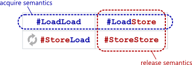

+++
Sources = [
"https://developer.arm.com/documentation/102336/0100/Load-Acquire-and-Store-Release-instructions",
"https://preshing.com/20120913/acquire-and-release-semantics/",
"https://preshing.com/20130922/acquire-and-release-fences",
"https://www.kernel.org/doc/Documentation/memory-barriers.txt",
"https://lwn.net/Articles/827180/",
"http://infolab.stanford.edu/pub/cstr/reports/csl/tr/95/685/CSL-TR-95-685.pdf",
"https://en.wikipedia.org/wiki/Consistency_model",
"https://documentation-service.arm.com/static/65fdad3c1bc22b03bca90781?token=",
"https://lwn.net/Articles/847481/",
"https://developer.arm.com/documentation/100941/0101/Barriers",
"https://github.com/torvalds/linux/blob/master/tools/memory-model/Documentation/ordering.txt",
"https://github.com/torvalds/linux/blob/master/Documentation/core-api/refcount-vs-atomic.rst",
"https://github.com/torvalds/linux/blob/master/tools/memory-model/Documentation/recipes.txt",
"https://www.kernel.org/doc/Documentation/atomic_bitops.txt",
"http://www0.cs.ucl.ac.uk/staff/j.alglave/papers/toplas21.pdf",
"https://krinkinmu.github.io/2024/04/20/arm-synchronization.html",

]
authors = [
"Michael Shalitin",

]
math = true
date = "2025-01-11"
categories = [

]
series = [

]
title = "Acquire Release"
+++
# מבוא

ההוראות מסוג load-acquire ו-store-release, כוללות מחסומים מובנים חד-כיווניים, המאפשרים דרישות סדר חלשות ממחסומים כלליים. הן משפיעות על הסדר של גישה לזיכרון מפורש שצוינו שנמצא בכל צד של הוראת מחסום הזיכרון. אופי זה מאפשר ביצועים משופרים בזכות אופטימיזציות מיקרו-ארכיטקטוניות ומצמצם את השפעת הביצועים לעומת מחסום זיכרון כללי. 

כאשר הסדר הנדרש נתמך על ידי load-acquire או store-release, מומלץ להשתמש בהן במקום במחסום כללי כדי לשפר את היעילות.

סמנטיקות acquire ו-release הן מרכיבים חיוניים לאפשר העברת מידע מתואמת מ-thread אחד לאחר באופן אמין.

סמנטיקת acquire מתארת פעולה שקוראת מזיכרון משותף, בין אם מדובר בקריאה רגילה או ב-RMW. כאשר פעולה כזו מוגדרת כ-load-acquire, היא מונעת שינויים בסדר הפעולות כך שכל קריאה או כתיבה שמבוצעת לאחר פעולת ה-load-acquire תישאר בסדר שבו הופיעה בקוד המקורי.

לעומת זאת, סמנטיקת release מתארת פעולה שכותבת לזיכרון משותף: כתיבה רגילה ו-RMW. פעולה שמוגדרת כ-store-release מונעת שינויים בסדר הפעולות, כך שכל קריאה או כתיבה שמבוצעת לפניה נשארת בסדר המקורי שלה בקוד.

עם ההבנה הזו, ניתן לראות שסמנטיקות acquire ו-release מושגות למעשה באמצעות שילובים מתאימים של מחסומי זיכרון שונים. כך לדוגמה, יש למקם מחסום לאחר פעולת ה-load-acquire ולפני פעולת ה-store-release. מחסומים אלו מספקים את אפקט ההגנה הדרוש, אף שלעתים הם קפדניים יותר ממה שנחוץ עבור סמנטיקת acquire ו-release לפעולה בודדת בזיכרון.



מעניין במיוחד שסמנטיקות acquire ו-release אינן מצריכות שימוש במחסום מסוג store-load, שהוא לרוב סוג מחסום יקר יחסית. לדוגמה, במעבדים מסוג PowerPC, ההוראה `lwsync` פועלת כאיחוד של המחסומים: load-store, store-store ו-load-load מבלי לכלול את store-load, ולכן היא יעילה יותר בהיבט זה.

אחת הדרכים ליישם מחסומי זיכרון נדרשים היא באמצעות שימוש בהוראות מחסום מפורשות. נבחן דוגמה בסיסית עבור מעבדי PowerPC: מאחר ש-`lwsync` מספקת מספר סוגים של מחסומי זיכרון, אפשר להשתמש בה כדי לייצר סמנטיקות acquire או release בהתאם לצורך.


בתרחיש זה, thread 1 מבצע כתיבה למשתנה `Ready` שמשמשת כ-store-release, בעוד ש-thread 2 מבצע קריאה מאותו משתנה והיא מוגדרת כ-load-acquire. כאשר שני ה-thread-ים רצים במקביל ואנחנו מגלים כי `r1 == 1`, ניתן לראות בכך אישור שהערך של `A`, שהוקצה ב-thread 1, אכן עבר בצורה תקינה ל-thread 2. זה מבטיח גם ש-`r2 == 42`.

באופן כללי, כדי שהטכניקה תעבוד בצורה אמינה, סמנטיקות ה-acquire וה-release צריכות לפעול על אותו משתנה, במקרה זה `Ready`. בנוסף, גם פעולת ה-load וגם פעולת ה-store צריכות להיות אטומיות. כאן, `Ready` הוא משתנה int מיושר בזיכרון, ולכן הפעולות עליו הן אטומיות כברירת מחדל במעבדי PowerPC.

כאשר רוכשים מנעול, מתבצע acquire מרומז (implicit), וכאשר משחררים את המנעול מתבצע release מרומז. כלומר, כל פעולות הזיכרון המבוצעות בין רכישת המנעול לשחרורו נמצאות במסגרת מוגנת שמונעת סידור מחדש של זיכרון מחוץ לגבולות אלו.

## מחסום acquire

מחסום acquire מונע סידור מחדש של הזיכרון של כל קריאה שקודמת לו בסדר התוכנית עם כל קריאה או כתיבה שאחריו לפי סדר התוכנית. במילים אחרות, מחסום acquire ממלא תפקיד של מחסום load-load ו-load-store.

פעולת acquire מבטיחה כי כל פעולות הזיכרון שיבוצעו לאחריה יושלמו לאחר סיומה. עם זאת, פעולות זיכרון שנעשו לפני פעולת acquire עשויות להסתיים גם לאחריה, כך שפעולת acquire מבטיחה בעיקר שהוראות שיבואו אחריה לא יוקדמו במיקומן.

## מחסום release

מחסום release מונע את סידור הזיכרון מחדש של כל קריאה או כתיבה שקודמת לו בסדר התוכנית עם כל כתיבה שאחריו לפי סדר התוכנית. מחסום release, מתפקד כמחסום load-store ו-store-store.

פעולת release מספקת הבטחה שכל הפעולות שבוצעו לפני פעולה זו יהיו גלויות וניתנות לצפייה לפני שה-release עצמה מתבצעת. כלומר, כאשר מתבצעת פעולה release, כל הגישות לזיכרון שנעשו קודם לכן ייחשבו כגלויות לכל המעבדים המעורבים, ובכך זה מאפשר למעבדים אחרים לראות את השינויים שהתרחשו לפני פעולה זו. עם זאת, פעולות זיכרון שבאות לאחר פעולת release עשויות להסתיים עוד לפני סיומה. 

### אינטראקציה בין מחסומי acquire ו-release

כאשר מבצעים פעולת acquire על משתנה מסוים, מובטח שכל גישות הזיכרון שהתבצעו לפני פעולת release קודמת לאותו משתנה יהיו גלויות. כלומר, בכניסה לקטע קריטי באמצעות acquire, מובטח שכל השינויים שבוצעו בקטעים קריטיים קודמים על אותו משתנה זמינים כעת לקריאה.

במקרים של אינטראקציה בין מעבדים שונים, יש להקפיד להתאים מחסומי זיכרון מתאימים כדי למנוע שגיאות סנכרון.

### מחסומים כלליים מול מחסומי acquire-release

שימוש במחסומי זיכרון כלליים לא רק מבטיח התאמה של כל גישות הזיכרון בכל המעבדים, אלא גם מפצה על תכונות כמו non-multi-copy atomicity, שבהן עותקי זיכרון עשויים להתעדכן בזמנים שונים במעבדים השונים

לעומת זאת, מחסומים בזוגות acquire-release יוצרים סידור זיכרון שרלוונטי רק לאותם מעבדים שמשתתפים באותה שרשרת ספציפית של acquire-release. כלומר, הם מבטיחים סנכרון מקומי למעבדים שמשתמשים באותם משתנים אך אינם מבטיחים בהכרח התאמה כוללת בין כל המעבדים במערכת.

מעניין לראות שבמעבדי x86, כל הוראת load לזיכרון מתפרשת כהוראת load acquire, בעוד שכל הוראת store נחשבת כהוראת store release. התנהגות זו היא חלק מהדרישות של הארכיטקטורה.


### קשר synchronizes-with

בהנחה שנשקול שתי פעולות, A ו-B, אשר שתיהן מתבצעות על אותו משתנה אטומי M, נניח כי A היא פעולה של release, מה שאומר שהיא מבצעת כתיבה ל-M. ונניח ש-B היא פעולה של acquire, כך שהיא קוראת מ-M.

כדי שאפשר יהיה לקבוע כי הפעולה A מסונכרנת עם B, יש צורך שב-B ייקרא ערך אשר נכתב על ידי A, או על ידי כל פעולה אטומית אחרת שכתבה ערך ל-M לאחר ביצוע A. כלומר, אכן ניתן לומר כי A מסונכרנת עם B, אם ב-B מתבצעת קריאה של ערך שנכתב על ידי A, או ערך שנכתב לאחר הכתיבה של A למשתנה האטומי.

ניתן לנסח זאת בצורה יותר ברורה: שתי פעולות שמבוצעות על אותו משתנה אטומי מסונכרנות זו עם זו אם אחת מהן רואה תוצאה של השנייה, ובתוספת לכך, כל התנאים המתקיימים בפרמטרים של סדר הזיכרון ישפיעו על תהליך הסנכרון.

## RC - Release Consistency

הרעיון המרכזי של עקביות release הוא שלפעולות הסנכרון, הן הקריאה והן הכתיבה, יש דרישות סדר שונות. פעולת ה-release מסמנת שהפעולות הקודמות הושלמו, ואין לה השפעה על סדר הגישה שלאחר מכן. לכן, למרות שפעולת ה-release מחכה להשלמת פעולות הזיכרון הקודמות לפי סדר התוכנית, פעולות הזיכרון שאחריה יכולות להתרחש ללא עיכוב.

באותו אופן, פעולת acquire לא מחייבת סיום של פעולות זיכרון קודמות, מכיוון שהיא לא מעניקה הרשאה למעבדים אחרים לגשת למיקומים המשותפים בזמן זה. זה מאפשר סידור מחדש וחפיפות נוספות של פעולות זיכרון ביחס ל-acquires ו-releases.

המודל RC מבדיל בין פעולות הסנכרון של כניסה (entrance) ויציאה (exit).

במודל סדר חלש, כאשר מתבצעת פעולה של סנכרון, כל הפעולות שמבוצעות בכל המעבדים חייבות להיות גלויות לפני שהמעבד ממשיך בפעולה הבאה. במילים אחרות, כל הכתיבות והקריאות המתרחשות לפני הסנכרון צריכות להתפרסם ולהיות נראות לפני שמבצעים את פעולת הסנכרון.

במודל RC, לעומת זאת, במהלך הכניסה לקטע קריטי, המוכר בשם acquire, יש להשלים את כל הפעולות הקשורות למשתני זיכרון המקומיים. במהלך היציאה מהקטע הקריטי, המכונה release, יש להפיץ את כל השינויים שנעשו על ידי המעבד המקומי לכל שאר המעבדים במערכת. בכך נשמרת הקוהרנטיות של הזיכרון.

פעולת ה-acquire מתבצעת באמצעות הוראת load, שמטרתה לגשת לקטע הקריטי. מצד שני, פעולת ה-release מתבצעת באמצעות הוראת store, שמאפשרת למעבדים אחרים לגשת למשתנים המשותפים.

באופן כללי, בין משתני הסנכרון ניתן לשמור על SC או עקביות מעבד (PC). במודל SC, יש לעבד את כל משתני הסנכרון המתחרים בסדר הנכון, בעוד שבמודל PC, זוג משתנים מתחרים צריכים לפעול רק לפי הסדר המסוים הזה. במודל PC, ניתן לאפשר להוראות acquire להתבצע לפני release שנעשו בעבר, מה שמספק גמישות רבה יותר בניהול הסנכרון ובפעולות במערכת.
### עקביות כניסה (Entry Consistency)

עקביות כניסה היא גרסה של מודל עקביות ה-release, אשר דורשת את השימוש בהוראות acquire ו-release כדי לציין במפורש את הכניסה לקטע קריטי או היציאה ממנו. תחת מודל זה, לכל משתנה משותף מוקצה משתנה סנכרון ייחודי. המשמעות היא שכאשר פעולת acquire מתבצעת עבור משתנה מסוים (למשל x), יש להשליך את כל הפעולות הקשורות למשתנה זה על המעבד המפעיל את ה-acquire.

גישה זו מאפשרת למעבדים לבצע פעולות מקבילות על קטעים קריטיים שונים של משתנים משותפים שונים, מבלי שהן יתנגשו אחת עם השנייה. עם זאת, יש לציין שלא ניתן לראות חפיפות בין פעולות קריטיות המבוצעות על אותו משתנה משותף, מה שמחייב טיפול זהיר בכל הנוגע לסנכרון של פעולות על משתנים משותפים.

# Arm

ארכיטקטורת Arm מספקת סט הוראות המאפשר סמנטיקות Acquire לפעולות loads וסמנטיקות Release לפעולות stores. הוראות אלו תומכות במודל עקביות מסוג RCsc. נוסף לכך, כשמוגדר FEAT_LRCPC אז קיימת הוראה מסוג Load-AcquirePC, שניתן לשלב עם Store-Release כדי לתמוך במודל עקביות חלש יותר, המכונה RCpc.

באמצעות הוראות Load-Acquire, Load-AcquirePC ו-Store-Release, ניתן לעיתים להימנע משימוש בהוראות DMB מפורשות, משום שהן מספקות בעצמן את הסדר הנדרש בזיכרון.

מידע נוסף על דרישות הסדר והיישור של הוראות אלו:

- עבור ההוראות Load-Acquire, Load-AcquirePC ו-Store-Release, נדרש יישור הכתובת של אובייקט הנתונים בהתאם לגודלו. אחרת, הגישה תוביל לשגיאת יישור (Alignment fault).
    
- עבור הוראות Load-Acquire Exclusive Pair ו-Store-Release Exclusive Pair, נדרש יישור כפול מגודל הנתונים, אחרת תיווצר שגיאת יישור. לדוגמה:
	
	```asm {linenos=inline}
	LDAXP x0, x1, [0x08] ; Alignment fault
	LDAXP x0, x1 [0x10]
	```

- בניגוד להוראות DMB, שמקבל כפרמטר את הדומיין, הוראות ה-LDAR וה-STLR משתמשות בתכונה של הכתובת שאליה מתבצע הגישה.

- בנוסף, קיימות גם גרסאות בלעדיות של הוראות Load-Acquire ו-Store-Release, המספקות תכונות אטומיות נוספות, ההוראות הן `LDAXR` ו-`STLXR` בהתאמה.


### Load-Acquire (LDAR)


דרישות הסדר המוטלות על ידי הוראת Load-Acquire `LDAR` הן:

- כל הגישה המפורשת לזיכרון לאחר ה-`LDAR` תיראה לאחר ה-`LDAR`.
- כל הגישה המפורשת לזיכרון לפני ה-`LDAR` לא מושפעת, ומסודרת מחדש לגבי ה-`LDAR`.

ניתן לראות את דרישות הסדר האלה [בתרשים](https://documentation-service.arm.com/static/62a304f231ea212bb662321f?token=) הבא:


### Store-Release


דרישות הסדר המוטלות על ידי הוראת Store-Release `STLR` הן:

- כל הגישה המפורשת לזיכרון לפני `STLR` תיראה לפני `STLR`.
- כל הגישה המפורשת לזיכרון לאחר `STLR` לא מושפעת, ומסודרת מחדש לגבי `STLR`.

אתה יכול לראות את דרישות הסדר האלה [בתרשים](https://documentation-service.arm.com/static/62a304f231ea212bb6623216?token=) הבא:


הדוגמה הבאה מראה כיצד להשתמש ב-`STLR` כדי לאכוף ניראות ביצוע הוראות. מיקומי הזיכרון ב-`X1` ו-`X3` מאתחלים ל-`0x0`:

```asm {linenos=inline}
STR  , [X1] 
STLR , [X3]  ; Cannot observe this STLR without observing the previous STR.
```


בדוגמה זו, אם מיקום הזיכרון ב-`X3` נצפה מעודכן, אז גם `X1` חייב להיות מעודכן. אם מעבד אחר קורא את אותם שני מיקומי זיכרון, באותו סדר, הטבלה הבאה מציגה את שילוב הערכים שמערכת הזיכרון עשויה להחזיר:

|X1|X3|
|---|---|
|0x0|0x0|
|0x1|0x0|
|0x1|0x1|
### זוגות Load-Acquire ו-Store-Release

הוראות מסוג load-acquire ו-store-release יכולות לשמש בזוג כדי להגן על קטע קריטי בקוד. כאשר הוראות אלו מופעלות כזוג, הן מבטיחות שגישות זיכרון המבוצעות בתוך הקטע הקריטי אינן "זולגות" או מסודרות מחדש מחוץ לקטע זה. 

אבל סדר הגישות בתוך הקטע הקריטי אינו מושפע. כלומר, ניתן עדיין לשנות את הסדר של פעולות המתרחשות בתוך הקטע הקריטי עצמו, בהתאם לאופטימיזציות אפשריות בתוך הדומיין המוגדר כמו [בתרשים](https://documentation-service.arm.com/static/62a304f231ea212bb662321e?token=) הבא:


### Load-AcquirePC

הארכיטקטורה Armv8.3-A מציעה את ההוראה `LDAPR` שהיא הוראות נוספות מסוג Load-AcquirePC. השימוש בשילוב של הוראות Load-AcquirePC עם הוראות Store-Release נועד לתמוך במודל ה-RCpc, אשר הוא מודל חלש יותר בהשוואה למודלים אחרים.

ניתן לראות את השפעת השימוש בהוראות הללו בתרשים הבא:


שינוי משמעותי במודל זה הוא שהדרישה לכך שגישות Load-Acquire יהיו נצפות בסדר קבוע עם store-releases הקודמות הוסרה בהוראות Load-AcquirePC החדשות, דבר שמקל על השימוש בהן ומאפשר גמישות רבה יותר בהסדרת גישות לזיכרון.

ההוראה LDAPR יחד עם הוראות store release, מאפשרת אמולציה יעילה של x86-TSO.


### קביעת דומיין

הדומיין shareability קובע את טווח המעבדים בהם נשמר הסדר שיצרו הוראות אלו, בהתאם לשיתוף הכתובת שנגישה. לדוגמה, אם מעבד P0 ומעבד P1 נמצאים בדומיינים שונים (למשל, הם לא נמצאים באותו דומיין Inner), ייתכן ש-P1 יבחין בעדכון מיקום הזיכרון ב-`X3` לפני ש-`X1` עודכן, אם הכתובת ב-`X3` היא בדומיין שיתוף פנימי.

```asm {linenos=inline}
P0

STR  , [X1]
STLR , [X3]
```

# LKMM

## Release

פעולות  Release משמשות להבטחת סדר בזיכרון על ידי כך שהן מסדרות את ה-store שלהן מול כל גישה קודמת לזיכרון (באותו מעבד).

סידור הזיכרון של release מבטיח שכל ה-stores שבוצעו קודם בסדר התוכנית באותו מעבד, כמו גם כל ה-stores המופצים ממעבדים אחרים, יתפשטו לכל המעבדים במערכת לפני שפעולת ה-release תושלם. זהו מאפיין A-cumulative.

### יתרונות

בגלל אופן הפעולה של פעולות Release, הן מאפשרות בדרך כלל קוד פשוט וקריא יותר עם ביצועים משופרים בהשוואה לשימוש במחסומים מפורשים כגון `smp_wmb`. לדוגמה, שימוש ב-`smp_store_release` יכול להחליף את הצורך ב-`smp_wmb`, תוך שמירה על סדר כתיבה נכון בזיכרון:

```c {linenos=inline}
WRITE_ONCE(x, 1);
smp_store_release(&y, 1);
```


בדרך כלל, הערך המאוחסן על ידי פעולת Release, כמו בכתיבה ל-`y` בדוגמה, ישמש כחלק מאלגוריתם מקבילי, שבו חלקים אחרים באלגוריתם ייגשו אליו באמצעות פעולת Acquire. בכך, פעולת ה-Release מקלה על תיאום בין מעבדים שונים באלגוריתם, ומספקת בסיס לשיתוף מידע בצורה עקבית.

במקרה בו נדרש סידור עבור קריאה מ-`x` ולא כתיבה (כמו קודם), כמו בדוגמה הבאה:

```c {linenos=inline}
r1 = READ_ONCE(x);
smp_mb();
WRITE_ONCE(y, 1);
```

אפשר להשתמש ב-`smp_mb` כדי להבטיח את הסדר הנדרש. אולם `smp_mb` מייצר לעיתים תקורה גבוהה. לעומת זאת, `smp_store_release` יספק את הסדר הדרוש בצורה יעילה יותר, ללא התקורה הגבוהה של `smp_mb`.

ב-x86, ה-`smp_store_release` עשוי להתקמפל להוראות בסיסיות של `load` ו-`store`, מה שמאפשר הוראה פשוטה ויעילה בהרבה. לעומת זאת, `smp_mb` מצריך הוראה מורכבת יותר, מה שמגביר את התקורה בשימוש בו.

### סוגי פעולות Release

קיימות מספר פעולות Release שמספקות מנגנונים שונים להבטחת סידור:
#### פעולות כתיבה אטומיות ללא החזרת ערך

פעולות אלו כוללות את `smp_store_release`, כמו גם את `atomic_set_release` ו-`atomic_long_set_release`.
#### פעולות RMW עם החזרת ערך

פעולות RMW אטומיות שמחזירות ערך, שמספקות סידור Release ששמותיהן מסתיימות ב-`_release`. דוגמאות כוללות את `atomic_fetch_add_release` ו-`cmpxchg_release`. עם זאת, חשוב לשים לב שסידור Release מובטח רק עבור חלק ה-store של פעולת ה-RMW, כלומר סדר זה מבטיח רק שהכתיבה תתקיים אחרי כל הפעולות הקודמות בזיכרון, ולא עבור חלק ה-load שבוצע כחלק מה-RMW.

בנוסף, עבור פעולות מותנות כמו `cmpxchg_release`, יש לזכור שהן מספקות סידור זה רק אם הפעולה הצליחה.


## Acquire

פעולות Acquire מבטיחות שה-load שלהן יתקיים בסדר נכון ביחס לגישות הזיכרון הקודמות והבאות של המעבד, כך שכל פעולה שמתבצעת לאחר פעולת ה-Acquire תתקיים רק אחרי ה-load הנוכחי. בהשוואה למחסומי זיכרון כלליים (כגון `smp_rmb`), פעולות Acquire מאפשרות קוד קריא יותר ובעל ביצועים משופרים.


### דוגמה לסידור זיכרון באמצעות `smp_load_acquire`

במקום להשתמש ב-`smp_rmb` כדי להבטיח סידור זיכרון, ניתן להשתמש ב-`smp_load_acquire`:


```c {linenos=inline}
r0 = smp_load_acquire(&y);
r1 = READ_ONCE(x);
```

כמו פעולת `smp_store_release`, פעולת `smp_load_acquire` מאפשרת לאלגוריתם המקבילי לפעול בצורה סינכרונית על ידי יצירת סידור ברור מול פעולות ה-Release. במקרה זה, `smp_load_acquire` יעיל יותר מ-`smp_rmb`, משום שהוא מספק סידור מול כל פעולות ה-store וה-load המתרחשות לאחריו, ולא רק מול פעולות ה-load.
### סוגי פעולות Acquire

ישנם מספר סוגים של פעולות Acquire, כל אחד מהם מתאים לשימושים שונים:

#### פעולות קריאה אטומיות עם Acquire

פעולות אלו כוללות מספר פונקציות כמו `smp_load_acquire`, `atomic_read_acquire`, `atomic64_read_acquire` ו-`test_bit_acquire`. כל אחת מפעולות אלו מספקת את סידור הזיכרון הנדרש עבור פעולת load, ומבטיחה כי פעולות הקריאה והכתיבה בזיכרון שיבואו אחריהן יתקיימו רק לאחריה.


#### פעולות RMW עם Acquire שמחזירות ערך

פעולות RMW אטומיות מחזירות ערך ששמן מסתיים ב-`_acquire` (כגון `atomic_xchg_acquire` ו-`atomic_cmpxchg_acquire`) מספקות סידור Acquire רק עבור חלק ה-load של פעולת ה-RMW, ולא עבור חלק ה-store. כמו כן, פעולות מותנות, כמו `atomic_cmpxchg_acquire` ו-`test_and_set_bit_lock`, מבטיחות סידור זה רק אם הן מצליחות.

## acquire & release

### שימוש Acquire עם Release

לרוב הוראות מחסום הזיכרון החלשות המשמשות ליישום `smp_load_acquire` ו-`smp_store_release` והן אינן נדרשות לסדר stores קודמים ביחס ל-loads הבאים בכל המקרים.

עם זאת, זכור כי `smp_load_acquire` אינו קסם. בפרט, הוא פשוט קורא מהארגומנט שלו עם סדר. זה **לא** מבטיח שערך מסוים ייקרא.

פעולות ה-acquire מוצמדות לרוב לפעולות ה-release. לדוגמה, שקול את הדוגמה הבאה, שבה `task0` ו- `task1` פועלות במקביל:

 
```c {linenos=inline}
void task0 (void)
{
	WRITE_ONCE(x, 1);
	smp_store_release(&y, 1);
}

void task1 (void)
{
	r0 = smp_load_acquire(&y);
	r1 = READ_ONCE(x);
}
```

אם נניח שהערכים ההתחלתיים של `x` ו-`y` הם אפס, אז הערכים הסופיים של `r0` ו-`r1` יכולים להיות:

- או ש-`r0` ו-`r1` שניהם אפס,
- או ש-`r0` שווה ל-`r1`.

התוצאה היחידה שאינה מותרת היא מצב שבו `r0` מכיל אפס ו-`r1` מכיל 1, מכיוון שהיא סותרת את הסידור הנדרש שמבטיחות פעולות ה-Acquire וה-Release.

### שרשראות Release-Acquire

שרשראות של פעולות release-acquire מספקות כלי יעיל, גמיש ונוח ליצירת סדר עקבי בין פעולות על פני מעבדים שונים. עם זאת, ישנם מספר מגבלות ופרטים חשובים שראוי להבין.

להלן דוגמה בסיסית המשתמשת בשרשרת release-acquire כדי לשמור על הסדר:

 
```c {linenos=inline}
/* See ISA2+pooncerelease+poacquirerelease+poacquireonce.litmus. */
void CPU0(void)
{
	WRITE_ONCE(x, 1);
	smp_store_release(&y, 1);
}

void CPU1(void)
{
	r0 = smp_load_acquire(y);
	smp_store_release(&z, 1);
}

void CPU2(void)
{
	r1 = smp_load_acquire(z);
	r2 = READ_ONCE(x);
}
```

בתרחיש זה, אם ערכיהם הסופיים של `r0` ו-`r1` הם שניהם 1, אז גם `r2` חייב לקבל ערך סופי של 1. כאן מתקיים סדר גלובלי חזק, אך למעשה הוא חזק יותר מהנדרש. לדוגמה, אפשר להחליף את `smp_load_acquire` של CPU1 ב-`READ_ONCE`, והסדר יישמר.

עם זאת, חשוב להדגיש ששרשרת release-acquire אינה מבטיחה שכל store מתבצע באופן גלובלי לפי הסדר המדויק שצופה המשתמש. לדוגמה, נניח את התוכנית הבאה:


```c {linenos=inline}
/* See Z6.0+pooncerelease+poacquirerelease+mbonceonce.litmus. */
void CPU0(void)
{
	WRITE_ONCE(x, 1);
	smp_store_release(&y, 1);
}

void CPU1(void)
{
	r0 = smp_load_acquire(y);
	smp_store_release(&z, 1);
}

void CPU2(void)
{
	WRITE_ONCE(z, 2);
	smp_mb();
	r1 = READ_ONCE(x);
}
```


ייתכן שנרצה לחשוב שאם `r0` הוא 1 והערך של `z` בסוף הוא 2, אז `r1` יהיה בהכרח 1. עם זאת, במציאות `r1` עשוי להיות 0, שכן CPU2 אינו משתתף בשרשרת release-acquire המוגדרת בין CPU0 ל-CPU1. כלומר, CPU2 יכול לגשת למשתנים בלי להיות מחובר לשרשרת זו ולכן אינו מחויב לסדר הגלובלי שלה.

למרות מגבלות אלו, שרשראות release-acquire נשארות כלי חיוני ויעיל, בזכות התקורה הנמוכה וקלות השימוש שלהן. הן מבטיחות סדר עקבי עבור משתתפים בשרשרת, כך שבמרבית המקרים, הן מאפשרות יציבות ופשטות בסידור הגישה לזיכרון במערכות מרובות ליבות.

### מימוש ב-Power PC

עוד דרך מעניינת להבין את הרעיון של acquire release היא על ידי המימוש של הקרנל של בארכיטקטורת PowerPC:


המימוש מתוך `arch/powerpc/include/asm/barrier.h`:

```c {linenos=inline}
 __smp_load_acquire(p)						\
({									\
	typeof(*p) ___p1 = READ_ONCE(*p);				\
	compiletime_assert_atomic_type(*p);				\
	__smp_lwsync();							\
	___p1;								\
})

 __smp_store_release(p, v)						\
do {									\
	compiletime_assert_atomic_type(*p);				\
	__smp_lwsync();							\
	WRITE_ONCE(*p, v);						\
} while (0)
```

אפשר לראות שגם ה-acquire וגם ה-release ממומשים עם המחסום החלש `lwsync` של PowerPC, והשוני העיקרי בין המימושים הוא המיקום של המחסום ביחס להוראת הזיכרון: ב-acquire המחסום מגיע אחרי הקריאה וב-release המחסום מגיע לפני הכתיבה.

ניתן להשתמש  ב-PPC כדי להבין למה רק מעבדים שמשתתפים בשרשרת  Release-Acquire מבטיחים סדר הפצה של כתיבות, כמו שהוזכר קודם פעולות release מגיעות עם מאפיין A-cumulative, וזה ברור אם רואים את המימוש של release ב-PPC, ה-`lwsync` מגיע לפני הכתיבה ומאלץ את כל הכתיבות שהתפשטו למעבד שמבצע את המחסום לפני ביצוע המחסום להתפשט למעבד שקורא את הערך שנכתב על ידי ה-release כי לפני שהוא ראה את הערך הוא היה חייב לקבל את המחסום ולפני שהוא קיבל את המחסום הוא היה חייב לקבל את כל הכתיבות שהתפשטו למעבד שביצע את ה-release. בגלל שהסדר של השרשרת מתבסס על הפצה של הכתיבות בין המעבדים בשרשרת אז מעבדים מחוץ לשרשרת לא בטוח יקבלו את הכתיבות בשרשרת.
## מימוש בקרנל

בקרנל כברירת מחדל ה-`smp_load_acquire` הוא הזוג `READ_ONCE() + smp_mb()` (כלומר `READ_ONCE` ואחריו `smp_mb`).
ה-`smp_load_acquire` מוגדר ב-`include/asm-generic/barrier.h`:

```c {linenos=inline}
 __smp_load_acquire(p)						\
({									\
	__unqual_scalar_typeof(*p) ___p1 = READ_ONCE(*p);		\
	compiletime_assert_atomic_type(*p);				\
	__smp_mb();							\
	(typeof(*p))___p1;						\
})

```

השימוש בהגדרה הזאת היא הכללית אלה אם מוגדר לארכיטקטורה מסויימת מימוש אחר של `smp_load_acquire` כמו בחלק מהמקרים (למשל ב-x86_64 ו-aarch64) שבהם יש מחסומים קלים יותר מהמחסום המלאה `smp_mb` שמבטיחים את ההתנהגות הרצויה ב-`acquire`.


---


