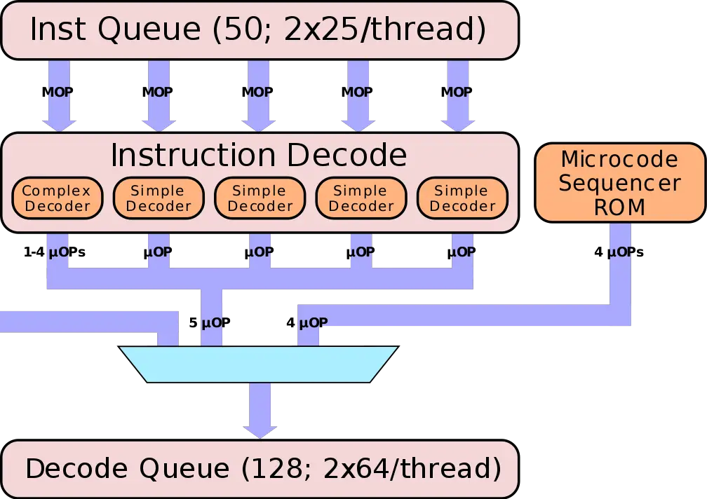

+++
Sources = [
"https://lwn.net/Articles/252125/",
"https://en.wikipedia.org/wiki/Vector_processor",
"https://arxiv.org/pdf/2310.13212",
"https://en.wikipedia.org/wiki/CPU_cache",
"https://dl.acm.org/doi/pdf/10.1145/3524059.3532396",

]
authors = [
"Michael Shalitin",

]
math = true
date = "2025-01-11"
categories = [

]
series = [

]
title = "Decoder"
+++

מעבדים מבצעים הוראות באמצעות טכניקת ה-pipeline, שבה כל הוראה עוברת סדרת שלבים: תחילה היא מפוענחת, לאחר מכן מתבצע הכנת הפרמטרים, ולבסוף ההוראה מבוצעת. כאשר ה-pipeline ארוך, זה אומר שאם מתרחשת תקלה ב-pipeline (כלומר, כאשר זרימת ההוראות עוצרת), לוקח זמן להחזיר אותו למצב של פעולה רגילה. תקלות ב-pipeline יכולות להתרחש כאשר קשה לחזות את מיקום ההוראה הבאה או כאשר לוקח זמן רב לטעון את ההוראה הבאה מהזיכרון.

ב-pipeline, ה"טריק" הוא להתחיל לפענח את ההוראה הבאה עוד לפני שההוראה הנוכחית עזבה את המעבד, בדומה לפס ייצור. כך, מפענח הכתובות נשאר בתפקוד רציף ולא נותר ללא עבודה.

השליפה של הוראות מפוענחות מראש מבטלת את הצורך בפענוח חוזר של הוראות מורכבות באורך משתנה ל-micro-ops פשוטות ואחידות באורכן. תהליך זה מפשט את חיזוי ההוראות, שליפתן, סידורן ויישורן. cache ה-μop מפחית את העומס על שלבי השליפה והפענוח, מקטין את צריכת הכוח ומשפר את אספקת ה-frontend של micro-ops מפוענחות. בנוסף, cache ה-μop מייעל את הביצועים על ידי אספקה עקבית יותר של micro-ops מפוענחות ל-backend, ובכך נמנע מצווארי בקבוק בלוגיקת השליפה והפענוח של המעבד.

במעבדי אינטל, ה-predecoder שולף בלוקים מיושרים של 16 בתים מ-cache ההוראות (עד בלוק אחד בכל מחזור). תפקידו המרכזי הוא לזהות את נקודת ההתחלה של כל הוראה, משימה מאתגרת במיוחד בשל השונות באורך ההוראות, הנע בין בית אחד ל-15 בתים. זיהוי זה דורש לעיתים בדיקה של מספר בתים בהוראה כדי לקבוע את אורכה. לאחר הפענוח הראשוני, ההוראות מועברות לתור ההוראות (IQ).

קיים מקרה מיוחד עבור הוראות עם קידומות באורך משתנה (LCP), שבהן ה-predecoder נאלץ להשתמש באלגוריתם פענוח איטי יותר, מה שמוביל לעיכוב בעיבוד כל הוראה כזו.

במעבדים, ה-µops המפוענחים מוזרמים לרוב מתוך cache ה-µOP (הנקרא גם Decoded Stream Buffer - DSB) או מתוך יחידת זיהוי זרם לולאה (Loop Stream Detector - LSD). לעומת זאת, בלוקים בסיסיים שאינם בלולאה נלקחים בדרך כלל מ-cache ההוראות (instruction cache - IC) ומפוענחים על ידי המפענחים.

ה-pipeline במעבד מחולק לשני חלקים עיקריים: ה-front end וה-back end. ה-front end אחראי על שליפת ההוראות ופענוחן ל-µops, בעוד שה-back end, המכונה גם מנוע הביצוע (execution engine), אחראי על ביצוע ה-µops, שמירה על סדר עדיפות בשל תלות בכתיבה ובקריאה, ובסופו של דבר על ביצוע ההוראות. ניתן לחלק את ה-front end וה-back end למספר רכיבים שונים:

ה-front end כולל את cache ההוראות (instruction cache), את ה-predecoder, את המפענח (decoder), את ה-DSB ואת ה-LSD.

המפענח אחראי על פענוח הוראות קלט ואחסון ה-µops שהתקבלו בתור פענוח ההוראות (instruction decode queue - IDQ). לאחר מכן, ה-renamer מקבל את ה-µops מתוך ה-IDQ, מבצע את המשימות הנדרשות, מאחסן את ה-µops ב-reorder buffer ומוציא אותם ל-scheduler.

כל רכיב ב-pipeline יכול לעבד מספר מסוים של הוראות או µops בכל מחזור, בהתאם לרוחב העיבוד המקביל שלו. כפי שנמצא במחקרים קודמים, כמות ה-µops שעובדים על ידי רכיב מסוים במחזור תלויה הן במאפייני רכיב ה-pipeline והן באופי ה-µops המעובדים.

בשלבים שונים של ה-pipeline, ניתן לבצע מיזוג, פיצול או ביטול הוראות. לדוגמה, ניתן למזג זוגות מסוימים של הוראות בתור ההוראות (instruction queue), הוראות אלו נקראות "macro fused" והן מטופלות כהוראה אחת על ידי שאר ה-pipeline. באופן דומה, שני µops מסוגי הוראות מסוימים יכולים להתמזג יחד בשלב הפענוח, ולטופל כ-µop אחד עד שהם מפוצלים על ידי ה-renamer או כשהם נכנסים ל-scheduler. מצב זה מכונה לעיתים קרובות micro fusion. לפני הפיצול, ה-µops המפוענחים נקראים fused-domain µops. ישנם גם µops מסוימים שיכולים להתבצע על ידי ה-renamer עצמו ולא נשלחים כלל ל-scheduler.

בהתאם לסוג ההוראה ומצב ה-pipeline, הוראות עוברות דרך רכיבי pipeline שונים. הוראות שהן חלק מלולאה מעובדות בדרך כלל על ידי ה-predecoder וה-decoder רק פעם אחת, ובאיטרציות הבאות הן מוגשות מ-LSD או DSB. הוראות שאינן חלק מלולאה מעובדות בדרך כלל על ידי ה-predecoder וה-decoder.

### Decoder

יחידת הפענוח (Decoder) אחראית לפענוח של עד ארבע הוראות בכל מחזור, ולאחסון ה-µops המפוענחים בתור פענוח ההוראות (IDQ). יחידת הפענוח מורכבת משלושה מפענחים פשוטים ומפענח מורכב אחד. המפענח המורכב יכול לפענח הוראות המכילות עד ארבעה µops, בעוד שהמפענחים הפשוטים מטפלים בהוראות המכילות µop אחד בלבד. המפענח המורכב תמיד מטפל בהוראה הראשונה שנשלפת במחזור. יחידת הפענוח מקצה פקודה נכנסת למפענח מתאים בהתבסס על מצב היחידה ומאפייני ההוראות הנכנסות.

### Decoded Stream Buffer (DSB)

ה-Decoded Stream Buffer (DSB), הידוע גם כ-µop cache, מאחסן µops מפוענחים. עבור לולאות שבהן הפענוח מהווה צוואר בקבוק, ה-DSB יכול לשפר את התפוקה על ידי אחסון ה-µops המפוענחים במהלך האיטרציה הראשונה של הלולאה, ולאחר מכן הזרמתם ל-renamer באיטרציות הבאות.

ה-µops שמפוענחים מאוחסנים ב-Decoded Stream Buffer (DSB, או µOP cache), בהתאם לתנאים מסוימים. אחסון זה יכול לשפר את התפוקה של לולאות שבהן הפענוח מהווה צוואר בקבוק.

### Loop Stream Detector (LSD)

ה-Loop Stream Detector (LSD) מזהה מתי µops של לולאה מתאימים באופן מלא ל-IDQ. במצבים כאלה, הוא נועל את ה-µops ב-IDQ ומזרים אותם ישירות ל-renamer ללא צורך בפנייה ל-DSB או למפענחים. עם זאת, לא ניתן להזרים את ה-µop האחרון של איטרציית הלולאה הנוכחית ואת ה-µop הראשון של האיטרציה הבאה באותו מחזור. עבור לולאות קטנות, זה יכול להיות צוואר בקבוק משמעותי, מכיוון שמספר ה-µops המוזרמים בכל מחזור עלול להיות קטן מרוחב ההנפקה של המיקרו-ארכיטקטורה. במקרים כאלה, ה-LSD עשוי לפתוח את הלולאה כדי להגדיל את מספר ה-µops המוזרמים בכל מחזור.

### Predecoder

ה-Predecoder אחראי להבאת הוראות מ-cache ההוראות בבלוקים מיושרים של 16 בתים. הוא מזהה את תחילתה של כל פקודה בבלוקים אלה ומאחסן את ההוראות המפוענחות מראש בתור ההוראות (Instruction Queue - IQ). זה חשוב, מכיוון שכל פקודה יכולה להיות באורך של בין 1 ל-15 בתים, וזיהוי תחילת ההוראה העוקבת עשוי לדרוש בדיקה של מספר בתים מההוראה הנוכחית.

ה-Predecoder מסוגל לפענח מראש עד חמש הוראות בכל מחזור. אם יש יותר מחמש הוראות בבלוק של 16 בתים, חמש ההוראות הבאות יפוענחו במחזור הבא, וכך הלאה.

כאשר הוראה חוצה את גבול ה-16 בתים, עשוי להיגרם עיכוב של מחזור אחד בפענוח המוקדם שלה, בהתאם למיקום של ה-opcode של ההוראה בבלוק. נוסף על כך, אם ההוראות מכילות קידומות משתנות באורך (length-changing prefix - LCP), ה-Predecoder יצטרך להשתמש באלגוריתם מיוחד, מה שיגרום לעיכוב של שלושה מחזורים על כל הוראה כזו.

---

https://en.wikichip.org/wiki/intel/microarchitectures/skylake_(client)

**תפקיד ה-Front-End**

ה-front-end מיועד להזין את ה-back-end בזרם יציב של פעולות, באמצעות פענוח ההוראות שנשלפות מהזיכרון. ה-front-end כולל שני מסלולים עיקריים: הנתיב המסורתי (legacy path) ונתיב ה-µOP cache. הנתיב המסורתי מטפל בהוראות x86 באורך משתנה, שמובאות מ-cache ההוראות ברמה 1, מונחות בתור ולאחר מכן מפוענחות ל-µOPs פשוטות וקבועות באורכן. הנתיב השני, והעדיף, הוא נתיב ה-µOP cache, בו ההוראות שכבר פוענחו מאוחסנות ב-cache וניתנות לשליחה ישירה ל-decode queue.

למרות המסלול שההוראה עוברת, בסופו של דבר היא מגיעה ל-decode queue. תור ה-IDQ מייצג את הגבול בין ה-front-end ל-execution engine, ומסמן את תחילת התהליך שבו מתבצע ביצוע מחוץ לסדר.

**האתגר של ה-Front-End**

ה-front-end אחראי על תהליך מורכב של שליפת הוראות x86 מהזיכרון, פענוחן, והעברתן ליחידות הביצוע. המטרה שלו היא לספק באופן מתמיד זרם מספק של µOPs כדי שה-back-end יוכל לפעול במלוא העוצמה. כאשר ה-back-end לא מנוצל במלואו, ביצועי הליבה נפגעים. ביצועים נמוכים של ה-front-end מובילים לביצועים נמוכים של הליבה. המשימה מורכבת עוד יותר בשל השינויים בנתיבי הביצוע כמו branch-ים והמורכבות של הוראות x86 עצמן.

**Pre-Decode Buffer**

בתחילה, ההוראות נשלפות מ-cache L2 אל cache L1, שבו הן עדיין נשארות macro-ops, כלומר הוראות ארכיטקטוניות באורך משתנה מסוג x86. בשלב זה, הן מועברות ל-pre-decode buffer לצורך הכנה ראשונית.

הוראות x86 הן מורכבות ובעלות אורך משתנה, דבר המקשה על זיהוי גבולות ההוראה ב-pre-decode buffer. כל הוראה יכולה להשתנות באורכה מבית אחד עד 15 בתים, ולכן תהליך הפענוח דורש בדיקה של מספר בתים בהוראה. בנוסף לזיהוי גבולות ההוראה, ה-pre-decoder גם מפענח קידומות ונבדקות תכונות כמו branch-ים. בדומה לארכיטקטורות קודמות, ל-pre-decoder יש תפוקה של עד 6 macro-ops למחזור או עד שמיצו את 16 הבתים של הבלוק הנוכחי, המוקדם מביניהם.

יש לציין שה-predecoder אינו טוען בלוק חדש של 16 בתים עד שמיצוי מלא של הבלוק הקודם מתבצע. לדוגמה, אם במחזור הראשון יעובדו 6 הוראות מתוך 7, המחזור השני יתבזבז על עיבוד ההוראה האחרונה. זה יגרום לתפוקה נמוכה בהרבה של 3.5 הוראות למחזור, דבר שאינו אופטימלי. מקרה דומה מתרחש אם בלוק של 16 בתים מכיל 4 הוראות בלבד עם בית אחד נוסף מההוראה החמישית. במקרה זה, תהליך הפענוח ידרוש שני מחזורים. כמו כן, קיימים מקרים מיוחדים שבהם קידומות ארוכות יגררו עלויות נוספות בתהליך ה-predecoder. בדרך כלל, הקוד האמיתי קטן מ-4 בתים, מה שמוביל לתפוקה טובה יותר.

**חיזוי Branch-ים**

כל המערכת פועלת בשיתוף עם יחידת חיזוי ה-branch-ים (ה-branch prediction), שמנסה לנחש את זרימת ההוראות הבאה. בארכיטקטורת Skylake, מנבא ה-branch שופר, עם הפחתה בעונש (latency) על חיזוי שגוי של יעד קפיצה ישירה. בנוסף, המנבא ב-Skylake מסוגל לבדוק יותר בזרם הבייטים בהשוואה לארכיטקטורות קודמות, אך פרטי השיפורים המדויקים לא נחשפו על ידי אינטל.

#### תור ההוראות ומיזוג macro-ops (Fusion)

הוראות שעברו פענוח ראשוני מועברות לתור ההוראות (IQ). בתור זה, Skylake מבצע macro-ops-fusion, בו הוא יכול לשלב שני macro-ops לפעולה מורכבת אחת במקרים מסוימים. לדוגמה, כאשר מופיעה הוראת בדיקה או השוואה עם קפיצה מותנית מיד לאחריה, היא מתמזגת להוראת השוואה ו-branch יחיד. הוראות ממוזגות אלו נשארות כפעולה אחת לאורך כל ה-pipeline ומתבצעות כפעולה יחידה על ידי יחידת ה-branch, מה שחוסך ברוחב פס בשלבי העיבוד השונים. עם זאת, רק מיזוג אחד כזה יכול להתבצע בכל מחזור.

#### פענוח (Decoding)

בכל מחזור, עד ארבע הוראות שעברו פענוח ראשוני (pre-decoded) מועברות למפענחים (decoders). המפענחים מתחלפים בין שני ה-thread-ים בכל מחזור, בדומה למנגנון השליפה. כל מפענח מתרגם את פעולות המאקרו ופולט µOPs באורך קבוע.

מפענח פשוט מסוגל לתרגם הוראות שפולטות µOP מתמזג בודד, בעוד שמפענח מורכב יכול לפענח בין אחד לארבעה µOPs מתמזגים.

#### MSROM ומנוע המחסנית (Stack Engine)

בארכיטקטורת x86 קיימות פעולות ייעודיות לניהול מחסנית, כגון PUSH, POP, CALL ו-RET, שפועלות על מצביע המחסנית (ESP). ללא חומרה ייעודית, פעולות אלו היו נשלחות ל-back-end לביצוע באמצעות ה-ALUs הכלליים, דבר שהיה מנצל רוחב פס ומשאבי יחידות הביצוע וה-scheduler. מאז Pentium M, אינטל עושה שימוש במנוע מחסנית (Stack Engine) כדי להתמודד עם פעולות אלו.

מנוע המחסנית כולל שלושה חיבורים ייעודיים, בהם הוא משתמש כדי לבצע ולעדכן את ה-µOPs של המחסנית. לדוגמה, הוראת PUSH מתורגמת לפעולת store וחיסור של 4 מ-ESP. במקרה זה, החיסור מבוצע על ידי מנוע המחסנית. המנוע ממוקם אחרי המפענחים ועוקב אחרי זרם ה-µOPs שעוברים דרכו. כאשר נתפסת פעולה לשינוי המחסנית, היא מטופלת על ידי המנוע, מה שמקל על העומס ב-pipeline על ידי הפחתת הצורך לשלוח את פעולות המחסנית ליחידות הביצוע הכלליות. בצורה זו, החישוב של מצביע המחסנית במנוע המחסנית מהיר ויעיל יותר מאשר ביצוע פעולות אלו ב-pipeline באמצעות ה-ALUs.

#### cache µOP ומורכבות פענוח x86

פענוח הוראות x86 הוא תהליך מורכב בשל אורכן המשתנה, חוסר העקביות והמבנה המסובך שלהן. משימה זו גוזלת לא מעט משאבי ביצועים וצריכת כוח. כדי להימנע מהעומס הזה, ה-pipeline מעדיף להימנע מפענוח חוזר של ההוראות. כאן נכנס לתמונה cache ה-µOP, או buffer הזרם המפוענח (DSB), שתפקידו לספק את הפענוחים שכבר בוצעו.

ה-cache µOP מחולק בצורה תחרותית בין שני ה-thread-ים והוא גם מסוגל לשמור מצביעים למיקרוקוד.

#### מיזוג µOP וגלאי לולאות (LSD)

ה-IDQ מבצע אופטימיזציות נוספות כאשר הוא ממלא את תור ההוראות. אחד ממנגנוני האופטימיזציה הוא גלאי הלולאות (Loop Stream Detector - LSD), שמסוגל לזהות לולאות המתאימות לתור ההוראות ולנעול אותן בו. כלומר, ה-LSD יכול להזרים את אותו רצף של µOPs ישירות מה-IDQ שוב ושוב, ללא צורך בשליפה, פענוח או ניצול נוסף של cache-ים ומשאבים אחרים. הזרמת הלולאה נמשכת ללא הפסקה עד שמתרחשת תחזית שגויה של branch. כאשר ה-LSD פעיל, יתר ה-front-end מושבת למעשה.

ה-LSD יעיל במיוחד עבור אלגוריתמים נפוצים רבים, כמו לולאות חוזרות, לולאות חישוב אינטנסיביות וחיפושים, שנמצאים במגוון תוכנות ויישומים.

