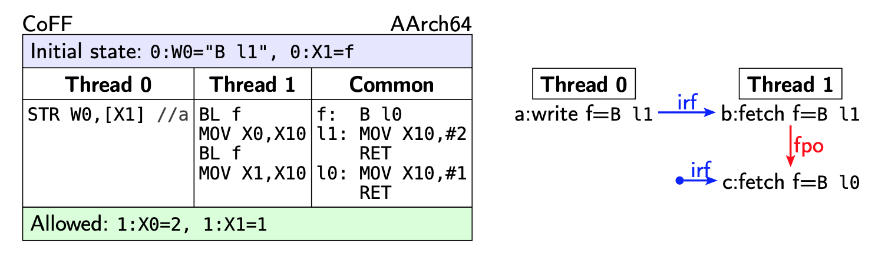

+++
Sources = [
"https://en.wikipedia.org/wiki/Cache_coherence",
"https://pages.cs.wisc.edu/~markhill/papers/primer2020_2nd_edition.pdf",
"https://developer.arm.com/documentation/den0024/a/Multi-core-processors/Multi-core-cache-coherency-within-a-cluster?lang=en",
"https://inria.hal.science/hal-02509910/document",
"https://www.amd.com/content/dam/amd/en/documents/processor-tech-docs/programmer-references/24593.pdf",
"http://infolab.stanford.edu/pub/cstr/reports/csl/tr/95/685/CSL-TR-95-685.pdf",
"https://mirrors.edge.kernel.org/pub/linux/kernel/people/paulmck/LWNLinuxMM/StrongModel.html",

]
authors = [
"Michael Shalitin",

]
math = true
date = "2025-01-11"
categories = [

]
series = [

]
title = "Cache coherence"
+++

---

## מבוא לקוהרנטיות

בעיית קוהרנטיות יכולה להתרחש כאשר מספר גורמים (כמו מספר ליבות) מנסים לגשת לנתון מסוים שיש לו מספר עותקים (למשל, עותקים שונים ב-cache-ים) ולפחות אחת הגישות היא כתיבה. כדי למנוע גישה לנתונים מיושנים (שגורמת לחוסר קוהרנטיות) נעשה שימוש בפרוטוקול קוהרנטיות.

חוסר קוהרנטיות נגרם בעיקר בשל נוכחותם של מספר מעבדים עם גישה ל-cache-ים ולזיכרון. במערכות מודרניות, מעבדים אלו כוללים ליבות מעבד, מנועי DMA  והתקנים חיצוניים, אשר יכולים לקרוא ולכתוב לזיכרון ולפחות לחלקם יש cache.

קוהרנטיות cache שואפת להפוך את ה-cache-ים במערכת זיכרון משותף לבלתי נראים מבחינה פונקציונלית, כאילו כל ה-cache-ים שייכים למערכת בעלת ליבה אחת בלבד. היא משיגה זאת על ידי הפצת כתיבה ממעבד אחד ל-cache-ים של מעבדים אחרים במערכת.

חשוב לציין, שבניגוד לעקביות, שהיא מפרט ארכיטקטוני המגדיר את נכונות הזיכרון המשותף, קוהרנטיות אינה עוסקת בהגדרת המודל של עקביות עצמו אלא משמשת כאמצעי לתמוך במודל העקביות. בפרט, פרוטוקולי קוהרנטיות ממלאים תפקיד חשוב בהבטחת עקביות הזיכרון במערכת.

אפשר להשיג קוהרנטיות על ידי השבתה מוחלטת של ה-cache למיקומי זיכרון משותפים, אך שיטה זו נוטה להקטין את הביצועים באופן משמעותי.
### מתי קוהרנטיות רלוונטית?

קוהרנטיות נוגעת לכל מבני האחסון שמחזיקים בלוקים מתוך מרחב הכתובות המשותף. מבנים אלה כוללים את ה-cache הנתונים ברמות השונות, וגם את הזיכרון הראשי. בנוסף, בחלק מהארכיטקטורות זה כולל את ה-instructions-cache ברמה L1 ו-TLBs (לפעמים ה-TLB יכול להחזיק מיפויים שאינם עותקים בלבד של בלוקים מתוך הזיכרון המשותף).

קוהרנטיות אינה נראית ישירות למתכנת. במקום זאת, ה-pipeline של המעבד ופרוטוקול הקוהרנטיות עובדים יחד כדי לאכוף את מודל העקביות, ורק מודל העקביות הוא החשוף למתכנת.

### הדרישות המרכזיות לקוהרנטיות cache:

- **התפשטות כתיבה**: כאשר משתנים נתונים המאוחסנים ב-cache, יש לוודא שהשינויים מתעדכנים גם בעותקים האחרים של אותו בלוק בזיכרונות ה-cache של שאר המעבדים במערכת.

- **סידור טרנזקציות**: כל פעולות הקריאה והכתיבה שמתבצעות לאותו מיקום בזיכרון צריכות להיראות לכל המעבדים באותו סדר. כך מובטחת עקביות בסדר הגישה לנתונים המשותפים בין כל המרכיבים במערכת.

בעוד שתיאורטית ניתן להבטיח קוהרנטיות ברמת כל פעולת קריאה וכתיבה, בפועל קוהרנטיות מיושמת לרוב ברמת cache line, משום שזה יעיל יותר מבחינת ביצועים.

קוהרנטיות cache לבדה אינה מספיקה כדי להבטיח התנהגות זיכרון תקינה במערכות שבהן נתונים משותפים נשמרים ב-cache. היא מהווה רק חלק מצומצם מהאילוצים שמגדיר מודל הזיכרון של המערכת. לדוגמה, קוהרנטיות cache אינה מתייחסת לסדר הפעולות הנובע מיחסי סדר בין פעולות זיכרון שונות במיקומים שונים. יתרה מכך, חלק מהאילוצים שמגדיר מודל הזיכרון חלים גם במערכות שאינן תומכות ב-cache-ים כלל. בנוסף, במערכות רבות, קשה להפריד בין פרוטוקול קוהרנטיות ה-cache לפרוטוקול הכללי שנועד לשמירה על עקביות הזיכרון, אך לרוב, פרוטוקול הקוהרנטיות מהווה חלק חיוני בתוכנית הכוללת לתמיכה במודל הזיכרון של המערכת.

קוהרנטיות cache מתארת עקרון לפיו במערכת מרובת מעבדים, כל המעבדים חייבים לקבל תצוגה עקבית של תוכן הזיכרון המשותף. כלומר, כאשר מעבדים שונים מבצעים פעולות כתיבה לאותו מיקום בזיכרון, חייב להיות סדר גלובלי מוסכם של פעולות הכתיבה הללו (הנקרא "סדר הקוהרנטיות"), כך שכל מעבד יראה את השינויים באותו סדר. סדר זה חייב להיות עקבי עם סדר הפעולות שהוגדרו בתוכנית עבור אותו מיקום בזיכרון.

חשוב להבדיל בין קוהרנטיות לעקביות, בספרות המקצועית ההבדל ביניהם הוא שקוהרנטיות מתייחסת לכל מיקום זיכרון בנפרד (מיקום זיכרון יחיד), בעוד שעקביות מתייחסת למערכת כולה ולכל מיקומי הזיכרון באופן כללי במערכת.

### קוהרנטיות מנוהלת תוכנה

קוהרנטיות מנוהלת תוכנה היא גישה לניהול שיתוף נתונים. ביישום זה, הנתונים מאוחסנים ב-cache, אך ניהול הקוהרנטיות שמתבצע באמצעות תוכנה (בעיקר דרייברים וספריות ברמה נמוכה מבצעים פעולות כאלו) אחראי לנקות נתונים שהם במצב dirty או לבטל עותקים ישנים מה-cache. גישה זו עלולה להוסיף זמן עיבוד, להקשות על פיתוח התוכנה ולהפחית ביצועים כאשר שיעור השיתוף בין הליבות גבוה.

### קוהרנטיות מנוהלת חומרה

בגישה מנוהלת חומרה, הקוהרנטיות בין ה-data-cache-ים ברמה 1 בתוך cluster נשמרת על ידי החומרה. כאשר ליבה מופעלת, היא משתתפת אוטומטית במערכת הקוהרנטיות, כל עוד ה-data-cache וה-MMU שלה פעילים והכתובת נחשבת לקוהרנטית.

תמיכה בקוהרנטיות מנוהלת חומרה מוסיפה מורכבות לחומרה הקשורה ל-interconnect ול-cluster, אך היא מפשטת מאוד את התוכנה ומאפשרת פיתוח יישומים שלא היו אפשריים רק באמצעות קוהרנטיות תוכנה.

במערכות עם קוהרנטיות חומרה הקוהרנטיות נשמרת לרוב בפירוט שמתאים למספר מילים בזיכרון, אשר בדרך כלל תואם לגודל ה-cache line. פירוט זה מכונה coherence granularity. גודל גדול יותר של coherence granularity מסייע בהפחתת התקורה הקשורה לניהול ביטים של מצבי תג ב-cache. בדרך כלל, עותקים ב-cache נשלפים לפי גודל של cache line שלמה, וכאשר מתבצע ביטול, cache line שלמה מבוטלת גם אם הכתיבה שהביאה לכך נוגעת רק למילה בודדת.

כשה-coherence granularity גדול זה מציב פשרה מבחינת ביצועים: כאשר יש מקומיות מרחבית טובה, נתונים יכולים להפיק תועלת מהעברת נתונים בגודל cache line שלמה, אך כאשר יש מקומיות מרחבית גרועה, הדבר עלול להוביל ליותר cache misses בשל תופעת false sharing.

## קוהרנטיות בין רכיבים שונים

במקרים מסוימים, שינוי הנתונים יכול להתרחש בצורה שהפרוטוקול קוהרנטיות לא יכול לטפל בו עקב השפעות של מנגנוני יעול של המעבד כמו prefetching של הוראות וקיום רכיבים שלא משתתפים בפרוטוקול קוהרנטיות.

במצבים כאלה, התוכנה חייבת להשתמש בהוראות המיועדות להסדרת ה-cache או הוראות invalidation כדי להבטיח שהגישה לנתונים תהיה קוהרנטית לאחר מכן.

### קוהרנטיות הוראות

בארכיטקטורות כמו ARM וארכיטקטורות אחרות, שליפת פקודות אינן בהכרח קוהרנטיות. 

#### קוהרנטיות הוראות להוראה
$\text{instruction fetch} \to \text{instruction fetch}$
שליפה אחת של פקודות עשויה להיות לא עקבית עם שליפה קודמת לפי סדר התוכנית.
#### קוהרנטיות הוראה לנתונים
$\text{instruction fetch} \to \text{data fetch}$
כאשר מתבצע fetch ואז קריאה מאותו מיקום בזיכרון, הקריאה אינה מחויבת לראות את הכתיבה לאותו מיקום באופן קוהרנטי.

#### קוהרנטיות נתונים להוראה
$\text{data fetch} \to \text{instruction fetch}$
כאשר מתבצעת קריאה ואחריה fetch מאותו מיקום בזיכרון, הקריאה אינה מחויבת לראות את הכתיבה לאותו מיקום באופן קוהרנטי. במילים אחרות, ייתכן שה-fetch של הוראה לא יראה את השינויים שנעשו בכתיבה הקודמת.
### גישה קוהרנטית עם DMA

הטמעה של DMA בצורה קוהרנטית יכולה להתבצע פשוט על ידי הוספת cache קוהרנטי לבקר ה-DMA, מה שמאפשר לו להשתתף בפרוטוקול הקוהרנטיות של המערכת. במודל כזה, בקר ה-DMA יתנהג כמו ליבה ייעודית מבחינת הקוהרנטיות, מה שמבטיח שקריאות DMA תמיד יגיבו לגרסה העדכנית ביותר של בלוק הנתונים ושהכתיבות של DMA יבצעו ביטול של כל העותקים הישנים של הבלוק.

עם זאת, הוספת cache קוהרנטי לבקר DMA אינה תמיד אופטימלית מסיבות שונות. ראשית, דפוסי מקומיות של בקרי DMA שונים מאוד מאלו של ליבות קונבנציונליות, לעיתים רחוקות בקרי DMA משתמשים באותם נתונים שוב בטווח זמן קצר והגישות זורמות דרך הזיכרון. לכן, ה-cache של DMA בדרך כלל לא מנצל היטב את התועלת שניתן להפיק מגודלו. שנית, כאשר בקר DMA מבצע כתיבה לבלוק, הוא נוטה לכתוב את כל הבלוק בבת אחת, מה שהופך את שליפת הבלוק באמצעות פעולה כמו ReadUnique (בפרוטוקלי AMBA) לבזבזנית, מכיוון שכל הנתונים מוחלפים. פרוטוקולי קוהרנטיות שונים מטפלים במצבים כאלה על ידי שימוש בפעולות קוהרנטיות מיוחדות, כמו הוספת בקשה חדשה מסוג MakeUnique שתבקש הרשאה לכתיבה רק אם מדובר בכתיבה ולא תדרוש שליחה של נתונים חדשים. אפשרות נוספת היא שימוש בהודעת WriteUniqueFull, שמעדכנת את הבלוק בזיכרון ומבטלת את כל העותקים האחרים, כולל העותקים במצבים של UD ו-SD.

אפשרות נוספת היא להימנע מהצורך בקוהרנטיות של cache חומרה על ידי דרישה ממערכת ההפעלה לשטוף את ה-cache בצורה סלקטיבית. לדוגמה, לפני התחלת DMA לקריאה או כתיבה ב-page מסוים, מערכת ההפעלה יכולה לאלץ את כל ה-cache-ים לשטוף את ה-page הנוגע באמצעות פרוטוקול דמוי TLB Shootdown או באמצעות תמיכה חומרתית אחרת לניקוי page-ים. גישה זו נחשבת לפחות יעילה ומיועדת בדרך כלל למערכות משובצות, מכיוון שמערכת ההפעלה צריכה לשטוף את כל ה-page באופן שמרני, גם אם רק חלק קטן ממנו נמצא בקבצים הנדרשים.

## פרוטוקול קוהרנטיות

מימושים התומכים ב-caching חייבים להיעזר בפרוטוקול קוהרנטיות cache על מנת לשמור על קוהרנטיות בין הזיכרון הראשי לבין ה-cache ושמירה על קוהרנטיות בין ה-cache-ים עצמם.

פרוטוקול קוהרנטיות, הוא מערכת של כללים המיושמת על ידי קבוצה של מעבדים מבוזרים בתוך המערכת. קיימים מגוון רחב של פרוטוקולי קוהרנטיות, אך העקרון המרכזי הוא שכל הווריאציות מבטיחות שהכתיבה של מעבד אחד תהיה גלויה לשאר המעבדים על ידי הפצת הכתיבה לכל ה-cache-ים.

פרוטוקול קוהרנטיות שומר על קוהרנטיות על ידי אכיפת האינוריאנטים הבאים:

1. **כותב אחד וריבוי קוראים (Single-Writer, Multiple-Read (SWMR))**: עבור כל מיקום זיכרון A, בכל זמן נתון (לוגי), ישנה רק ליבה אחת בלבד שיכולה לכתוב ל-A (ויכולה גם לקרוא אותה), או מספר ליבות שיכולות לקרוא את A בלבד מבלי לכתוב אליו.

2. **ערך ללא שינוי (Data-Value Invariant)**: הערך של מיקום הזיכרון בתחילת עידן חייב להיות זהה לערך של אותו מיקום זיכרון בסוף העידן הקודם שבו בוצעה קריאה או כתיבה.

כדי ליישם את האינוריאנטים הללו, מקשרים לכל מבנה אחסון, כל cache וזיכרון מכונת מצב סופי שנקראת בקר קוהרנטיות (coherence controller). האוסף של בקרי הקוהרנטיות הללו יוצר מערכת מבוזרת שבה הבקרים מתקשרים זה עם זה באמצעות הודעות, על מנת להבטיח שכל בלוק זיכרון שומר על האינוריאנטים SWMR ו-Data-Value לאורך זמן.

האינטראקציות בין מכונות המצב הסופי הללו מוגדרות על ידי פרוטוקול הקוהרנטיות. בקרי הקוהרנטיות אחראים למספר תחומים: בקר הקוהרנטיות ב-cache, לדוגמה, נקרא לעיתים בקר cache.

בקר ה-cache אחראי לטפל בבקשות משני מקורות עיקריים:

- **בצד הליבה**: בקר ה-cache מתקשר עם ליבת המעבד. הוא מקבל בקשות לקריאות ולכתיבות מהליבה ומחזיר את ערכי הקריאות לליבה. כאשר מתרחש cache miss, הבקר יוזם טרנזקציה קוהרנטית על ידי שליחת בקשת קוהרנטיות, כמו בקשה להרשאת קריאה בלבד, עבור הבלוק המכיל את המיקום שניגשת אליו הליבה. בקשת הקוהרנטיות נשלחת דרך רשת interconnection לבקרי קוהרנטיות אחרים במערכת. טרנזקציה זו כוללת את הבקשה וכן את שאר ההודעות הנדרשות להשלמתה, כגון הודעות תגובה עם נתונים שנשלחות מבקר קוהרנטיות אחר למבקש. סוגי הטרנזקציות וההודעות שנשלחות במסגרת כל טרנזקציה משתנים בהתאם לפרוטוקול הקוהרנטיות הספציפי במערכת.

- **בצד הרשת**: בקר ה-cache מתקשר עם שאר המערכת דרך רשת interconnection. הוא מקבל בקשות קוהרנטיות ותגובות קוהרנטיות שצריך לעבד. עיבוד ההודעות הקוהרנטיות הנכנסות תלוי גם הוא בפרוטוקול הקוהרנטיות הספציפי המנוהל במערכת.

בקר זיכרון דומה לבקר cache, אך בדרך כלל יש לו רק צד רשת. כלומר, הוא לא מוציא בקשות קוהרנטיות עבור פעולות קריאה או כתיבה, ולא מקבל תגובות קוהרנטיות.

ה-agent-ים אחרים במערכת, כמו התקני io, עשויים להתנהג כמו בקרי cache, בקרי זיכרון או לשלב את התכנים של שניהם, בהתאם לצרכים הספציפיים שלהם. כל בקר קוהרנטיות פועל על פי קבוצת מכונות מצב סופי - למעשה, מכונת מצב סופי אחת עבור כל בלוק באופן לוגי - ומעבד אירועים (כגון הודעות קוהרנטיות נכנסות) בהתאם למצב הנוכחי של הבלוק. כאשר אירוע מסוים, E (למשל, בקשת store מהליבה), מתרחש עבור בלוק B, בקר הקוהרנטיות מבצע פעולות (כגון הוצאת בקשת קוהרנטיות להרשאת קריאה-כתיבה) התלויות באירוע E ובמצב הנוכחי של B. לאחר ביצוע הפעולות הללו, הבקר עשוי לעדכן את מצב הבלוק B בהתאם.

ההבדלים בין פרוטוקולי קוהרנטיות נובעים מהשונות במפרטי הבקר השונים. הבדלים אלה כוללים קבוצות שונות של מצבי בלוק, טרנזקציות, אירועים ומעברים בין מצבים.

### מאפייני פרוטוקול קוהרנטיות

קיימים כל מיני מאפיינים לפרוטוקול קוהרנטיות ובעזרתם אפשר לחלק את הפרוטוקולים לקבוצות ולראות תכונות בולטות בין הפרוטוקולים.

#### מאפייני סנכרון
הפרוטוקולים שונים במועדי ובאופן הסנכרון שיתקיים, קיימים שני סוגים עיקריים של פרוטוקולי קוהרנטיות:

1. בגישה הראשונה, פרוטוקול הקוהרנטיות מבצע הפצת כתיבה ל-cache-ים באופן סינכרוני, כלומר הכתיבה מועברת לכולם במקביל.
2. בגישה השנייה, פרוטוקול הקוהרנטיות מבצע את ההפצה באופן אסינכרוני, כלומר הכתיבה מופצת בהדרגה, תוך שמירה על מודל העקביות של המערכת.

במעבדים מודרניים, כתיבה לרוב מופצת באופן אסינכרוני, מה שאומר שהכתיבה עשויה להתבצע לפני שהיא הופכת לגלויה לכל המעבדים במערכת. תהליך זה יכול להוביל לצפייה בערכים מיושנים בזמן אמת. עם זאת, כדי לשמור על עקביות נכונה, פרוטוקולי קוהרנטיות צריכים להבטיח שהסדר שבו הכתיבה הופכת לגלויה יהיה בהתאם לכללי הסדר שנקבעו על ידי מודל העקביות של המערכת.

#### קוהרנטיות בתוך המעבד ובין המעבדים

בדרך כלל ניתן להבחין בין שני מרכיבים עיקריים בקוהרנטיות cache:

- פרוטוקול הקוהרנטיות שמטפל בניהול הקוהרנטיות בתוך היררכיית ה-cache של כל מעבד בנפרד.
- פרוטוקול הקוהרנטיות שמנהל את הקוהרנטיות בין cache-ים של מעבדים שונים במערכת.

ההבחנה הזו מאפשרת לטפל בנפרד בקוהרנטיות בתוך המעבד ובין המעבדים, מה שמייעל את הניהול של קוהרנטיות במערכות מבוזרות.

#### פרוטוקולי Invalidate לעומת Update

כדי להבטיח שהעותקים ב-cache-ים השונים יישארו מעודכנים, כאשר מתבצעת כתיבה לזיכרון, יש לבטל או לעדכן את העותקים הישנים, המכונים נתונים מעופשים (stale), בעותקים האחרים. ניתן לבצע זאת באמצעות שתי גישות: ביטול (invalidate) של הנתונים המעופשים או עדכון הערך המאוחסן ב-cache לערך החדש שנכתב. תהליך זה של ביטול או עדכון מלווה לעיתים קרובות בהודעת אישור שמעידה על השלמת הפעולה. רוב העיצובים של פרוטוקולי קוהרנטיות משתמשים או בגישה של ביטול או בגישה של עדכון, אך ישנם עיצובים היברידיים שבהם המערכת יכולה לבחור באופן סטטי או דינמי בין שתי השיטות, בהתאם למיקום הזיכרון או לתנאים אחרים. 

בפרוטוקול קוהרנטיות, אחת ההחלטות העיקריות בתכנון היא כיצד לנהוג כאשר ליבה כותבת לבלוק זיכרון. קיימות שתי אפשרויות עיקריות:

##### פרוטוקולי Invalidate

כאשר ליבה רוצה לכתוב לבלוק, היא יוזמת טרנזקציה קוהרנטית שמביאה לביטול של העותקים של הבלוק בכל ה-cache-ים האחרים. ברגע שהעותקים בוטלו והפכו ללא חוקיים, הליבה המבקשת יכולה לבצע את הכתיבה ללא חשש שהליבות האחרות יקראו את הערך הישן של הבלוק. אם ליבה אחרת רוצה לקרוא את הבלוק לאחר שהעותק שלו בוטל, עליה ליזום טרנזקציה קוהרנטית חדשה כדי לקבל את הבלוק, ובכך תקבל עותק מעודכן מהליבה שביצעה את הכתיבה. תהליך זה מבטיח שמירה על הקוהרנטיות.
##### פרוטוקולי Update

כאשר ליבה רוצה לכתוב לבלוק, היא יוזמת טרנזקציה קוהרנטית שמביאה לעדכון כל העותקים של הבלוק בכל ה-cache-ים האחרים כדי לשקף את הערך החדש שנכתב.

פרוטוקולי Update מפחיתים את זמן ההשהיה לקריאה של בלוק חדש שנכתב, משום שהליבה אינה נדרשת ליזום ולחכות להשלמת טרנזקציה חדשה. עם זאת, פרוטוקולי Update בדרך כלל צורכים יותר רוחב פס מפרוטוקולי Invalidate, מכיוון שהודעות ה-Update כוללות מידע נוסף (כתובת וערך חדש) לעומת הודעות Invalidate (שכוללות רק כתובת).

פרוטוקולי Update גם מסבכים את היישום של מודלים שונים של עקביות זיכרון. לדוגמה, שמירה על multi-copy atomicity נעשית מורכבת יותר כאשר יש צורך לעדכן מספר עותקים של בלוק בזיכרון. בשל המורכבות הרבה של פרוטוקולי Update, הם מיושמים רק לעיתים נדירות.

### תנאי סיום בפרוטוקול קוהרנטיות

תנאי הסיום של פרוטוקול קוהרנטיות דורשים שכל פעולת כתיבה שהונפקה על ידי מעבד תסתיים לבסוף באופן שהכתיבה תיראה על ידי כל המעבדים באותו סדר עקבי. כלומר, סדר ההשלמה של פעולות הכתיבה חייב להיות אחיד ונראה לכל המעבדים במערכת. דרישה זו חיונית במיוחד במערכות שבהן נתונים משוכפלים ב-cache-ים בין כמה מעבדים, שכן היא מבטיחה שכל שינוי בנתונים יהיה גלוי ומסונכרן בין כל הרכיבים.

בנוסף, הקוהרנטיות מחייבת שכל פעולת כתיבה לאותה כתובת בזיכרון תופיע בכל המעבדים באותו הסדר. כלומר, אם מספר מעבדים כותבים לאותה כתובת בזיכרון, כל המעבדים האחרים צריכים לראות את סדר הכתיבות באופן זהה (דרישה ל-multi-copy atomicity)

### Point of Coherence

נקודת הקוהרנטיות היא מיקום רעיוני בתוך המערכת שאליו מגיעות כל הכתיבות והמחסומים במהלך פעולתן. ניתן לדמות את נקודת הקוהרנטיות כמקום הסופי שבו מתבצעת הכתיבה, לאחר שהיא עוברת דרך כל ה-cache-ים וה-buffer-ים הרלוונטיים ומגיעה לזיכרון הראשי לשם אחסון סופי של הנתונים.

העיקרון המרכזי של נקודת הקוהרנטיות הוא שכתיבות לאותה כתובת זיכרון חייבות להגיע לנקודה זו בסדר קוהרנטיות אחיד. סדר זה מגדיר את הסדר שבו כל מעבד במערכת יראה את הכתיבות. ייתכן שמערכת הזיכרון עצמה תקבע את סדר הכתיבות מראש ותשלח אותן לנקודת הקוהרנטיות לפי סדר מוגדר, או שהיא תעביר את הכתיבות לפי סדר הגעתן לנקודה זו, ומשם תקבע את הסדר. מה שחשוב הוא שברגע שכתיבה מסוימת מגיעה לנקודת הקוהרנטיות, מיקומה בסדר הקוהרנטיות נקבע ולא ניתן לשנותו. כלומר, כתיבות עתידיות לא יוכלו לעקוף כתיבות קודמות בסדר זה.

פרט לדרישות שמטילים מחסומי זיכרון, אין הכרח שסדר ההתפשטות של הכתיבות בין המעבדים או הדרך שבה הן מגיעות לנקודת הקוהרנטיות יהיה מוגדר מראש. כתיבות יכולות להגיע לנקודת הקוהרנטיות בסדר שונה מזה שבו נשלחו במקור. לדוגמה, ייתכן ששני מעבדים יכתבו לאותה כתובת זיכרון בזמנים שונים, אך הכתיבה השנייה תגיע לנקודת הקוהרנטיות ותהפוך לגלויה לפני הכתיבה הראשונה.

הדרישה המרכזית היא שקוהרנטיות אחת בלבד תהיה תקפה עבור משתנה נתון בזמן נתון. דרישה זו מתממשת באמצעות ה-cache line המכיל את המשתנה, שיכול לעבור בין מעבדים לפי הצורך. נוסף לכך, המערכת יכולה להפיק תועלת מיכולת scalability של נקודת הקוהרנטיות עבור כל cache line, כך שהיא תוכל לתמוך גם במערכות גדולות ומורכבות יותר. יישום חומרה פשוט שיכול להתרחב בצורה יעילה במערכות גדולות מסתמך על שימוש ב-store buffer-ים, שמסייעים בשמירה על קוהרנטיות וסדר הכתיבות.

עוד דרך לראות את ה-point of coherence הוא המקום בהיררכיית הזיכרון שבו מאוחסן הערך האחרון של מיקום זיכרון, ושם מובטחות גישה קוהרנטית למיקום זה.
הוא מייצג את המיקום הספציפי שבו ניתן למצוא את הערך הקוהרנטי העדכני ביותר של בלוק זיכרון, לאחר השלמת כל הפעולות הממתינות.

### serialization point

דרישת הסדר הכולל בטיפול בבקשות קוהרנטיות יוצרת השפעות משמעותיות על עיצוב רשת interconnection, במיוחד בפרוטוקולים מסורתיים מבוססי snooping. מאחר שבקרי קוהרנטיות שונים יכולים להנפיק בקשות במקביל, יש צורך ברשת שתארגן את הבקשות לפי סדר כולל שייקבע בצורה עקבית. מנגנון זה נקרא נקודת הסדרה (serialization point), ותפקידו לקבוע את הסדר שבו הבקשות יישלחו לבקרים ויטופלו.

כאשר בקר קוהרנטיות שולח בקשת קוהרנטיות, רשת ה-interconnection מתאמת את הבקשה בהתאם לנקודת ההסדרה ושולחת אותה לכל הבקרים. הבקר ששולח את הבקשה יכול לגלות באיזה סדר היא טופלה על ידי ביצוע snooping לבקשות המגיעות מהבקרים האחרים, כך שיוכל לדעת אילו בקשות קודמות או עוקבות בקשר לבקשה שלו.

בואו ניקח דוגמה פשוטה למערכת המשתמשת ב-bus לשידור בקשות קוהרנטיות. במערכת כזו, בקרי הקוהרנטיות חייבים לפעול עם לוגיקת סלקציה שמבטיחה שבכל רגע רק בקשה אחת תעבור על ה-bus. לוגיקת הסלקציה פועלת כנקודת ההסדרה בכך שהיא קובעת את הסדר שבו הבקשות יישלחו על ה-bus. ברגע שהלוגיקה הזו מארגנת את הבקשה, הבקשה יכולה להתבצע, אך הבקר המנפיק יידע את הסדר הכולל שבו הבקשה שלו שולבה רק על ידי ביצוע snooping ב-bus. במהלך זה הוא יגלה אילו בקשות אחרות קיימות לפני או אחרי הבקשה שלו.

כתוצאה מכך, בקרי הקוהרנטיות יכולים להבין את הסדר הכולל של הבקשות רק מספר מחזורי שעון לאחר שנקודת ההסדרה קבעה את הסדר בפועל.

ה-serialization point מתייחסת לרגע או למקום בזמן שבו פעולה בזיכרון משותף מסודרת באופן גלובלי ביחס לפעולות אחרות.
זוהי הנקודה שבה כל המעבדים מסכימים על סדר פעולות הזיכרון. סדר זה חיוני לעקביות, מכיוון שהוא מבטיח שכל המעבדים יצפו בפעולות זיכרון באותו רצף.
לדוגמה, במערכת עם מספר cache-ים, כאשר מתרחשת כתיבה למשתנה משותף, ה-serialization point הוא הזמן או המנגנון שקובעים מתי כתיבה זו תהיה גלויה לכל המעבדים.
### serialization point vs point of coherence

ה-serialization point מתארת את סדר הפעולות ומתי הן מזוהות גלובלית על ידי כל המעבדים, בעוד ש-point of coherence הוא על המיקום שבו קיים ערך הנתונים העדכני והנכון ביותר.

נקודת סריאליזציה היא מושג זמני הקשור להבטחת עקביות זיכרון, בעוד שנקודת קוהרנטיות היא מושג מרחבי הקשור למציאת הערך הקוהרנטי של cache line.

---

https://inria.hal.science/hal-02509910/document

### זיכרון לא קוהרנטי
לא כל מיקום זיכרון מוגדר כקוהרנטי וזה נפוץ בסוגים שונים של מידע שלרוב לא משתנים הרבה כמו ה-instruction cache ב-AArch64.

#### הדגמה של חוסר קוהרנטיות ב-instruction cache

- קשר `fe` (fetch-to-execute): קשר זה מקשר בין אירוע ה-fetch של ההוראה לבין כל אירועי הביצוע הנלווים (כגון כתיבה וקריאת זיכרון או מחסומים) של אותה ההוראה. הוא מתאר את התהליך שבו ההוראה שנשלפה מתבצעת בפועל.

- קשר `irf` (instruction-read-from): קשר זה מתייחס לכתיבה לכל ה-fetch-ים שקוראים מאותו קוד, בדומה לקשר `rf`. הוא משקף את הקשר בין ההוראה הנשלפת לאירועים אחרים המתקיימים סביב הקריאות ממנה.

- קשר `fpo` (fetch-program order): קשר זה מתאר את הסדר שבו מתבצעות שליפות ההוראות, בהתאם לסדר התוכנית המקורי, בדומה ליחס `po`.

תופעה זו ממחישה את מבחן CoFF:

במבחן זה, thread 1 מבצע שתי קריאות לכתובת `f`, שבה thread 0 מחליף את ההוראה. התרחיש המעניין מתרחש כאשר הקריאה הראשונה ל-`f` (הוראת BL היא branch-and-link) מצליחה להביא ולבצע את ההוראה החדשה `B l1`, בעוד שהקריאה השנייה מביאה ומבצעת את ההוראה המקורית `B l0`.

#### קצוות מהמצב ההתחלתי

הקצוות המתוארים מהמצב ההתחלתי נמשכים מעיגול קטן. מכיוון שאיננו משנים את הקוד עבור רוב המיקומים, לרוב אנו משמיטים את אירועי ה-fetch של ההוראות הללו ומציגים רק תת-גרף של האירועים המעניינים, כפי שמוצג בגרף בצד. עבור ארכיטקטורת ARM, ביצוע זה מתיר ומצופה גם בניסויים.

במקרים אלו, אנו מניחים שהקוד כולל פונקציה בכתובת `f` שמחזיקה באותה צורה: branch שעשוי להיות מוחלף, אשר בוחר בלוק שמבצע כתיבה לרגיסטר `X10` לפני החזרה. לעיתים, קוד זה משוכפל לכתובות שונות (כגון `f1`, `f2` וכו') או מורחב לפונקציה `g`, עם שלושה תרחישים שונים. לפעמים אנו מסלקים את הקוד הנפוץ לצורך הפשטה.

---
