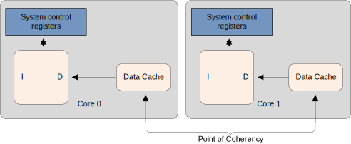
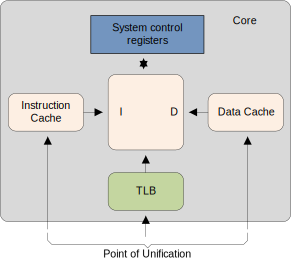

+++
Difficulty = "Easy"
Sources = [
"https://en.wikipedia.org/wiki/Cache_placement_policies",
"https://lwn.net/Articles/255364/",
"https://en.wikipedia.org/wiki/CPU_cache",
"https://lwn.net/Articles/252125/",
"https://developer.arm.com/documentation/den0042/a/Caches",
"https://stackoverflow.com/questions/25947962/cacheline-aligned-in-smp-for-structure-in-the-linux-kernel",
"https://developer.arm.com/documentation/107565/0101/Memory-system/Caches-and-memory-hierarchy/Introduction-to-caches?lang=en",
"https://documentation-service.arm.com/static/65fdad3c1bc22b03bca90781?token=",
"https://inria.hal.science/hal-02509910/document",
"https://mariokartwii.com/armv8",
"https://en.wikipedia.org/wiki/False_sharing",
"https://developer.arm.com/documentation/den0024/a/Caches/Point-of-coherency-and-unification",

]
authors = [
"Michael Shalitin",

]
math = true
date = "2025-01-11"
categories = [

]
series = [

]
title = "Cache"
+++

 
 

## מבוא

זיכרון RAM מהיר כמו ליבות המעבד המודרניות יקר בהרבה לעומת זיכרון DRAM הקונבנציונלי. העלויות הגבוהות של זיכרון מהיר נוטות להיות מנוטרלות על ידי התקורות הכרוכות בניהול המשאבים. לכן, במקום להפוך את ה-SRAM למשאב שנשלט על ידי מערכת ההפעלה או המשתמש, הוא מנוהל ישירות על ידי המעבד, והשימוש בו שקוף למערכת.

במקרה כזה, ה-SRAM משמש כזיכרון cache, כלומר, כמאגר זמני עבור נתונים מהזיכרון הראשי, אשר סביר להניח שיעשה בהם שימוש בקרוב על ידי המעבד. הדבר מתאפשר בזכות העובדה שהקוד והנתונים של תוכנה נוטים להפגין מקומיות זמנית ומרחבית. 

- מקומיות מרחבית: יש סבירות גבוהה שגישה למיקום מסוים תוביל גם לגישה למיקומים סמוכים. לדוגמה, קריאת הוראות רציפות או גישה למבני נתונים מקודדים באותו אזור זיכרון, כמו בגישה ל-stack, היא לרוב מוגבלת לאזורים קטנים בזיכרון.

- מקומיות זמנית: גישה לאזור זיכרון מסוים נוטה לחזור על עצמה בתוך פרק זמן קצר. לדוגמה, לולאות קוד שמבצעות גישות חוזרות ונשנות לאותו אזור זיכרון. בנוסף, פונקציות יכולות להיקרא מספר פעמים, מה שמוביל לשימוש חוזר בכתובות מסוימות בזיכרון.

ולכן גישה לזיכרון RAM על ידי הליבה אינה אקראית, אלא מציגה דפוסים של מקומיות מרחבית וזמנית. מאפיינים אלו מאפשרים ל-cache לפעול בצורה יעילה מאוד ולשפר את ביצועי המערכת.

מכיוון שמקומיות מרחבית היא עיקרון חשוב מאחורי תכנון cache-ים, יש לדאוג לטעון ל-cache לא רק מילים בודדות מהזיכרון אלא קטעים רצופים של מספר מילים, שנקראים cache lines. זאת משום שיש סבירות גבוהה שזיכרון קרוב ישמש יחד, ולכן טעינתו כיחידה אחת משפרת את הביצועים.

כאשר מעבד משנה נתונים בזיכרון, אך השינוי משפיע רק על חלק מ-cache line (רצף של מספר מילים בזיכרון המאוחסנות יחד ב-cache), הוא חייב קודם לטעון את ה-cache line המלאה לזיכרון שלו. כדי להכניס נתונים חדשים ל-cache, בדרך כלל נדרש לפנות מקום. 

המעבדים חופשיים לנהל את ה-cache-ים שלהם לפי שיקול דעתם, כל עוד הם נשארים בהתאם למודל הזיכרון שהוגדר עבור ארכיטקטורת המעבד. לדוגמה, זה מקובל שמעבד ינצל תקופות בהן יש פעילות מועטה או ללא פעילות על ה-bus של הזיכרון, כדי לכתוב באופן יזום cache lines מלוכלכות (כאלו שעברו שינויים ועדיין לא נכתבו לזיכרון הראשי) בחזרה לזיכרון הראשי.

## סקירה כללית

כאשר המעבד מנסה לקרוא או לכתוב למיקום בזיכרון הראשי, הוא קודם כל בודק אם הנתונים מאותו מיקום כבר מאוחסנים ב-cache. אם הנתונים אכן נמצאים ב-cache, המעבד מבצע את פעולת הקריאה או הכתיבה ישירות מה-cache, שהוא מהיר בהרבה מהזיכרון הראשי. תהליך זה מאפשר גישה מהירה יותר לנתונים ושיפור משמעותי בביצועים.

### רשומות cache (Cache entries)

נתונים מועברים בין הזיכרון הראשי ל-cache בצורת בלוקים בגודל קבוע הנקראים cache lines או cache blocks. כאשר cache line מועברת מהזיכרון הראשי אל ה-cache, נוצרת cache entry. ה-entry כוללת את הנתונים שהועתקו מהזיכרון, לצד מיקום הזיכרון שממנו הם נלקחו.

כאשר המעבד מבצע פעולה של קריאה או כתיבה למיקום בזיכרון, הוא תחילה בודק אם מיקום הזיכרון הזה נמצא כבר ב-cache. ה-cache בודק את כל שורות ה-cache שעשויות להכיל את הכתובת המבוקשת. אם הכתובת קיימת ב-cache, כלומר אם הנתונים נמצאים שם, נוצר מצב שנקרא cache hit. במצב כזה, המעבד ניגש ישירות לנתונים שב-cache ומבצע את הקריאה או הכתיבה במהירות רבה.

לעומת זאת, אם מיקום הזיכרון המבוקש לא נמצא ב-cache, מתרחש מצב שלcache miss. במקרה כזה, ה-cache מקצה cache entry חדשה ומעתיק את הנתונים הדרושים מהזיכרון הראשי. לאחר מכן, הבקשה של המעבד מתמלאת מתוך ה-cache עצמו, כך שהגישה לנתונים לאחר מכן תהיה מהירה יותר, במקרה שיהיה צורך לגשת אליהם שוב.


### Cache Miss

ב-cache miss מתרחש ניסיון שנכשל לקרוא או לכתוב פיסת נתונים מה-cache, מה שמוביל לגישה לזיכרון הראשי, שמאופיין ב-latency גבוה בהרבה. ישנם שלושה סוגים עיקריים של cache miss:

1. פספוס קריאת הוראות: כאשר מדובר בהחמצת קריאת הוראות מה-cache, מדובר בדרך כלל בעיכוב משמעותי. הסיבה לכך היא שהמעבד, או ה-thread המבצע, צריך להמתין (stall) עד שההוראה תיטען מהזיכרון הראשי. זה יכול להוביל לעיכובים משמעותיים בתפקוד המעבד, שכן כל הוראה שאינה זמינה ב-cache צריכה להביא את עצמה מהזיכרון הראשי.

2. פספוס קריאת נתונים: כאשר מתרחשת החמצת קריאת נתונים מה-cache, העיכוב הוא לרוב קטן יותר. במקרה זה, ניתן להוציא הוראות שאינן תלויות בנתונים החסרים ולהמשיך בביצוע עד שהנתונים יגיעו מהזיכרון הראשי. כך, ההוראות התלויות בנתונים החסרים יכולות להמתין לטעינת הנתונים ולהתחדש עם הגעתם.

3. פספוס כתיבת נתונים: פספוסי כתיבת נתונים ב-cache גורמים לעיכוב הקצר ביותר מבין השלושה. הסיבה לכך היא שניתן להכניס את הכתיבה ל-store buffer, ואין בדרך כלל מגבלות רבות על ביצוע ההוראות הבאות. המעבד יכול להמשיך לעבוד עד שהתור יתמלא, ומאוחר יותר תתבצע הכתיבה לנתונים בזיכרון הראשי.

### ביצועי Cache

ביצועי ה-cache הם גורם חשוב מאוד משום שהפער בין מהירות הזיכרון למהירות המעבד גדל באופן אקספוננציאלי. ה-cache נועד לצמצם פער זה על ידי אחסון נתונים שנעשה בהם שימוש תכוף בגישה מהירה יותר מהזיכרון הראשי. שני גורמים מרכזיים המשפיעים על ביצועי ה-cache הם שיעור ה-cache hits ושיעור ה-cache misses. הפחתת ה-cache misses היא קריטית לשיפור הביצועים הכוללים, שכן כל miss עלול להאריך את זמן הגישה לנתונים ולהשפיע על ביצועי התוכנית.

#### CPU Stalls

כאשר נדרש זמן ארוך להביא cache line אחת מהזיכרון, המעבד עשוי להיתקל במצב שבו הוא מחכה לזמן ארוך כדי לקבל את הנתונים. מצב זה נקרא stall. כאשר מעבדים הופכים למהירים יותר, הפער בין מהירות המעבד לזיכרון הראשי גדל, מה שמוביל ליותר זמן המתנה במהלך cache miss. מעבדים מודרניים יכולים לבצע מאות הוראות בזמן שלוקח להביא cache line אחת מהזיכרון הראשי.

כדי להתמודד עם בעיות אלו ולהפחית את הזמן האבוד בזמן עיכוב, נעשו פיתוחים שונים. אחד הפתרונות הוא ביצוע מחוץ לסדר.

### Multi-Level Caches

ביצועי ה-cache הם פשרה בין זמן השהיית ה-cache וקצב ה-hit. ל-cache גדול יותר יש נטיה לספק שיעורי hits טובים יותר אך דורש יותר זמן גישה, בעוד ש-cache קטן יותר הוא מהיר יותר אך פחות יעיל בשיעור hits. כדי לנהל את הפשרה הזו, מחשבים רבים עושים שימוש במבנה של מספר רמות של cache.

בדרך כלל, ה-cache-ים מחולקים למספר רמות כשהרמה הראשונה (L1) הקטנה והמהירה ביותר, שנמצאת הכי קרוב למעבד ואחריה יש רמות אחרות גדולות יותר ואיטיות יותר, הרבה פעמים הרמה האחרונה של ה-cache משותפת למספר ליבות ונקראת הרבה גם LLC.

### ריבוי סוגי cache-ים

במחשבים מודרניים יש לפחות שלושה סוגים עצמאיים של cache-ים:
###  Data Cache

משמש להאצה של פעולות קריאה וכתיבה של נתונים. בניגוד ל-instruction-cache, הממוקד בהוראות, ה-data-cache מיועד לנתונים שהמעבד זקוק להם לצורך ביצוע חישובים. לרוב, data-cache בנוי כהיררכיה מרובת רמות.

### Instruction Cache

המעבד לא מאחסן רק נתונים ב-cache, אלא גם את ההוראות שאותן הוא מבצע. למרות זאת, ה-instruction cache נחשב לפחות בעייתי בהשוואה ל-data cache (זיכרון ה-cache לנתונים).

הסיבה לכך היא שזרימת ההוראות בתוכנית צפויה יותר מדפוסי הגישה לנתונים. המעבדים המודרניים מצוידים ביכולות מתקדמות לזיהוי דפוסים, מה שמאפשר להם לבצע prefetching בצורה יעילה יותר. בנוסף, לקוד יש מקומיות מרחבית וזמנית חזקה יחסית, כלומר, סביר להניח שההוראות הנמצאות בסמוך זו לזו בזיכרון יבוצעו ברצף, ושתהיה חזרה על אותן הוראות בתוך פרקי זמן קצרים.

עיכוב בטעינת ההוראה הבאה מהזיכרון פוגע משמעותית במהירות התהליך ה-pipeline של ביצוע ההוראות

במעבדי CISC, במיוחד, שלב הפענוח יכול לקחת זמן רב יותר עקב מורכבות ההוראות.

בשנים האחרונות, מעבדי x86 ו-x86-64 מתקדמים, כמו אלה של אינטל, אינם מאחסנים ב-L1i את רצף הבייטים הגולמי של ההוראות. במקום זאת, הם שומרים את ההוראות לאחר שהן כבר מפוענחות (ב-intel ההוראות המופענחות נשמרות במקום הנקרא µop cache או Decoded Stream Buffer). זה מאפשר להאיץ את ביצוע ההוראות ולמנוע עיכובים הנובעים מצורך לפענח אותן בכל פעם מחדש.

החל מ-L2 ומעלה, זיכרון ה-cache במעבדים עשוי להיות מאוחד, כלומר, הוא מכיל גם קוד וגם נתונים. עם זאת, בניגוד ל-L1i, כאן ההוראות מאוחסנות בתצורתן הגולמית כרצפי בתים שטרם פוענחו.

ה-Instruction Cache אינו בהכרח קוהרנטי עם זיכרון הנתונים: למשל בארכיטקטורת Arm מערכת מחשבים אינה מחייבת את החומרה לשמור על קוהרנטיות בין cache-ים של ההוראות לבין זיכרון הנתונים. במקום זאת, על המתכנתים להשתמש בהוראות תחזוקה מפורשות של ה-cache כדי להבטיח סנכרון והתעדכנות נכונה.

במקרים רבים, פרוטוקול הקוהרנטיות של ה-Instruction Cache פשוט הרבה יותר בהשוואה לפרוטוקולי קוהרנטיות כמו MOESI. ה-Instruction Cache, משתמש בביט פשוט של valid/invalid כדי לנהל את הבלוקים או ה-lines שבו. ההבדל בין פרוטוקולים אלו נובע מהמידע שכל אחד מהם שומר והכמות של השינויים שהמידע עובר. בדרך כלל, כמעט ואין צורך לשנות את ההוראות שב-cache בזמן הריצה, כאשר חריגות נראות לעיתים רחוקות, כמו במצבים של JIT או ב-context switch.

### Translation Lookaside Buffer (TLB)

ה-TLB שנועד להאיץ את תהליך תרגום הכתובות הווירטואליות לכתובות פיזיות, המשמשות את המעבד לגישה להוראות ולנתונים. ה-TLB יכול להיות משותף עבור שני סוגי הגישות (הוראות ונתונים) או להפריד בין TLB להוראות ו-TLB לנתונים. למרות שהוא חלק חשוב בהאצת גישה לזיכרון, ה-TLB שייך ליחידת ניהול הזיכרון (MMU) ואינו נחשב כחלק ישיר ממערכת ה-cache של המעבד עצמו.


### מדיניות

#### מדיניות החלפה (Replacement)

כאשר מתרחש cache miss ויש צורך להכניס ערך חדש ל-cache, לעיתים יש צורך לפנות מקום על ידי הסרת אחד מהערכים הקיימים. התהליך שבו ה-cache בוחר איזה ערך להסיר נקרא מדיניות ההחלפה. האתגר המרכזי במדיניות זו הוא לחזות איזה ערך שנמצא כרגע ב-cache יש סיכוי נמוך יותר לשימוש בעתיד. כיוון שתחזיות אלו מורכבות ולעיתים בלתי אפשריות, אין שיטה מושלמת לבחירת הערך שיש להחליף. עם זאת, ישנן מספר שיטות הנמצאות בשימוש נרחב, כאשר אחת פופולריות היא מדיניות ה-LRU. מדיניות זו מסירה את הערך שלא נעשה בו שימוש לאחרונה מתוך הנחה שסביר להניח שהוא יהיה הפחות נחוץ בקרוב.

במקרים מסוימים, ניתן לשפר ביצועים על ידי סימון טווחי זיכרון מסוימים כ-non-cacheable. גישה זו מונעת את הכנסת נתונים אל ה-cache כאשר לא סביר שיהיה בהם שימוש חוזר בעתיד הקרוב, וכך נמנעת התקורה של אחסון מידע מיותר ב-cache.

בנוסף, ניתן גם לנקוט בגישות של ניהול חכם יותר של ה-cache, כמו השבתה או נעילה של ערכים מסוימים בהתאם להקשר התוכנית, כדי לשלוט על הנתונים המאוחסנים ולייעל את הגישה אליהם.

כאשר נתונים נכתבים ל-cache, בסופו של דבר יש צורך לכתוב אותם גם לזיכרון הראשי. התזמון שבו הכתיבה מתבצעת נקרא מדיניות הכתיבה.
## מדיניות כתיבת cache
### write-through

מדיניות ה-write-through היא השיטה הפשוטה ביותר להשגת קוהרנטיות של ה-cache. כאשר מעבד כותב ל-cache line, הנתונים נכתבים באופן מיידי גם לזיכרון הראשי. כך מובטח שכל שינוי שמתבצע בזיכרון ה-cache משתקף מיד בזיכרון הראשי, מה שמבטיח שהמידע בשני המקומות נשאר מסונכרן. יתרה מזאת, כאשר יש צורך להחליף cache line בנתונים חדשים, ניתן פשוט להשליך את התוכן הישן מה-cache מבלי לחשוש לאובדן נתונים, שכן הם כבר נכתבו לזיכרון הראשי. אמנם מדיניות זו היא קלה ליישום ומספקת קוהרנטיות טובה, אך היא אינה מהירה במיוחד, מכיוון שכל כתיבה ל-cache גוררת כתיבה מיידית לזיכרון הראשי, מה שעלול להאט את ביצועי המערכת.

### write-back

במדיניות ה-write-back, המעבד אינו כותב את ה-cache line ששונתה בחזרה לזיכרון הראשי באופן מיידי. במקום זאת, ה-cache line מסומנת כ-Dirty, מה שמעיד שהיא עברה שינוי, אך הנתונים עדיין לא נכתבו לזיכרון הראשי. רק כאשר ה-cache line נדחקת החוצה מה-cache בנקודת זמן כלשהי בעתיד, אז הביט Dirty מורה למעבד לכתוב את הנתונים המעודכנים לזיכרון הראשי. שיטה זו מאפשרת להימנע מכתיבה תכופה לזיכרון הראשי, מה שמסייע לשיפור ביצועי המערכת, במיוחד במצבים שבהם נעשות הרבה פעולות כתיבה ל-cache.

עם זאת, קיימת בעיה משמעותית ביישום של write-back במערכות מרובות מעבדים (או ליבות, או hyper-threading). כאשר מספר מעבדים ניגשים לאותו אזור זיכרון, יש להבטיח שכל המעבדים רואים את אותם נתונים בכל זמן נתון. אם ה-cache line מלוכלכת באחד המעבדים ולא נכתבה עדיין לזיכרון הראשי, ומעבד אחר מנסה לקרוא את אותו מיקום בזיכרון, הקריאה לא יכולה להתבצע מהזיכרון הראשי, שכן הוא אינו מכיל את הנתונים המעודכנים. במקרה זה, נדרש שהמעבד השני יקבל את תוכן ה-cache line ישירות מהמעבד הראשון, כדי להבטיח קוהרנטיות של הנתונים.

### write-combining

מדיניות ה-write-combining (שילוב כתיבה) היא סוג של אופטימיזציה ב-cache, שנמצאת בשימוש בעיקר עבור זיכרון RAM של מכשירים חיצוניים, כמו כרטיסים גרפיים. מאחר שעלות העברת נתונים לזיכרון של מכשירים חיצוניים גבוהה בהרבה בהשוואה לגישה לזיכרון RAM המקומי, יש חשיבות גבוהה להימנע מהעברות רבות ומיותרות. לדוגמה, העברת cache line שלמה רק בגלל שינוי של מילה אחת בזיכרון היא פעולה בזבזנית, במיוחד אם הפעולה הבאה תחליף מילה אחרת באותו cache line.

מדיניות write-combining נועדה לפתור בעיה זו על ידי שילוב של כמה פעולות כתיבה לפני כתיבת כל ה-cache line לזיכרון החיצוני. בתרחיש האידיאלי, כל ה-cache line משתנה בהדרגה, מילה אחרי מילה, ורק כאשר כל המילים עברו שינוי, כל ה-cache line נכתבת לזיכרון המכשיר החיצוני. זה מאפשר להפחית את מספר ההעברות ולהגביר את היעילות.

### uncacheable

כאשר אזור זיכרון מוגדר כ-uncacheable, המשמעות היא שבדרך כלל אין לו תמיכה מגובה ב-RAM, כלומר, אין אפשרות לאחסן אותו ב-cache. במקרים מסוימים, זה יכול להיות אזור זיכרון מיוחד שמוקצה לכתובת קשיחה, המשמש למטרות מסוימות מחוץ לפעילות הרגילה של המעבד, כמו גישה למכשירים חיצוניים או פקודות ספציפיות למערכת.

### 

מדיניות ה-write-combining וה-uncacheable מיועדות לשימוש באזורים מיוחדים במרחב הכתובות של המערכת, שאינם מגובים בזיכרון RAM אמיתי. אזורים אלה משמשים למטרות ייחודיות הקשורות לגישה למכשירים או פונקציות חומרה ייחודיות, ולכן אינם מנוהלים באותו אופן כמו זיכרון רגיל.

### תמיכה בריבוי מעבדים

במערכות מרובות מעבדים, אין זה מעשי לאפשר גישה ישירה של מעבד אחד ל-cache של מעבד אחר. אחת הסיבות המרכזיות לכך היא שהחיבור בין המעבדים אינו מהיר מספיק כדי לאפשר גישה כזו בזמן אמת. במקום זאת, הפתרון היעיל יותר הוא להעביר את תוכן ה-cache למעבד השני בעת הצורך. זה נכון גם במקרים שבהם ה-cache-ים שייכים לאותו מעבד אך אינם משותפים.

העברת cache line מתבצעת כאשר מעבד אחד זקוק ל-cache line מלוכלכת שנמצאת ב-cache של מעבד אחר לצורך קריאה או כתיבה. עם זאת, מרבית הגישות לזיכרון הן קריאות, וה-cache lines המתקבלות הן נקיות, כלומר לא שונו ב-cache.

לכן, אין זה מעשי לשדר את המידע על כל שינוי ב-cache lines אחרי כל גישת כתיבה. כדי להתמודד עם הבעיה הזו, פותחו פרוטוקולים לניהול קוהרנטיות ה-cache, כגון MOESI ו-AMBA CHI, לצד פרוטוקולים נוספים. פרוטוקולים אלה נועדו להבטיח שכל המעבדים במערכת יראו את אותו מצב של הזיכרון, גם כאשר מספר מעבדים ניגשים לאותם נתונים בזיכרון.

במערכות מרובות מעבדים סימטריות (SMP), לא ניתן לאפשר ל-cache-ים של המעבדים לפעול באופן עצמאי לחלוטין. כל המעבדים במערכת חייבים לשמור על תמונה אחידה של תוכן הזיכרון, כך שכולם יראו את אותו המידע בכל רגע נתון (נכון רק כשמדובר בפלטפורמות multicopy-atomic), שמירה על אחידות זו נקראת "קוהרנטיות cache".

אם מעבד היה בודק רק את ה-cache שלו ואת הזיכרון הראשי שלו, הוא לא היה מודע ל-cache lines מלוכלכות ששונו על ידי מעבדים אחרים. מתן גישה ישירה של מעבד אחד ל-cache של מעבד אחר היה גורם לעלויות גבוהות מאוד וליצירת צוואר בקבוק משמעותי בביצועים. במקום זאת, המעבדים מתוכננים לזהות מתי מעבד אחר מבצע קריאה או כתיבה ל-cache line מסוימת, וכך לשמור על הסנכרון והקוהרנטיות של הזיכרון בין כל המעבדים.

כאשר מעבד מזהה ניסיון כתיבה לכתובת מסוימת ויש לו עותק נקי של ה-cache line המתאימה ב-cache שלו, העותק הזה מסומן כ-Invalid. משמעות הדבר היא שגישות עתידיות לאותה cache line ידרשו לטעון אותה מחדש מהזיכרון הראשי. עם זאת, חשוב לציין שקריאה ממעבד אחר אינה מחייבת Invalidate, וניתן לשמור מספר עותקים נקיים של אותה cache line בכמה מעבדים בו זמנית.

במקרים מתקדמים יותר של ניהול cache, ייתכן מצב נוסף. אם ה-cache line שהמעבד השני רוצה לקרוא או לכתוב אליה מסומנת כ"מלוכלכת" ב-cache של המעבד הראשון (כלומר, היא שונתה אך השינויים לא נכתבו לזיכרון הראשי), יש צורך בגישה שונה. במצב כזה, מכיוון שהזיכרון הראשי אינו מעודכן, המעבד המבקש חייב לקבל את תוכן ה-cache line ישירות מהמעבד הראשון (המצב המתואר הוא SD בפרוטוקול AMBA CHI).

תהליך זה מתבצע באמצעות טכניקה שנקראת "snooping", שבה המעבד שמבקש לבצע כתיבה או קריאה שולח בקשה לנתונים מהמעבד הראשון, כך שהמידע עובר ישירות ביניהם, מבלי לעבור דרך הזיכרון הראשי. לעיתים, בקר הזיכרון מזהה את ההעברה הישירה הזו ומעדכן את הזיכרון הראשי עם התוכן המעודכן של ה-cache line.

אם הגישה מיועדת לכתיבה, המעבד הראשון יסמן את ה-cache line המקומית שלו כ-invalid כדי להבטיח שאין עותקים ישנים ולא מעודכנים בזיכרון ה-cache שלו. למרות זאת, עותקים נקיים של אותה cache line יכולים להישמר באופן שרירותי במספר caches של מעבדים שונים במערכת.


### Cache Controller

ה-cache controller הוא רכיב חומרה שתפקידו לנהל את זיכרון ה-cache במערכת, מבלי שהניהול יהיה גלוי לתוכנית. ה-cache controller אחראי לכתיבה אוטומטית של הוראות ונתונים מהזיכרון הראשי לתוך ה-cache. הוא מקבל בקשות קריאה וכתיבה מהליבה ומבצע את הפעולות הנדרשות על זיכרון ה-cache או על הזיכרון החיצוני.

כאשר ה-cache controller מקבל בקשה מהליבה, עליו לבדוק אם הכתובת המבוקשת כבר קיימת ב-cache. שלב זה נקרא חיפוש ב-cache.

אם הליבה מבקשת הוראות או נתונים מכתובת מסוימת, אך ה-cache controller לא מוצא את התוכן המבוקש ב-cache, מדובר במצב של cache miss. במקרה כזה, הבקשה מועברת לרמה הבאה בהיררכיית הזיכרון, אשר יכולה להיות cache ברמה גבוהה יותר (כגון L2) או זיכרון חיצוני. התוצאה של מצב זה יכולה להיות מילוי line ב-cache, שבו תוכן מהזיכרון הראשי מועתק ל-cache. במקביל, הנתונים או ההוראות המבוקשים נמסרים לליבה. תהליך זה מתרחש בצורה שקופה, כלומר, אינו גלוי ישירות למשתמש. הליבה אינה צריכה להמתין עד שהמילוי של ה-cache line יושלם לפני השימוש בנתונים.

במקרים רבים, ה-cache controller יגש קודם כל למילה הקריטית בתוך ה-cache line. לדוגמה, אם הוראת load גורמת ל-cache miss ומפעילה מילוי של cache line, הקריאה הראשונה לזיכרון החיצוני תהיה עבור הכתובת המדויקת שניתנה על ידי הוראת ה-load. הנתונים הקריטיים הללו יסופקו מיד ל-pipeline של המעבד, בעוד שחומרת ה-cache וממשק ה-bus החיצוני ימשיכו לקרוא את שאר ה-cache line ברקע.

בחלק מהמעבדים המודרניים קיימת רכיב הנקרא Line Fill Buffer, אשר נועדה לטפל בתהליך של מילוי ה-cache line.

### ניקוי וביטול תוקף של זיכרון Cache

ניקוי וביטול של זיכרון ה-cache נדרשים כאשר תוכן הזיכרון החיצוני משתנה, ויש צורך להסיר נתונים מיושנים מה-cache. פעולה זו עשויה להיות דרושה גם לאחר שינויים במדיניות ה-cache או בהרשאות גישה שמבוצעים על ידי ה-MPU.

המונח "שטיפה" (flush) משמש לעיתים קרובות כדי לתאר את פעולות הניקוי והביטול תוקף, אך בסטנדרטים של ARM ו-x86, השמות הנפוצים הם "clean" ו-"invalidate".

ביצוע של invalidation על cache או על cache line גורם להסרת הנתונים מה-cache על ידי ביטול תוקף של ה-cache line אחת או יותר. בתהליך זה, הביט valid של ה-cache line נוקה, מה שמוביל לכך שהנתונים שב-cache אינם מוגדרים עוד. חשוב להדגיש כי לאחר ביצוע invalidation, ה-cache אינו מכיל נתונים תקפים, ולכן יש לבצע ניקוי נוסף כדי להימנע מאובדן מידע. אם ה-cache מכיל נתונים מלוכלכים, לא נכון לבטל אותו מבלי לנקות את הנתונים. פעולה זו תוביל לאובדן כל הנתונים המעודכנים ב-cache ובאזורי האחסון שלו.

ביצוע של clean על cache או על cache line מעורב בכתיבה של התוכן של cache lines מלוכלכות אל הזיכרון הראשי. פעולה זו מבטיחה שהתוכן שב-cache line והזיכרון הראשי יהיו קוהרנטיים זה עם זה. חשוב לציין שפעולה זו מתבצעת רק על cache-ים של נתונים שבהם נעשה שימוש במדיניות write-back.

במכשירי ARM, פעולות ה-invalidate וה-clean של ה-cache יכולות להתבצע על פי set/way או על ידי ציון כתובת מסוימת.

### חסרונות ה-Cache

למרות היתרונות הברורים של זיכרון ה-cache, שמאיץ את ביצוע התוכניות, הוא גם מוסיף מספר אתגרים ייחודיים. אחד החסרונות המרכזיים הוא האפשרות לכך שזמן הביצוע של התוכנית יהפוך ללא דטרמיניסטי, כלומר, לא ניתן יהיה לחזות באופן מדויק את משך הזמן שיידרש לביצועה בכל פעם.

בנוסף, ייתכן שתוכן ה-cache והזיכרון הראשי לא יהיו מסונכרנים באופן מושלם. במצבים מסוימים, המעבד עשוי לעדכן את ה-cache, אך השינויים טרם ייכתבו חזרה לזיכרון הראשי. מצד שני, רכיב חיצוני כמו בקר DMA יכול לעדכן את הזיכרון הראשי לאחר שהליבה כבר טענה עותק משלה. בעיות אלו נוגעות לניהול קוהרנטיות הזיכרון, והן עשויות להתעורר במיוחד במערכות עם מספר ליבות או רכיבים חיצוניים שניגשים לזיכרון, כמו בקרים חיצוניים.


### בעיות ידועות עם cache

#### False Sharing

המושג False sharing מתאר בעיה ביצועים במערכות עם ריבוי cache-ים, כאשר מספר מעבדים משתמשים באותו משתנה. הבעיה מתעוררת כאשר משתנים המאוחסנים ב-cache נמצאים באותה cache line. אם אחד המעבדים משנה רק חלק מהנתונים ב-cache line, אך החלקים האחרים אינם משתנים, כל ה-cache line צריכה לצאת מה-cache ולהגיע לזיכרון הראשי ולאחר מכן להיטען מחדש, משום שמבנה ה-cache עובד לפי שורות שלמות ולא לפי חלקים בתוכן.

בעיה זו גורמת לכך שכל עדכון של חלק מסוים ב-cache line יוביל לעדכון מחדש של כל ה-cache line, גם אם רק חלק קטן מהמידע השתנה. זה מוביל לבעיות ביצועים משום שהמעבד צריך להפעיל מנגנוני סנכרון כדי לנהל את העדכונים.

כאשר ה-cache lines מחולקות בין משתנים גלובליים, אם אחד המשתנים משתנה על ידי אחד מהמעבדים, ה-cache line המתאימה מסומנת כמלוכלכת. ב-cache line הנותרת של המעבד, זה עלול לגרום לכניסה מעופשת (stale entry) שדורשת שטיפה (flush) והחזרה מהזיכרון, דבר שיכול להוביל ל-miss של cache line ולדרוש יותר מחזורי CPU. זה עשוי להפחית את ביצועי המערכת. רוב מבני הנתונים בקרנל של מערכת ההפעלה משתמשים באסטרטגיות כדי להימנע מ-miss של ה-cache line.

 פתרון אפשרי לבעית ה-false sharing זו הוא להפריד בין נתונים שצריכים להתעדכן ביחד ונתונים שלא דורשים עדכון משותף. ניתן לעשות זאת על ידי יצירת משתנים אשר נמצאים באותה שורת cache (משתנים שמשתנים או קבועים יחד), או על ידי שימוש ב-padding לצורך יישור נכון של הנתונים. במקרים של structs חשובים וקריטיים, במיוחד בשימוש נרחב, יש לקחת בחשבון בעיות אלו ולתכנן את ה-struct כך שיהיה מיושר (aligned) לגודל  ה-cache line. 

בעיית false sharing עלולה לגרום לירידה בביצועים ואם מטפלים בבעיה כראוי יכול להיות שיפור ביצועים משמעותי. הבעיה יכולה להתרחש גם בפרוטוקולי cache אוטומטיים וגם בסביבות נוספות כמו מערכות קבצים מבוזרות או מסדי נתונים, אך היא שכיחה בעיקר ב-cache RAM.


## יעול גישה ל-cache

- כאשר יוצרים נתונים גדולים שלא נעשה בהם שימוש מיידי, יש לשקול דרכים למנוע את הכנסתם המוקדמת ל-cache. הכנסת נתונים שאינם בשימוש גורמת לעומס מיותר ולתקורה, כיוון שמידע עובר דרך ה-cache ללא צורך, מה שעלול לדחוק מידע חשוב יותר מרמות נמוכות כמו L1 ל-L2 או אף החוצה מה-cache. מצב כזה יוצר חוסר יעילות וזמן עיבוד מבוזבז.

- כאשר יש נתונים רציפים שניתן לאחד ביניהם בעת כתיבה, מומלץ לאחד אותם לשורת cache אחת. איחוד שכזה מפחית את מספר הקריאות והכתיבות ל-cache ומשפר את ביצועי התוכנית על ידי הפחתת התקשורת המיותרת עם הזיכרון הראשי.

- שדות הנגישים לעיתים קרובות ב-struct ממוקמים בתחילתו, הדבר נעשה כדי להגדיל את הסיכוי שהשדות החשובים ימוקמו כולם על אותו cache line, כך שהמעבד יוכל לגשת אליהם בבת אחת.

- הפרדה בין שדות לא קשורים ב-struct ואין צורך לעבד אותם יחד, יש להקפיד להפריד אותם בזיכרון כך שהם יהיו על cache lines נפרדים. מטרת ההפרדה היא למנוע תופעה של false sharing.

- כאשר מדובר במבני נתונים קטנים יחסית, יש סיכוי טוב שניתן להכניס את כל המבנה ל-cache line אחת. כדי לממש זאת, חשוב לוודא שאין שדות מיותרים במבנה ושכל שדה מוקצה בגודל מינימלי, ללא בזבוז מקום או padding מיותר בין השדות. פעולה זו מצמצמת את גודל המבנה ומאפשרת לו להיכנס כולו ל-cache line אחד, ובכך מייעלת את הגישה אליו.

- כאשר סדר הגישה למבנה אינו מוגדר על ידי לוגיקה חיצונית, עדיף לגשת לאלמנטים בסדר שבו הם מופיעים במבנה הנתונים.
  עבור מבנים קטנים, חשוב שהמתכנת יחשוב מראש על סדר האלמנטים ויגדיר אותם בצורה כזו שתתאים לסדר הגישה הסביר ביותר בתוכנית. בנוסף, יש להיות גמישים ולאפשר שינויים כדי להתאים לאופטימיזציות אחרות, כגון מניעת רווחים מיותרים בזיכרון. במבנים גדולים יותר, כל בלוק של מידע צריך להיות מאורגן כך שיתאים לגודל של cache line ולהבטיח גישה יעילה בהתאם לחוקים הללו.


למשל בשפת C עם GCC:
```c {linenos=inline}
struct strtype {
	...members...
} __attribute((aligned(64)));
```


זה יגרום להקצאת אובייקטים עם יישור מתאים (יישור ל-64 בתים), וזה חיוני לביצועים מיטביים של cache ולמניעת בעיות גישה. הקומפיילר אחראי להקצות אובייקטים עם היישור הנדרש, כולל מערכים. עם זאת, כאשר מדובר בהקצאה דינמית של אובייקטים, על המתכנת להקפיד לבקש את היישור המתאים בעצמו.

### אתגרי יישור ב-stack

כאשר משתנה אוטומטי מוקצה על המחסנית עם דרישת יישור מסוימת, על הקומפיילר להבטיח שהדרישה מתקיימת. עם זאת, לא תמיד מדובר במשימה פשוטה. הסיבה לכך היא שהקומפיילר אינו שולט בכל הקריאות הפנימיות המבוצעות (כגון דחיפות למחסנית) או על האופן שבו הקריאות הללו מטפלות במחסנית. כדי להתמודד עם האתגר הזה, ישנן שתי דרכים עיקריות:

1. הקומפיילר יכול לייצר קוד שמוודא שהמחסנית מיושרת בצורה נכונה בכל שלב. פעולה זו כוללת הכנסת padding במידת הצורך כדי ליישר את הנתונים, וכן קוד נוסף שנדרש גם לבטל את היישור כאשר אין בו עוד צורך. שיטה זו מחייבת בדיקות חוזרות על היישור במהלך זמן הריצה, מה שעלול להוסיף מעט תקורה לביצועים.

2. שימוש במחסנית מיושרת אצל כל ה-caller-ים וכדי לבצע את זה צריך לוודא שכל הקריאות שמבוצעות תומכות במחסנית מיושרת מראש, כלומר, כל פונקציה דואגת לכך שהמחסנית תישאר מיושרת כאשר היא קוראת לפונקציה אחרת. גישה זו היא הסטנדרט בכל ה-ABI הנפוצים, והיא נפוצה כי היא דורשת פחות קוד מורכב לזמן ריצה.

### ניצול מיטבי של cache

במערכות שבהן ה-working set גדול, חשוב לנצל את ה-cache באופן מיטבי. לשם כך, ייתכן שיהיה צורך לארגן מחדש את מבני הנתונים ולא לסדר אותם לפי השייכות הרעיונית בלבד. לעיתים קרובות, המתכנת יעדיף לרכז את כל הנתונים הקשורים רעיונית לאותו מבנה נתונים, אך גישה זו אינה בהכרח המיטבית לביצועים. ארגון שגוי יכול להוביל לכך שהגישה לנתונים לא תהיה מיושרת באופן יעיל ל-cache.

### השפעות של גישה לא מיושרת

גישה לא מיושרת לנתונים מגדילה את הסיכון ל-miss בזיכרון ה-cache הנגרם מקונפליקטים, מכיוון שכל גישה לנתונים עלולה לדרוש יותר משורת cache אחת. כתוצאה מכך, חלקים שונים מהנתונים עשויים להימצא במיקומים שונים בזיכרון ה-cache, מה שמוביל לכך שקריאות עוקבות לנתונים אלו יגרמו לדחיקות ולבזבוז משאבים ב-cache.

## נקודת קוהרנטיות ונקודת איחוד ב-arm


במערכת לניהול cache , פעולות ניקוי וביטול יכולות להתבצע ברמות שונות של cache, ואלה מוגדרות בהתאם לסוג הקונפיגורציה של cache - לפי set/way. כאשר מדובר בפעולות המשתמשות בכתובת וירטואלית, הארכיטקטורה מגדירה שתי נקודות עיקריות:

נקודת קוהרנטיות (Point of Coherency, PoC): עבור כתובת מסוימת, נקודת הקוהרנטיות היא המקום שבו מובטח לכל המעבדים במערכת (ליבות המעבד, DSPs, מנועי DMA, וכו..) - שיגיעו לאותו עותק של מיקום זיכרון. לרוב, נקודת הקוהרנטיות היא זיכרון המערכת החיצוני הראשי.




נקודת איחוד (Point of Unification, PoU): נקודת האיחוד עבור ליבה היא המקום שבו מובטח שה-cache-ים של ההוראות ,הנתונים וה-translation table walks יראו נתונים את אותם העותקים. לדוגמה, אם cache רמה 2 פועל כ-cache מאוחד במערכת שבה יש cache רמה 1 ו-TLB לשמירה ב-cache של ערכי טבלת תרגום, אז ה-cache רמה 2 משמש כנקודת האיחוד. במקרה שאין cache חיצוני, אז הזיכרון הראשי משמש כנקודת האיחוד.




