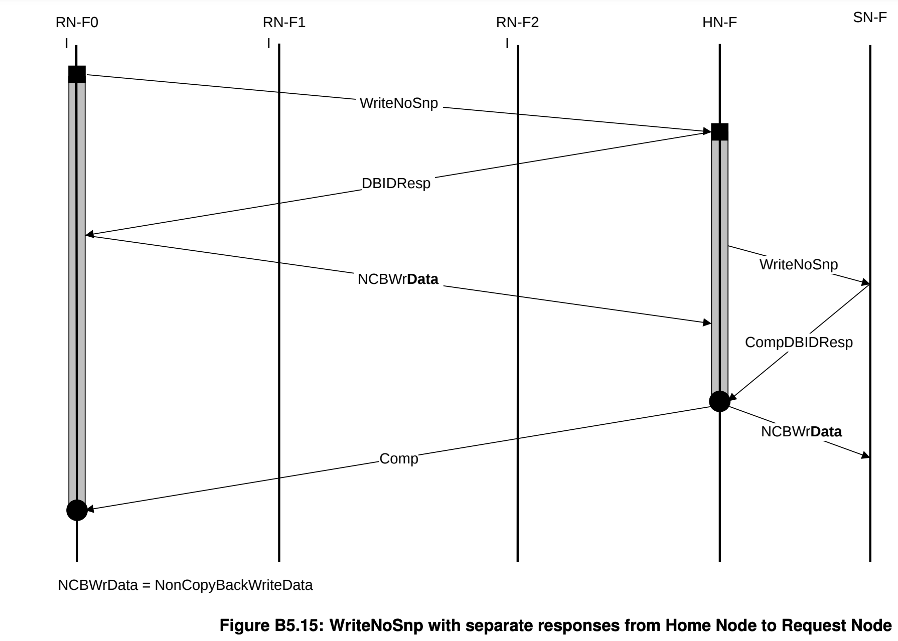

+++
Sources = [
"https://developer.arm.com/documentation/102407/0100/Introduction-to-CHI",
"https://developer.arm.com/documentation/ihi0022/e/",
"https://developer.arm.com/documentation/ihi0050/latest/",
"https://developer.arm.com/documentation/100236/0100/functional-description/cache-behavior-and-cache-protection/coherency-between-data-caches-with-the-moesi-protocol",
"https://www.linkedin.com/advice/1/what-key-features-differences-amba5-chi-amba4",
"https://developer.arm.com/documentation/102407/0100/Transaction-flows",
"https://developer.arm.com/documentation/102407/0100/Other-protocol-changes-and-extensions",
"https://pages.cs.wisc.edu/~markhill/papers/primer2020_2nd_edition.pdf",

]
authors = [
"Michael Shalitin",

]
math = true
date = "2025-01-11"
categories = [

]
series = [

]
title = "AMBA CHI"
+++

### מהו AMBA?

פרוטוקול AMBA (קיצור של Advanced Microcontroller Bus Architecture) הוא פרוטוקול שפותח על ידי ARM ומיועד לסטנדרטיזציה של התקשורת בין רכיבי חומרה שונים במערכות SoC. משפחת פרוטוקולים זו מכסה מגוון רחב של היבטים בתכנון המערכת, כולל טופולוגיית bus, בוררות (arbitration) בין רכיבים המבקשים גישה למשאבים משותפים, ניהול signaling, תכנון interconnect, ניהול צריכת חשמל ואבטחה. הפרוטוקול AMBA כולל מספר מפרטים שונים שמותאמים לצרכים מגוונים של טרנזקציות וסוכנים במערכת, כולל AHB, APB, AXI, ACE ו-CHI. כל אחד מפרוטוקולים אלו מתמקד בהיבט מסוים של התקשורת בין רכיבי המערכת.
### מהי מערכת קוהרנטית?

מערכת קוהרנטית היא מערכת שבה מספר מעבדים או agent-ים יכולים לגשת לאותם מיקומי זיכרון ולבצע בהם שינויים תוך כדי שמירה על תצוגה עקבית של הנתונים בין כל הרכיבים. כל שינוי במיקום זיכרון מסוים צריך להיות נגיש לכל ה-agent-ים בזמן אמת, כך שכולם יראו את המידע המעודכן בצורה עקבית. זה מאפשר עיבוד יעיל ומהיר יותר של נתונים ומקל על תהליכי התכנות והניפוי. עם זאת, שמירה על קוהרנטיות מביאה עימה גם אתגרים טכניים, כמו ניהול עקביות בין מספר agent-ים, הימנעות מקונפליקטים בין פעולות קריאה וכתיבה, וכן שמירה על חביון נמוך ורוחב פס מספק. לפיכך, יש צורך בפרוטוקול מוגדר היטב שיסדיר את אופן התקשורת והסנכרון בין ה-agent-ים כדי להבטיח את הקוהרנטיות.

### מהו AMBA5 CHI?

פרוטוקול AMBA5 CHI (קיצור של Coherent Hub Interface) הוא פרוטוקול שנועד להחליף את פרוטוקול AMBA4 ACE, תוך תמיכה בקוהרנטיות cache במערכות בעלות מספר רב של מאסטרים, כגון CPUs ו-GPUs. פרוטוקול זה מאפשר שיתוף נתונים בין מספר רב של מעבדים או agent-ים במסגרת תחום קוהרנטי, כאשר הם ניגשים לזיכרון דרך רכיב מרכזי שנקרא Hub קוהרנטי. ה-Hub מתפקד כמתווך וכבקר זיכרון עבור התחום הקוהרנטי.

## מאפייני Cache line

ל-AMBA CHI יש  מודל קוהרנטיות דומה ל-ACE, והוא מציג מספר המצבי ה-cache line, בניגוד למשפחת פרוטוקולי MESI הפרוטוקול מציג מצבים שבנויים על ידי מספר מאפיינים, וחלק מהמאפיינים יכול להתקיים במקביל על אותו cache line.

מוצגים כאן המאפיינים של ה-cache line, והם מוצגים בצורה של קבוצות מנוגדות, כלומר כל קבוצה מכילה מאפיינים שלא יכולים להיות במקביל על אותה cache line אבל מאפיינים בקבוצות שונות יכולים להתקיים במקביל.

### Valid, Invalid
- מאפיין Valid: ה-cache line תקפה (Valid), כלומר היא קיימת ב-cache.

-  מאפיין Invalid: ה-cache line לא תקפה (Invalid), כלומר היא לא קיימת ב-cache.

### Unique, Shared
-  מאפיין Unique: ה-cache line היא העותק היחיד שקיים.

-  מאפיין Shared: ה-cache line יכולה להיות משותפת (עם מספר עותקים) ב-cache-ים שונים אבל לא בטוח שיש עוד עותקים.
###  Clean, Dirty

-  מאפיין Clean: ה-cache שמחזיק ב-cache line לא אחראי על עדכון הזיכרון הראשי וה-cache line מכילה ערך שיכול להיות שונה מהזיכרון הראשי או זהה לזיכרון הראשי.

-  מאפיין Dirty: האחריות של ה-cache שמחזיק ב-cache line היא להבטיח שהערך מתעדכן בזיכרון הראשי (ההבטחה לא בהכרח אומרת שה-cahce בעצמו יבצע את העדכון), ה-cache line יכול להכיל ערך שונה מהזיכרון הראשי אבל לא חייב להכיל ערך שונה.

### Full, Partial, Empty
- מאפיין Full: כל הבתים שה-cache line מכילה חוקיים (במצב Valid).
-  מאפיין Partial: חלק מהבתים שה-cache line מכילה יכולים להיות חוקיים (במצב Valid) אבל גם יכול להיות שאין בכלל או כל הבתים חוקיים.
-  מאפיין Empty: ה-cache line לא מכילה בכלל בתים חוקיים (במצב Valid).

#### מאפיין Empty

כש-cache line היא Empty היא מוחזקת במצב Unique כדי למנוע עותקים אחרים של אותה cache line.

מצבים בהם cache line ריקה יכולה להיווצר כוללים לדוגמה את המקרים הבאים:

- רכיב requester יכול בכוונה להשיג cache line ריקה לפני תחילת כתיבה, וזאת במטרה להפחית את צריכת רוחב הפס של המערכת. במקרה שבו ה-requester מתכנן לכתוב לשורת ה-cache, הוא יכול לקבל cache line ריקה עם הרשאות אחסון, במקום לקבל שורה מלאה וחוקית של נתונים קיימים.

- רכיב requester שמחזיק כבר בעותק של שורת ה-cache יכול לעבור למצב ריק כאשר מתבקשת הרשאת אחסון. העותק שבידיו יהיה לא חוקי (invalid) עד שה-requester יקבל הרשאת אחסון. כאשר בקשה זו תושלם, ה-requester יוכל להחזיק ב-cache line ריקה עם הרשאות אחסון.

## מצבי Cache line

### מצב Invalid
ה-cache line לא קיימת ב-cache.

### מצב Unique Dirty
ה-cache line קיימת רק ב-cache הזה בלבד והיא בעלת האחריות לעדכון הזיכרון הראשי, ה-cache שמחזיק את ה-cache line יכול לבצע כתיבה כי הוא היחיד שמחזיק בה, וכבר יש לו הרשאות כתיבה.

בבקשת snoop ה-cache צריך להעביר את ה-cache line ל-requester המבקש ולשנות את המצב של ה-cache line בהתאם (ואולי גם לכתוב את הנתונים לזיכרון הראשי אם הבקשת snoop דורשת את זה). 

### מצב Unique Dirty Partial
ה-cache line הזו קיימת ב-cache הזה בלבד והיא בעלת האחריות לעדכון הזיכרון הראשי. זה יכול להיות כמה בתים חוקיים, כשחלקם יכול להיות אף אחד או את כולם.

לאחר שה-requester מקבל בעלות על cache line ריקה, הוא רשאי אך אינו מחויב לאחסן נתונים ב-cache line. אם ה-requester מחליף חלק מנתוני ה-cache line תשאר במצב Unique Dirty Partial, כלומר, ה-cache line תכיל נתונים חלקיים שעברו שינוי.

המצב הזה הוא מצב זמני ופרטי ולא יכול להיות קבוע, ולכן בבקשת snoop ה-cache לא ניתן להעביר את ה-cache line ל-requester המבקש כי חסר לו מידע כדי להעביר cache line מלאה, וצריך לבצע טרנזקציות מתאימות כדי לקבל את שאר המידע הרלוונטי כדי לקבל את המידע המלא. ודוגמה לתהליך כזה הוא כשה-cache line מפונה, יש למזג נתונים מה-cache או הזיכרון ברמה הבאה עם ה-cache line שמפונה כדי ליצור את שורת ה-cache התקינה המלאה. 

### מצב Shared Dirty
ה-cache line בעלת האחריות לעדכון הזיכרון הראשי, מכיוון שה-cache line משותפת (Shared), ייתכן שהיא קיימת ב-cache מקומי אחד או יותר, אבל זה לא מובטח. אם ה-cache line קיימת במספר cache-ים, ה-cache-ים האלו יהיו בעלי שורה זו ב-Shared Clean.

### מצב Unique Clean
ה-cache line לא בעלת האחריות לעדכון הזיכרון הראשי, והיא קיימת רק ב-cache מקומי יחיד. ניתן לשנות אותו מבלי ליידע cache-ים אחרים.

### מצב Unique Clean Empty
ה-cache line קיימת רק ב-cache הזה, אך אף אחד מהבתים חוקי. ניתן לשנות את ה-cache line מבלי להודיע ל-cache-ים אחרים.

### מצב Shared Clean
ה-cache line עשויה להיות מוחזקת ב-cache מקומי אחד או יותר. ייתכן שה-cache line השתנתה ביחס לזיכרון הראשי, אך cache זה אינו אחראי לכתיבת השורה חזרה לזיכרון בעת פינוי.

## מיפוי בין MOESI ל-AMBA CHI 
יש תמיכה של AMBA CHI ב-MOESI, וכמו שאפשר לראות בטבלה הבאה, התמיכה הגיעה די בחינם, ולא היה צורך לעשות שינויים על מנת לאפשר את התמיכה.

| MOESI     | AMBA        |
| --------- | ----------- |
| Modified  | UniqueDirty |
| Owned     | SharedDirty |
| Exclusive | UniqueClean |
| Shared    | SharedClean |
| Invalid   | Invalid     |

בנוסף, לפי דעתי הגישה הזאת נוחה יותר על מנת להבין את הפעולות עצמן במערכת כי בעזרת AMBA יש קשר הדוק בין השמות של המצבים שה-cache line נמצאת בו לבין הטרנקציות שמתרחשות במערכת.

## רכיבים  ב-AMBA CHI

### Interconnect

ה-Interconnect (או בקיצור ICN) הוא מנגנון התקשורת המשמש בפרוטוקול CHI להעברת מידע בין צמתי פרוטוקול. מנגנון זה יכול להיות מיושם במגוון טופולוגיות, כמו רשת של switch-ים המחוברים ב-ring, crossbar, או רשתות אחרות. ה-Interconnect עשוי לכלול גם צמתי פרוטוקול שונים, כגון צומת Home וצמתים אחרים, בהתאם לצרכי התקשורת במערכת.

### Requester

ה-Requester הוא רכיב במערכת שתפקידו ליזום טרנזקציה על ידי שליחת הודעת בקשה. מדובר ברכיב שמתחיל את תהליך התקשורת באופן עצמאי, כאשר הוא נדרש למשאב מסוים או לנתונים מסוימים. המונח Requester מתייחס גם לרכיב interconnect שמוציא הודעות בקשה ב-downstream כחלק מתהליך ניהול התקשורת, בין אם מדובר בבקשה יזומה ישירות או בתגובה לטרנזקציות אחרות המתרחשות במערכת. כלומר, רכיב ה-Requester לא רק שולח בקשות עצמאיות אלא גם עשוי להגיב לטרנזקציות שהושקו על ידי רכיבים אחרים במערכת.

סוגי Requester-ים:

- צמתים קוהרנטיים לחלוטין (RN-F): צמתי Requester אלה מכילים זיכרון cache התומך בקוהרנטיות מלאה. כתוצאה מכך, הם יכולים לקבל ולהגיב ל-snoop-ים, שהם בקשות שמטרתן לשמור על עקביות הנתונים ב-cache-ים במערכת מרובת agent-ים.

- צמתים I/O קוהרנטיים (RN-I): צמתי Requester אלו אינם מכילים cache קוהרנטי ולכן אינם מסוגלים לקבל snoops. בדרך כלל, הם משמשים לצורך חיבור התקני I/O למערכת.

הערה:
	במאמר הזה אני משתמש במונח Requester אבל הכוונה היא ל-RN-F.

### Subordinate

ה-Subordinate הוא ה-agent במערכת שאחראי לקבל את הטרנזקציות מה-Requester ולבצע אותן כהלכה. תפקידו הוא להשלים את הבקשות באופן תקין, בין אם מדובר בגישה לנתונים, משאבים או זיכרון. בדרך כלל, ה-Subordinate הוא ה-agent הנמוך ביותר בהיררכיית התקשורת של המערכת, כלומר, הנקודה הסופית אליה מגיעות הטרנזקציות לביצוע. לעיתים מתייחסים אליו גם כאל "משלים" (Completer) או "נקודת קצה" (Endpoint), שכן הוא ה-agent שסוגר את המעגל ומבצע את הפעולה שהתבקשה בטרנזקציה, דוגמה ל-Subordinate זה הזיכרון הראשי.

- צומת SN-F עבור זיכרון רגיל: צמתים אלו מחוברים להתקני זיכרון המגבים את שטח הזיכרון הקוהרנטי. לדוגמה, בקר זיכרון יתחבר לצומת SN-F מסוג זה.

- צומת SN-I עבור זיכרון היקפי או רגיל: צמתים אלו מחוברים לציוד היקפי I/O או לזיכרון לא קוהרנטי, המספק גישה למשאבים שאינם מחויבים לעמוד בקוהרנטיות מלאה.

הערה:
	במאמר הזה אני משתמש במונח Subordinate אבל הכוונה היא ל-SN-F.

### Home

ה-Home Node (HN) הוא יחידה בתוך המערכת, המשמשת כנקודת ריכוז עבור טרנזקציות של פרוטוקול קוהרנטיות המגיעות מצמתי Requester. תפקידו הוא לנהל ולתאם את הגישה לנתונים או למשאבים המשותפים, והוא ממוקם בתוך ה-interconnect, המהווה את החיבור המרכזי בין מרכיבי המערכת השונים.

צמתי Home יכולים להיות קוהרנטיים או לא קוהרנטיים בהתאם לתפקידם.
צמתי Home קוהרנטיים לחלוטין (HN-F): צמתי Home אלו אחראים לניהול וסידור כל הבקשות לזיכרון קוהרנטי במערכת. הם גם מוציאים פעולות snoop לצמתי RN-F כדי לשמור על קוהרנטיות בין כל הצמתי ה-Requester-ים.

במערכת המבוססת על פרוטוקול CHI, כאשר מתבצעת בקשת קריאה, הנתונים הנדרשים יכולים להגיע ממספר מקורות אפשריים:

- ה-cache שנמצא בתוך ה-interconnect.
- צומת Subordinate.
- עמית RN-F: צומת Requester אחר במערכת בעל יכולות קוהרנטיות מלאות, שיכול לספק את הנתונים הנדרשים לבקשת הקריאה.

תרחיש אחד אפשרי הוא שה-Home Node מבקש מ-RN-F או מצומת ה-Subordinate להחזיר את הנתונים ישירות אליו (אל ה-Home). לאחר מכן, ה-Home Node מבצע את התיאום הנדרש ומעביר עותק של הנתונים שקיבל אל ה-Requester.

כדי לשפר את יעילות המערכת ולצמצם שלבים מיותרים בתהליך זה, ניתן לאפשר לספק הנתונים (למשל, ה-RN-F או ה-Subordinate) להעביר את תגובת הנתונים ישירות ל-Requester שביקש את הנתונים, מבלי שהנתונים יעברו דרך ה-Home Node תחילה. דרך פעולה זו מפחיתה את ההשהיה (latency) ומשפרת את זרימת הטרנזקציות, שכן היא מבטלת את הצורך במעבר נוסף דרך ה-Home, היכולת היא בעצם תמיכה ב-2 יכולות: Direct Memory Transfer (DMT) ו-Direct Cache Transfer (DCT).

הערה:
	במאמר הזה אני משתמש במונח Home אבל הכוונה היא ל-HN-F.

### Snoop & Snoopee

ה-Snoop היא הודעת בקשה שמיודעת ל-Requester ויש כל מיני סוגים של פעולות שיכולות להתבצע כתוצאה ממנה ב-Requester היעד, לדוגמה בקשת snoop לקבל cache line מסויימת

ה-Snoopee הוא Requester שמקבל snoop (כלומר עושים עליו פעולת snoop ועליו לפעול בהתאם).

### allocate

היא פעולת הקצאת משאבים שנעשה ב-node מסויים, לדוגמה זה יכול להיות הקצאת מקום ב-cache של ה-node כדי לאפשר קבלת מידע מבקשת כתיבה, או למשל הקצאה של משאבים לסיפוק של בקשה מסוימת אם היא צריכה להחזיר תגובת ack.

בסיום הטרנזקציה שגרמה לפעולת allocate ה-node שביצע את ה-allocate צריך לשחרר את המשאבים ולכן הוא יבצע פעולת deallocate.
### סיווג תפקיד רכיבים במערכת

רכיבים שונים במערכת יכולים להיות מסווגים כ-"Requester" או "Completer", תלוי בתפקידם בטרנזקציה:

- צומת Requester: רכיב שמתחיל טרנזקציה על ידי שליחת הודעת בקשה. זהו רכיב שמסוגל ליזום טרנזקציות עצמאיות, או לפעמים רכיב interconnect שמוציא הודעת בקשה במורד הזרם כחלק מטרנזקציה אחרת. כלומר, ה-Requester לא חייב להיות מקור הבקשה הראשוני, אלא יכול גם לתפקד כחלק משרשרת טרנזקציות במערכת.

- צומת Completer: רכיב שמקבל טרנזקציה ומגיב לה. ה-Completer יכול להיות רכיב interconnect, כמו HN, או רכיב מחוץ למערכת ה-interconnect, כגון subordinate, שמבצע את הטרנזקציה בפועל.

### מודל זיכרון
#### Multi-copy atomicity

מודל הזיכרון של AMBA CHI מחייב יישום של Multi-copy atomicity. משמעות הדבר היא שכל רכיב התואם לפרוטוקול חייב להבטיח שבקשות הכתיבה שלו מקיימות את התנאים של Multi-copy atomicity. כתיבה נחשבת כעומדת בתנאי זה אם מתקיימים שני תנאים עיקריים:

- כל פעולות הכתיבה לאותו מיקום מתבצעות בסדר מוגדר, כך שכל ה-Requester-ים רואים (observed) את פעולות הכתיבה באותו סדר. יש Requester-ים שאולי לא יראו את כל הכתיבות.

- קריאה מאותו מיקום לא תוכל להחזיר את הערך שנכתב עד שכל ה-Requester-ים יוכלו לראות את הכתיבה (כלומר אסור ש-Requester אחד יוכל לראות את הערך החדש ו-Requester אחר יראה ערך ישן).
#### Downstream

ה-Downstream מוגדר מנקודת המבט של ה-Requester. כשה-Requester שולח בקשה, ה-Downstream cache הוא ה-cache שאליו ניגשת הבקשה באמצעות טרנזקציות הבקשה בפרוטוקול CHI. כלומר, ה-cache ממוקם "במורד ה-stream" ביחס ל-Requester.

#### Upstream

במהלך טרנזקציה, יש אינטראקציה בין ה-Requester לבין רכיבי Subordinate אחד או יותר, כאשר התקשורת יכולה לעבור גם דרך רכיבי ביניים נוספים. במצב כזה, ה-Upstream מייצג את הכיוון מהצומת הנוכחי (כגון רכיב ביניים) חזרה לכיוון הצומת ה-Requester המקורי שהוציא את הטרנזקציה. כלומר, כל רכיב ביניים שמבצע טרנזקציה מתייחס ל-Upstream בתור הכיוון שמוביל אל צומת ה-Requester המקור, כולל הצומת עצמו.

יש לציין כי ההגדרות של "במורד הזרם" (Downstream) ו"במעלה הזרם" (Upstream) נקבעות לפי הטרנזקציה בכללותה, ולא על סמך זרימת נתונים ספציפיים בתוך הטרנזקציה.

#### PoS - Point of Serialization

ה-Point of Serialization (PoS) היא הנקודה בתוך ה-interconnect שבה נקבע סדר הביצוע של הבקשות המגיעות מ-agent-ים שונים. בנקודה זו, המערכת קובעת את סדר הפעולות על מנת להבטיח עקביות בביצוע הטרנזקציות, מה שמאפשר שמירה על סדר פעולות קריאה וכתיבה מצד ה-agent-ים השונים במערכת.

#### PoC - Point of Coherence

ה-Point of Coherence (PoC) היא הנקודה במערכת שבה מובטח שכל ה-agent-ים שיכולים לגשת לזיכרון יראו את אותו העותק העדכני של מיקום הזיכרון. כלומר, ב-PoC מתקיים סנכרון בין כל הגישות לזיכרון, כך שכולם עובדים מול אותו מצב נתונים. במערכת טיפוסית שמבוססת על CHI, ה-PoC נמצא ב-Home הקוהרנטי (HN-F) שב-interconnect.

## טרנזקציות ב-AMBA CHI

טרנזקציה היא קבוצת הודעות שהמערכת מחליפה בין node-ים כדי להשלים בקשה שמגיעה מ-node כלשהו.

### תגובות In order לעומת Out-of order

אחד היתרונות המרכזיים של bus pipeline שאינו פועל באופן אטומי הוא היכולת לטפל בבקשות באופן רציף, ללא צורך להמתין להשלמת תגובה לבקשה קודמת. מבנה זה מאפשר ל-bus לנצל את המשאבים המשותפים בצורה טובה יותר ולהשיג רוחב פס גבוה יותר, כל זאת מבלי להגדיל את מספר ה-thread-ים או להוסיף משאבים נוספים. עם זאת, בניית טרנזקציות אטומיות בתנאים כאלה הופכת למורכבת יותר (אך עדיין אפשרית). טרנזקציה אטומית מבטיחה כי כל פעולה על בלוק מסוים תסתיים לפני שתחל פעולה חדשה על אותו הבלוק, אולם אין חובה לקיים את אותה ההבטחה עבור בלוקים שונים.

גישה אחת ליישום bus שאינו אטומי היא שימוש בטרנזקציות מפוצלות (split-transaction). ב-bus pipeline, התגובות לבקשות נשלחות תמיד באותו הסדר שבו התקבלו הבקשות, אך ב-split-transaction bus, התגובות לבקשות עשויות להגיע בסדר שונה מזה שבו התקבלו הבקשות.

פרוטוקול AMBA CHI עובד עם טרנזקציות מפוצלות (split-transaction).

#### יתרונות וחסרונות של bus מפוצל טרנזקציות

היתרון העיקרי של bus מפוצל טרנזקציות לעומת bus pipeline הוא בכך שהוא מאפשר למערכת לספק תגובות עם השהיות קצרות יותר מבלי להמתין לתגובות בעלות השהיות ארוכות יותר. לדוגמה, אם בקשה 1 מתייחסת לבלוק שאינו נמצא ב-cache ולכן מחייב גישה לזיכרון הראשי, בעוד בקשה 2 מתייחסת לבלוק שכבר נמצא ב-cache, אז pipeline bus היה מאלץ את התגובה לבקשה 2 להמתין עד להשלמת הטיפול בבקשה 1. מצב זה היה יוצר עיכוב בביצועים. לעומת זאת, ב-split-transaction bus, התגובה לבקשה 2 יכולה להישלח מיד, ללא תלות בתגובה לבקשה 1, ובכך נמנע עיכוב מיותר.

#### אתגרים ביישום bus מפוצל טרנזקציות

בעיה מרכזית שמופיעה כאשר משתמשים ב-bus מפוצל היא הצורך בהתאמת התגובות לבקשות המתאימות. ב-bus אטומי, התגובה האחרונה תמיד תתאים לבקשה האחרונה שהתקבלה, דבר שמפשט את ניהול התגובות. ב-pipeline bus, המבקש צריך לעקוב אחר מספר הבקשות שממתינות למענה כדי להתאים תגובה לבקשה הנכונה. עם זאת, ב-bus מפוצל, המערכת חייבת לצרף לכל תגובה מידע שמציין את זהות הבקשה או המבקש, כדי להבטיח שהתגובה תגיע לבקשה הנכונה, וכדי למנוע בלבול במצבים שבהם התגובות מתקבלות בסדר שונה מזה שבו נשלחו הבקשות.

### התמודדות עם מצב Deadlock בפרוטוקול קוהרנטיות

בפרוטוקולי קוהרנטיות במערכות עם cache, יכול להיווצר מצב של deadlock כאשר יש תלות מעגלית בין משאבים, כלומר, כל משאב ממתין למשאב אחר שיסיים את עבודתו לפני שהוא ממשיך, וכך אף משאב לא מסוגל להתקדם. תרחישים כאלה יכולים להתרחש במספר רמות שונות של מערכת הקוהרנטיות. לדוגמה, במערכת שבה שני מעבדים שולחים בקשות ל-cache אחד של השני, מצב של deadlock יתרחש אם כל אחד מהמעבדים ממתין לתגובה מהשני לפני שהוא יכול לעבד את הבקשה שלו. בנוסף, deadlock יכול להיגרם גם עקב buffering של הודעות שלא מעובדות במלואן בהיררכיית ה-cache או בעיבודן ברשת התקשורת בין הרכיבים.

פתרון נפוץ למניעת מצב זה הוא הפרדה בין נתיבי התקשורת של הודעות הבקשה להודעות התגובה, כך שכל אחד מהם ישתמש בערוץ לוגי נפרד או בנתיבים וירטואליים שונים (כמו בפרוטוקול AMBA CHI) . הפרדה כזו מונעת חסימות שנגרמות כאשר הודעות משני סוגים שונים ממתינות זו לזו באותו ערוץ, ובכך נמנע מצב של deadlock. עם זאת, כאשר יש הפרדה בנתיבי התקשורת, עלול להיווצר חוסר עקביות בסדר הגעת ההודעות מאותה נקודת מקור לנקודת יעד, דבר שמצריך פתרונות נוספים כמו שימוש במחסומי זיכרון או בטרנזרציות עם מאפייני סידור כדי להבטיח סדר אחיד והגיוני של פעולות התקשורת.

### אישור השלמה (Completion acknowledgment - CompAck)

ה-`CompAck` הוא מנגנון המבטיח את סדר השלמת הטרנזקציות במערכת. באמצעות אישור זה, ניתן לשלוט בסדר היחסי של טרנזקציות שהונפקו על ידי ה-Requester ובין טרנזקציות ה-Snoop הנגרמות על ידי בקשות שונות. המנגנון מבטיח שטרנזקצית Snoop שמסודרת לאחר הטרנזקציה מה-Requester מובטחת להתקבל לאחר תגובת הטרנזקציה.

הסדר שבו טרנזקציית Read מושלמת ונשלח אישור `CompAck` הוא כדלקמן:

1. ה-Requester מקבל אחת מההודעות הבאות: `Comp`, `RespSepData`, או `CompData`, או לאחר קבלת שילוב של `RespSepData` ו- `DataSepResp`.

2. ה-Requester שולח `CompAck`.

3. ה-Home חייב להמתין לקבלת `CompAck` לפני שליחת בקשת Snoop נוספת לאותה כתובת.

סדר זה מבטיח שה-Requester יקבל השלמת טרנזקציה ובקשת Snoop לאותה כתובת של ה-cache line באותו הסדר שבו הם נשלחו על ידי ה-Home, ומבטיח שהפעולות לכתובת מסוימת ב-cache יתבצעו בסדר הנכון.

כאשר ל-Requester יש טרנזקציה פעילה המשתמשת באישור `CompAck`, (למעט במקרים של מספר טרנזקציות ספציפיות כמו `ReadNoSnp`), מובטח שטרנזקציית Snoop לא תישלח לאותה כתובת בין הזמן שבו מתקבל ה-`CompAck` לבין הזמן שבו ה-`CompAck` נשלח.

שימוש ב-`CompAck` עבור טרנזקציה נקבע לפי שדה `ExpCompAck` שנקבע על ידי ה-Requester בבקשה המקורית.

חשוב לציין שלא כל טרנזקציה במערכת CHI דורשת הודעת Completion Acknowledgment.
#### עצירת טרנזקציות לשמירה על הסדר

צמתי ה-HN-F יכולים לשלוט בסדר הטרנזקציות במערכת על ידי עצירת טרנזקציות מסוימות. למשל, אם כבר קיימת טרנזקציה בביצוע (outstanding) שפועלת על cache line מסוימת, ו-Requester אחר מנפיק טרנזקציה חדשה שמובילה לפעולת snoop לאותה שורת cache, ה-HN-F יכול להשהות את הטרנזקציה המאוחרת כדי לשמור על הסדר.

לאחר שהטרנזקציה הקוהרנטית המקורית שהונפקה על ידי ה-RN-F מושלמת, ה-RN-F שולח `CompAck` ל-HN-F. בעקבות זאת, ה-HN-F משחרר את פעולות ה-snoop שחיכו להשלמת אותה טרנזקציה.

מנגנון זה מזכיר את הפונקציונליות של מנגנוני RACK/WACK בפרוטוקול ACE, בהם שומרים על סדר טרנזקציות באמצעות מנגנוני אישור.

#### תגובה ונתונים נפרדים בטרנזקציית קריאה

בטרנזקציית קריאה, ישנה אפשרות לקבל תגובות נפרדות עבור השלמת הקריאה ועבור הנתונים שנקראו. כדי לתמוך במנגנון זה, נוספו שתי הודעות חדשות:

- הודעת `RespSepData`שהיא מסמנת שהקריאה הגיעה לנקודת הסידור. ה-Home שולח הודעה זו ל-Requester. באמצעות הודעה זו, משך החיים של בקשת הקריאה ב-Home מתקצר, בגלל שה-Requester יכול לשלוח מיד את תגובת ה-`CompAck` לאחר קבלת קריאה שאינה מסודרת.

- הודעת `DataSepResp`, שהיא מתייחסת לנתונים בלבד, שמטרתה לשלוח את נתוני הקריאה. הודעה זו יכולה להישלח על ידי ה-Home או על ידי Subordinate, בהתאם אם נעשה שימוש במנגנון DMT.

#### משמעות הסדר של `RespSepData` ו-`DataSepResp`

כאשר ה-Requester מקבל את הודעת ה-`DataSepResp` ראשון (לפני ה-`RespSepData`), ניתן להתייחס לטרנזקציית הקריאה ככזו שנצפתה גלובלית. הסיבה לכך היא שאין יותר פעולות שיכולות לשנות את הנתונים שכבר התקבלו במסגרת הקריאה. כלומר, מרגע שהתקבלה תגובת `DataSepResp`, הנתונים שנקראו הם סופיים ואין עוד סיכון לשינוי במידע שנמסר.

כאשר ה-Requester מקבל תגובת `RespSepData` מה-Home, הדבר מעיד על כך שהבקשה הרלוונטית לטרנזקציה סודרה ב-Home. מרגע זה, ה-Requester לא יקבל שום בקשת Snoop עבור טרנזקציות שנשלחו לפני תגובת ה-`RespSepData`. לפני שה-Home שולח את תגובת ה-`RespSepData` ל-Requester, עליו לוודא שאין בקשות Snoop פעילות לאותו Requester ולאותה כתובת ספציפית. עם זאת, חשוב לציין שקבלת `RespSepData` לא מבטיח שה-Home השלים את כל פעולות ה-snooping הנדרשות מול node-ים אחרים במערכת, אלא רק לגבי ה-Requester הנוכחי.
### סידור טרנזקציות

מעבר לשימוש בתגובת `Comp` לצורך שמירה על הסדר של בקשות שנשלחות על ידי ה-Requester , ב-AMBA CHI יש מנגנונים נוספים שמבטיחים סידור של בקשות בין ה-Requester, ל-Home כמו שדה ה-Order שמשמש לצורך קבלת אישור שה-Requester התקבל בהצלחה.

הסדר בין ה-Requester ל-node-ים השונים נתמך על ידי שדה Order שמופיע בכל בקשה הנשלחת.

### טרנזקציות קריאה
#### תגובות להשלמת טרנזקציות קריאה

התגובות להשלמת הטרנזקציות `CompData` ו-`DataSepResp` כוללות שדה בשם `Resp`, אשר משמש לציון הפרטים הבאים:

##### שדה Cache state

השדה מציין את מצב ה-cache line הסופי ב-Requester עבור כל סוגי הקריאות, למעט `ReadNoSnp` ו-`ReadOnce`. השדה מצויין בשם בתגובה באמצעות תוספת של שם המצב בקיצור.

לדוגמה התגובה `CompData_UC` מתארת שה-Requester שקיבל את התגובה צריך להעביר את המצב של ה-cache line שלו ל-Unique Clean.

##### שדה Pass Dirty

השדה מציין האם האחריות לעדכן את הזיכרון עוברת אל ה-Requester. אם השדה `Pass Dirty` מופעל, המשמעות היא שה-Requester מקבל אחריות על עדכון הזיכרון במקרה שהנתונים הנוכחיים מלוכלכים, ומצב זה מצוין בשם התגובה באמצעות הסיומת `PD`

לדוגמה התגובה `CompData_UD_PD` מתארת שה-Requester שקיבל את התגובה קיבל גם את האחריות לכתוב את הערך של ה-cache line לזיכרון הראשי (או לדאוג שמישהו אחר יעשה את זה בעתיד), ובשילוב עם השדה Cache state ה-Requester צריך להעביר את המצב של ה-cache line שלו ל-Unique Dirty.

#### סידור ותגובת `ReadReceipt`

ההודעה מסוג `ReadReceipt` מסמנת שהמערכת יכולה להנפיק את הבקשה הבאה לאחר שהבקשה הקודמת סודרה והתקבלה כראוי.

כאשר ה-subordinate שולח תגובת `ReadReceipt`, הוא מתחייב לשמור על הסדר שבו קיבל את הבקשות השונות. כלומר, הוא מבטיח שהבקשות יטופלו ויבוצעו לפי הסדר שבו הגיעו, כדי לשמור על עקביות והתנהלות נכונה של הטרנזקציות במערכת.

מטרת ההודעה היא להבטיח שהבקשה התקבלה ותטופל לפי סדר הבקשות שהוגדר.

הודעת `ReadReceipt` נשלחת כאשר ישנה בקשה המחייבת שמירה על סדר בהשוואה לבקשות אחרות מאותו Requester.
#### `ReadNoSnp`

ה-`ReadNoSnp` היא בקשת קריאה שנעשית על ידי Requester עבור אזור כתובת שאינו snoopable, או שבקשה זו יכולה להישלח מ-Home לכל אזור כתובת כדי לקבל עותק של הנתונים הכתובים (addressed data).

בטרנזקציית `ReadNoSnp`, מדובר בקריאה שאינה מבצעת הקצאה (Non-allocating). הנתונים שמתקבלים כתוצאה מהקריאה לא צפויים להישמר ב-cache, ואם הם כן נשמרים, הם לא נשמרים בצורה קוהרנטית עם שאר המערכת.

בנוסף, אין צורך להודיע ל-Home על השלמת הטרנזקציה, כלומר אין צורך לשלוח תגובת `CompAck` ל-Home כדי לסמן שהבקשה הושלמה.

- כאשר משתמשים בטרנזקציית `ReadNoSnp` מ-Home ל-Subordinate, על Home לקבל הודעת `ReadReceipt` מה-Subordinate או לחכות לתגובת `CompAck` מה-Requester, בהתאם למבנה הטרנזקציה.

על ה-Requester להתעלם ממצב ה-cache בתגובת `CompData` או `DataSepResp` ל-`ReadNoSnp` ולהניח באופן מרומז שמצב ה-cache הוא Invalid.

---

---

#### `ReadNoSnpSep`

ה-`ReadNoSnpSep` היא בקשת קריאה הנשלחת מ-Home ל-Subordinate, ובקשה זו מיועדת ל-completer לשלוח רק את תגובת הנתונים, ללא צורך בתגובה להשלמת הטרנזקציה.

סוג זה של טרנזקציה משמש כאשר התגובות עבור השלמת הקריאה והנתונים הנקראים נשלחות בנפרד, כלומר תהליך הקריאה מושלם בשני שלבים נפרדים – שלב אחד עבור ההשלמה ושלב נוסף עבור שליחת הנתונים.

כאשר משתמשים ב-`ReadNoSnpSep` מ-Home ל-Subordinate, על ה-Home לקבל הודעת ReadReceipt מה-Subordinate.

#### `ReadClean`

ה-`ReadClean` היא בקשת קריאה לאזור כתובת snoopable במטרה לקבל עותק נקי של cache line. בקשה זו מיועדת לשימוש כאשר ה-Requester מקצה את השורה ל-cache שאינו תומך בשורות מלוכלכות, כמו ה-Instruction cache (לרוב הוא שומר רק מידע אם ה-cache line היא valid או invalid).
במצב זה, על הנתונים שמתקבלים להיות במצבי UC או SC בלבד.

הטרנזקציה מחייבת את השדה `ExpCompAck` להיות דלוק (כלומר מחייבת לשלוח `CompAck` בסוף הטרנזקציה).

#### `ReadShared`

ה-`ReadShared` היא בקשת קריאה לאזור כתובת snoopable, ומשמשת לביצוע פעולת load של cache line. הבקשה מאפשרת ל-Requester לקבל עותק של cache line לצורך קריאה בלבד, במצבי UC, UD, SC או SD.

במקרים שבהם ל-Requester יש אפשרות לקבל נתונים במצב SD, נעשה שימוש ב-`ReadShared` במקום ב-`ReadNotSharedDirty`, שמיועדת למקרים בהם אין תמיכה בקבלת נתונים במצב SD.

#### `ReadUnique`

ה-`ReadUnique` היא בקשת קריאה לאזור כתובת snoopable, ומשמשת לביצוע store ל-cache line. השורה שתתקבל תינתן ל-Requester רק במצבים UC או UD.

הטרנזקציה מחייבת את השדה `ExpCompAck` להיות דלוק (כלומר מחייבת לשלוח `CompAck` בסוף הטרנזקציה).

#### `MakeReadUnique`

ה-`MakeReadUnique` היא בקשת קריאה לאזור כתובת snoopable, שמטרתה לקבל עותק ייחודי של cache line. בקשה זו אופיינית כאשר ל-Requester יש עותק משותף של cache line, והוא מעוניין לקבל הרשאה לאחסן את השורה כעותק ייחודי.

כאשר ה-Requester מקבל בקשת snoop שגורמת ל-invalidate, אם יש צורך לשמור את הנתונים, מובטח ש-Requester יקבל עותק ייחודי של השורה בלי הצורך להוציא מחדש בקשה.

הטרנזקציה מחייבת את השדה `ExpCompAck` להיות דלוק (כלומר מחייבת לשלוח `CompAck` בסוף הטרנזקציה).

### טרנזקציות Dataless

צמתי Requester משתמשים בטרנזקציות Dataless כדי לבצע פעולות קוהרנטיות מבלי להעביר נתונים ל-Requester או ממנו.

#### תגובות להשלמת טרנזקציות Dataless

תגובת `Comp` כוללת שדה בשם `Resp`, שמציין את הפרטים הבאים:
##### Cache state

השדה `Resp` מתאר את המצב הסופי שבו יכולה להימצא cache line אצל ה-Requester לאחר ביצוע הטרנזקציה, למעט עבור טרנזקציות מסוג תחזוקת cache. עבור טרנזקציות תחזוקת cache צריך להתעלם מהשדה והמצב של cache line נשאר ללא שינוי.

#### `CleanUnique`
טרנזקציה זו נועדה לאפשר ל-Requester לשנות את מצב ה-cache שלו למצב Unique עבור כתובת נתונה. זה מאפשר ל-Requester לבצע כתיבה ל-cache line המדוברת. התרחיש הנפוץ הוא כאשר ל-Requester יש עותק משותף של ה-cache line, והוא מבקש הרשאה להפוך את העותק הזה ל-Unique כדי שיוכל לכתוב עליו. כל עותק מלוכלך של אותו cache line ב-cache-ים שביצעו snoop ייכתב בחזרה לזיכרון כדי לשמור על הקוהרנטיות.

הטרנזקציה מחייבת את השדה `ExpCompAck` להיות דלוק (כלומר מחייבת לשלוח `CompAck` בסוף הטרנזקציה).
#### `MakeUnique`

טרנזקציה זו מאפשרת ל-Requester לקבל בעלות על שורת ה-cache מבלי לדרוש תגובת נתונים, כלומר, ללא העברת תוכן ה-cache line. הטרנזקציה מבוצעת כאשר ה-Requester מתכוון לכתוב את כל תוכן ה-cache line, ולכן אין צורך להעביר נתונים קיימים. כל עותק מלוכלך של השורה ב-cache-ים אחרים יהפוך ל-invalid מבלי להעביר את הנתונים (כלומר נתונים מלוכלכים ימחקו).

הטרנזקציה מחייבת את השדה `ExpCompAck` להיות דלוק (כלומר מחייבת לשלוח `CompAck` בסוף הטרנזקציה).

#### טרנזקציות Dataless לתחזוקת cache

פעולות תחזוקת cache (המכונות גם CMO - Cache Maintenance Operations) משמשות לניהול המבנה והמצב של ה-cache-ים בעזרת תוכנה, על מנת לשמור על עקביות הזיכרון במערכת.

##### `CleanShared`

תגובה לטרנזקציית `CleanShared` מבטיחה שכל עותקי ה-cache של ה-cache line הרלוונטית ישתנו למצב clean. אם יש עותקים מלוכלכים ב-cache-ים, הם ייכתבו בחזרה לזיכרון כדי לשמור על עקביות. כך מבטיחים שמצב ה-cache-ים מסונכרן עם הזיכרון.

##### `CleanInvalid`
תגובה לטרנזקציית `CleanInvalid` מבטיחה שכל העותקים המאוחסנים של ה-cache line המסוים ייכנסו למצב Invalid, כלומר לא יהיה ניתן להשתמש בהם עוד. כמו כן, עותקים מלוכלכים יאולצו להיכתב בחזרה לזיכרון כדי למנוע אובדן נתונים.

##### `MakeInvalid`
תגובה לטרנזקציית `MakeInvalid` מבטיחה שכל עותקי ה-cache של השורה המדוברת יהפכו ל-invalid. פעולה זו מתירה למחוק את העותקים המלוכלכים מה-cache מבלי לשמור אותם בזיכרון.
### טרנזקציות כתיבה

טרנזקציות כתיבה מעבירות נתונים מצומת Requester לצומת Completer, אשר יכול להיות cache ברמה הבאה, זיכרון או רכיב היקפי כלשהו. סוג הנתונים המועבר, בין אם הוא קוהרנטי או לא קוהרנטי, תלוי בסוג הטרנזקציה שבוצעה.

#### תגובת WriteData
##### שדה Cache state

שדה זה מציין את מצב cache line לפני שנשלחת תגובת WriteData. מצב זה יכול להשתנות לעומת המצב שבו ה-cache line הייתה בעת שליחת בקשת הטרנזקציה המקורית. שינוי זה עשוי להתרחש אם בקשת snoop שמופנית לאותה כתובת התקבלה אצל ה-Requester לאחר שליחת בקשת הטרנזקציה המקורית, אך לפני שה-Requester שולח את תגובת WriteData.

לדוגמה כש-Requester מסויים מבצע כתיבה ל-cache line במצב UD אז לפני שהוא שולח את המידע לאחר שהוא קיבל תגובה עם אישור על הקצאה הוא משנה את ה-cache line ל-I ושולח את התגובה `CBWrData_UD_PD`.

##### שדה Pass Dirty

שדה זה מציין אם האחריות לעדכן את הזיכרון עוברת מה-Requester. במידה והאחריות להעברת הנתונים המלוכלכים לזיכרון עוברת ל-Requester, הדבר מסומן באמצעות הסיומת `_PD` בשם התגובה.

#### סידור בטרנזקציות כתיבה

ב-CHI, טרנזקציות מסודרות בהתאם ל-Endpoint Order ו-Request Order, והם מוגדרים כך:

- ה-Endpoint Order: שומר על הסדר של טרנזקציות שמגיעות מ-Requester יחיד המיועדות לטווח כתובות יחיד של Subordinate. לדוגמה, ב-Endpoint Order, מספר פעולות גישה למכשיר מונפקות ל-register bank של Subordinate.

- ה-Request Order: שומר על הסדר של טרנזקציות שמגיעות מ-Requester יחיד לאותה כתובת ספציפית. סדר זה נדרש, למשל, כאשר ישנן מספר בקשות שמונפקות לכתובת חופפת שהיא non-cacheable, כמו Device-GRE.

הערה:
	כאשר מוגדר סדר Request Order, הסדר של Endpoint Order משתמע אוטומטית.

רק סוגי בקשות מסוימים יכולים לנצל את סדרי ה-Request Order וה-Endpoint Order. סוגי הבקשות האלה כוללים:

- בקשות מסוג `ReadNoSnp` ו-`ReadOnce`:
	- ה-Requester מנפיק בקשה מסוג `ReadNoSnp` או `ReadOnce` שדורשת שמירה על סדר.
	- ה-Subordinate מקבל את הבקשה ומחזיר תשובה בהודעת `ReadReceipt`. הודעה זו מאשרת שניתן להנפיק את הבקשה הבאה ששומרת על הסדר.
	- באמצעות הנפקת הודעת `ReadReceipt`, ה-Subordinate מבטיח כי הבקשות יישמרו ויטופלו לפי סדר קבלתן.

- בקשות מסוג `WriteNoSnp` ו-`WriteUnique` מטופלות כך:
	- ה-Requester מגיש בקשה מסוג `WriteNoSnp` או `WriteUnique`, הדורשת שמירה על סדר (Ordered).
	- ה-Subordinate מגיב בהודעת `DBIDResp`, המאותתת שהוא מוכן לקבל את ההודעה. הודעת `DBIDResp` מסמנת שיש slot פנוי ב-Data Buffer לקליטת נתוני הכתיבה, ומאפשרת ל-Requester להמשיך ולהנפיק את הבקשה המסודרת הבאה.
	- הנפקת הודעת `DBIDResp` מצד ה-Subordinate מבטיחה שהבקשות ישמרו ויטופלו לפי סדר קבלתן.

סדר האירועים במצב כזה מתנהל כך:

1. ה-Requester יוזם בקשת קריאה מספר 1 ל-Subordinate, כאשר מוגדר `ReqOrder`.
2. ה-Requester מגיש גם בקשת קריאה מספר 2 לאותו Subordinate, עם `ReqOrder` מוגדר, אך נחסם מלשלוח אותה כי בקשה מספר 1 עדיין ממתינה להשלמה.
3. ה-Subordinate מגיב להודעה של בקשת קריאה מספר 1 עם `ReadReceipt`, המאשר שהבקשה התקבלה.
4. לאחר מכן 2 האירועים הבאים יכולים לקרות בכל סדר:
	1. ה-Requester שולח את בקשת קריאה מספר 2 ל-Subordinate.
	2. ה-Subordinate משיב ל-Requester עם נתוני הקריאה עבור בקשת קריאה מספר 1.

#### שדה הקצאת מידע DBID

ה-`DBID` (קיצור של Data Buffer ID) מופיע רק בהודעות תשובות ומידע. מזהה זה משמש את צומת היעד כדי להודיע על זמינות לקבלת נתוני כתיבה, וכדי להקצות טרנזקציות הדורשות Completion Acknowledgement.

- כאשר מדובר בכתיבות, ה-Requester אינו רשאי לשלוח נתוני כתיבה (Write Data) עד לקבלת ערך `DBID` בתגובה מה-completer.

- בחלק מטרנזקציות הקריאה, מתבצע Completion Acknowledgement, שבו ה-Requester מציין שהוא קיבל את נתוני הקריאה. במהלך החזרת נתוני הקריאה ל-Requester, מועבר גם ערך `DBID`, שה-Requester ישתמש בו כדי לשלוח הודעת השלמה.

##### תגובת `DBIDResp`

- תגובת `DBIDResp` נשלחת כדי להודיע ל-Requester שישנם משאבים זמינים לקבלת נתוני הכתיבה (`WriteData`).
- בנוסף, תגובת `DBIDResp` מציינת שה-completer מספק ערבויות מסוימות לגבי סדר הטרנזקציות.

#### טרנזקציות כתיבה מיידיות

טרנזקציות כתיבה מיידיות, הידועות גם כ-Non-CopyBack Write, הן סוג מיוחד של טרנזקציות כתיבה שבהן הנתונים מועברים מצומת Requester ישירות לצומת Home מבלי לקבל תחילה בעלות קוהרנטית על הנתונים. טרנזקציות אלו משמשות להעברת נתונים ישירות, לדוגמה מהצומת Home לצומת Subordinate, מבלי לעבור תהליך של קבלת בעלות קוהרנטית לפני כן. טרנזקציות אלו עשויות לדרוש ביצוע Snoop מול agent-ים אחרים במערכת כדי לשמור על עקביות הנתונים.

##### `WriteNoSnpFull`
טרנזקציה זו מתבצעת כאשר יש צורך לכתוב שורת cache מלאה של נתונים מצומת Requester לאזור כתובת שלא ניתן לבצע בו snooping, או כאשר יש צורך לכתוב שורת cache מלאה של נתונים מצומת Home לצומת Subordinate. נתונים מועברים בשלמותם, ואין צורך ב-snooping במהלך הפעולה.

##### `WriteNoSnpPtl`

כתיבה חלקית (Ptl - partial) לשורת cache line מתבצעת מצומת הבקשה לאזור כתובת שאינו ניתן ל-Snoop, או מצומת Home לצומת Subordinate. הכתיבה נעשית עבור בתים מסוימים ב-cache line.

##### `WriteUniqueFull`
פעולה זו מתבצעת כאשר יש צורך לכתוב שורת cache מלאה לאזור כתובת ניתן ל-Snoop. במקרה זה, שורת ה-cache נכתבת לזיכרון או ל-cache ברמה הבאה, כאשר שורת ה-cache אצל ה-Requester היא במצב Invalid.

##### `WriteUniquePtl`
פעולה זו דומה ל-`WriteUniqueFull`, אך כאן הכתיבה מתבצעת עבור חלק מהבתים בלבד של שורת ה-cache.

##### `WriteUniqueZero`
כתיבה לאזור כתובת הניתן ל-Snoop, כאשר כל הבתים בשורת ה-cache נכתבים עם ערך אפס. פעולה זו אינה מעבירה נתונים אמיתיים אלא מציינת שהשורה מכילה אפסים.

#### טרנזקציות CopyBack

טרנזקציות CopyBack הן סוג מיוחד של טרנזקציות כתיבה, שבהן מועברים נתונים קוהרנטיים מ-cache אחד ל-cache אחר או לזיכרון ברמה הבאה. טרנזקציות אלו מתבצעות כאשר יש צורך להחזיר נתונים מלוכלכים מ-cache לזיכרון, תוך שמירה על הקוהרנטיות של המערכת. חשוב לציין כי טרנזקציות CopyBack לא דורשות ביצוע snooping ל-agent-ים אחרים במערכת, מכיוון שהן מתמקדות בהעברת נתונים שנמצאים במצב מלוכלך.

##### `WriteBackFull`
פעולה זו מתבצעת כאשר יש צורך להחזיר שורת cache מלאה של נתונים מלוכלכים לזיכרון או ל-cache ברמה הבאה. אם הנתונים מועברים באמצעות `CopyBackWriteData_I`, אז ייתכן ויש צורך לדלג על חלק מהביטים ב-cache line.

##### `WriteBackPtl`
פעולה זו מיועדת להחזיר באופן חלקי שורת cache של נתונים מלוכלכים לזיכרון או ל-cache ברמה הבאה.

##### `WriteCleanFull`
בפעולה זו מוחזרים נתונים מלוכלכים לזיכרון או ל-cache ברמה הבאה, וגם צריך לשומר עותק במצב clean של שורת ה-cache המקורית. אם הטרנזקציה מתבצעת עם `CopyBackWriteData_I`, אז ייתכן ויש צורך לדלג על חלק מהביטים ב-cache line.

### בקשות Snoop

ה-Interconnect יוצר בקשה מסוג Snoop, או בתגובה לבקשה מה-Requester, או בעקבות טריגר פנימי, כגון פעולה של cache או פעולת תחזוקה של מסנן snoop. כל טרנזקציית Snoop, למעט טרנזקציית SnpDVMOp, מתמקדת בנתונים המאוחסנים ב-cache של ה-Requester.

הערה:
	המונח Snoopee מתייחס ל-node שנשאל או נחקר במהלך פעולת snoop, זה ה-node שמבצעים עליו את ה-snooping והוא היעד של הודעת ה-snoop (שולחים לו את ההודעה).

#### תגובת Snoop

##### שדה Cache state
שדה זה מייצג את המצב הסופי של ה-cache line בצומת שמבצעים עליה את פעולת ה-snoop. כלומר, לאחר ביצוע פעולת ה-snoop, השדה הזה מגדיר מה יהיה המצב של ה-cache line בצומת הנבדקת.

לדוגמה ב-Requester שמקבל בקשת snoop של `SnpMakeInvalid` (כלומר צריך להפוך את ה-cache line למצב invalid) וה-cache line שיש לו לפני שהוא מקבל את הבקשה נמצאת במצב SC וכשהוא מקבל את הבקשה הוא הופך את ה-cache line ל-I ומגיב עם הודעת `SnpResp_I`.
##### שדה Pass Dirty
שדה זה מציין שהאחריות לעדכון הזיכרון עבור הנתונים מועברת ל-Requester (שיזם את הטרנזקציה המקורית) או ל-interconnect. השדה הזה קיים רק כאשר תגובת ה-snoop כוללת נתונים, כלומר כאשר הצומת ששולחת את התגובה שולחת גם את המידע הנדרש.
כש-Pass Dirty דולק זה מוצג על ידי `_PD` בשם התגובה.

#### טרנזקציות Snoop

##### `SnpCleanFwd` & `SnpClean`  

בקשה מסוג Snoop לקבלת עותק של ה-cache line במצב Clean, תוך שמירה על עותק במצב משותף. אין להשאיר את ה-cache line במצב Unique.

##### `SnpNotSharedDirtyFwd` &`SnpNotSharedDirty`  
בקשה מסוג Snoop לקבלת עותק של ה-cache line במצב SharedClean, תוך שמירה על עותק במצב Shared. אין להשאיר את ה-cache line במצב Unique.

הערה:
	התגובה הזאת מעניינת כי היא נוספה ב-CHI-B כדי לאפשר תמיכה בפרוטוקול MESI שבו אסור מצב SD (זהה ב-MOESI למצב Owned שלא קיים ב-MESI) ובנוסף כדי לאפשר תמיכה נוספה גם הטרנזקציה `ReadNotSharedDirty`.

##### `SnpSharedFwd` & `SnpShared`  
בקשה מסוג Snoop לקבלת עותק של ה-cache line במצב Shared, תוך שמירה על עותק במצב Shared. אין להשאיר את ה-cache line במצב Unique.

##### `SnpUniqueFwd`& `SnpUnique`  
בקשה מסוג Snoop לקבלת עותק של ה-cache line במצב Unique, תוך ביטול עותקים שמאוחסנים ב-cache. חייב להתרחש שינוי במצב ה-cache line ל-invalid. אם יש ל-Snoopee עותק במצב מלוכלך הוא מחויב להעביר גם את המידע ל-Requester המבקש.

##### `SnpCleanShared`  
בקשה מסוג snoop המיועדת להסיר כל עותק מלוכלך של ה-cache line בצומת ה-Snoopee. אין להשאיר את ה-cache line במצב מלוכלך.

##### `SnpCleanInvalid`  
בקשה מסוג snoop המיועדת לבטל את תוקף ה-cache line בצומת ה-Snoopee ולהשיג כל עותק מלוכלך. בקשה זו עשויה להיווצר גם על ידי ה-Interconnect ללא בקשה מתאימה מה-Requester. חייבת להתרחש פעולה של שינוי במצב ה-cache line ל-invalid.

##### `SnpMakeInvalid`  
בקשה מסוג snoop המיועדת לבטל את תוקף ה-cache line בצומת ה-Snoopee, ובכך לבטל כל עותק מלוכלך:

- אין החזרת נתונים עם תגובת Snoop; נתונים מלוכלכים נמחקים.
- חייבת להתרחש פעולה של שינוי במצב ה-cache line ל-invalid.
##### `SnpQuery`  

בקשה מסוג Snoop שמטרתה לבדוק את מצב ה-cache line ב-Requester:

- ה-Home יכול לשלוח בקשת snoop מסוג `SnpQuery` ללא כל בקשה מתאימה מה-Requester.
- תגובת Snoop חייבת לכלול את המצב המדויק של ה-cache line ב-snoopee המיועד.
- אין להחזיר נתונים עם תגובת snoop.
- טרנזקציית `SnpQuery` אינה אמורה לשנות את מצב ה-cache line ב-Snoopee.

### מעברי cache שקטים

ה-cache יכול לשנות את מצבו בעקבות אירועים פנימיים, מבלי לשלוח הודעה לשאר רכיבי המערכת. במקרים מסוימים, קיימת אפשרות (אך אין חובה) להוציא טרנזקציה שמודיעה על שינוי המצב. כאשר טרנזקציה כזו מונפקת, המעבר של מצב ה-cache הופך לגלוי ל-Interconnect, ולכן אינו נחשב למעבר שקט.

לדוגמה יכול להתרחש מעבר מצב cache שקט בתוך ה-RN-F, בפעולת store: ממצב UC ל-UD

### סוגי טרנזקציות ומנגנונים אחרים
יש עוד הרבה סוגים של טרנזקציות, אופטימיזציות ומנגנונים שקיימים ב-AMBA CHI אבל אני לא אסביר על כולם במאמר הזה, אבל אסביר בקצרה על עוד מספר מנגנונים:

#### Direct Cache Transfer (DCT)

מנגנון Direct Cache Transfer נועד להפחית את זמן ההשהיה שנגרם עקב פעולות snoop. מנגנון זה דומה ל-Direct Memory Transfer (DMT) אך מתמקד ב-snoop-ים. ה-DCT מאפשר לנתוני ה-snoop לעקוף את צומת ה-Home ולעבור ישירות מצומת Requester מסויים אל ה-Requester המקורי שהוציא את הבקשה, מה שמאיץ את ביצועי המערכת במקרים שבהם הנתונים צריכים לחזור מ-Requester-ים שונים.

מקרי שימוש שבהם מנגנון DCT מועיל כוללים מקרים של מנעולים וניהול עומסי עבודה במודל יצרן-צרכן, בהם מהירות הגישה לנתונים היא קריטית.

לדוגמה, ניתן להשוות בין המסלול שהנתונים עוברים בבקשת קריאה רגילה לעומת מסלול הנתונים בעת שימוש ב-DCT:

- ללא DCT:
	1. מעבד A שולח בקשת קריאה ל-Home.
	2. הבקשה מובילה ל-cache miss ב-Home.
	3. ה-Home שולח בקשת snoop למעבד B, שמחזיק את ה-cache line הרלוונטית.
	4. מעבד B מחזיר את הנתונים לצומת ה-Home.
	5. ה-Home מחזיר את הנתונים למעבד A, ה-Requester המקורי.

- עם DCT:
	1. מעבד A שולח בקשת קריאה ל-Home.
	2. הבקשה מובילה ל-cache miss ב-Home.
	3. ה-Home שולח בקשת snoop למעבד B, שמחזיק את שורת ה-cache הרלוונטית.
	4. מעבד B עוקף את ה-Home ושולח את הנתונים ישירות למעבד A, ה-Requester המקורי.

באמצעות DCT, ניתן לקצר את זמן ההשהיה במקרה של snoop hit, ולשפר את יעילות הגישה לנתונים.

#### העברת (forward) בקשות Snoop

בכדי לאפשר את ה-DCT, הוסיפה CHI-B את מנגנון בקשת Forwarding Snoop. מנגנון זה מאפשר ל-Requester, שהוא המבצע של ה-snoop, לשלוח את נתוני ה-snoop ישירות ל-Requester המקורי במקום דרך ה-Home.

כמעט כל פעולות קריאה הניתנות ל-Snoop, למעט טרנזקציות אטומיות וקריאות בלעדיות, יכולות לנצל את היתרון של ה-DCT לצורך קיצור זמן ההשהיה ושיפור הביצועים.

## הדגמת טרנזקציות

#### טרנזקציית קריאה ReadNoSnp ללא DMT או DCT

באיור B5.5 מוצגת דוגמה ל-flow של טרנזקציית `ReadNoSnp` שאינה עושה שימוש במנגנוני DMT או DCT.

במקרה זה, לטרנזקציית `ReadNoSnp` מוגדר השדה `ExpCompAck` בבקשה המקורית ולכן זה מחייב ש-Requester 0 ישלח בסוף התהליך הודעת `CompAck`. הטרנזקציה אינה גורמת ל-snooping מכיוון שהנתונים מתקבלים ישירות מהזיכרון דרך ה-Home, וזה בגלל שהבקשה מוגדרת כ-NoSnp.

תהליך העבודה של טרנזקציית `ReadNoSnp` מתבצע בשלבים הבאים:

1. ה-Requester 0 מנפיק בקשת `ReadNoSnp`, כאשר השדה `ExpCompAck` מוגדר ל-1, כלומר ה-Home צריך לצפות לתגובת השלמה בסוף התהליך.

2. ה-Home מקבל את הבקשה, מקצה את הבקשה ושולח את בקשת `ReadNoSnp` ל-Subordinate.

3. ה-Subordinate מחזיר תגובת `CompData_I` אל ה-Home.

4. ה-Home מחזיר את הנתונים שהתקבלו ל-Requester 0. (אם השדה `ExpCompAck` לא היה מוגדר בבקשה המקורית של `ReadNoSnp`, ה-Home היה יכול לבטל את הקצאת הבקשה בשלב זה).

5. ה-Requester 0 מסיים את התהליך על ידי ביטול ההקצאת הבקשה, ושולח את הודעת `CompAck` ל-Home. בתשובה שמגיעה בהודעה `CompData_I` מה-Home אז Requester 0 לא יכול לשמור את הנתונים בצורה קוהרנטית (בגלל שלא נעשה snoop בתהליך הטרנזקציה) ולכן גם באיור המידע שמועבר לא צריך להישמר ב-Requester 0 בסוף כל הטרנזקציה ולכן הוא "עובר" ממצב invalid ל-invalid.

6. ה-Home מקבל את תגובת `CompAck` מ-Requester 0 ומבטל את הקצאת הבקשה.

### טרנזקציית קריאה עם תגובת snoop ונתונים חלקיים ללא עדכון זיכרון

דוגמה לסוג טרנזקציה כזו היא ה-`ReadUnique`.

איור B5.6 מציג את זרימת הטרנזקציה, כאשר הנתונים המועברים מסומנים בהדגשה.

1. שלב הבקשה: Requester 0 שולח בקשת `ReadUnique` אל ה-Home.

2. הפצת הבקשה: ה-Home שולח בקשות `ReadNoSnp` אל ה-Subordinate ובמקביל שולח בקשות `SnpUnique` אל Requester 1 ו-Requester 2, בגלל שיכול להיות שיש להם עותקים של הנתונים ב-cache שלהם.

3. תגובה מ-Requester 1: ה-Requester 1, שיש לו את הנתונים במצב `UDP`, משנה את מצב ה-cache line שלו למצב `I` ושולח ל-Home תגובת `SnpRespDataPtl_I_PD`, כלומר תגובת snoop עם נתונים חלקיים ומצב של Invalid.

4. תגובה מ-Requester 2: ה-Requester 2, שאין לו את הנתונים, מחזיר תגובת `SnpResp_I`, כלומר תגובת snoop פשוטה המציינת שהנתונים אינם נמצאים ב-cache שלו (או שיש לו נתונים במצב Invalid אבל זה כאילו אין לו נתונים).

5. תגובה מ-Subordinate: במקביל, ה-Subordinate מחזיר תגובת `CompData_I` לבקשת `ReadNoSnp` משלב 2.

6. מיזוג הנתונים: ה-Home ממזג את הנתונים שהתקבלו מ-Requester 1 (הנתונים החלקיים) יחד עם הנתונים שהתקבלו מה-Subordinate.

7. שליחת הנתונים ל-Requester 0: לאחר המיזוג, ה-Home שולח את הנתונים המלאים, כעת במצב `CompData_UD_PD` , ל-Requester 0, שמשנה את מצב ה-cache line שלו מ-`I` ל-`UD`.

8. השלמת הטרנזקציה: Requester 0 שולח ל-Home תגובת `CompAck`, המאשרת את קבלת הנתונים וסיום הטרנזקציה בהצלחה. ובשלב זה ה-Home יכול לבצע deallocate לבקשה. (Requester 0 מחוייב לשלוח  תגובת `CompAck` בגלל שלבקשת `ReadUnique` חייב להיות השדה `ExpCompAck` להיות דלוק).

### טרנזקציית קריאה עם תגובת snoop עם נתונים חלקיים ועדכון זיכרון

 
 
דוגמה ל-flow של טרנזקציה מסוג זה היא טרנזקציית `ReadClean`.

באיור B5.7 ניתן לראות את ה-flow המלא של הטרנזקציה:

השלבים בטרנזקציית `ReadClean` עם תגובת Snoop עם נתונים במצב Ptl (חלקי):

1. שליחת בקשה: Requester 0 שולח בקשת `ReadClean` אל ה-Home.

2. הפצת בקשות: ה-Home מפיץ בקשות `ReadNoSnp` אל ה-Subordinate וגם מפיץ בקשות `SnpClean` אל Requester 1 ו-Requester 2.

3. תגובת Requester 1: ה-Requester 1 מקבל את בקשת ה-Snoop, מעביר את ה-cache line ממצב UDP למצב I, ולאחר מכן מחזיר ל-Home תגובת `SnpRespDataPtl_I_PD` הכוללת נתונים חלקיים.

4. תגובת Requester 2: צומת Requester 2 מקבל את הבקשה ומחזיר ל-Home תגובת `SnpResp_I`, שמשמעותה שאין לו נתונים להחזיר (מצב Invalid).

5. תגובת ה-Subordinate: במקביל, ה-Subordinate מחזיר ל-Home את התגובה `CompData_I`, הכוללת נתונים מלאים במצב Invalid.

6. מיזוג נתונים: ה-Home מקבל את התגובות מה-Subordinate ומ-Requester 1, וממזג את הנתונים שהתקבלו (הנתונים המלאים מה-Subordinate אבל לא כל המידע בהם עדכני והנתונים החלקיים מ-Requester 1).

7. שליחת הנתונים: ה-Home שולח `CompData_UC` ל-Requester 0, ומנפיק בקשת `WriteNoSnp` אל ה-Subordinate כדי לעדכן את הזיכרון.

8. כש-Requester 0 מקבל את הנתונים מה-Home, הוא מעביר את ה-cache line שלו ממצב I למצב UC. לאחר מכן, הוא משדר תגובת `CompAck` ל-Home כדי לציין שהטרנזקציה הושלמה בהצלחה. (Requester 0 מחוייב לשלוח  תגובת `CompAck` בגלל שלבקשת `ReadClean` חייב להיות השדה `ExpCompAck` להיות דלוק).

9. ה-Subordinate מנפיק `CompDBIDResp` ל-Home כתגובה לבקשה בשלב 7.

10. שליחת נתונים סופיים: ה-Home שולח נתונים ל-Subordinate באמצעות `NCBWrData`. לאחר מכן, הוא מסיים את הטרנזקציה ומבצע deallocate לבקשה.

### טרנזקציית Dataless ללא עדכון זיכרון

דוגמה ל-flow של טרנזקציה מסוג זה היא טרנזקציית `MakeUnique`, שבה לא מתבצע עדכון בזיכרון, אלא רק תחזוקת מצב ה-cache.

1. שליחת בקשה: Requester 0 שולח בקשה מסוג `MakeUnique` אל ה-Home.

2. הפצת בקשות `SnpMakeInvalid`: ה-Home משדר בקשות `SnpMakeInvalid` ל-Requester 1 ול-Requester 2, שמטרתן לבטל את תוקף ה-cache line ב-node-ים האלה.

3. כש-Requester 1 ו-Requester 2 מקבלים את הבקשה `SnpMakeInvalid`  (כל אחד בנפרד) הם משנים את המצב ה-cache line מ-UC ל-I. ולאחר מכן כל אחד מהם מחזיר ל-Home תגובות `SnpResp_I`, שמודיע שה-cache line שלהם במצב Invalid.

4. לאחר קבלת 2 התגובות של Requester 1 ו-Requester 2 בשלב 3, ה-Home שולח ל-Requester 0 תגובת `Comp_UC` שמציינת שהבקשה הושלמה בהצלחה.

5. כש-Requester 0 מקבל את ה-`Comp_UC` מה-Home הוא צריך לעדכן את מצב ה-cache line שיש לו מ-I ל-UD ולאחר מכן הוא מאשר את קבלת ההודעה על ידי שליחת תגובת `CompAck` ל-Home, ובכך מציין שהטרנזקציה הסתיימה בהצלחה.  (Requester 0 מחוייב לשלוח  תגובת `CompAck` בגלל שלבקשת `ReadClean` חייב להיות השדה `ExpCompAck` להיות דלוק).

6. כשה-Home מקבל את ה-`CompAck` הוא יכול לסיים את הטרנזקציה והוא מבצע deallocate לבקשה.

### טרנזקציית Dataless עם עדכון זיכרון

דוגמה לטרנזקציה מסוג זה היא `CleanUnique`, שבה מתבצע עדכון זיכרון אך אין העברת נתונים בטרנזקציה עצמה.

השלבים בזרימת הטרנזקציה `CleanUnique` עם עדכון זיכרון כפי שמוצגים באיור B5.12:

1. שליחת בקשה: Requester 0 שולח בקשת `CleanUnique` אל ה-Home.

2. שליחת בקשות `SnpCleanInvalid`: ה-Home משדר בקשות `SnpCleanInvalid` ל-Requester 1 ו-Requester 2, שמטרתן לנקות ולבטל את תוקף ה-cache line בצמתים אלו.

3. לאחר שהבקשה מגיעה ל-Requester 1 הוא משנה את המצב של ה-cache line ממצב SD ל-I. ולאחר מכן הוא מחזיר ל-Home תגובת `SnpRespData_I_PD`, המכילה נתונים חלקיים במצב Invalid.

4. כשהתגובה `SnpRespData_I_PD` מגיעה מ-Requester 1 אל ה-Home, ה-Home משדר בקשת `WriteNoSnp` ל-Subordinate כדי לעדכן את הזיכרון.

5. תגובת Requester 2: ה-Requester 2 מחזיר ל-Home תגובת `SnpResp_I` לבקשה משלב 2. 

6. כשהתגובה מ-Requester 2 מגיעה אל ה-Home (וכבר בשלב זה הגיעה התגובה מ-Requester 1) אז כל התגובות שהוא חיכה להן הגיעו וה-Home משדר ל-Requester 0 תגובת `Comp_UC`, שמשמעותה שהבקשה הושלמה בהצלחה.

7. בנתיים ה-Subordinate קיבל את ה-`WriteNoSnp` משלב 4 ולאחר מכן משיב ל-Home תגובת `CompDBIDResp`

8. כשה-Home מקבל את ה-`CompDBIDResp` מה-Subordinate הוא שולח ל-Subordinate את הנתונים הסופיים באמצעות `NCBWrData`.

9. כש-Requester 0 מקבל את התגובה מ-Home הוא משנה את המצב של ה-cache line מ-SC ל-UC, ולאחר מכן הוא שולח ל-Home תגובת `CompAck`, המאשרת שהטרנזקציה הסתיימה בהצלחה. (Requester 0 מחוייב לשלוח  תגובת `CompAck` בגלל שלבקשת `ReadClean` חייב להיות השדה `ExpCompAck` להיות דלוק).

10. כשה-Home מקבל את ה-`CompAck` הוא יכול לסיים את הטרנזקציה והוא מבצע deallocate לבקשה.

### טרנזקציית כתיבה ללא snoop ותגובות נפרדות

האיור B5.15 מציג את ה-flow של טרנזקציית `WriteNoSnp`, שבה נתונים נכתבים ללא צורך בביצוע snoop.

שלבים בזרימת הטרנזקציה `WriteNoSnp` כפי שמוצגים באיור B5.15:

1. הנפקת הבקשה: Requester 0 שולח בקשה לכתיבה מסוג `WriteNoSnp` אל ה-Home.

2. לאחר שה-Home מקבל את הבקשה מ-Requester 0 הוא מקצה משאבים לבקשה וגם מחזיר ל-Requester 0 תגובת `DBIDResp`, ללא `Comp`.

3. במקביל, ה-Home משדר בקשת `WriteNoSnp` אל ה-Subordinate.

4. העברת הנתונים: Requester 0 משדר ל-Home את הנתונים הדרושים לכתיבה באמצעות `NCWrData`.

5. לאחר שה-Subordinate, מקבל את בקשת הכתיבה, הוא מחזיר ל-Home את התגובה `CompDBIDResp`.

6. ה-Home מקבל תגובת `CompDBIDResp` מה-Subordinate,  ולאחר מכן ה-Home משדר את הנתונים הסופיים (`NCBWrData`) ל-Subordinate כדי לעדכן את הזיכרון.

7. ה-Home שולח ל-Requester 0 את תגובת ה-`Comp`, המודיעה על השלמת הטרנזקציה. למרות שבדוגמה זו ה-`Comp` נשלח לאחר קבלת תגובת `CompDBIDResp` מה-Subordinate, ה-Home רשאי לשלוח את ה-`Comp` בכל שלב לאחר שקיבל את בקשת ה-`WriteNoSnp` מ-Requester 0.

8. כש-Requester 0 מקבל מה-Home את ההודעת`Comp` שהוא חיכה לה שמסמנת את סיום התהליך הוא מבצע deallocate לבקשה.

###  טרנזקציית כתיבה עם snoop ותגובות נפרדות

דוגמה ל-flow מסוג זה היא טרנזקציית `WriteUniquePtl`, שבה כתיבה מתבצעת עם הפעלת snoop.

שלבי זרימת הטרנזקציה `WriteUniquePtl` עם Snoop (איור B5.16):

1. הנפקת הבקשה: Requester 0 שולח בקשת `WriteUniquePtl` אל ה-Home.

2. שליחת בקשות Snoop ותגובת `DBIDResp`: ה-Home משדר בקשות `SnpCleanInvalid` ל-Requester 1 ול-Requester 2, שמטרתן לנקות ולבטל את תוקף ה-cache line ב-node-ים האלו.

3. במקביל, ה-Home שולח ל-Requester 0 תגובת `DBIDResp`, שמעידה על קבלת הבקשה.

4. כש-Requester 1 מקבל את ה-`SnpCleanInvalid` הוא משיב ל-Home עם תגובת `SnpResp_I`, המציינת שה-cache line נמצא במצב Invalid.

5. כש-Requester 2 מקבל את ה-`SnpCleanInvalid` מ-Home הוא משנה את מצב ה-cache line מ-UD ל-I ולאחר מכן הוא שולח ל-Home תגובת `SnpRespData_I_PD`, הכוללת את הנתונים המלוכלכים במצב Invalid.

6. כש-Requester 0 מקבל את ה-`DBIDResp` מ-Home הוא משדר ל-Home את הנתונים המיועדים לכתיבה באמצעות `NCBWrData`. 

7.  ה-Home מקבל `SnpRespData_I_PD` מ-Requester 2.

8. ה-Home מקבל `SnpResp_I` מ-Requester 1 ובשלב זה הגיעו כל התגובות מבקשות ה-snoop שהוא שלח ולכן הוא לא צריך יותר לחכות והוא שולח ל-Requester 0 את תגובת ה-`Comp`.

8. בנתיים ה-Home מקבל את ההודעה מ-Requester 0 עם הנתונים לכתיבה הוא ממזג את נתוני הכתיבה עם ה-cache line המלוכלכת שהתקבלה מ-Requester 2, ולאחר מכן שולח בקשת `WriteNoSnp` אל ה-Subordinate, כדי לעדכן את השורה בזיכרון.

9. ה-Subordinate מחזיר ל-Home את תגובת `CompDBIDResp`.

10. כש-Requester 0 מקבל מה-Home את ההודעת`Comp` שהוא חיכה לה שמסמנת את סיום התהליך הוא מבצע deallocate לבקשה.

11. ה-Home שולח ל-Subordinate את הנתונים הסופיים באמצעות `NCBWrData`, ובכך מסיים את תהליך הכתיבה והוא מבצע deallocate לבקשה.

### טרנזקציית כתיבה CopyBack לזיכרון

טרנזקציית `WriteBackFull` מתארת תהליך שבו נתונים נשמרים מה-cache של ה-Requester לזיכרון או ל-cache ברמה הבאה.

שלבים בזרימת טרנזקציית `WriteBackFull` (איור B5.17):

1. הנפקת הבקשה: Requester 0 שולח בקשת `WriteBackFull` אל ה-Home.

2. כשה-Home מקבל את הבקשה הוא מחזיר ל-Requester 0 תגובת `CompDBIDResp`.

3. לאחר ש-Requester 0 מקבל את התגובה מ-Home הוא משנה את מצב ה-cache line מ-UD ל-I ולאחר מכן הוא משדר ל-Home את הנתונים שיש לכתוב באמצעות `CBWrData_UD_PD`, שכוללים את הנתונים המלוכלכים מה-cache ולאחר מכן הוא מסיים את הביצוע של התהליך מבחינתו ולכן הוא מבצע deallocate לבקשה.

4. כשה-Home מקבל את הנתונים מ-Requester 0, ה-Home שולח בקשת `WriteNoSnp` ל-Subordinate.

5. ה-Subordinate שולח ל-Home את תגובת `CompDBIDResp`.

6. ה-Home שולח את הנתונים הסופיים אל ה-Subordinate באמצעות `NCBWrData`, ובכך משלים את הכתיבה לזיכרון, ומסיים את הטרנזקציה ולכן הוא מבצע deallocate לבקשה.

