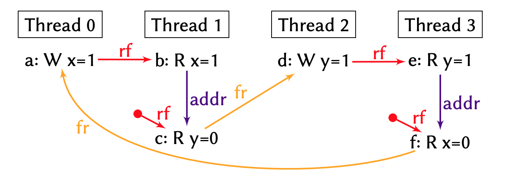
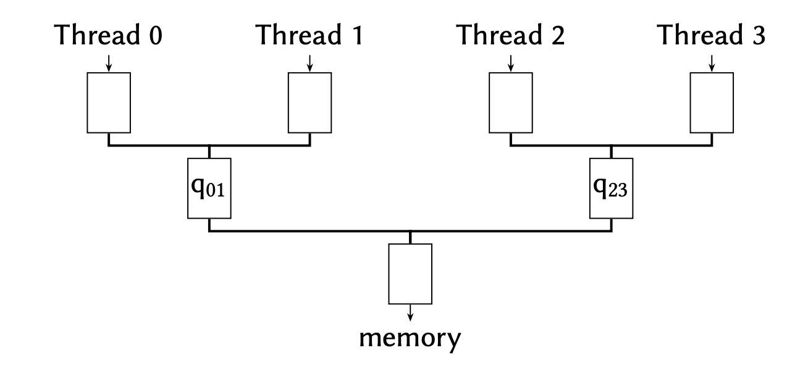

+++
Sources = [
"http://infolab.stanford.edu/pub/cstr/reports/csl/tr/95/685/CSL-TR-95-685.pdf",
"https://www.cl.cam.ac.uk/~pes20/armv8-mca/armv8-mca-draft.pdf",
"https://developer.arm.com/documentation/102336/0100/Memory-barriers",
"http://www0.cs.ucl.ac.uk/staff/j.alglave/papers/toplas21.pdf",
"https://github.com/paulmckrcu/perfbook",
"https://pages.cs.wisc.edu/~markhill/papers/primer2020_2nd_edition.pdf",
"https://developer.arm.com/documentation/ka002179/latest/",
"https://developer.arm.com/documentation/ihi0022/e/",

]
authors = [
"Michael Shalitin",

]
math = true
date = "2025-01-11"
categories = [

]
series = [

]
title = "Multi-copy atomicity"
+++
## דרישת אטומיות

שמירה ב-cache של נתונים משותפים מהווה אופטימיזציה חשובה שמסייעת להפחית את זמן השהייה של גישות לזיכרון במערכות זיכרון משותף. אולם, שמירה ב-cache יוצרת מספר עותקים של נתונים בצמתים שונים ברשת, והצורך לשמור על עדכניות העותקים הללו בכל כתיבה יכול להוות אתגר. קיימת האפשרות לבטל את העותקים הישנים או לעדכן אותם לערך החדש. אך הפצת העותקים והשוני במסלולי הרשת מקשים על ביטול או עדכון של העותקים בצורה אטומית.

לרוב יש פתרונות אפקטיביים לדרישת אטומיות עבור מערכות המשתמשות ב-invalidating. פתרונות למערכות המשתמשות ב-updating נוטים להיות מסובכים ובלתי יעילים לעומת הפתרונות ל-invalidating.

שיפורים ארכיטקטוניים שמטרתם להתמודד עם זמני השהייה ארוכים בזיכרון עשויים להשפיע על התנהגות הזיכרון בכך שהם מאפשרים לפעולות להתרחש מחוץ לסדר המתוכנן או לגרום להן להיראות כאילו אינן אטומיות.

במערכות מודרניות שבהן קיימים מספר מעבדים וכל אחד מהם מחזיק עותק של כל זיכרון, אנו נדרשים להשתמש במודלים של זיכרון עם עותקים בכל מעבד על מנת לתפוס את ההשפעות הלא אטומיות שנובעות מהימצאות מספר עותקים של מיקום זיכרון יחיד.

מכיוון שהזיכרון אינו מתפקד עוד כעותק לוגי יחיד, יש צורך להרחיב את המושג של פעולות קריאה וכתיבה על מנת להתמודד עם נוכחותם של מספר עותקים. כתיבה במצבים כאלה עשויה לא להיראות אטומית.

## מודל Multi-copy atomicity

הרעיון של multi-copy atomicity דורש שכל שאר הליבות יראו את הכתיבה של ליבה מסוימת באופן לוגי בו-זמנית.

במודל שהוא multi-copy atomicity, יש נקודת זמן אטומית שבה הכתיבה נכנסת לתוקף בזיכרון. לפני נקודת הזמן הזו, אף ליבה אחרת לא יכולה לראות את הערך החדש שנכתב. לאחר נקודה זו, כל הליבות האחרות חייבות לראות את הערך החדש או ערך מכתיבה מאוחרת יותר, אך לא ערך מלפני הכתיבה.

כדי לתמוך ב-multi-copy atomicity, יש צורך לטפל נכון בתרחיש הקרויIndependent Read Independent Write (IRIW), שבו קריאות וכתיבות למיקומים שונים בזיכרון נעשות בצורה בלתי תלויה. עם זאת, טיפול נכון ב-IRIW אינו מבטיח אוטומטית שמערכת תעמוד בדרישות של multi-copy atomicity.

המשמעות של עיקרון multi-copy atomicity הוא שניתן להתמקד בסנכרון ברמה המקומית של כל thread, מבלי לנתח את האינטראקציה הכוללת בין כל ה-thread-ים בתוכנית המרובת-thread-ים. באופן זה, אפשר להבטיח סנכרון נכון של דפוסים כמו MP ו-WRC באמצעות הנמקות סנכרון מקומיות לכל thread, במקום להחיל שיקולי סנכרון על התוכנית כולה. זה שונה מארכיטקטורות אחרות, כמו IBM Power, שבהן המבחן WRC דורש מנגנון נוסף שנקרא cumulative כדי להבטיח סנכרון נכון.

מבחינת יישום החומרה, מודל multi-copy atomicity מצריך מנגנונים פחות מורכבים כדי למנוע התנהגויות חריגות כמו אלו שנצפות ב-WRC. אף על פי שהדרישה הזו מטילה עומס נוסף על החומרה, היא מציעה יתרון בכך שהיא יוצרת מודל עקביות פשוט יותר עבור המפתחים.

### הקשר ל-single-copy atomicity

במקור השם של ה-multi-copy atomicity הגיע מ-single-copy atomicity בגלל שהם דומים מבחינה רעיונית.
ה-single-copy atomicity לא מגדיר את הרגע המדויק שבו הנתונים מתעדכנים, החשיבות היא לוודא שאף מעבד לא יוכל לראות מצב של נתונים מעודכנים חלקית.

ב-multi-copy atomicity אותו הרעיון קיים פשוט לא לערך בודד שאסור שיכיל ערבוב של מספר כתיבות אלה למיקום זיכרון שצריך להיראות זהה לכל המעבדים.

### סיבתיות ו-Multi-copy Atomicity

סיבתיות, למרות שהיא מספקת הבטחה של סדר לוגי של אירועים, אינה בהכרח מצביעה על multi-copy atomicity. דוגמה לכך היא מצב שבו מספר ליבות חולקות store buffer: הליבות שחולקות את ה-store buffer יראו את הכתיבה, בעוד שליבות שאינן חולקות אותו לא יראו את הכתיבה. מצב זה מפר את עקרון האטומיות של הכתיבה, שכן הכתיבה אינה גלויה באופן אחיד לכל הליבות במערכת.

 כאשר כתיבה עונה על התנאים של multi-copy atomicity, זה מרמז על כך שהכתיבה משמרת סיבתיות, כלומר כל הליבות במערכת יקבלו את המידע החדש לפי סדר לוגי של התרחשות האירועים, ולכן מודל ששומר על multi-copy atomicity מרמז על כך שהסיבתיות נשמרת.

## מודל Non-Multi-Copy Atomic

מודל שהוא Non-Multi-Copy Atomic מתאר אופן פעולה שבו תת-מערכת האחסון במעבד מורכבת מהיררכיה מורכבת בצורת עץ של תורים, שנמצאים מעל מערכת זיכרון פשוטה. בתת-מערכת זו, כל תור מתייחס לפעולות כתיבה, בקשות קריאה ומחסומים הקשורים ל-thread מסוים. כאשר thread מבצע פעולה כלשהי, כמו גישה לזיכרון או הפעלת מחסום, הפעולה נכנסת לראש התור המשויך לאותו thread.

לאורך הזמן, האירועים הנמצאים בתחתית התור יכולים "לזרום" לתורים הבאים בהיררכיה, עד שהם מגיעים לזיכרון הראשי. במקרה של כתיבה, כאשר אירוע כתיבה מגיע לזיכרון, הוא מעדכן את מפת הזיכרון, שהיא מפה של מיקומי בתים המייצגים את כתיבות הזיכרון האחרונות שבוצעו למיקומים אלה. עבור קריאה, כאשר האירוע מגיע לתחתית התור, נשלחת תגובת קריאה עם הערך מהזיכרון חזרה ל-thread המבצע את הקריאה. מחסומים בתור מוסרים כאשר הם מגיעים לשלב הסופי שלהם.

במקרה של קריאה, ייתכן שלא יהיה צורך להמתין להשלמת הכתיבה בזיכרון הראשי. אם בתור יש אירוע כתיבה שנמצא ישירות מתחת לאירוע הקריאה והוא מתייחס לאותו מיקום בזיכרון, הקריאה יכולה להיות מסופקת מיד מהתור, ולא לחכות לכתיבה בזיכרון הראשי.

התורים במערכת non-multi-copy atomicity גם מאפשרים גמישות מסוימת בסידור מחדש של האירועים. אירועים בתורים סמוכים, אפילו אם הם קשורים ל-thread-ים שונים, עשויים להחליף את הסדר ביניהם, בתנאי שזה לא מפר את המגבלות של סידור האירועים במערכת.

פלטפורמה שאינה תומכת באטומיות מרובת עותקים עשויה לגרום לכך ש-stores יגיעו ל-thread-ים שונים בזמנים שונים.

### דוגמה למבחן IRIW

כדי להבין את זרימת האירועים במודל non-multi-copy atomicity, ניתן להסתכל על מבחן לקמוס שנקרא IRIW+addrs1:

מבחן זה ממחיש מקרים שבהם תוצאה לא עקבית יכולה להתרחש עקב סידור מחדש של אירועים בתורים, אשר מתאפשרת על ידי המודל non-multi-copy atomicity.

בתרחיש המתואר, ה-thread-ים 0 ו-2 מבצעים כתיבות למיקומי זיכרון שונים (`x` ו-`y`, בהתאמה), ולאחר מכן ה-thread-ים 1 ו-3 קוראים מהמיקומים הללו, אך בסדר הפוך. כלומר, thread 1 קורא תחילה את `x` ואחר כך את `y`, בעוד thread 3 קורא תחילה את `y` ואחר כך את `x`. תוצאה מעניינת מתרחשת כאשר כל אחד מה-thread-ים הקוראים רואה את הערך החדש במיקום הזיכרון הראשון שהוא ניגש אליו, אך את הערך ההתחלתי במיקום הזיכרון השני.

#### תיאור טופולוגיית הזרימה

כאשר thread-ים 0 ו-2 מבצעים את הכתיבות שלהם (`x=1` ו-`y=1`), הכתיבה של thread 0 (`x=1`) יכולה לעבור לתור q01, שהוא התור המשותף ל-thread-ים 0 ו-1. במקביל, הכתיבה של thread 2 (`y=1`) עוברת לתור q23 המשותף ל-thread-ים 2 ו-3.

כעת, thread 1 יכול לבצע את הקריאה הראשונה שלו למיקום `x`, והקריאה "זורמת" בתור q01 עד שהיא פוגשת את הכתיבה `x=1`, כך שהוא יקרא את הערך המעודכן. לאחר מכן, הוא מבצע את הקריאה השנייה שלו למיקום `y`, והקריאה הזו זורמת כל הדרך אל הזיכרון הראשי, שם היא מסודרת מחדש עם הכתיבה `x=1` והקריאה של `y`  מחזירה את הערך ההתחלתי `y=0`.

באופן דומה, thread 3 מבצע את הקריאה הראשונה שלו למיקום `y`, והיא זורמת בתור q23 עד שהיא פוגשת את הכתיבה `y=1`, כך שהוא יקרא את הערך המעודכן. לאחר מכן, הוא מבצע את הקריאה השנייה שלו למיקום `x`, והיא זורמת אל הזיכרון, מסודרת מחדש עם הכתיבה `y=1`, ומחזירה את הערך ההתחלתי `x=0`.

ההתנהגות הזו מראה כיצד כתיבות יכולות להיות נראות על ידי חלק מה-thread-ים לפני שהן נראות על ידי כולם, מה שמוביל לתוצאות שונות בין ה-thread-ים הקוראים.

באופן כללי, המודל non-multi-copy atomicity מאפשר שתי אופטימיזציות חומרה עיקריות:

1. קיום של buffer משותף לפני ה-cache: זהו buffer שנמצא לפני ה-cache, המאפשר העברת נתונים מוקדמת בין תת-קבוצה של thread-ים במערכת. בכך, הנתונים יכולים לזרום בצורה מהירה יותר בין thread-ים מסוימים לפני שהם מגיעים לזיכרון הראשי או ל-cache-ים האחרים.

2. קיום של snoop invalidation מהיר: מנגנון שמאפשר שליחת בקשת invalidation ל-cache-ים האחרים שמשתתפים בפרוטוקול הקוהרנטיות, מבלי להמתין לאישור מלא מהם. כך מתאפשרת פעולה מהירה יותר במערכת הקוהרנטיות.

## מודל Other-multi-copy atomic

בפלטפורמה התומכת באטומיות מרובת עותקים מלאה, כל ה-thread-ים הפעילים בה מבוטחים להסכים על סדר ה-stores, גם כאשר מדובר במיקומי זיכרון שונים. כלומר, כל ה-stores שנעשו על ידי כל ה-thread-ים נצפים באותו סדר על ידי כל ה-thread-ים במערכת.

לעומת זאת, רוב ספקי המעבדים המספקים אטומיות מרובת עותקים למעשה מספקים גרסה חלשה יותר המכונה other-multi-copy atomicity. בגרסה זו, אין דרישה שכל המעבדים יסכימו על סדר כל ה-stores. במקום זאת, רק תת-קבוצה של המעבדים המספקים את ה-stores תסכים על סדר זה. 

השם "אחר" (other) ב-other-multi-copy atomicity מתאר את העובדה שלמעבד עצמו מותר לראות את ה-store שלו מוקדם יותר, מה שמאפשר ל-loads המאוחרים שלו לקבל את הערך החדש שהוא כתב ובכך לשפר את הביצועים.

במודל Other-multi-copy atomic הכתיבה שנעשית על ידי מעבד חייבת להיות גלויה לכל המעבדים האחרים שניגשים למיקום זה באופן קוהרנטי, אם היא נצפתה על ידי מעבד אחר. כלומר, כל מעבד במערכת צריך לראות את הכתיבה אם היא נראית על ידי מעבד אחר, אך יש לציין שמעבד יכול לראות את הכתיבות שלו לפני שהן נחשפות לצופים אחרים במערכת.

בפועל, מודל זיכרון המתואר כ-Other-multi-copy atomic מאפשר למעבדים להפעיל store buffers מקומיים שאינם קוהרנטיים עם המעבדים האחרים במערכת. ה-store buffers האלה נבדקים רק במובן המקומי עבור תלות בין פעולות, ולא בהכרח בשקיפות מלאה מול יתר המעבדים במערכת, ומעבדים שמבצעים כתיבה יכולים לקרוא ישירות מה-store buffer וכך לקבל את הערך החדש שהם כתבו (ידוע בתור forward).

המודל Other-multi-copy-atomicity מוגדר בתיעוד של Arm באופן הבא:
	במערכת שבה כל כתיבה שנצפתה על ידי צופה אחד (כמו מעבד או thread) צריכה להיות נראית לכל שאר הצופים שניגשים לאותו מיקום בזיכרון באופן קוהרנטי. עם זאת, מותר לכל thread לראות את הכתיבות שלו עצמו לפני שהן הופכות לגלויות לשאר ה-thread-ים במערכת.

## אטומיות מרובת עותקים ב-Arm

במודל המקורי של ארכיטקטורת ARM, המערכת לא הייתה אטומית מרובת עותקים. עם זאת, התנהגות זו לא יושמה בייצור בפועל. הסיבה לכך היא שהאופטימיזציות הפוטנציאליות שביצועים כאלה מציעות לא סיפקו יתרונות משמעותיים עבור ARM, והן גרמו לסיבוכים מורכבים בשילוב עם תכונות אחרות של ARMv8.

כתוצאה מכך, ארכיטקטורת ARMv8 עברה שינוי, והמודל הנוכחי שלה הוא Other-multi-copy-atomicity. המשמעות היא שכאשר כתיבה הופכת גלויה ל-thread אחד, היא תהיה גלויה לכל ה-thread-ים האחרים במערכת. השינוי במודל זה פישט גם היבטים נוספים בארכיטקטורה, כולל הגדרות ברורות יותר של תלות בין פעולות, והארכיטקטורה כעת כוללת מודל רשמי לניהול מקביליות.

בגרסאות של ARMv7 ו-ARMv8 ישנות, במדריכים הרשמיים נאמר כי כתיבה יכולה להפוך גלויה לחלק מה-thread-ים לפני שתהיה גלויה לכולם, תכונה שהייתה דומה לארכיטקטורת IBM POWER. אך בהקשר של ARM, היתרונות הביצועיים של מודל non-multi-copy atomicity לא הצדיקו את המורכבות הנוספת שהגיעו איתם, במיוחד באימות הלוגיקה והיישום.

האפשרות לאפשר התנהגות non-multi-copy atomicity גרמה למורכבות גדולה במודל הזיכרון, בעיקר כשמנסים לשלב זאת עם הרצון להעניק חופש ביישום ארכיטקטוני ועם ההוראות החדשות שנוספו ב-ARMv8, כמו store-release ו-load-acquire. כתוצאה מכך, ARM עדכנו את המפרט של ARMv8.

בנוסף, המפרט המעודכן של ARMv8 כולל כעת מודל זיכרון רשמי שמפרט בבירור אילו סוגי התנהגויות מותרות ואילו אסורות, והמודל הפורמלי מלווה בגרסה תיאורית כתובה. השינויים הללו כוללים גם הבהרות בנוגע לתלות בין הוראות, מה שמוסיף עוד מידה של פשטות ושקיפות לארכיטקטורה.

למרות שהאופטימיזציות הללו יכולות להיות יעילות במצבים מסוימים, בארכיטקטורת ARM הגיעו למסקנה פנימית שהן לא מספקות יתרון משמעותי. אחת הסיבות לכך היא שארכיטקטורת ה-buses של ARM, שמתבססת על פרוטוקול AMBA, שתומך ב-multi-copy atomicity. כלומר, בארכיטקטורה זו יש גישה אחידה וברורה יותר לניהול כתיבות זיכרון, ואין צורך באותן אופטימיזציות מורכבות שמספקות non-multi-copy atomicity. לכן, המורכבות שהתווספה על ידי non-multi-copy atomicity בארכיטקטורת ARMv8 לא הצדיקה את הגמישות הנוספת שהוא סיפק.

בעיה נוספת ב-non-multi-copy atomicity היא העובדה שהוא מאפשר התפשטות של כתיבה ל-thread-ים אחרים לפני שכתיבה קודמת באותו מיקום בוצעה במלואה. כלומר, ייתכן מצב שבו כתיבה מאוחרת תבוצע לפני שכתיבה קודמת לאותו מיקום הושלמה, מה שיוצר חוסר עקביות.

במודלים שהם multi-copy atomicity, בעיות כאלה אינן מתקיימות. לדוגמה, מבחנים כמו IRIW+addrs ו-WRC+addrs לא יכולים להתקיים, מכיוון שמודלים multi-copy atomicity מבטיחים סדר יותר קפדני של כתיבות וקריאות, כך שאין צורך להצטברות מחסומים כדי להבטיח קוהרנטיות במערכת.

## AMBA CHI

בגרסאות של AMBA4 ACE ו-CHI Issue A, מעבדים יכולים להעביר מחסומי זיכרון לתוך המערכת. פעולה זו מאפשרת להבטיח שהסדר והצפייה בטרנזקציות נשמרים כפי שנדרש במערכת, כלומר, היא מספקת ערבויות לגבי אופן ביצוע הטרנזקציות והסדר שלהן כפי שנצפה על ידי כל הרכיבים המשתתפים.

כאשר מפיצים מחסומי זיכרון במערכות בעלות תכונה של Multi-Copy Atomicity, עלולה להתרחש ירידה בביצועי המערכת. הדבר נובע מכך שמחסומים אלו יוצרים hazards מיותרים בין הטרנזקציות, מה שמאט את פעולת המערכת.

בפרוטוקולי קוהרנטיות חדשים, כמו AMBA CHI 5, הוסרה או צומצמה התמיכה במחסומי זיכרון. במערכות Armv8, שהן Multi-Copy Atomic, לא נדרשת עוד הפצה של מחסומים לצורך שמירה על הסדר. במערכת כזו, המחסומים אינם משפיעים על אופן סידור הטרנזקציות, והערבויות על הסדר נשמרות באופן טבעי, ללא תלות בשאלה אם המחסומים מופצים או לא.

מערכת מוגדרת כ-Multi-copy atomicity אם מתקיימים שני התנאים הבאים:

1. כתיבה לאותו מיקום בזיכרון נצפית על ידי כל הרכיבים (agents) באותו סדר, ללא הבדלים בסדר הצפייה.
2. אם agent אחד רואה כתיבה למיקום מסוים בזיכרון, כל ה-agents האחרים במערכת יראו גם הם את הכתיבה לאותו מיקום.

במערכות כאלה, אין צורך בהפצה של מחסומים לצורך שמירה על עקביות וסדר בין הכתיבות, מכיוון שהן שומרות על סדר אטומי מעצם פעולתן.

### בפרוטוקולי AXI/ACE

בפרוטוקולי AXI/ACE, כאשר רכיב ביניים מספק תגובת כתיבה מוקדמת (early write response), המשמעות היא שהתוצאה של הכתיבה חייבת להיות גלויה לכל המעבדים במערכת. אם מערכת אינה נותנת תגובות כתיבה מוקדמות, ייתכן שהיא פועלת במודל של Multi-copy atomicity, כלומר שכל הכתיבות נעשות זמינות לכל המעבדים בו-זמנית.

#### גישה למיקומים Inner Shareable ו-Outer Shareable

במערכת עם מיקומים Inner Shareable ו-Outer Shareable, נדרשת אטומיות מרובת עותקים (Multi-copy atomicity). כלומר, תגובת snoop לכתיבה תתקבל רק כאשר כל המעבדים בתחום השיתוף הנדרש ראו את הכתיבה. בנוסף, בעת קבלת תגובת snoop, המעבד המשויך כבר צריך להיות חשוף לכתיבה. נקודת הצפייה מוגדרת כלחיצת היד בערוץ התגובה של snoop. חשוב לציין שערוץ data snoop אינו משמש להגדרת נקודת הצפייה, כך שאין דרישה למחסומים בערוץ הכתובת של snoop.
