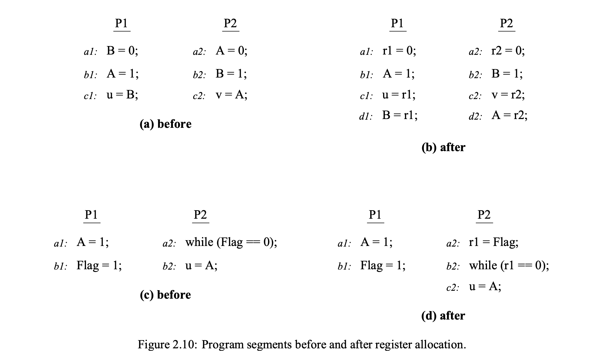
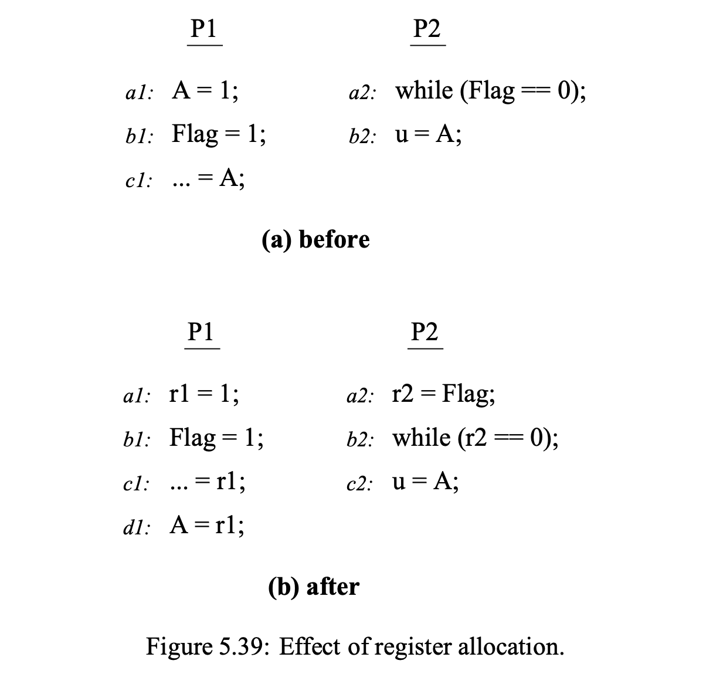
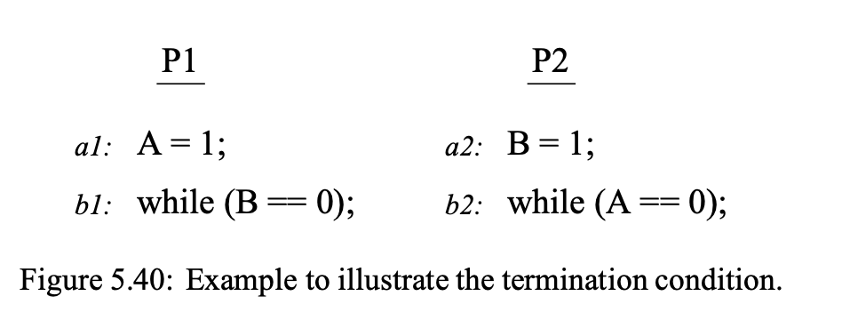

+++
Sources = [
"https://www.kernel.org/doc/Documentation/memory-barriers.txt",
"http://infolab.stanford.edu/pub/cstr/reports/csl/tr/95/685/CSL-TR-95-685.pdf",
"https://developer.arm.com/documentation/den0024/a/Memory-Ordering",
"https://community.arm.com/arm-community-blogs/b/architectures-and-processors-blog/posts/memory-access-ordering---an-introduction",
"https://community.arm.com/arm-community-blogs/b/architectures-and-processors-blog/posts/memory-access-ordering-part-2---barriers-and-the-linux-kernel",
"https://github.com/paulmckrcu/oota",
"https://stackoverflow.com/questions/37725497/how-does-memory-reordering-help-processors-and-compilers",
"https://preshing.com/20120625/memory-ordering-at-compile-time/",
"https://diy.inria.fr/linux/long.pdf",
"https://github.com/torvalds/linux/blob/master/tools/memory-model/Documentation/recipes.txt",
"https://github.com/torvalds/linux/blob/master/tools/memory-model/Documentation/ordering.txt",
"https://github.com/torvalds/linux/blob/master/tools/memory-model/Documentation/control-dependencies.txt",
"https://en.wikipedia.org/wiki/Instruction-level_parallelism",
"https://en.wikipedia.org/wiki/Register_renaming",
"https://en.wikipedia.org/wiki/Memory_barrier",
"https://lwn.net/Articles/718628/",
"https://lwn.net/Articles/255364/",
"https://coffeebeforearch.github.io/2020/11/21/compiler-memory-ordering.html",
"https://gcc.gnu.org/onlinedocs/gcc/Constraints.html",
"https://0xax.gitbooks.io/linux-insides/content/Theory/linux-theory-3.html",
"https://gcc.gnu.org/onlinedocs/gcc/Extended-Asm.html",
"https://gcc.gnu.org/onlinedocs/gcc/Simple-Constraints.html",

]
authors = [
"Michael Shalitin",

]
math = true
date = "2025-01-11"
categories = [

]
series = [

]
title = "Optimizations"
+++


## מבוא


הקומפיילר יכול לשנות את הסדר של הפעולות של התוכנית, להוסיף ולבטל loads ו-stores ,לעשות ספקולציות של ערכים, ועוד אופטימיזציות יצרתיות בתנאי שזה לא משפיע על הפעולה הנראית לעין של התוכנית.

לדוגמה זה יכול לבוא לידי ביטוי על ידי רצף של stores שיכול להשתנות, זה לא מפריע לרוב ב-thread יחיד אבל כשיש מספר thread-ים אז זה כבר בעייתי.

## אופטימיזציות קומפיילר

בדומה לאופטימיזציות שנעשות ברמת ארכיטקטורת החומרה, גם אופטימיזציות קומפיילר נפוצות יכולות לשנות את האופן שבו פעולות זיכרון משותף מתבצעות, וכתוצאה מכך, להשפיע על ההתנהגות של תוכנות מקביליות. אופטימיזציות כגון הקצאת רגיסטרים, תנועת קוד (code motion), חיסול תת-ביטויים נפוצים, שינויי מבנה לולאות, וחסימת טרנספורמציות (blocking transformations), כולן משפיעות על סידור פעולות הזיכרון ואף עלולות לגרום לביטולן. ההשפעות של אופטימיזציות כאלה עלולות להיות קריטיות כאשר מקמפלים תוכנות מקביליות שמוגדרות באופן מפורש.

אופטימיזציות קומפיילר נועדו לשפר את ביצועי הקוד על ידי סידור מחדש של הוראות כך שהן מנצלות בצורה אופטימלית את תכונות החומרה ומפחיתות את זמן השהייה. 

במערכת עם ליבה אחת, שינויים בסדר ההוראות שביצע הקומפיילר לרוב שקופים למתכנת, מאחר והמעבד הבודד מסוגל לנהל את התלויות בין הוראות ולוודא שהן מכובדות. אבל, במערכות הכוללות ליבות מרובות, שבהן הליבות מתקשרות זו עם זו דרך זיכרון משותף או משתפות נתונים בדרכים אחרות, הופך ניהול סדר הזיכרון לעניין חשוב. במקרים אלו, חשוב להבין את השפעת אופטימיזציות הקומפיילר על סדר הגישות לזיכרון, שכן הן עשויות להשפיע על התנהגות התוכנית בכל ליבה ולהשפיע על התקשורת בין הליבות.

אופטימיזציות קומפיילר עשויות להשפיע באופן משמעותי על הקוד שלך במטרה להסתיר השהיות ב-pipeline ולנצל אופטימיזציות של המיקרו-ארכיטקטורה. קומפיילר יכול להחליט להזיז גישות לזיכרון מוקדם יותר או מאוחר יותר, בהתאם למטרה להעניק יותר זמן להשלמת פעולות מסוימות או לאזן את סדר הגישות בתוכנית ובנוסף הקומפיילר יכול להזיז גישות לזיכרון קדימה, כלומר להקדים את ביצוען, כדי להבטיח שהן יושלמו לפני שהערכים שנדרשים מהן יהיו נדרשים על ידי קוד נוסף בהמשך.

באופן כללי, אופטימיזציות קומפיילר עשויות להוביל להפרת סדר התוכנית המקורי על ידי סידור מחדש של פעולות זיכרון באותו מעבד.

קומפיילרים יכולים להשתמש בכלל ה-"כאילו". כלומר, הם רשאים להפיק כל קוד שהם רוצים עבור גישה רגילה, כל עוד התוצאה המתקבלת מביצוע ה-thread נראית כאילו הקומפיילר עמד בכל הכללים הרלוונטיים של השפה. ניתן לראות את זה בצורה ברורה יותר אם מקמפלים קוד עם רמת אופטימיזציה גבוהה ואז מבצעים דיבוג על הבינארי שנוצר.

במערכת החומרה, מקביליות ניהול הוראות נעשית בצורה דינמית, כלומר המעבד קובע בזמן הריצה אילו הוראות ניתן לבצע במקביל. לעומת זאת, במערכת התוכנה, מקביליות מנוהלת בצורה סטטית, כלומר הקומפיילר הוא זה שמחליט מראש אילו הוראות יבוצעו במקביל בזמן התרגום.
### הדגמה של השפעת האופטימיזציה

קומפיילר יכול לזהות רצפים של הוראות שאינן תלויות זו בזו, ואם קיימים מספיק רגיסטרים פנויים, הוא יכול להקצות לכל רצף רגיסטרים שונה במהלך שלב הקצאת הרגיסטרים בתהליך יצירת הקוד.

איורים 2.10(א) ו-(ב) מדגימים כיצד אופטימיזציה כמו הקצאת רגיסטרים, יכולה גם היא לגרום לסידור מחדש של פעולות זיכרון באופן דומה. שתי התוכניות שמוצגות שם נראות תואמות לפני ואחרי הקצאת הרגיסטרים.



ביצוע התוכנית לאחר הקצאת הרגיסטרים מוביל לתוצאה `u=0`, `v=0`. בפועל, הקצאת הרגיסטרים גרמה לסידור מחדש של הקריאה ל-B עם הכתיבה ל-A ב-P1, ושל הקריאה ל-A עם הכתיבה ל-B ב-P2.

שימו לב שהטרנספורמציה שנעשתה תיחשב בטוחה אם נבחן את הקוד של כל מעבד כיחידה נפרדת, כלומר, תוכנית חד-מעבד. אבל, במערכות מקביליות, שינויי סדר כאלה עלולים להוביל להתנהגויות בלתי צפויות ולשבור את הסנכרון בין מעבדים שונים.

### ההשפעות של אופטימיזציות קומפיילר על ביטול פעולות זיכרון

איורים 2.10(ג) ו-(ד) ממחישים בעיות נוספות הנובעות מאופטימיזציות קומפיילר, כמו הקצאת רגיסטר, שהשפעתן נובעת מביטול פעולות זיכרון מסוימות. לדוגמה, בקטע הקוד ב-2.10(ג) מופיעה לולאת while, שמסתיימת בכל ביצוע תחת מודל הזיכרון רציף. לעומת זאת, הקוד ב-2.10(ד) מציג מצב שבו רגיסטר משמש לאחסון הערך של משתנה Flag שהוקצה ל-P2. בכך נמנעת הקריאה החוזרת של Flag בתוך לולאת ה-while.

נניח שהתוכנית עברה טרנספורמציה שבה הקריאה למשתנה Flag ב-P2 מחזירה את הערך 0. במצב כזה, לולאת ה-while ב-P2 לא תסתיים, דבר שמפר את מודל הזיכרון הרציף. הסיבה לכך היא שהקצאת רגיסטר למשתנה Flag גורמת לכך ש-P2 לא יראה את השינויים שבוצעו על ידי P1 בערך של משתנה Flag. זה יוצר מצב שבו נראה כאילו פעולת הכתיבה של Flag ב-P1 לא נצפתה כלל על ידי P2.

חשוב לציין שאופטימיזציה זו תיחשב בטוחה בתוכנית חד-מעבדית, שכן שם אין צורך לדאוג לסנכרון זיכרון thread-ים שונים.

המקרים המתוארים מדגימים כיצד אופטימיזציות קומפיילר נפוצות, שמיועדות לתוכניות חד-מעבדיות, עלולות להוביל להתנהגות לא נכונה כאשר הן מיושמות על תוכניות מקבילות במפורש. אופטימיזציות אלו עשויות לשנות את האופן שבו זיכרון משותף מנוהל, דבר שעלול להוביל למירוצי נתונים ולבעיות סנכרון במערכות מרובות מעבדים.

### השפעת אופטימיזציות על מודל הזיכרון הרציף

איור 5.39 מציג דוגמה להשפעתה של אופטימיזציה קומפיילרית נפוצה. באיור 5.39(א) מופיעה התוכנית המקורית, שנכתבה במפורש תחת מודל הזיכרון הרציף. בתוכנית זו, P1 כותב ערך למשתנה A, מגדיר Flag, ולאחר מכן קורא שוב את הערך של A. בינתיים, P2 ממתין עד שהדגל יוגדר לפני שהוא קורא את A. תחת מודל רציף, לולאת ה-while של P2 תמיד תסתיים, והתוצאה האפשרית היחידה היא `u=1`.



עם זאת, איור 5.39(ב) מציג את ההשפעה של אופטימיזציה מסוג הקצאת רגיסטר למשתנים A ו-Flag. אופטימיזציה זו נחשבת תקינה לחלוטין אם בוחנים את הקוד של כל מעבד בנפרד, כאילו הוא תוכנית חד-מעבדית. אך כאשר מדובר בתוכנית מקבילית, האופטימיזציה עלולה להפר את הסמנטיקה של מודל SC.

לדוגמה, הקצאת רגיסטר למשתנה A ב-P1 עשויה לאפשר ל-P2 לקרוא את הערך 0 עבור A, מכיוון שהכתיבה ל-A ב-P1 מתבצעת רק לאחר הכתיבה ל-Flag. זהו למעשה מקרה של סידור מחדש של פעולות כתוצאה מהאופטימיזציה. בנוסף, אם Flag מוקצה גם הוא לרגיסטר ב-P2, לולאת ה-while עלולה שלא להסתיים לעולם, מכיוון ש-P2 יקרא את Flag פעם אחת בלבד ולא ימשיך לעדכן את הערך שלו מתוך הזיכרון. כלומר, אם הקריאה הראשונית ל-Flag מחזירה את הערך 0, P2 עשוי לא לקרוא את Flag שוב ולעולם לא לסיים את לולאת ה-while.

שתי ההתנהגויות שתוארו אינן מותרות בתוכנית המקורית תחת מודל הזיכרון הרציף.


תוכנית מקורית מניחה לרוב מודל זיכרון בסיסי מסוים. עם זאת, ייתכן שארכיטקטורת היעד או החומרה שבהן התוכנית תפעל תומכות במודל זיכרון שונה מהמודל המקורי. זה יוצר שתי דרישות מהקומפיילר:

1. **הגבלת אופטימיזציות הקומפיילר:** הקומפיילר חייב להגביל את האופטימיזציות שהוא מבצע כדי לוודא שהן תואמות לסמנטיקה של מודל הזיכרון שהתוכנית המקורית מסתמכת עליו.

2. **מיפוי נכון בין המודלים:** הקומפיילר צריך למפות את הסמנטיקה של מודל הזיכרון המקורי כך שתהיה תואמת למודל הזיכרון של החומרה בארכיטקטורת היעד, במיוחד כאשר המודלים שונים זה מזה.

יתכן שגם במצבים שבהם נדרשות אופטימיזציות בטוחות, הקומפיילר צריך להיות מודע למודל הזיכרון של ארכיטקטורת היעד כדי להחליט אילו אופטימיזציות ניתן ליישם מבלי לפגוע בתפקוד התקין של התוכנית.

כדי להבטיח אופטימיזציות בטוחות, יש לספק לקומפיילר מידע מפורט, כגון שימוש בתוויות או מחסומי זיכרון, שיסייעו לו להקפיד על הסדר והגישה הנכונים בזיכרון.


### תנאי תלות בערך, התחלה, ותלות חד-מעבד

כדי להבטיח את תקינות התלות בנתונים בתוכניות חד-מעבד, הקומפיילר צריך לוודא שאם קריאה מחזירה את הערך שנכתב על ידי אותו מעבד, אז הכתיבה היא הפעולה האחרונה לפני הקריאה, לפי סדר התוכנית המקורי. זה פשוט יחסית כאשר אין אופטימיזציות כמו הקצאת רגיסטרים, מכיוון שהקומפיילר יכול פשוט להימנע מסידור מחדש של פעולות כתיבה וקריאה לאותה כתובת זיכרון.

עם זאת, כאשר מתבצעת אופטימיזציה כמו הקצאת רגיסטרים, התקינות נשמרת אם במהלך הקצאת הרגיסטרים הקומפיילר מבטיח שסדר הפעולות בתוך הרגיסטרים תואם את סדר הפעולות בזיכרון בתוכנית המקורית. בנוסף, תנאי התלות החד-מעבד מחייבים שמירה על סדר הפעולות בין כל הפעולות שמתנגשות בזיכרון.

תנאים אלו חלים רק על פעולות המכוונות לאותה כתובת זיכרון. מכיוון שאופטימיזציות קומפיילר מתבצעות בזמן הקומפילציה, הקומפיילר אינו יכול לדעת בזמן זה את הכתובות המדויקות שייחשפו בזמן הריצה. לכן, לעיתים הקומפיילר יצטרך להניח הנחות שמרניות לגבי התנגשויות אפשריות בין פעולות בזיכרון. מצד שני, במקרים מסוימים, הקומפיילר יכול לבצע אופטימיזציות מדויקות יותר מהחומרה בזמן ריצה על ידי שימוש בידע סטטי על התוכנית ומבני הנתונים שלה כדי לקבוע שאין התנגשויות בין פעולות מסוימות.

באיור 5.40, מופיע תבנית SB, אנו בוחנים כיצד אופטימיזציות שונות עשויות להפר את תנאי הסיום ותנאי התקינות של תוכניות חד-מעבד. 

 


נניח שמודל זיכרון דורש שכתיבת ערך ל-A על ידי P1 וכתיבת ערך ל-B על ידי P2 יעמדו בתנאים מסוימים של סיום. תנאים חד-מעבדיים, כגון נכונות, ערך ותנאי סיום, מחייבים שכל לולאת while בתוכנית תסיים את ביצועיה בכל ריצה אפשרית של הקוד. עם זאת, אופטימיזציות מסוימות עלולות להפר את התנאים הללו:

1. **העברת לולאת while מעל הכתיבה:** אם לולאת while בכל מעבד מועברת מעל הכתיבה המבוצעת באותו מעבד, אופטימיזציה זו משנה את הסדר שבו מבוצעות הפעולות. מצב זה אינו מתואם עם תנאי התקינות החד-מעבדיים, שכן הוא עשוי לשנות את הסדר שבו מבוצעות פעולות הזיכרון ולמנוע סיום תקין של הלולאות.

2. **כתיבה לרגסיטר בלבד:** אם הכתיבה ל-A ול-B מתבצעת ישירות לרגיסטר ולא נכתבת חזרה לזיכרון, הערכים החדשים לא יירשמו בזיכרון. אופטימיזציה זו מפרה את תנאי הסיום, מכיוון שהערכים החדשים אינם מתעדכנים בזיכרון, דבר שמונע סיום נכון של הלולאות לפי תנאים שהוגדרו.

3. **הקצאת מיקומים ב-P1 ו-P2:** אם מיקום B מוקצה ל-P1 או מיקום A מוקצה ל-P2, הדבר מפר את ההגדרה של הוראות ביצוע שמגבילות את מספר תתי-הפעולות שיכולות להקדים כל פעולה מסוימת בסדר הביצוע. אופטימיזציה זו עשויה לשנות את סדר פעולות הזיכרון ולפגוע בתנאי הסיום והתקינות של התוכנית.

באופן כללי, אופטימיזציות אלו יכולות לשנות את הסדר שבו מתבצעות פעולות הזיכרון בתוכנית, דבר שעשוי להפר את תנאי הסיום ואת תנאי התקינות החד-מעבדיים הנדרשים במודל הזיכרון.

## מחסומי קומפיילר

מחסומי זיכרון קומפיילר, המכונים גם מחסומי קומפיילר, הם הוראות או הנחיות שמיועדות לכפות סידור וסנכרון מדויקים של גישות לזיכרון בתוך הקוד שהקומפיילר יוצר. השימוש במחסומים אלו נועד למנוע מהקומפיילר לבצע סידור מחדש או אופטימיזציה של פעולות זיכרון באופן שעלול להפר את ההתנהגות הרצויה של התוכנית.

בתכנות מקבילי, מחסומי זיכרון קומפיילר חיוניים כדי להבטיח התנהגות צפויה ונכונה בעת עבודה עם זיכרון משותף ותיאום בין thread-ים. הם מבטיחים שפעולות זיכרון יתבצעו בסדר המתוכנן על ידי המתכנת, גם אם הקומפיילר יכול היה לייעל את הקוד או לשנות את סדר ההוראות.

שימוש נכון במחסומי זיכרון קומפיילר מאפשר למתכנתים להבטיח שהקוד שנוצר יכבד את אילוצי הסידור והסנכרון שנדרשים, ובכך להבטיח פעולה נכונה ואמינה של תוכנות מקביליות או מבוססות thread-ים.

ב-GCC רוב קריאות הפונקציות פועלות כמחסומי קומפיילר גם אם הפונקציה עצמה אינה מכילה מחסום כזה. החריגים לכך הם פונקציות inline, פונקציות שמסומנות כ-pure, ומקרים בהם נעשה שימוש בהפקת קוד בזמן תהליך ה-linking. במקרים שבהם הפונקציה חיצונית, היא משמשת כמחסום קומפיילר חזק יותר, שכן הקומפיילר אינו יכול לדעת את תופעות הלוואי של הפונקציה החיצונית. לכן, הקומפיילר חייב להימנע מהנחות לגבי הגישה לזיכרון שעשויות להיות גלויות לפונקציה זו.

הקומפיילר משנה את סדר האינטראקציות בזיכרון מסיבות דומות לאלה של המעבד - אופטימיזציה של ביצועים. שינויים אלה הם תוצאה ישירה מהמורכבות של מעבדים מודרניים, שמצדיקים אופטימיזציות לשיפור הביצועים.

### מחסומי קומפיילר בקרנל
#### המאקרו `barrier`

מחסום קומפיילר הוא סוג של מחסום המתייחס רק לתהליך הקומפילציה ולא ישירות לביצוע ההוראות על ידי המעבד. בקוד המקור של הקרנל של לינוקס, המאקרו `barrier` משמש כמחסום קומפיילר. הוא לא מייצר הוראות מכונה ישירות בקוד האובייקט, אלא משפיעה על הדרך בה הקומפיילר יוצר את שאר קוד האובייקט.

המאקרו `barrier` שמוגדר ב-`include/linux/compiler.h` ([קישור](https://elixir.bootlin.com/linux/v6.4.11/source/include/linux/compiler.h#L85)) מונע מהקומפיילר להזיז פעולות גישה לזיכרון משני צדי המחסום. זהו מחסום כללי שאינו מחלק את פעולות הזיכרון לקריאות או כתיבות נפרדות (כמו סוגי מחסומים אחרים).

בהינתן קוד מקור המכיל מחסום קומפיילר כזה:

```c {linenos=inline}
... some memory accesses ...
barrier();
... some other memory accesses ...
```

הפונקציה `barrier` מבטיחה שכל הוראות המכונה שקשורות לקבוצת גישות אחת יושלמו במלואן לפני שהמעבד יתפנה לבצע הוראות המכונה שקשורות לקבוצת גישות אחרת. זאת אומרת, כל גישה במסגרת הקבוצה הראשונה תושלם לפני כל גישה מהקבוצה השנייה, גם אם חלק מהגישות הן גישות פשוטות (plain). יש לציין שהמעבד עשוי להוציא את ההוראות בסדר שאינו תואם את סדר התוכנית, אך ניתן להתמודד עם בעיות כאלה בדרכים אחרות. ללא השימוש ב-`barrier`, לא תהיה הבטחה לכך שסדר ההוראות נשמר, וייתכן ששתי קבוצות הגישות יתערבבו או אפילו יחליפו את מקומן בקוד האובייקט.

ה-`barrier` מונע מהקומפיילר לבצע סידור מחדש או אופטימיזציה של פעולות זיכרון מעבר למחסום, בשני הכיוונים. 

בתוך לולאות, המחסום מאלץ את הקומפיילר לטעון מחדש את המשתנים בהם נעשה שימוש בכל מחזור של הלולאה, ומונע אופטימיזציות שעלולות להוביל להתנהגות לא צפויה.


#### שימוש ב-`READ_ONCE` ו-`WRITE_ONCE`

פונקציות המאקרו `READ_ONCE` ו-`WRITE_ONCE` נועדו לעזור למנוע מהקומפיילר לבצע אופטימיזציות מוטעות שעלולות לשנות את אופן פעולת התוכנית. לדוגמה, לעיתים הקומפיילר עלול להניח שהמעבד הנוכחי הוא היחיד שמבצע עדכונים למשתנה מסוים, ולכן הוא מרשה לעצמו לבצע שינויים בקוד על בסיס הנחות אלו. השימוש ב-`READ_ONCE` ו-`WRITE_ONCE` מונע הנחות כאלו בכך שהוא מכריח את הקומפיילר לא לשמור בזיכרונו מידע מוטעה אודות תוכן משתנים מסוימים.

בעת השימוש ב-`READ_ONCE` ו-`WRITE_ONCE`, הקומפיילר נדרש לשכוח את הערכים של מיקומי זיכרון מסוימים, אבל בניגוד ל-`barrier`, הוא אינו צריך למחוק את כל התוכן שהוא שומר ברגיסטרים. (זה נשמע קצת מוזר בהתחלה בגלל שלקומפיילר אין רגיסטרים, אבל הכוונה כאן היא שאסור לו להניח הנחות קודמות ולכן הוא חייב לעשות את זה).

בנוסף, הקומפיילר מחויב לכבד את סדר הפעולות שבו מתבצעים ה-`READ_ONCE` וה-`WRITE_ONCE`, אך המעבד עצמו אינו חייב לעשות זאת, מה שעלול לגרום לשינויים נוספים ברמת החומרה.

משתנים פרטיים, שאינם משותפים בין מעבדים שונים, ניתן לגשת אליהם בדרך כלל מבלי להשתמש ב-`READ_ONCE` או `WRITE_ONCE`. למעשה, משתנים פרטיים אינם חייבים להיות מאוחסנים בזיכרון רגיל, ויכולים להיות מאוחסנים ישירות ברגיסטר של המעבד.

כאשר משתנה מסומן כ-`volatile`, אין צורך להשתמש ב-`READ_ONCE` וב-`WRITE_ONCE`, מכיוון שהשניים מיושמים כהטלות `volatile`. משתנים מסומנים כ-`volatile` מונעים אופטימיזציות מיותרות מצד הקומפיילר.

ההגנות שמספקות הפונקציות `READ_ONCE`, `WRITE_ONCE` ודומיהן אינן מושלמות, ובמצבים מסוימים הקומפיילר עשוי לשנות את התנהגות הזיכרון בדרכים שאינן תואמות למודל הזיכרון המיועד.

פרימיטיבים של `ONCE` מונעים תופעות של קריעת נתונים (כמו כשהקומפיילר מפרק גישה יחידה למשתנה גדול למספר גישות קטנות יותר), היתוך גישות (כאשר הקומפיילר מאחד מספר גישות לאותו מיקום בגישה אחת בלבד), ופיצול גישות (כאשר גישה בודדת מחולקת למספר גישות מלאות, לדוגמה, חזרה על פעולת load כדי להימנע מאובדן נתונים ברגיסטר).

בעת גישה למשתנה בודד משותף בין מעבדים מרובים השימוש בהם מונע קריעת זיכרון (memory tearing).


#### מחסומי קומפיילר והשפעתם על CPU

חשוב להבין כי המחסומים הקומפיילרים, כמו `READ_ONCE`, `WRITE_ONCE` ו-`barrier`, אינם משפיעים באופן ישיר על אופן הפעולה של ה-CPU. לאחר יצירת הקוד, ה-CPU עדיין חופשי לסדר מחדש פעולות בהתאם לאופטימיזציות פנימיות שלו. המחסומים משפיעים רק על אופן יצירת הקוד על ידי הקומפיילר, ולא על אופן הביצוע הפנימי של ה-CPU.

#### יצירת פעולות טעינה נוספות על ידי הקומפיילר

לעיתים, הקומפיילר עלול להוסיף פעולות loads נוספות שמעולם לא היו בקוד המקורי. פעולות loads אלו לא תמיד גורמות לנזק, אך הן יכולות לגרום להקפצת שורותcache (cache bouncing), תופעה שבה כמה מעבדים ניגשים לאותם מיקומי זיכרון ובכך גורמים להקטנת ביצועים ופגיעה ב-scalability של המערכת. כדי למנוע פעולות loads שהומצאו על ידי הקומפיילר, צריך להשתמש ב-`READ_ONCE`.

#### שימוש בפרימיטיבים חזקים באינטראקציה בין מעבדים

כאשר יש צורך באינטראקציה בין מעבדים שונים, יש להשתמש בפרימיטיבים חזקים יותר, כמו `smp_load_acquire` ו-`smp_store_release`, כדי להבטיח שהסדר הנכון של פעולות הזיכרון נשמר, ושיש שקיפות מלאה של השינויים בין המעבדים. במקרים בהם יש תלות בקרה, כלומר כאשר סדר הביצוע תלוי בבדיקת תנאי כלשהו, יש להשתמש ב-`WRITE_ONCE` עבור פעולת ה-store כדי להבטיח שהסדר ישמר לפי תלות הבקרה.

### השפעת `volatile`

רוב הקומפיילרים אינם מותאמים במיוחד לעבודה עם תוכניות מרובות מעבדים. התוצאה היא שאופטימיזציות שמיועדות לתוכניות חד-מעבדיות עלולות לשבור את הסמנטיקה במודלי זיכרון חלשים במערכות מרובות מעבדים.

אחת מהשיטות הנפוצות להתמודדות עם בעיה זו היא השימוש במילת המפתח `volatile`, המוכרת בשפות כמו C, לזיהוי משתנים משותפים בין thread-ים.

הפונקציונליות של `volatile` נועדה במקור לטפל בפעולות קלט/פלט בסביבת חד-מעבד, אך הקומפיילר נמנע מהקצאת משתנים אלו לרגיסטרים ושומר על הסדר המקורי של הקוד לגביהם. 

השימוש במילת המפתח `volatile` מבטיח שהקומפיילר ייצור קוד שבו גישה למשתנה מתבצעת תמיד. המשמעות היא שהקומפיילר אינו מורשה לבצע אופטימיזציות שעלולות להסתמך על ערכים שנשמרו או "הונחו" בעבר. השימוש ב-`volatile` נועד לציין בפני הקומפיילר שהמשתנה עשוי להשתנות בדרכים חיצוניות שאינן נראות ישירות בקוד, ולכן יש לגשת אליו בכל פעם ישירות מהזיכרון הראשי.

עם זאת, מילת המפתח `volatile` מתאימה בעיקר למודלים מחמירים של זיכרון כמו SC, אך אינה גמישה מספיק לתמיכה במודלים רגועים יותר. אחת הבעיות המרכזיות היא שפעולות למשתנים שאינם מוגדרים כ-`volatile` אינן מסודרות ביחס לפעולות למשתנים המוגדרים כ-`volatile`. 

בכל המעבדים המודרנים שמבצעים ביצוע מחוץ לסדר הגדרת כל פעולות הסנכרון כ-`volatile` אינה מספיקה כדי להבטיח את תקינות התוכנית, מכיוון שהקומפיילר עדיין עלול להזיז או לבצע אופטימיזציה של פעולות הקצאת נתונים מעבר לפעולות הסנכרון.

הכרזה על אובייקטים כ-`volatile` משמשת את המתכנת לציין שהחומרה צריכה לגשת לאובייקטים אלה בדיוק כפי שמצוין בקוד המקור. זאת עשויה להיות דרישה מיוחדת עבור רגיססטרי התקנים ממופי זיכרון או DMA buffers ולא עבור מיקומי זיכרון רגילים. הציפייה היא שתהליך תרגום הקוד של קומפיילרים לאובייקטים `volatile` לקוד מכונה יהיה מדויק ככל האפשר.

כשעוסקים בגישה לאובייקטים `volatile` חלקית, הדרישות משתנות בהתאם:

- **שמירה על סדר**: הדרישה לשמירה על סדר מתמעטת. היא חלה רק על זוגות של גישות לאותו אובייקט `volatile`. כלומר, בעוד שסדר הגישות לאובייקט `volatile` אחד חייב להישמר, גישות לאובייקטים שונים יכולות להיות מסודרות מחדש זה ביחס לזה.

- **מיזוג והשמטה**: הקומפיילר מורשה למזג או להשמיט גישות לאובייקטים `volatile` חלקית.

- **שמירה על יחס rf**: המיפוי חייב לשמר את יחס כתיבה-לקריאה (rf). זה אומר, אם גישת קריאה R מבצעת קריאה מהכתיבה W אז יכולים להיות שינויים אבל חייב להישמר היחס ש-R קורא את הערך ש-W כתב ($\text{W} \to_{\text{rf}} \text{R}$).


המשמעות המדויקת של הגבלת הגישה ל-`volatile` אינה תמיד ברורה. טיפול ב-`volatile`, כפי שהובן על ידי מפתחי קומפיילרים, נתפס לעיתים יותר כעניין של מוסכמה חברתית (folklore) מאשר כללים ברורים. כדי להנחות את משתמשי ומיישמי C++, התקן מספק הערות שהן רמזים עבור מימושים:

- **הסמנטיקה של גישה לאובייקט `volatile` גלובלי**: הסמנטיקה של גישה לאובייקט `volatile` גלובלי מוגדרת לפי המימוש. כלומר, המימוש עצמו אחראי להגדיר את ההתנהגות של גישות כאלה.

- **מניעת אופטימיזציה**: ה-`volatile` מהווה רמז למימוש להימנע מאופטימיזציות אגרסיביות הכוללות את האובייקט, משום שערכו עשוי להשתנות באמצעים בלתי ניתנים לזיהוי על ידי המימוש.

באופן כללי, הסמנטיקה של `volatile` נחשבת לפולקלור בין כמה כותבי קומפיילרים ומפתחי דרייברים שמועברת מפה לאוזן. הדבר החשוב הוא שגישה ל-`volatile` לקיים אינטראקציה MMIO בצורה שתאפשר כתיבת דרייברים. 

יש לציין ש-`volatile` אינה מספקת מחסום זיכרון לצורך אכיפת עקביות cache, ולכן אינה מספיקה לצורך תקשורת בין thread-ים במערכות מרובות ליבות.

תקני C ו-C++ שקדמו ל-C11 ו-C++11 אינם מתייחסים לתמיכה בעבודה עם מספר thread-ים או מעבדים, ולכן השימוש ב-`volatile` תלוי בקומפיילר ובחומרה הספציפיים. 


## Data race

בפשטות מירוץ נתונים מתרחש כאשר מספר thread-ים ניגשים במקביל למשתנה מסוים, כאשר לפחות אחת מהגישות היא גישה רגילה ולפחות אחת מהן היא פעולת כתיבה (store). מצב זה עלול לגרום להתנהגות לא צפויה של התוכנית, מכיוון שאין סנכרון נכון בין הגישות למשתנה.

מירוצי נתונים (Data Races) הם הפרות של תקני השפה, (לדוגמה, התקן C11) והם נגרמים מכך ש-thread-ים ניגשים במקביל למשתנה ללא סנכרון נכון. לעומתם, Race Conditions הם באגים לוגים הנובעים מנעילה שגויה או משימוש לא נכון בסמנטיקה של פעולות release/acquire, מה שיכול להוביל להתנהגות לא צפויה בתוכנית גם אם אין הפרות של תקני השפה.

מנקודת מבט טכנית, הקומפיילר יכול להניח שבזמן שהקוד רץ, לא יתרחשו מירוצי נתונים. מירוץ נתונים מתרחש כאשר מתבצעות שתי גישות לזיכרון בתנאים הבאים:

1. הן ניגשות לאותו מיקום בזיכרון.
2. לפחות אחת מהן היא גישה של store.
3. לפחות אחת מהן היא גישה פשוטה (plain).
4. הגישות מתבצעות במעבדים שונים או ב-thread-ים שונים באותו מעבד.
5. הגישות מתבצעות במקביל אחת לשנייה.

בספרות המקצועית, נאמר ששתי גישות "מתנגשות" אם הן עומדות בתנאים 1 ו-2. אם נוסיף לתנאים אלה גם את התנאים 3 ו-4, נאמר ששתי גישות הן "מועמדות למירוץ".
אבל יש מקרים שבהם הקומפיילר יכול לעשות טוב יותר מחומרת זמן ריצה על ידי שימוש בידע שלו על התוכנית ומבני הנתונים כדי לקבוע ששתי פעולות לא יכולות להתנגש.

הקומפיילר אינו רשאי לבצע טרנספורמציות מתקדמות על גישות המסומנות כ-`volatile`, ולכן כל גישה כזו בקוד המקור מתורגמת כמעט ישירות להוראת מכונה בקוד האובייקט. לעומת זאת, גישות רגילות (plain) יכולות לעבור שינויים משמעותיים: הקומפיילר יכול לשלב אותן, לפצל אותן, לשכפל אותן, להסיר אותן, להמציא חדשות, וכדומה. לכן, לראות גישה רגילה בקוד המקור לא מספק מידע ברור לגבי הוראות המכונה שיופיעו בקוד האובייקט.

עם זאת, הקומפיילר אינו חופשי לגמרי לפעול כרצונו. הוא כפוף למגבלות מסוימות. אסור לו להוסיף מירוצי נתונים לקוד האובייקט אם הקוד המקור אינו מכיל כבר מירוצי נתונים, שכן הדבר היה מבטל את תועלתם של מודלים לזיכרון ולא היה מאפשר כתיבת קוד מרובה-thread-ים בטוח. בנוסף, הקומפיילר לא יכול להעביר גישה רגילה מעבר למחסום קומפיילר.

בקרנל שימוש ב-`READ_ONCE` מונע מהקומפיילר לסדר מחדש את פעולת ה-`READ_ONCE` עם גישות אחרות שמסומנות באופן מיוחד, כמו פעולות גישה לזיכרון באמצעות גישות מסומנת ולא גישות זיכרון רגילות בשפת C. זה מבטיח שהקומפיילר לא ישנה את סדר פעולות הגישה, מה שעשוי להוביל למירוצי נתונים.

## תלות בקרה
 

קושי מרכזי עם תלות בקרה הוא שהקומפיילרים הנוכחיים אינם תומכים בהם.

אופטימיזציות של קומפיילר יכולות בקלות לשבור את תלות הבקרה בקוד. לכן, כאשר עושים שימוש בתלות בקרה, יש לוודא שהקוד נבנה תוך התחשבות בכלל הקומפיילרים השונים שעשויים לשמש לבניית ליבת לינוקס.

בנוסף, יצירת תלות בתוך הקוד נועדה למנוע מהקומפיילר לפרק או לשנות את התלות הללו.
## שפת C

שפת C מכילה היבטים שבהם הסדר אינו מוגדר. לדוגמה, בביטוי כמו:

```c {linenos=inline}
foo(x) + bar(y)
```

אין קביעה חד-משמעית של הסדר שבו ייקראו הפונקציות `foo` ו-`bar`. הקומפיילר חופשי לבחור את הסדר, ואף רשאי לשלב את החישובים בתהליך הקומפילציה.

בנוסף, ישנן התנהגויות מסוימות בתוכנית שמוגדרות כ-"התנהגות לא מוגדרת" (undefined behavior) לפי תקן שפת C. כאשר התנהגויות כאלה מתרחשות, אין כל ערובה לתוצאה של הפעולה. דוגמאות לכך כוללות גישה למשתנה לא מאותחל או גישה אל מחוץ לטווח של מערך, בין אם לפני תחילתו או מעבר לסופו.

הקרנל של לינוקס מסתמך אך ורק על שימוש באסמבלי inline לצורך יישום ההוראות האטומיות שלה, ולא עושה שימוש בהוראות האטומיות של תקן C11 או בהוראות המובנות של הקומפיילר (compiler built-ins).

מודל זיכרון של הקרנל של לינוקס קפדני יותר מזה של C11.

## יעול הקוד בעזרת הקומפיילר
### ישור מבני נתונים

כאשר יש מבני נתונים יחסית קטנים, ייתכן שניתן להכניס את כל המבנה לשורת cache אחת. כדי להשיג זאת, יש לוודא שהמבנה מכיל רק את השדות הנחוצים ושגודלם מינימלי ככל האפשר. בנוסף, חשוב להימנע מ-padding מיותר בתוך ה-struct בין השדות, כלומר, המטרה היא למזער את גודל המבנה כך שיתאים לשורת ה-cache.

כדי לייעל גישה למבנים, קיימים שני עקרונות חשובים:

1. הצב את האלמנט שסביר שיהיה הנגיש ביותר (המילה הקריטית) בתחילת המבנה.
2. כאשר ניגשים למבנה, ובמיוחד אם אין סדר גישה מוכתב, יש לגשת לאלמנטים לפי הסדר שבו הם מופיעים במבנה.

עבור מבנים קטנים, מתכנתים צריכים לסדר את האלמנטים לפי סדר הגישה הצפוי, תוך שמירה על גמישות שמאפשרת לבצע אופטימיזציות אחרות, כמו מילוי חורים. עבור מבני נתונים גדולים יותר, יש לארגן את המבנה כך שכל בלוק בגודל שורת cache יעמוד בעקרונות אלה ויאפשר גישה יעילה יותר.


```c {linenos=inline}
struct strtype {
	...members...
} __attribute((aligned(64)));
```

כדי להבטיח שהקומפיילר מקצה את כל האובייקטים עם היישור הנדרש, כולל מערכים, המתכנת צריך לדאוג לבקש את היישור המתאים גם עבור אובייקטים שהוקצו דינמית.

עם זאת, קיימת מגבלה מסוימת בנושא היישור. כאשר משתנה אוטומטי (שנמצא על המחסנית) דורש יישור, הקומפיילר מחויב להבטיח שהדרישה מתקיימת בכל מצב. זה לא תמיד פשוט, מכיוון שלקומפיילר אין שליטה על כל המקומות בהם מתבצעות קריאות (כלומר, דחיפות למחסנית) או על האופן שבו הן מנוהלות. ניתן להתמודד עם הבעיה בשתי דרכים:

1. הקוד שנוצר יוודא את היישור של המחסנית באופן פעיל, ויכלול פערים במידת הצורך. זה דורש קוד מיוחד לצורך בדיקת היישור, יצירת יישור, ולבסוף ביטול היישור.

2. כל ה-callers צריכים להחזיק מחסנית מיושרת.

האפשרות השנייה היא הנפוצה ביותר, והיישומים הנפוצים עוקבים אחריה.

כשהתמודדות עם working-sets גדולות, חשוב להשתמש ב-cache בצורה אופטימלית. כדי להשיג זאת, ייתכן שיהיה צורך לארגן מחדש את מבני הנתונים. אף על פי שקל יותר למתכנת להניח שכל הנתונים שקשורים לאותו מבנה נתונים יהיו יחד, זו לא תמיד הגישה האופטימלית לביצועים גבוהים.

### ביצוע מותנה

כאשר משתמשים בביצוע מותנה שבו הביטוי נוטה להניב תוצאה אחת הרבה יותר מאשר את השנייה, יש סיכון לחיזוי branch סטטי שגוי, מה שעלול להוביל לבועות ב-pipeline. 

כדי למנוע בעיה זו, ניתן להנחות את הקומפיילר להעביר את הקוד שמבוצע בתדירות נמוכה מהנתיב של הקוד הראשי. במקרה זה, ה-branch המותנה שנוצר עבור הצהרת `if` יקפוץ מחוץ לזרם הביצוע הרגיל והביצוע הנפוץ יהיה רציף.

במצבים כאלה, משתמשים בהוראה `__builtin_expect` כדי להנחות את הקומפיילר לגבי הסבירות של הערך בביטוי התנאי (הפרמטר הראשון) בהשוואה לערך הצפוי (הפרמטר השני). הוראה זו מאפשרת לקומפיילר לבצע אופטימיזציות שמביאות את הקוד המיועד לביצוע בתדירות נמוכה יותר, ובכך לצמצם את הסיכון לבעיות ביצועים. לרוב, משתמשים בהוראה זו דרך פקודות מאקרו נפוצות:

```c {linenos=inline}
 unlikely(expr) __builtin_expect(!!(expr), 0)
 likely(expr) __builtin_expect(!!(expr), 1)
```


### בקרנל של לינוקס

בקובץ `/proc/kallsyms`, הפונקציות המסומנות ב-`cold.` הן פונקציות שהוגדרו על ידי תכונת הקומפיילר המצביעה על כך שסביר להניח שהפונקציה לא תתבצע בתדירות גבוהה. פונקציות אלה ממוקמות בדרך כלל בקטע קישור נפרד, במטרה לשפר את מיקום הקוד של הפונקציות הנדרשות לביצוע מהיר, שאינן מסומנות כ-`cold`. זהו חלק מהאופטימיזציה שמטרתה לייעל את ביצועי הקוד על ידי ארגון נכון של הפונקציות השונות בקוד.


### דוגמה לסידור מחדש של הקומפיילר

ב-gcc בגרסה 11.4.0 ב-ubuntu 22.04 ב-x86-64 הקוד הבא לא בטוח בריצה של מספר thread-ים, בגלל שאין כאן מחסומים בכלל, ואפילו אם המעבד לא מבצע סידור מחדש הקומפיילר יכול לעשות סידור מחדש (ובאמת עושה).

```c {linenos=inline}
// Shared values
volatile int lock;
int data;

// Some expensive computation
int compute(int a);

void my_function(int ticket, int a) {
    // Wait for the lock
    while(lock != ticket);

    // Critical section
    data = compute(a);

    // Release lock
    lock = ticket + 1;
}
```

על ידי קימפול בעזרת gcc:

```sh {linenos=inline}
gcc -O1 -S test.c -o test.s
```

נקבל את הקטע הבא (רק הקטע הרלוונטי מוצג):

```asm {linenos=inline}
movl	my_lock(%rip), %eax
cmpl	%ebx, %eax
jne	.L2
call	compute@PLT
movl	%eax, data(%rip)
addl	$1, %ebx
movl	%ebx, my_lock(%rip)
```

אפשר לראות שהוא נמצא בסדר שהקוד מקור נמצא, סדר הפעולות הוא:

1. קריאה מהמנעול `my_lock`
2. כתיבה ל-`data`
3. כתיבה ל-`my_lock`


וכשמנסים להגביר את האופטימיזציות:

```sh {linenos=inline}
gcc -O2 -S test.c -o test.s
```

נקבל את הקטע הבא (רק הקטע הרלוונטי מוצג):

```asm {linenos=inline}
movl	my_lock(%rip), %eax
cmpl	%ebx, %eax
jne	.L2
call	compute@PLT
addl	$1, %ebx
movl	%ebx, my_lock(%rip)
popq	%rbx
.cfi_def_cfa_offset 8
movl	%eax, data(%rip)
```

1. קריאה מהמנעול `my_lock`
2. כתיבה ל-`my_lock`
3. כתיבה ל-`data`

כדי לדכא את הסידור מחדש הזה של הקומפיילר צריך להוסיף מחסום זיכרון קומפיילר בין הכתיבה ל-`data` לכתיבה ל-`my_lock`.

המחסום קומפיילר נכתב בצורה הבאה:

```c {linenos=inline}
asm volatile("" : : : "memory");
```

ה-`memory` היא סוג של clobber שאומר לקומפיילר שהקוד אסמבלי מבצע קריאת זיכרון או כתיבה לפריטים אחרים מאלה הרשומים באופרנדים של הקלט והפלט (לדוגמה, גישה לזיכרון שעליו מצביע אחד מפרמטרי הקלט). כדי להבטיח שהזיכרון מכיל ערכים נכונים, ייתכן ש-GCC יצטרך לשטוף (flush) ערכי רגיסטרים ספציפיים לזיכרון לפני ביצוע ה-ASM. יתר על כן, הקומפיילר אינו מניח שערכים כלשהם הנקראים מהזיכרון לפני ה- ASM נשארים ללא שינוי לאחר ה-ASM זה; זה טוען אותם מחדש לפי הצורך. השימוש ב"זיכרון" clobber יוצר למעשה מחסום זיכרון קריאה/כתיבה עבור הקומפיילר.

בקיצור ה-`memory` אומר לקומפיילר שהקוד אסמבלי מבצע קריאת זיכרון או כתיבה לפריטים אחרים מאלה הרשומים באופרנדים של הקלט והפלט (לדוגמה, גישה לזיכרון שעליו מצביע אחד מפרמטרי הקלט).


עכשיו נוסיף את המחסום לקוד שלנו:

```c {linenos=inline}
// Shared values
volatile int lock;
int data;

// Some expensive computation
int compute(int a);

void my_function(int ticket, int a) {
    // Wait for the lock
    while(lock != ticket);

    // Critical section
    data = compute(a);

	// Compiler memory barrier
	asm volatile("" : : : "memory");

    // Release lock
    lock = ticket + 1;
}
```

ועכשיו כשנריץ את gcc עם `-O2` על הקוד החדש נקבל:

```asm {linenos=inline}
movl	my_lock(%rip), %eax
cmpl	%ebx, %eax
jne	.L2
call	compute@PLT
movl	%eax, data(%rip)
addl	$1, %ebx
movl	%ebx, my_lock(%rip)
popq	%rbx
```

וכאן אפשר לראות שהכתיבה ל-`data` מסודרת לפני הכתיבה ל-`my_lock`.


