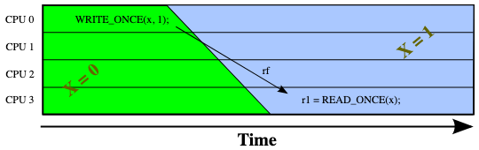
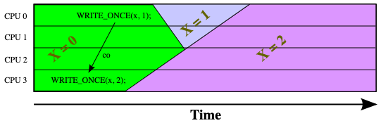
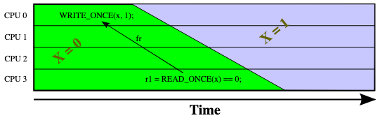

+++
Sources = [
"https://lwn.net/Articles/720550/",
"http://www0.cs.ucl.ac.uk/staff/j.alglave/papers/cav10.pdf",
"https://www.joelfernandes.org/resources/lkmm_herd7.pdf",
"https://github.com/torvalds/linux/blob/master/tools/memory-model/Documentation/explanation.txt",
"https://mirrors.edge.kernel.org/pub/linux/kernel/people/paulmck/LWNLinuxMM/fr.html",
"https://mirrors.edge.kernel.org/pub/linux/kernel/people/paulmck/LWNLinuxMM/Examples.html",
"https://mirrors.edge.kernel.org/pub/linux/kernel/people/paulmck/LWNLinuxMM/StrongModel.html",
"https://mirrors.edge.kernel.org/pub/linux/kernel/people/paulmck/LWNLinuxMM/StrongModel.html",
"http://www0.cs.ucl.ac.uk/staff/j.alglave/papers/toplas21.pdf",

]
authors = [
"Michael Shalitin",

]
math = true
date = "2025-01-11"
categories = [

]
series = [

]
title = "Base Formal"
+++


## יחסי סדר


מודלי זיכרון עוסקים בקביעת סדר, לרוב סדר זמני שבו אירועים מתרחשים, אך לא בהכרח רק בכך. לדוגמה, ניתן להתייחס גם לסדר ההוראות בקוד המקור של תוכנית. המודל SC מניח כי המעבדים מבצעים את ההוראות באותו סדר שבו הן מופיעות בקוד המקור, דבר שמדגיש את חשיבות הסדר. בנוסף לכך, הסדר ממלא תפקיד מרכזי במודלי זיכרון שונים.

רעיון מקביל לסדר הוא הרעיון של מחזורים (cycle) - סידור אירועים פוסל מחזורים, שכן לא ניתן לסדר אירועים כך שאירוע X יופיע לפני Y, אירוע Y לפני Z, ואירוע Z יופיע לפני X, שכן זה יגרום לכך ש-X יופיע לפני עצמו, מה שאינו אפשרי.

### יחסי סדר בתוכנית: po ו-po-loc

הקשר `po`, הוא הסדר שבו ההוראות מופיעות בזרם ההוראות של מעבד מסוים ונשלחות ליחידת הביצוע שלו. זהו סדר התוכנית הבסיסי שמכתיב את יחסי התלות בין ההוראות במהלך ביצוע.
אפשר לדמיין זאת כסדר שבו הצהרות מתבצעות בקוד המקור לאחר טיפול במבנים כמו branch-ים ולולאות. 

לכן, נאמר ש-X הוא po-לפני Y (נכתב `X ->po Y`) אם ההוראה X מופיעה לפני Y בזרם ההוראות של אותו מעבד.

זהו יחס שמתקיים בתוך אותו מעבד בלבד; שתי הוראות שרצות על מעבדים שונים אינן מקושרות באמצעות יחס po. בנוסף, זהו יחס מסודר מטבעו ולכן לא יכול להכיל מחזורים.

היחס po-loc הוא תת-קבוצה של po. הוא מתאר יחס בין שתי גישות לזיכרון, כאשר הראשונה מתבצעת לפני השנייה בסדר התוכנית, ושתיהן מתייחסות לאותו מיקום זיכרון (אותו משתנה) (מכאן התוספת `-loc`: יש שימוש ביחס `loc`).

### יחס rf

היחס rf מייצג את הקשר בין אירוע כתיבה לאירוע קריאה, כאשר הערך שהקריאה טוענת (load) הוא אותו הערך שנכתב על ידי הכתיבה (store). כלומר, ניתן לומר שה-load קורא מה-store. היחס מסומן בצורה הבאה: `W ->rf R`, שבה R מייצג את הקריאה שמבצעת את טעינת הערך ש-W שמר.

קיימת הבחנה בין שני סוגים של יחסים read-from:

1. קריאה פנימית (rfi): כאשר ה-load וה-store מתבצעים על אותו מעבד.
2. קריאה חיצונית (rfe): כאשר ה-load וה-store מתבצעים על מעבדים שונים.

####  אילוץ זמני של rf

קשר`rf` מעיד על אילוץ זמני (temporal constraint), בהיעדר אופטימיזציות כגון ספקולציות ערך, יש צורך שהקריאה תתרחש לאחר הכתיבה שסיפקה את ערך הקריאה (זה קורה בהנחה שהיקום הוא סיבתי וצריך שהסיבה תקדים את התוצאה).

נקודה חשובה היא שכתיבה למשתנה אינה יכולה לגרום לשינוי מידי בערך הנראה לעין. זאת נובע מכך שהמהירות של אור היא סופית ושהאטומים עצמם אינם בגודל אפס.  במקום שהשינוי יתרחש באופן מיידי, הוא יתפשט במערכת, להמחשת הרעיון בואו נבדוק את התמונה למטה כאשר הזמן מתקדם משמאל לימין:



כתוצאה מכך, כאשר קריאה ממשתנה משותף מחזירה את הערך שנשמר בכתיבה, נוצר קשר `rf` בין הכתיבה לאותה קריאה. משמעות הדבר היא שהקריאה חייבת להתבצע לאחר הכתיבה, ובכך קובע הקשר `rf` את הסדר הזמני בין האירועים הללו.

ככל שיהיו יותר קישורי `rf` בקוד שלך, תצטרך לארגן את הקוד שלך בצורה פחות מורכבת.

### קוהרנטיות ויחס סדר קוהרנטיות: co, coi ו-coe

קוהרנטיות היא עיקרון מרכזי במערכות מרובות מעבדים, המחייב שכל המעבדים יראו תצוגה עקבית של תוכן הזיכרון המשותף. במילים אחרות, יש לוודא שכל המעבדים מסכימים על סדר כתיבות למיקומים בזיכרון המשותף. עיקרון זה מחייב שסדר הכתיבות למיקום מסוים בזיכרון יוגדר בסדר גלובלי אחד, אשר מוסכם על כל המעבדים במערכת. סדר זה נקרא סדר הקוהרנטיות (coherence order), והוא חייב להיות עקבי גם עם סדר התוכנית לגישות לאותו מיקום זיכרון.


הקשר `co` מקשר בין כל פעולות הכתיבה לאותו משתנה, והוא מגדיר את הסדר שבו כל כתיבה מחליפה את הכתיבה הקודמת לה.

בפשטות, עבור כל משתנה בזיכרון (נניח x), סדר הקוהרנטיות (co) מתאר את הסדר שבו פעולות ה-store מחליפות זו את זו עבור אותו מיקום בזיכרון.
לדוגמה: פעולת הכתיבה הראשונה קובעת את הערך ההתחלתי של x ולאחר מכן, הכתיבה הבאה מחליפה את הערך הזה, ולבסוף הכתיבה האחרונה בסדר תחליף את הערך הנוכחי.

סדר הקוהרנטיות יכול להיחשב כסדר שבו פעולות ה-store מגיעות למיקום x בזיכרון, או בצורה יותר ממוקדת בחומרה, הסדר שבו הן נכתבות ל-cache line של x.

הסדר הקוהרנטי בין כל שתי פעולות כתיבה מתואר על ידי הקשר `co`. לדוגמה, אם יש שתי פעולות כתיבה `W1` ו-`W2` לאותו מיקום בזיכרון, והכתיבה `W1` התרחשה לפני `W2`, היחס מסומן  בצורה הבאה:
`W1 ->co W2`

שפירושו הוא שפעולת הכתיבה `W1` קודמת לכתיבה `W2` בסדר הקוהרנטיות, כלומר הערך שנכתב על ידי `W1` יוחלף ישירות או בעקיפין על ידי הערך שנכתב על ידי `W2`.

יש לציין שיחס הקוהרנטיות הוא טרנזיטיבי, כלומר אם כתיבה A מוחלפת בכתיבה B וכתיבה B מוחלפת בכתיבה C, אז גם כתיבה A נחשבת כקשורה לכתיבה C דרך כלל המעבר, כלומר:
$$
\begin{aligned}
W_{A}\to_{\text{co}} W_{B} \\
W_{B}\to_{\text{co}} W_{C} \\
\Downarrow \\
W_{A}\to_{\text{co}} W_{C} \\
\end{aligned}
$$

####  אילוץ זמני של co

הקשר `co` אינו מצביע על אילוץ זמני כלשהו. למעשה, קיימת אפשרות שכתיבה שהתרחשה מוקדם יותר תחליף כתיבה שהתרחשה מאוחר יותר, כפי שמדגים האיור להלן:



הערה בקשר לתמונה:
	התמונה מציגה מקרה שיכול לקהתרחש רק במערכות שבן הפרוטוקול קוהרנטיות רגוע יותר ממה שהיינו מצפים ולכן אפשרי ששני מעבדים קוראים ערכים שונים של אותו מיקום זיכרון.
	
כפי שניתן לראות באיור, הכתיבה של הערך 2 התרחשה מוקדם יותר בזמן, אך היא הצליחה לדרוס את הכתיבה המאוחרת של הערך 1. תוצאה זו מתאפשרת בשל הזמן הנדרש לערכים הכתובים להתפשט במערכת, מה שמוביל לכך שהמערכת מחליטה בשלב מאוחר יותר איזו מהכתיבות היא זו שמנצחת.

### from read (fr)

הקשר `fr` (קיצור של from-read) מתאר את הקשר שבין פעולת קריאה לפעולות כתיבה שבוצעו מאוחר מדי מכדי להשפיע על הערך שהקריאה מחזירה. כלומר, פעולות הכתיבה מתבצעות לאחר שהקריאה כבר מתבצעת, ולכן אין להן השפעה על תוצאת הקריאה. במילים אחרות הוא מתאר את המצב שבו פעולת טעינה (load) קוראת ערך שנדרס על ידי פעולת כתיבה. 

בצורה פורמלית יותר, נוכל לומר: `R ->fr W` כאשר הערך ש-`R` קורא ערך שנדרס (בעקיפין או ישירות) על ידי `W`, או ש-`R` קורא מ-store מוקדם יותר מ-`W` בסדר הקוהרנטיות.

כדי להמחיש את הרעיון, נשתמש בדוגמה בקוד דמוי מבחן לקמוס:

```c {linenos=inline}
int x = 0;

P0()
{
	int r1;

	r1 = READ_ONCE(x);
	WRITE_ONCE(x, 2);
}
```

במקרה זה, הערך שנטען מ-x יהיה 0 (בהנחה שיש קוהרנטיות cache), והוא מוחלף על ידי הערך 2 לאחר הכתיבה. כלומר, יש קישור fr בין הקריאה `READ_ONCE()` לכתיבה `WRITE_ONCE()`. אם בקוד היו פעולות כתיבה נוספות מאוחרות יותר ל-x, היו גם קישורי fr מהקריאה `READ_ONCE()` לאותן כתיבות.

בדומה ליחסים rf, rfi ו-rfe, גם יחס fr מחולק ל-fri (כאשר ה-load וה-store מתבצעים על אותו מעבד) ול-fre (כאשר הם מתבצעים על מעבדים שונים).

חשוב לציין שיחס fr נקבע כולו על בסיס יחסי rf ו-co; הוא אינו עצמאי. בהינתן אירוע קריאה `R` ואירוע כתיבה `W` לאותו מיקום בזיכרון, יהיה לנו `R ->fr W` אם ורק אם הכתיבה שממנה `R` קוראת היא קודמת (ב-co) ל-W. 

#### מאפיינים עיקריים של יחס `fr`:

- **קישור מקריאה לכתיבה:** יחס `fr` תמיד מקשר קריאה מסוימת עם כתיבה, בתנאי שזו מתבצעת מאוחר מדי מכדי להשפיע על הערך שנקרא על ידי הקריאה.
- **אותו משתנה:** יחס זה תמיד מחבר בין קריאה לכתיבה לאותו משתנה ספציפי. הוא אינו מקשר בין קריאה ממשתנה אחד לכתיבה של משתנה אחר.
- **יחס אחד-לרבים:** קריאה בודדת עשויה להיות מקושרת לכמה כתיבות מאוחרות לאותו משתנה, כל עוד הן קורות לאחר הקריאה ואין להן השפעה על הערך שנטען.
- **יתכנות יחס ריק:** ייתכן שיחס `fr` יהיה ריק (כלומר, ללא קשרים), למשל, במצב שבו כל קריאה מחזירה את הערך הסופי של המשתנה, ואין כתיבה נוספת שמשפיעה עליה.
- **אתחול אינו חלק מיחס `fr`:** כתיבה שמבצעת אתחול של משתנה אינה קשורה ליחס `fr`.
- **יחסים בין קריאות מאותו משתנה:** אם יש שתי קריאות, R1 ו-R2, מאותו משתנה, והראשונה (R1) קוראת מערך מוקדם יותר מאשר השנייה (R2), אז ל-R1 יהיה מספר רב יותר של קשרי `fr` מאשר ל-R2, מכיוון שהיא עשויה להיות מושפעת מכתיבות מוקדמות יותר (כלומר יש יותר כתיבות ש-R1 "מפספס" והם מתרחשות מאוחר מידי בזמן כי הוא בוצע לפני R2)

#### יחסים נוספים קשורים ל-`fr`:

- יחס `co`: מקשר בין כל כתיבה לכתיבות הבאות לה על אותו משתנה. אתחול נחשב ככתיבה ראשונית שמתרחשת "לפני תחילת הזמן", ולכן יש קשר `co` בין האתחול לכל כתיבה שבאה אחריו. וגם `co` לא מצביע על אילוץ זמני. במקרה של קשר `co`, לשתי הכתיבות לוקח זמן להתפשט ברחבי המערכת, והסדר שלהן נקבע לעיתים קרובות רק לאחר מעשה.

- יחס `rf`: מקשר כתיבה מסוימת לכל קריאה שטוענת את הערך שנשמר באותה כתיבה.
#### עיכוב התפשטות במערכות מסודרות חלש

יחס `fr` מגדיר את הקשר בין פעולת קריאה לכתיבות המאוחרות יותר באותו משתנה. הוא פועל על ידי חזרה לאחור לכתיבה שסיפקה את ערך הקריאה, ואז ממשיך קדימה לקשר את הקריאה לכל כתיבה מאוחרת שנעשתה לאותו משתנה.

במערכות עם עקביות חלשה, עיכוב בתפשטות המידע אחראי למה שנראה כהיפוך זמן לכאורה.

זה קורה בגלל שלכתיבה לוקח זמן להתפשט במערכת, ולכן קריאה עשויה להתבצע מאוחר יותר בזמן הגלובלי מאשר הכתיבה, אך לא מאוחר מספיק כדי להחזיר את הערך של אותה כתיבה.  למשל ייתכן שקריאה תקבל ערך מכתיבה שעתידה להתחלף על ידי כתיבה מאוחרת יותר. 

במקרה של קשר `rfe`, הקריאה לא יכולה להחזיר את הערך של כתיבה מסוימת עד שהערך הזה יתפשט לחלק במערכת שבו מתבצעת הקריאה.

דוגמה לכך ניתן לראות במבחן לקמוס:


```c {linenos=inline}
C C-FR+w+w+w+reads.litmus

{
    a=0;
}

P0(int *a)
{
    WRITE_ONCE(*a, 1);
}

P1(int *a)
{
    WRITE_ONCE(*a, 2);
}

P2(int *a)
{
    WRITE_ONCE(*a, 3);
}

P3(int *a)
{
    r1 = READ_ONCE(*a);
    r2 = READ_ONCE(*a);
    r3 = READ_ONCE(*a);
    r4 = READ_ONCE(*a);
}

exists
(3:r1=0 /\ 3:r2=1 /\ 3:r3=2 /\ 3:r4=3)
```

נניח שכל הכתיבות מתרחשות בו זמנית (למשל בזמן t=0). בגלל מגבלות פיזיות כמו מהירות האור והטבע האטומי של החומר, כתיבות שמתבצעות במקביל ב-thread-ים נפרדים לא ייראו בכל חלקי המערכת באופן מיידי. במקום זאת, ייקח זמן עד שהכתיבות יתפשטו במערכת.

- החדשות על הכתיבה הראשונה W1 מגיעות ל-P3 בזמן t=1,
- החדשות על W2 מגיעות ל-P3 ב-t=2,
- והחדשות על W3 מגיעות ב-t=3.

לכן, ייתכן שיחס $R_{3} \to_{\text{fr}} W_{3}$ ייראה כאילו "חוזר אחורה בזמן" מ-t=2 ל-t=0. אך למעשה, אין כאן שימוש במכונת זמן, אלא שזהו אפקט של עיכוב התפשטות בכתיבה.




האיור מראה ש-`fr` עשוי להצביע על קשר שנראה כאילו הוא הולך "אחורה בזמן," לא בגלל מנגנון פיזי של מכונת זמן, אלא בשל העיכובים הנובעים מההתפשטות המוגבלת של עדכוני זיכרון במערכת המחשב.

#### מקרים ספציפים של `fr`
כל קריאה שמחזירה את הערך ההתחלתי של המשתנה תהיה קשורה לכל הכתיבות שנעשו לאותו משתנה, מכיוון שהיא לא ראתה אף אחת מהכתיבות הללו.
מצד שני, קריאה שמחזירה את הערך הסופי של המשתנה לא תהיה קשורה לשום כתיבה, מכיוון שהיא כבר מתייחסת לערך המעודכן ביותר ואין כתיבות נוספות שהיא מפספסת.

#### כיצד יחס `fr` מוגדר פורמלית

במסגרת כלי כמו herd, אופרטור הרצף מבוצע באמצעות `;`.  אם יחס A מקשר בין אירועים $x \to y$ ויחס B מקשר בין $y \to z$, אז `A;B` יקשר את $x \to z$. זה מאפשר לנסח את יחס `fr` בצורה הבאה:
`fr = (rf^-1 ; co)`

משמעות של הפורמליזציה היא כי עבור כל קריאה, תחילה יש לחזור אחורה לכתיבה שסיפקה את ערך הקריאה (באמצעות `rf^-1`), ואז להמשיך קדימה לכל כתיבה מאוחרת יותר לאותו משתנה (באמצעות `co`). כך נוצר הקשר בין הקריאה לכתיבה המאוחרת ביחס `fr`.

עוד משהו מעניין שאפשר לראות שבגלל בצורה הפורמלית הוא השימוש ב-co במבנה של fr ואפשר להבין שזאת הסיבה הפורמלית ש-`fr` אינו מצביע על אילוץ זמני, וזה בגלל שהוא משתמש ב-`co`, גם שהוא בעצמו לא מצביע על אילוץ זמני.

### יחס `ext`

הקשר `ext` מקשר בין כל זוגות האירועים ששייכים ל-thread-ים שונים.

### יחס `loc`

הקשר `loc` מקשר בין כל זוגות הגישה לאותו מיקום בזיכרון. לדוגמה, כל קריאה וכתיבה לאותו משתנה יקושרו זה לזה באמצעות `loc`.

## אופרטורים

### האופרטור `&`(החיתוך)

אופרטור החיתוך `&` משמש ליצירת קשרים משולבים בין קבוצות אירועים, כלומר הוא מייצר קשר הכולל רק את הזוגות שמשותפים לשני הקשרים שהוא משלב.


### האופרטור `;` (הרצף)

האופרטור `;` יוצר רצף של יחסים בין אירועים. המשמעות היא שאם יחס `x` מכיל את הקישור $a \to b$, ויחס `y` מכיל את הקישור $b \to c$, אז היחס המתקבל מ-`(x ; y)` יכיל את הקישור $a \to c$. במילים אחרות, האופרטור מחבר בין אירועים שמקושרים דרך אירוע ביניים משותף. 

בצורה מתמטית אופרטור הרצף (`r1; r2`): מוגדר כך:

$$
\{ (x, z) \mid \exists y \, \left[ (x, y) \in r_1 \land (y, z) \in r_2 \right] \}
$$
כלומר, קישור קיים בין x ל-z אם קיים y המקשר ביניהם.

לדוגמה שהקשר `fre;coe` מחבר כל קריאה של משתנה מסוים לכתיבה מאוחרת יותר של אותו משתנה, כאשר לפחות כתיבה אחת מתבצעת על ידי thread שונה (בגלל שזה עם ext).

### האופרטור `^-1` (ההיפוך)

אופרטור ה-`^-1` מחשב את ההיפוך של יחס נתון. כלומר, הוא מחליף את כיווני הקישורים באותו יחס. אם יחס מסוים מכיל את הקישור $a \to b$, אז ההיפוך שלו יכיל את הקישור $b \to a$. לדוגמה, היחס `po^-1` יכיל את כל זוגות האירועים לפי סדר תוכנית הפוך.

### האופרטורים domain ו-range

ה-domain (תחום) של פונקציה הוא קבוצת הערכים שמותר לנו לחבר לפונקציה שלנו. קבוצה זו היא ערכי x בפונקציה כגון f(x), ה-domain מחזיר את הקלטים של היחסים (כלומר את הצד השמאלי של הזוג ביחס).

ה-range (טווח) של פונקציה הוא קבוצת הערכים שהפונקציה מחזירה. קבוצה זו היא הערכים שהפונקציה מוציאה החוצה לאחר שאנו מכניסים ערך x, ה-range מחזיר את הפלטים של היחסים (כלומר את הצד הימני של הזוג ביחס).


במקרה הזה `f(x) -> y` הפונקציה `f` מקבלת `x` (שהוא [הדומיין](https://he.wikipedia.org/wiki/%D7%AA%D7%97%D7%95%D7%9D_%D7%A9%D7%9C_%D7%A4%D7%95%D7%A0%D7%A7%D7%A6%D7%99%D7%94) של הפונקציה - כלומר קבוצת כל הקלטים), ומחזירה `y` (שהוא [הטווח](https://he.wikipedia.org/wiki/%D7%98%D7%95%D7%95%D7%97_%D7%A9%D7%9C_%D7%A4%D7%95%D7%A0%D7%A7%D7%A6%D7%99%D7%94) של הפונקציה - כלומר קבוצת כל הפלטים).

### אופרטור הסיומת `?` (רפלקסיבי)

האופרטור `?` המשמש בסיומת (postfix) לאחרי יחס x מחשב את היחס המורכב מכל זוגות האירועים שניתן לחבר באמצעות שרשרת של קישורים מ-x באורך 0 או 1. האופרטור פועל כמו `?` ב-regex.

אפשר לייצג את האופרטור גם בצורה אחרת: `id |x`

במילים אחרות הסיומת `?` מצביעה על כך שהקישור הוא אופציונלי, כלומר במקרה של הביטוי `x?` עשוי להיות שווה ל-x.

### אופרטור הסיומת`+` (טרנזיטיבי)
האופרטור `+`  המשמש בסיומת (postfix) לאחרי יחס x מחשב את היחס המורכב מכל זוגות האירועים שניתן לחבר באמצעות שרשרת קישורים מ-x באורך 1 או יותר; האופרטור פועל כמו `+` ב-regex.

אפשר לייצג את האופרטור גם בצורה אחרת:
`x|(x;x)|(x;x;x)|...`


### אופרטור הסיומת`*` (רפלקסיבי-טרנזיטיבי)
האופרטור `*` המשמש בסיומת (postfix) לאחרי יחס x מחשב את היחס המורכב מכל זוגות האירועים שניתן לחבר באמצעות שרשרת קישורים מ-x באורך 0 או יותר. האופרטור פועל כמו `*` ב-regex.

אפשר לייצג את האופרטור גם בצורה אחרת:
`id|x|(x;x)|(x;x;x)|...`

במילים אחרות הסיומת `*` משמשת לציון מספר שרירותי של קישורים מהסוג שצוין.


### האופרטור `[]` (הזהות)

האופרטור `[x]` מחשב את יחס הזהות המוגבלת לאירועים ביחס x.

#### האופרטור `[]` כ-syntactic sugar

האופרטור `[]` בשפת cat מקבל יחס ולרוב משמש עם אופרטור הרצף `;`
והוא משמש לרוב בצורה הבאה לדוגמה:

 `r ; [W]`
 
הוא מגביל את הטווח (range - כלומר הקצה הימיני) של היחס `r` להיות בקבוצה `W` (כלומר להיות כתיבה)
 
במילים אחרות האופרטור `[x]` אומר שהאיבר הראשון ביחס `y` צריך להיות מהסוג של `x` לדוגמה כש-`x` הוא `R` ו-`y` הוא `addr`:
`addr ; [R]

זה אומר שביחס `addr` (תלות כתובת) האיבר בקצה הימני יהיה `R` (קריאה).
$$
\begin{aligned}
r = x \to y \\
r \ ; \ [R] \\
\Downarrow \\
x \to y ; \ [R] \\
y \in [R]
\end{aligned}
$$


הערה:
	למרות ש-`R` הוא אירוע קריאה כאן משתמשים בו כקבוצת כל הקריאות ואז כשמפעילים את האופרטור `[]` אז מתקבלת התוצאה הרצויה.


### הפונקציה `fencerel`
האופרטור `fencerel(x)` מחשב את היחס המורכב מכל זוגות האירועים כאשר הראשון מקדים (בסדר התוכנית) לאירוע בקבוצה x והשני אחריו.

אפשר לייצג את האופרטור גם בצורה אחרת:
`(po & (_ * x)) ; po`

לדוגמה אם יש:
```c {linenos=inline}
P0(int *x, int *y)
{
	r1 = READ_ONCE(*x);
	smp_rmb();
	r2 = READ_ONCE(*y);
	smp_mb();
	WRITE_ONCE(*z, r3);
}
```

במקרה של `fencerel(Rmb)` אז יתקבל $R_{1} \to R_{2}$

ובמקרה של `fencerel(Mb)` אז יתקבלו שלושת היחסים הבאים:
- $R_{1} \to W$
- $R_{2} \to W$
- $RMB \to W$


---


