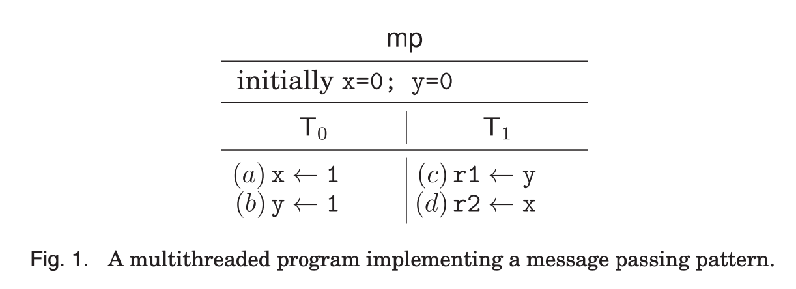
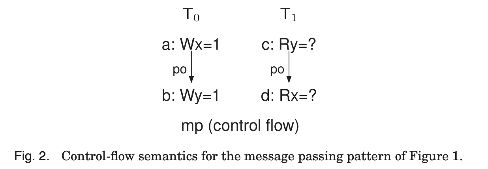
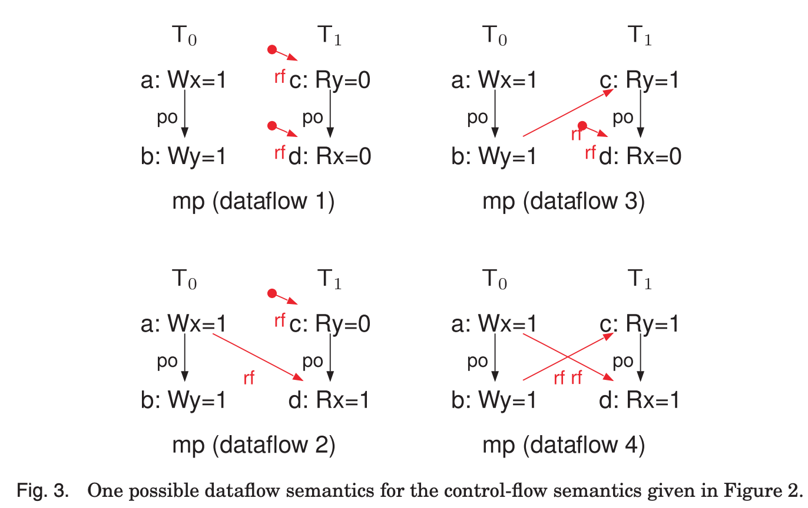
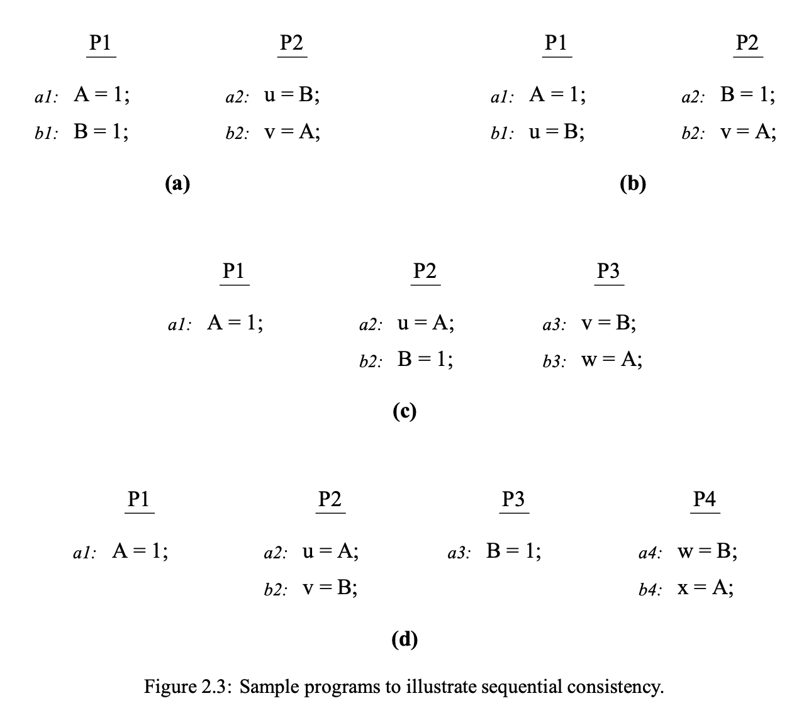

+++
Sources = [
"https://lwn.net/Articles/718628/",
"https://pages.cs.wisc.edu/~markhill/papers/primer2020_2nd_edition.pdf",
"https://www.cs.tau.ac.il/~orilahav/papers/ecoop2017-arm.pdf",
"https://www.cl.cam.ac.uk/~pes20/armv8-mca/armv8-mca-draft.pdf",
"https://www.cl.cam.ac.uk/~pes20/ppc-supplemental/pldi105-sarkar.pdf",
"https://inria.hal.science/hal-02509910/document",
"https://inria.hal.science/hal-01081364/document",
"http://infolab.stanford.edu/pub/cstr/reports/csl/tr/95/685/CSL-TR-95-685.pdf",
"https://en.wikipedia.org/wiki/Consistency_model",

]
authors = [
"Michael Shalitin",

]
math = true
date = "2025-01-11"
categories = [

]
series = [

]
title = "Models"
+++
## מבוא

מחשבים, בהיותם אוטומטים דטרמיניסטיים, בדרך כלל יניבו התנהגות צפויה ואחידה, ולכן רוב האנשים יחשבו שגזירת התוצאה היא אחת בלבד. עבור מערכות חד-מעבדים, רוב הזמן הם יהיו נכונים בהנחה הזו. עם זאת, במערכות מרובות מעבדים, התמונה משתנה, והן יכולות להוביל למגוון רחב הרבה יותר של התנהגויות. זאת בשל שינויים עדינים בתזמון היחסי של המעבדים השונים במערכת, כמו גם השפעת האותות המועברים ביניהם, ה-cache-ים והזיכרון הראשי.

מודלים של זיכרון מנסים להביא סדר לתמונה הזו, וזאת בעיקר על ידי תיאור מדויק של אילו תוצאות אפשריות עשויות להתרחש במערכת מרובת מעבדים SMP שמריצה תוכנית מסוימת. מטרת המודל היא להבהיר את התוצאה הצפויה מהפעולות המבוצעות, ולהגביל את האפשרויות באופן שיקל על ניתוח התנהגות המערכת.

מודל עקביות זיכרון, הידוע גם כמודל זיכרון, הוא מערכת כללים המתארת את האופן שבו תוכניות מרובות thread-ים צריכות להתנהג כאשר הן ניגשות לזיכרון משותף. מודל זה קובע אילו פעולות של קריאה וכתיבה בזיכרון מותרות להתרחש ובאיזה סדר, ומכתיב אילו תוצאות נחשבות חוקיות בתנאים שונים של ריבוי thread-ים.

באופן כללי, מודל עקביות זיכרון מספק סט של כללים שמגדיר את סדר ביצוע הפעולות בזיכרון. כך הוא מחלק את ההרצות של התוכנית לאלה שעומדות בתנאי עקביות הזיכרון ולכאלה שאינן עומדות בהם. פעולות התואמות את כללי העקביות מוגדרות כביצועים עקביים, בעוד שביצועים שאינם עומדים בכללים האלו נחשבות כלא עקביים.

מודל זיכרון מהווה סוג של חוזה בין התוכנה (המשתמש) לבין החומרה (המיישמת), אשר מגדיר את ההתנהגות הצפויה של מערכת הזיכרון. כאשר מדובר בתוכנית multithreaded המכילה רצפים של פעולות load ו-store עבור כל thread, מודל הזיכרון מציין אילו ערכים כל פעולה של load אמורה להחזיר. התנהגות מודל עקביות הזיכרון מתוארת על ידי רצף פעולות שניתן לצפות בהן, כולל stores, loads, והערכים המוחזרים, אשר מייצגים את התנהגות המערכת בהתאם למודל.

למרות שמודל עקביות זיכרון עשוי לא להיות נוגע במיוחד למתכנתים ב-high level המשתמשים בספריות סנכרון, הוא חשוב מאוד למתכנתים ב-low level. מתכנתים אלו, כגון כותבי קומפיילרים שמיישמים סנכרון ברמת שפה, כותבי קרנל, או מתכנתי יישומים שמפתחים מבני נתונים lockless, זקוקים להבנה מעמיקה של מודל עקביות הזיכרון. הם צריכים לדעת אילו התנהגויות ניתנות לצפייה במודל כדי להבטיח שהתנהגות הסנכרון במערכת שהם מפתחים תהיה בהתאם לדרישותיהם.
### מודל האופרטיבי

המודל האופרטיבי מתמקד בתיאור ובהגדרת גבולות ההתנהגות של זיכרון רגוע, בצורה שמחקה את האופן שבו התנהגות כזו מופיעה במימושי חומרה אמיתיים, בסגנון מיקרו-ארכיטקטוני מופשט.

מודל אופרטיבי, במהותו, ממדל תכונות חומרה רבות ברמה נמוכה שמביאות להשפעות ישירות על ביצוע תוכניות במקביל. תכונות אלו כוללות את טופולוגיית החומרה, את הפיזור הלא אחיד של הודעות בין המעבדים השונים, את הסידור מחדש של הודעות, את הביצוע של פקודות מחוץ לסדר ברמת המעבד, את חיזוי ה-branch-ים, את ההחלטות המקומיות בנוגע לקוהרנטיות של כתיבות שהוחלפו, ועוד. כל אחד מהם משפיע באופן משמעותי על אופן התפקוד של התוכנית במערכת מקבילית, ודורש ייצוג מדויק במודל כדי לשקף את ההתנהגות האמיתית של המערכת.

ההתנהגות של זיכרון רגוע במודל נועדה לשקף את התהליכים והאופטימיזציות המתקיימים ברמת החומרה, כמו ביצוע מחוץ לסדר וביצוע ספקולטיבי, שמובילים להתנהגויות הזיכרון הלא-עקביות שנצפות בפועל. המודל גמיש – ייתכנו מימושים חומרתיים שאינם מממשים את כל ההיבטים בצורה אגרסיבית או שממשים אותם בצורה אגרסיבית יותר, כל עוד לא חושפים למתכנת התנהגויות שנוגדות את הגדרות המודל.

מודלים אופרטיביים קרובים יותר למימושים החומרתיים עצמם, ולכן הם אינטואיטיביים יותר עבור ארכיטקטים ומפתחים. כך, ניתן לטעון שהמודל האופרטיבי הוא לעיתים קל יותר להדמיה כאשר רוצים לתכנן יישומים בצורה מפורטת, מכיוון שהוא משקף את הפעולות שמתבצעות במימוש החומרה.

המודל לא נדרש להתאים באופן מדויק למבנה הפנימי של החומרה, כלומר הוא לא צריך לשקף את המימושים הפנימיים של המערכת. המטרה העיקרית של המודל היא לתפוס ולהסביר את ההתנהגות החיצונית של יישומים סבירים, ולא את אופן המימוש הפנימי של החומרה עצמה.

עם זאת, המודל כן צריך להיות מקושר בצורה ברורה להיבטי ההפשטה של המיקרו-ארכיטקטורה. זאת אומרת, המודל צריך להיות מסוגל להסביר את ההתנהגות של המערכת בצורה שתהיה תואמת את הדוגמאות המעשיות של המימושים, כך שהתיאור התיאורטי יתאם עם התוצאות בפועל מהמערכת.

### מודל האקסיומטי

באופן כללי, מודלים אקסיומטיים הם הצהרתיים, כלומר הם מתארים אילו התנהגויות מותרות מבלי לפרט כיצד המערכת מיושמת בפועל. המודלים האקסיומטיים לרוב יותר מופשטים ומגיעים לידי ביטוי בקלות רבה יותר במתמטיקה, מה שמאפשר חקירה מהירה יותר של ההתנהגויות המותרות.

#### מבוא למודלים אקסיומטיים

מודלים אקסיומטיים, המשמשים לניתוח התנהגות של תוכניות מרובות thread-ים בסביבות ריבוי ליבות, מוגדרים בשלושה שלבים עיקריים:

1. הגדרת סמנטיקה של ההוראות: בשלב זה, כל הוראה בתוכנית מתורגמת למבנים מתמטיים מוגדרים, המייצגים את התנהגותה מבחינת תהליכי בקרת זרימה.

2. בניית מועמדים לביצוע: לאחר הגדרת סמנטיקת בקרת הזרימה, נוצרת קבוצת מועמדים לביצוע (candidate executions), המייצגת את כל האפשרויות בהן נתוני התוכנית יכולים לזרום בין ה-thread-ים השונים.

3. אילוצי תקינות על הביצועים: בשלב האחרון, מוגדרים אילוצים המכתיבים אילו מבין המועמדים לביצוע עומדים בדרישות המודל ולכן נחשבים לתקפים, ואילו לא. כך, נשמרת עקביות בין פעולות התוכנית לבין כללי המודל האקסיומטי.

מועמד לביצוע הוא ייצוג מופשט של ביצוע קונקרטי של תוכנית, המתאר את ההתנהלות של התוכנית במונחים של אירועים ויחסים בין האירועים הללו. כלומר, מועמד לביצוע מתאר את סדר התרחשות האירועים בתוכנית ואת הקשרים שבין פעולות שונות בה, כגון גישות לזיכרון, קריאות וכתיבות, ומחסומים. המודל הזה מוצג באמצעות herd, שמספק את הכלים והמבנים המאפשרים לנתח את ההתנהגות של התוכנית לפי קריטריונים אלו.
#### דוגמה: תוכנית מרובת thread-ים

נבדוק תוכנית מרובת thread-ים המתוארת באיור 1, בה משתתפים שני thread-ים, T0 ו-T1. ה-thread-ים האלו מתקשרים באמצעות שני משתנים בזיכרון המשותף, x ו-y, כאשר שניהם מתחילים בערך 0.

- ב-T0: מתבצעת כתיבה של הערך 1 למשתנה x, ולאחר מכן כתיבה של הערך 1 למשתנה y, בהתאם לסדר התוכנית.
- ב-T1: מתבצעת קריאה מהמשתנה y אל הרגיסטר r1, ואחריה קריאה מהמשתנה x אל הרגיסטר r2, גם כאן בהתאם לסדר התוכנית.

המשתנים x ו-y משותפים לשני ה-thread-ים, כך שכל שינוי בהם עשוי להיות נגיש לכל thread. לעומת זאת, הרגיסטרים, כדוגמת r1 ו-r2 ב-thread T1, הם פרטיים ל-thread המחזיק בהם ואינם נגישים ל-thread-ים אחרים.

הסמנטיקה של זרימת הבקרה מתייחסת לתרגום של הוראות בתוכנית לאירועים שמייצגים פעולות, כגון גישה לזיכרון או לרגיסטרים, החלטות ב-branch-ים, או שימוש במחסומי זיכרון. התהליך הזה מאפשר הבנה של השפעת כל הוראה על המערכת ובחינת אופן השפעת זרימת ההוראות על שיתוף מידע בין תהליכים.

כדי להמחיש זאת, נבחן את איור 2. הוא מציג סמנטיקה אפשרית לזרימת הבקרה של התוכנית המתוארת באיור 1. כל הוראת store (לדוגמה, הפעולה `x ← 1` ב-T0) מתורגמת לאירוע כתיבה, שמפרט את מיקום הזיכרון (x במקרה זה) ואת הערך הנכתב (במקרה זה 1), ומיוצג כ- `Wx=1`. לעומת זאת, כל הוראת load (למשל, `r1 ← y` ב-T1) מתורגמת לאירוע קריאה, שמציין את מיקום הזיכרון (y במקרה זה) ואת הערך הלא מוגדר בשלב זה (מיוצג כ- `Ry=?`), שכן הערך שייקרא תלוי באירועים שיתרחשו.

בנוסף לאירועים הללו, אנו כוללים גם אירועי כתיבה ראשוניים `Wx=0` ו- `Wy=0`, שמייצגים את המצב ההתחלתי של המשתנים x ו-y.

סמנטיקה של ההוראות כוללת גם הגדרת יחסים בין האירועים, אשר מייצגים את סדר התוכנית בתוך thread ואת התלות ביניהם (כגון תלות בכתובת, תלות בנתונים ותלות בקרה), שנובעות מגישה לזיכרון והמבוססות על חישובי ערכים ברגיסטרים.

לכן, באיור 3 אנו מציגים את יחס סדר התוכנית (po), שמעלה את סדר ההוראות בתוכנית לרמת האירועים. לדוגמה, שני פעולות store ב-T0 שבאיור 1, מבוצעות בסדר התוכנית ולכן האירועים התואמים שלהם, `Wx=1` ו-`Wy=1`, מחוברים בקשר `po` באיור 2.

בנקודה זו, כאשר יש לנו תוכנית כמו באיור 1 וגרפים של אירועים כמו באיור 2, כל גרף מציג קבוצת אירועים, המייצגים פעולות על זיכרון ורגיסטרים, ומספק את סדר התוכנית בין אירועים אלה, הכולל גם החלטות מסועפות ותלות שנגזרות מהן.

לאחר קבלת תוכנית כמו זו המופיעה באיור 1, יש לנו גרף אירועים המוגדר על פי סמנטיקת זרימת הבקרה (כפי שמוצג באיור 2), ויחסי קריאה וקוהרנטיות המתארים את התקשורת האפשרית בין ה-thread-ים. באיור 3, לדוגמה, לא מופיע סדר קוהרנטיות מאחר ויש רק כתיבה אחת לכל מיקום בזיכרון.

כדאי לציין שעבור סמנטיקה מסוימת של זרימת בקרה, יכולים להתקיים מספר ביצועים אפשריים עבור סמנטיקת זרימת הנתונים. לדוגמה, אם היו מספר כתיבות עם ערך 1 עבור x בדוגמה שלנו, אז היו קיימים שני מקורות אפשריים עבור הקריאה ל-x ב-T1.

מועמד לביצוע הוא אובייקט המורכב מאוסף של אירועים הכוללים את סדר התוכנית, תלות, יחסי קריאה מתוך וקוהרנטיות, כפי שניתן לראות באיור 3. עבור כל תוכנית, יכולים להתקיים מספר מועמדים לביצוע.

עבור כל מועמד לביצוע, מפרט האילוצים במודל מכריע האם מועמד לביצוע זה נחשב תקף או לא. מסורתית, מפרטים אלה מתוארים במונחים של תנאים כמו איסור על מחזוריות או איסור על רפלקסיביות של שילובים מסוימים של יחסים בין האירועים שהוגדרו במועמד לביצוע. המשמעות היא שהמודל יפסול מועמד לביצוע אם הוא מכיל מחזור ביחס כלשהו שמוגדר במפרט האילוצים.

המודל האקסיומטי מגדיר אילו מועמדים לביצוע של התוכנית נחשבים לתקפים. כל מועמד לביצוע מורכב מגרף אירועים של פעולות גישה לזיכרון ומחסומים, המקושרים באמצעות יחסי סדר תוכנית, תלות, קוהרנטיות ואטומיות. את המודל האקסיומטי ניתן לבטא באמצעות כלים כמו herd, שמסייעים לנתח את הביצועים האפשריים בהתאם להגדרות אלו.
### המודל האקסיומטי והמודל האופרטיבי

ההבדל העיקרי בין שני המודלים הוא ברמת הפירוט שלהם: במודל האקסיומטי ישנו אירוע יחיד עבור כל פעולת גישה לזיכרון, ואילו במודל האופרטיבי כל הוראה מתפרקת למספר מעברים פנימיים, כמו פעולות שליפה, פענוח, קריאה וכתיבה של ערכים לרגיסטרים. לדוגמה, עבור פעולת load מתקיימים מספר שלבים, בהם השלב שבו הקריאה מסופקת (מהזיכרון או בהעברה פנימית) והשלב הסופי שבו הפעולה מסתיימת ואינה ניתנת לביצוע חוזר.

בנוסף, המודל האקסיומטי מבוסס על יחסי תלות בסיסיים כגון תלות בכתובת, תלות בנתונים ותלות בקרה, שמקודדים בכלי herd. במודל האופרטיבי, לעומת זאת, תלות זו נגזרת מסמנטיקה מפורטת של הוראות ומאופן ניהול פעולות גישה לרגיסטרים עבור כל thread.

## מודלי זיכרון

### SC - Sequential Consistency

מערכת עם ריבוי מעבדים נחשבת לעקבית ברצף אם תוצאת הביצוע שלה תואמת כאילו כל הפעולות שבוצעו על ידי המעבדים השונים היו מתבצעות בסדר רציף כלשהו, כך שכל פעולה שבוצעה על ידי מעבד בודד ממוקמת ברצף זה בסדר שהוגדר על ידי התוכנית של המעבד. כלומר, כל פעולות הזיכרון והאינטרקציות ביניהן צריכות להיראות כאילו התרחשו בסדר מוגדר שמכבד את סדר הפעולות של כל מעבד בנפרד.

תכונה מרכזית בהגדרה של עקביות רציפה היא שהסדר שבו התוצאות מוצגות לא חייב להיות תואם ישירות לסדר שבו הפעולות בוצעו בפועל במערכת. במקום זאת, מדובר בסדר שבו הפעולות "נראות" על ידי כל המעבדים במערכת, כלומר, לא בהכרח הסדר הפיזי שבוצע על ידי המעבד.

שקול את המקרה בקטע התוכנית שבאיור 2.3(א). במערכת מסוימת, הפעולות מבוצעות בפועל בסדר (b1, a1, b2, a2) עם תוצאה `u=1` ו-`v=1`. למרות שהסדר שבו התרחשו הפעולות מפר את סדר התוכנית עבור שני המעבדים, הביצוע נחשב לעקבי ברצף, משום שהתוצאה הסופית תואמת את הסדר (a1, b1, a2, b2), שהוא הסדר התוכנית המתואם.

מודל SC מציין כי המערכת חייבת להיראות כך שכל פעולות ה-load וה-store שביצעו ה-thread-ים לכל מיקומי הזיכרון יבוצעו בסדר גלובלי שמכבד את סדר התוכנית של כל thread. זאת אומרת, כל פעולת load תציג את הערך של ה-store האחרון שבוצע בכל הסדרים.

הגדרה של קוהרנטיות המקבילה להגדרה של SC היא שמערכת קוהרנטית חייבת להיראות כך שכל ה-load וה-store של ה-thread-ים לכל מיקום בזיכרון יתבצעו בסדר גלובלי שמכבד את סדר התוכנית של כל thread.

ההבחנה החשובה כאן היא בין קוהרנטיות לעקביות: קוהרנטיות מתייחסת למיקום זיכרון ספציפי, בעוד שעקביות מתייחסת לסדר הגלובלי של כל פעולות הזיכרון במערכת כולה.

מודל SC חשוב משום שהוא מייצג את מה שמתכנתים רבים מצפים ממנו במערכות זיכרון משותף, והוא מספק את הבסיס להבנת מודלים חלשים יותר של עקביות זיכרון, כלומר מודלים רגועים או פחות מחמירים.

ב-SC, סדר הזיכרון מכבד את סדר התוכנית של כל ליבה במערכת. לעומת זאת, מודלים של עקביות אחרים עשויים לא לאפשר לסדר פעולות הזיכרון לעקוב תמיד אחרי סדר התוכנית של כל ליבה, מה שיכול להוביל לסטיות בהתנהגות הזיכרון.

סדר תוכנית הוא סדר לוגי הכולל את פעולות הזיכרון של כל ליבה, ומייצג את הסדר שבו כל ליבה מבצעת פעולות זיכרון לפי התוכנית שלה. מצד שני, סדר הזיכרון הגלובלי הוא הסדר הכולל של פעולות הזיכרון מכל הליבות במערכת.

במודל SC, כתיבה למשתנה לא בהכרח חייבת להיות מיידית, אך כתיבה למשתנים על ידי מעבדים שונים חייבת להיראות באותו סדר על ידי כל המעבדים במערכת. מודל זה מתקיים אם התוצאה של ביצוע כל פעולה במערכת נראית כאילו כל פעולות הקריאה והכתיבה של כל המעבדים במערכת בוצעו בסדר רציף אחד, והפעולות של כל מעבד מופיעות בסדר שמתואם לתוכנית שלו.

ב-SC, אין מושג של זמן או פעולות כתיבה אחרונות. כל המעבדים יכולים לראות את פעולות הכתיבה של שאר המעבדים במערכת, אך כל מעבד יכול רק לראות את פעולות הקריאה שהוא עצמו ביצע. על מנת לשמור על סדר ביצוע רציף בין המעבדים, כל הפעולות חייבות להיראות כמתבצעות באופן מיידי או אטומי ביחס לכל מעבד אחר במערכת.

פעולות אלו נדרשות להיראות כמתבצעות בסדר רציף אבל לא צריך שזה יתבצע באופן מיידי, שכן פיזית בלתי אפשרי לשלוח מידע באופן מיידי בין כל המעבדים.

במערכות שאין בהן cache או מערכות cache עם רשתות מקושרות לא מיידיות, יכול להיות פער בזמני העברת המידע בין המעבדים, מה שעלול לגרום לאי-עקביות בעקביות הרציפה. נתיבי העברת המידע איטיים עשויים לגרום לכך שמעבדים שונים יקבלו את המידע בזמן שונה, ובכך לשבור את העקביות הרציפה.

#### יכולת ליניאריזציה

יכולת ליניאריזציה, הידועה גם כעקביות אטומית או זיכרון אטומי, מתארת מצב שבו מערכת שמירה על עקביות רציפה מוגבלת בזמן. במודל זה, לכל פעולה יש זמן התחלה וזמן סיום, והביצוע נחשב לליניארי אם כל פעולה מתבצעת בסדר שניתן לסדר אותו בצורה ליניארית. כלומר, כל פעולה מקבלת נקודת ליניאריזציה שהיא נקודה בזמן בין זמן התחלתה לזמן סיומה, כאשר כל הפעולות נשמרות בעקביות הרציפה ביחס לאותו סדר ליניארי.

עם זאת, אימות עקביות רציפה באמצעות בדיקת מודל אינו נחשב לבעיה שניתן להכריע באופן כללי. זה נכון גם עבור פרוטוקולי קוהרנטיות cache במצבים סופיים, כלומר, אין דרך קלה או אוניברסלית לאמת את העקביות הרציפה של המערכת באופן אוטומטי.

מודל SC נשמע אטרקטיבי משום שהוא מבטיח עקביות ברורה ופשוטה בין כל המעבדים. עם זאת, במציאות, יישום מודל SC הוא יקר מאוד מבחינה ביצועית, ולכן אף לא מעבד מיינסטרים לא מספק את המודל הזה כברירת מחדל במערכות המודרניות.

### TSO - Total Store Order
#### רעיון בסיסי של TSO/X86

ארכיטקטורת x86 וויתרה על מודל SC ועברה למודל עקביות זיכרון חלופי שנקרא TSO, שמאפשר שימוש ב-store-buffer מסוג FIFO בכל ליבה.

המודל של SC דורש שכל ליבה תשמור את סדר התוכנית עבור כל ה-loads וה-stores, תוך שמירה על סדר פעולות מדויק עבור ארבעת השילובים האפשריים של פעולות עוקבות:

1. Load -> Load
2. Load -> Store
3. Store -> Store
4. Store -> Load

מודל TSO שומר על שלושת האילוצים הראשונים, אך לא על האילוץ של Store -> Load, מה שמפשט את המערכת. למרות שהשמטה זו לא חשובה עבור רוב התוכניות, היא מייצרת גמישות שמפחיתה את הדרישות מבחינת הסדר בין פעולות הזיכרון.

בנוסף, האילוץ השלישי מציין שה-store-buffer חייב לפעול לפי סדר FIFO, (ולא למשל לאפשר התלכדות של stores), כדי לשמור על סדר פעולות ה-store-store.

#### מחסומי זיכרון

במודל TSO, כל יחס בין פעולות תורם לסדר ההפצה של פעולות הזיכרון, אך יש יוצא מן הכלל עבור צמדי פעולות store-load בסדר התוכנית. במקרה זה, על סדר התוכנית להישמר באופן תקני ויש להשתמש במחסום מתאים (למשל mfence ב-x86) כדי לקבוע את הסדר בין הכתיבה לקריאה, במיוחד עבור צמדים אלה.
### PSO - Processor Store Order

הרעיון של עקביות מעבד (Processor Consistency - PC) מתאר מצב שבו פעולות הכתיבה של ליבה מסוימת נצפות על ידי ליבות אחרות בסדר שבו הן בוצעו, אך לא בהכרח באותו רגע זמן – כלומר, כל ליבה עשויה להבחין בעדכונים בזמנים שונים, אך הסדר נשמר.

במודלים כמו TSO ו-x86-TSO, מדובר במקרים מיוחדים של עקביות מעבד, שבהם קיימת תכונה נוספת: כל ליבה רואה את פעולות הכתיבה שהיא מבצעת מיד, כלומר כל עדכון שהיא מבצעת זמין עבורה באופן מיידי. בנוסף, כאשר ליבה אחת מבחינה בעדכון של ליבה אחרת, גם כל שאר הליבות מבחינות בו באותו הסדר, מה שמבטיח עקביות בסדר החשיפה של הכתיבה לכל הליבות האחרות.

### מודל relaxed

העיקרון המרכזי במודלים של זיכרון רגוע הוא לגרום לאילוצים של המודל עקביות רציפה להיות יותר גמישים. זאת כדי לאפשר יותר אופטימיזציות, כמו חפיפת פעולות זיכרון וסידור מחדש שלהן, שמסייעות בשיפור ביצועי המערכת.

בעוד שעקביות רציפה דורשת לשמור על האשליה שסדר התוכנית והאטומיות נשמרים עבור כל פעולות הזיכרון, מודלים של זיכרון רגוע מאפשרים במקרים מסוימים לבצע פעולות מחוץ לסדר התוכנית או בצורה לא אטומית. מידת ההרפיה הזו, כלומר עד כמה סדר התוכנית ואילוצי האטומיות נחלשים, משתנה בין המודלים השונים – כאשר כל מודל מכתיב תנאים ומגבלות אחרים על אופן ההרפיה.
