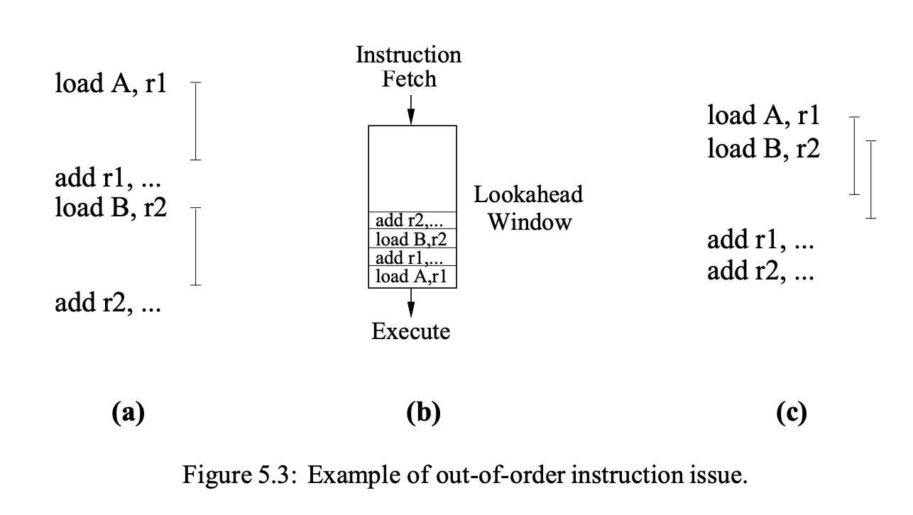
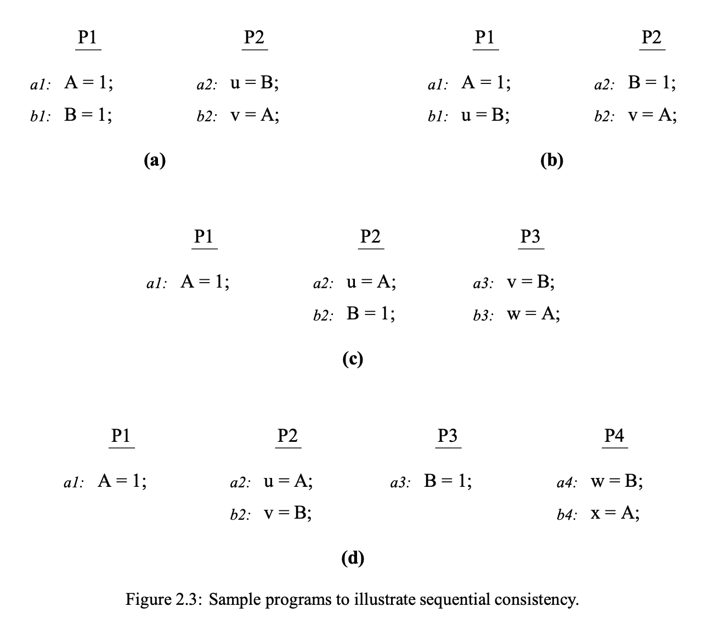
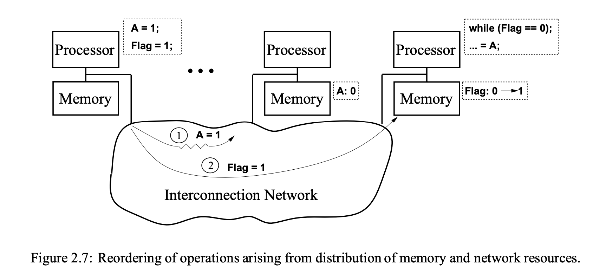

+++
Sources = [
"https://mirrors.edge.kernel.org/pub/linux/kernel/people/paulmck/LWNLinuxMM/StrongModel.html",
"https://en.wikipedia.org/wiki/Memory_disambiguation",
"https://en.wikipedia.org/wiki/Register_renaming",
"http://infolab.stanford.edu/pub/cstr/reports/csl/tr/95/685/CSL-TR-95-685.pdf",
"https://en.wikipedia.org/wiki/Out-of-order_execution",
"https://www.amd.com/content/dam/amd/en/documents/processor-tech-docs/programmer-references/24593.pdf",

]
authors = [
"Michael Shalitin",

]
math = true
date = "2025-01-11"
categories = [

]
series = [

]
title = "Ordering"
+++

## מבוא

במעבדים מודרניים ישנן הוראות רבות שלא ניתן להשלים מיידית, מאחר והן דורשות זמן לביצוע (מספר מחזורי שעון). 

במצב זה, ביצוע in-order משמעו שהמעבד ימתין בכל פעם שהוראה דורשת נתונים חסרים או שהיא אורכת מספר מחזורים לביצוע, מה שמוביל לעיכובים (stalls) בתהליך העיבוד.

לעומת זאת, בביצוע out-of-order, נעשה שימוש בטכניקות מתקדמות למעקב אחר נתונים. כאשר הוראה מסוימת אינה יכולה להתבצע בשל חוסר בנתונים, המעבד לא נכנס למצב של stall, אלא מריץ הוראות אחרות, כל עוד אין תלות ישירה בינן לבין ההוראות שטרם הושלמו. כך המעבד מנצל ביעילות את זמנו הפנוי וממשיך לעבד הוראות שאינן דורשות המתנה לנתונים.
## מעבדים in-order לעומת out-of-order

במעבדים מודרניים, פעולות זיכרון עשויות להסתיים מחוץ לסדר התוכנית המקורי בגלל אופטימיזציות שונות שמטרתן לחפוף בין ביצועי פעולות. 

היכולת לחפוף פעולות זיכרון עם פעולות אחרות או חישובים מאותו thread מתחילה ברמת המעבד עצמו. כדי להסתיר את זמני ההשהיה הנגרמים מגישה לזיכרון, המעבד נדרש להמשיך להריץ פעולות נוספות, גם כאשר חלק מהפעולות עדיין ממתינות להשלמתן. היכולת הזו להמשיך ולהנפיק הוראות נוספות תלויה בעיקר בשיטת תזמון ההוראות שהמעבד משתמש בה.

במעבדים עם הנפקת in-order, המכונים גם מתוזמנים סטטית (statically scheduled), המעבד בודק האם ישנן תלות בנתונים או structural hazards כבר בשלב הפענוח. אם מתגלה hazard כזה, מתן ההוראה נדחה עד לפתרון ה-hazard, מה שמוביל לביצוע הוראות בסדר התוכנית. תלות בנתונים מתרחשת כאשר נתוני המקור להוראה עדיין לא זמינים (data hazards), ואילו structural hazards מתרחשות כאשר משאבים כגון יחידות חישוב או buffer-ים תפוסים.

לעומת זאת, במעבדים עם הנפקת out-of-order, המכונים מתוזמנים דינמית (dynamically scheduled), ישנה הפרדה בין שלב פענוח הפקודה לבין שלב ההנפקה והביצוע שלה. המעבד מבצע את האחריות לאיתור תלות בנתונים ו-structural hazards ברמת יחידת הביצוע, ומאפשר פענוח והנפקה של הוראות נוספות גם אם הוראות קודמות עדיין מתבצעות. כך, המעבד ממשיך לבצע הוראות אחרות בזמן שהוראות קודמות ממתינות לפתרון ה-hazards.

אמנם מעבדי out-of-order הם מורכבים יותר משמעותית ממעבדי in-order, אך היתרון שלהם הוא יכולתם לשפר את ביצועי המעבד באמצעות ניצול טוב יותר של משאבים, והם כבר סטנדרט בדורות חדשים של מעבדים מסחריים.

### מעבדים In-Order

במעבדים מהדור הקודם, תהליך עיבוד ההוראות כולל מחזור הוראות המורכב לרוב מהשלבים הבאים:

1. **שליפת ההוראות**: ההוראות נשלפות מהזיכרון.

2. **בדיקת זמינות האופרנדים**: אם האופרנדים הנדרשים להוראה זמינים ברגיסטרים, ההוראה מועברת ליחידה הפונקציונלית המתאימה לביצוע. אם אופרנד אחד או יותר אינם זמינים בשלב זה (כאשר יש צורך לשלוף אותם מהזיכרון), המעבד ייכנס למצב המתנה עד שהם יהיו זמינים.

3. **ביצוע ההוראה**: לאחר שהאופרנדים זמינים, היחידה הפונקציונלית המבצעת את ההוראה משיגה את הנתונים ומבצעת את הפעולה הנדרשת.

4. **כתיבת התוצאות**: בסיום הביצוע, היחידה הפונקציונלית כותבת את התוצאות חזרה לקובץ הרגיסטרים של המעבד.

### מעבדי Out-of-Order

המעבדים המודרניים המיישמים את פרדיגמת הביצוע out-of-order מפצלים את תהליך עיבוד ההוראות למספר שלבים עיקריים:

1. המעבד שולף את ההוראות מהזיכרון

2. פענוח ההוראות

3. ביצוע renaming

4. ההוראות מועברות ל-instruction buffer.

5. ההוראה תישאר ב-buffer עד שהאופרנדים שלה יהיו זמינים. תהליך זה מאפשר להוראות לצאת מה-buffer גם אם הן מגיעות לאחר הוראות קודמות.

6. כאשר האופרנדים זמינים, ההוראה מועברת ליחידה הפונקציונלית המתאימה, שם היא מבוצעת.

7. לאחר הביצוע, התוצאות נשמרות בתור עד שהן יהיו מוכנות לכתיבה חזרה.

8. רק לאחר שכל ההוראות הקודמות בתור נכתבו חזרה לרגיסטרים, התוצאה החדשה תיכתב. שלב זה נקרא שלב הסיום או הפרישה.

העיקרון המרכזי בביצוע מחוץ לסדר הוא לאפשר למעבד להימנע מתקלות המתרחשות כאשר הנתונים הדרושים לביצוע פעולה אינם זמינים. מעבד מחוץ לסדר מפעיל הוראות אחרות שמוכנות לביצוע תוך כדי המתנה לזמינות האופרנדים, ובסוף, הוא מסדר מחדש את התוצאות כדי שהן ייראו כאילו הוצגו בסדר המקורי.

#### ניתוק שיגור והנפקה

אחד ההבדלים המרכזיים שהפרדיגמה של ביצוע מחוץ לסדר מביאה הוא היכולת ליצור תורים ו-buffer-ים שמאפשרים ניתוק בין שלב השיגור לשלב ההנפקה, וכן בין שלב הסיום לשלב הביצוע. פרדיגמה זו נקראה במקור decoupled architecture. במעבדים הקודמים שפעלו לפי מודל in-order, שלבים אלו פעלו בצורה ליניארית. במודל זה, הפעלת ההוראות אינה מחויבת להתבצע בסדר המוגדר בקוד המקורי, כל עוד התוצאה הסופית היא נכונה.

המטרה של ה-buffer היא לשפר את הגישה לזיכרון ולבצע פונקציות בתוכנה, ובכך לשפר את ביצועי המעבד על ידי ניצול ההקבלה בין שני שלבים אלו. למעשה, ה-buffer מסייע בהסתרת זמני השהיה הקשורים לגישה לזיכרון מנקודת המבט של המעבד.

בתיאוריה, כאשר ה-buffer גדול יותר, ניתן להגדיל את התפוקה הכוללת של המעבד. עם זאת, אם המעבד מתמודד עם חיזוי שגוי של branch או פעולה אחרת שדורשת שה-buffer יתרוקן (כמו מחסומי זיכרון), עשויה להיות הצורך לשטוף (flush) את כל ה-buffer, מה שיבזבז מחזורי שעון רבים ויפחית את היעילות הכוללת של המערכת. בנוסף, buffer-ים גדולים יותר עלולים ליצור יותר חום ולדרוש יותר מקום על השבב (die space). בשל סיבות אלו, כיום מעדיפים מעצבי מעבדים גישות עיצוב המיועדות ל-multithreading.

כאשר המעבד מנפיק פעולות כתיבה, הן נשלחות בדרך כלל ל-store-buffer, אשר מאפשר להן לחפוף לפעולות חישוב עתידיות. הסיבה לכך היא שהמעבד אינו דורש תגובה מיידית מהזיכרון עבור פעולת הכתיבה, ולכן כל עוד יש מספיק מקום ב-store-buffer, המעבד יכול להמשיך בעיבוד ולא להתקע בגלל פעולת כתיבה ממתינה.

עם זאת, פעולות קריאה שונות במהותן מפעולות כתיבה, משום שהוראות עתידיות עשויות להיות תלויות בערך שיוחזר מהקריאה. מעבדים פשוטים הפועלים בסדר התוכנית (in-order) תומכים לעיתים קרובות בקריאות חוסמות (blocking), שבהן המעבד נעצר וממתין לתוצאה של הקריאה עד שהיא מתקבלת. כדי לשפר את הביצועים ולאפשר חפיפה בין פעולות קריאה לבין פעולות עתידיות, המעבד יכול לתמוך בקריאה שאינה חוסמת (non-blocking). קריאה כזו מאפשרת למעבד להמשיך לבצע הוראות נוספות תוך כדי המתנה לערך הקריאה, ורק ברגע שבו יש צורך להשתמש בערך זה, תתרחש ההשהיה.

החפיפה בפועל בקוד הנוצר כיום על ידי קומפיילרים היא לרוב מוגבלת, משום שבדרך כלל השימוש בערך הקריאה מתרחש תוך כמה הוראות לאחר הקריאה. יחד עם זאת, ניתן להגדיל את פוטנציאל החפיפה באמצעות מתזמני הוראות שמטרתם להפריד ככל האפשר בין הוראת הקריאה לבין ההוראה שבה נעשה שימוש בערך הקריאה. לכן, מידת החפיפה האפשרית עבור קריאה שאינה חוסמת תלויה רבות באופטימיזציות של תזמון ההוראות, ויכולה להשתפר ככל שתזמון ההוראות יהיה יותר יעיל ומרווח.

כשהמעבד יכול לבצע מספר פעולות זיכרון במקביל, ניתנת למערכת הזיכרון האפשרות לחפוף בין מספר פעולות מאותו thread. עם זאת, בפועל, מספר הפעולות שיכולות להתבצע בו-זמנית הוא לעיתים קרובות מוגבל, למשל, יכול להיות שיש רק אפס או פעולה אחת בו-זמנית, אלא אם ההוראות מתוזמנות באופן יעיל מאוד.

תזמון דינמי במעבדים פותח אפשרות לחפוף פעולות בצורה רחבה יותר. תזמון זה מאפשר למעבד להמשיך בביצוע הוראות אחרות למרות שקיימות פעולות קריאה שעדיין ממתינות להשלמתן, וכן מאפשר לבצע הוראות התלויות בערך החוזר מבלי לעכב את הביצוע הכולל. השימוש בתזמון דינמי לשם הסתרת זמני השהיית הזיכרון מתועד עוד מימי מחשבי IBM Stretch ו-IBM 360/91.

איור 5.3 ממחיש דוגמה פשוטה לאופן שבו חפיפה זו פועלת.

בקטע התוכנית שבאיור 5.3(א), ישנן שתי הוראות load, ולאחר כל אחת מהן יש שימוש מיידי בערך המוחזר. נניח ששתי הוראות ה-load מובילות ל-cache miss, מה שגורם לזמני השהיה ממושכים. במעבד שתומך ב-in-order, ההוראה הראשונה של הטעינה תונפק, והמעבד ייעצר כדי להמתין לערך שיחזור. לאחר מכן הוא ינפיק את ההוראת add, ורק לאחר מכן את הטעינה השנייה. אפילו אם המעבד תומך בקריאה שאינה חוסמת, לא תתבצע חפיפה בין שתי הקריאות, מה שמוביל לאובדן יעילות ולזמני השהיה מצטברים.

באיור 5.3(ב) מוצגת המחשה של מעבד שתומך בהנפקת הוראות מחוץ לסדר. המעבד מתוכנן כך שהוא פועל במסגרת חלון lookahead של הוראות, שבו ניתן להנפיק כל הוראה מוכנה מתוך החלון. תהליך ההנפקה מתחיל עם הוראת טעינה לכתובת A. בשלב זה, הוראת ה-add שתלויה בערך המוחזר מהטעינה ל-A עדיין אינה מוכנה להנפקה, שכן היא תלויה בהשלמת פעולת הקריאה. עם זאת, המעבד ממשיך להתקדם ומנפיק את הוראת הטעינה לכתובת B, תוך כדי שהקריאה ל-A עדיין נמצאת בביצוע. לאחר מכן, ברגע שהערכים הנדרשים חוזרים מהזיכרון, ניתן להנפיק את הוראות ההוספה ולבצע את החישובים הנדרשים.

איור 5.3(ג) מציג כיצד מתקבלת חפיפה אפקטיבית בזכות היכולת להנפיק הוראות מחוץ לסדר. המצב המתואר מציג את היכולת של המעבד לבצע מספר פעולות במקביל, מבלי להמתין להשלמת כל פעולה בתורה. סוג זה של חפיפה היה אפשרי גם במעבד שתומך בהנפקת הוראות in-order, בתנאי שהקריאות non-blocking והתזמון של הקוד היה מדויק, כפי שמודגם באיור 5.3(ג). דבר זה מדגיש את הרגישות של מעבדים שתומכים בהנפקה in-order לאופן שבו הקוד המקורי מתוזמן. 

### תת-מערכת המעבד

כאשר המעבד מבצע הוראת כתיבה, הוא נדרש למסור לתת-מערכת הזיכרון את כתובת היעד שבה יש לשמור את המידע ואת הערך שצריך להאחסן שם. הוא אינו יכול לבצע זאת לפני שהכתיבה מתחייבת (committed), כי ברגע שהמידע מועבר לתת-מערכת הזיכרון, לא ניתן לבטל את שליחת המידע.

ההליך של קריאת נתונים הוא מורכב יותר. כאשר המעבד מתחיל לבצע הוראת קריאה, עליו תחילה לחשב את כתובת היעד, תהליך שיכול לכלול הוספת ערכים כמו אינדקסים או רגיסטר בסיס ל-offset קבוע. לאחר מכן, עליו לבדוק אם ההוראת הכתיבה האחרונה (על פי סדר התוכנית) לכתובת היעד עדיין לא הושלמה. אם הכתיבה לא הושלמה, המעבד יכול להשתמש בערך שהוקצה על ידי ההוראת הכתיבה כערך לקריאה.

תהליך זה נקרא store forwarding, והוא מהווה דוגמה לביצוע out-of-order, כלומר, ניתן לבצע את הקריאה לפני שהכתיבה המוקדמת הסתיימה. עם זאת, אם לא הייתה הוראת כתיבה קודמת לכתובת זו, או אם הכתיבה האחרונה כבר הושלמה, המעבד נדרש לפנות לתת-מערכת הזיכרון ולבקש ממנה לשלוף את הערך מהכתובת המבוקשת. יש לציין כי הוראת הקריאה לא יכולה להיחשב כמושלמת עד שהערך שדורש הקריאה אכן יימסר.

עם זאת, יש להדגיש שישנם מרכיבים נוספים בתהליך. הפעולה של מתן מענה לקריאה אינה תמיד סופית, ייתכן שהערכים ששימשו לחישוב כתובת היעד לא היו מחויבים בעצמם, דבר שעלול להוביל לכך שעדיין יש להם פוטנציאל לשינוי. במצב כזה, יהיה צורך לבצע מחדש את הוראת הקריאה: יש לחשב שוב את כתובת היעד ולהגיש מחדש את הבקשה לקריאה. תהליך זה יכול לחזור על עצמו מספר פעמים לפני שהקריאה תתממש. למעשה, קיימת אפשרות שהקריאה לא תתבצע אי פעם, במיוחד אם היא סודרה באופן ספקולטיבי ולאחר מכן בוטלה. חשוב לציין כי ברגע שהקריאה בוצעה, לא ניתן להפעילה מחדש.

בהתאם לכך, המעבד מבצע את הוראת הקריאה על ידי מתן מענה (ייתכן שכמה פעמים) ולבסוף מצליח לבצע אותה. עבור רוב סוגי ההוראות האחרות, תהליך הביצוע כולל את פעולתה של ההוראה בלבד, אך ישנו יוצא מן הכלל אחד. מחסום זיכרון חזק אינו מסתיים כאשר הוא מתבצע. במקום זאת, המעבד נדרש להמתין עד שהמחסום החזק יוכר על ידי תת-מערכת הזיכרון. ההכרה במחסום מתרחשת רק כאשר תת-מערכת הזיכרון מצליחה להפיץ את המחסום לכל שאר המעבדים במערכת. עד שתהליך זה לא יושלם, המעבד אינו מורשה להתחיל בביצוע הוראות נוספות המגיעות לאחר המחסום החזק בסדר התוכנית. תהליך זה הוא מה שמקנה למחסומים הללו את עוצמתם ואת עיכוביהם.

### תת-מערכת הזיכרון

טיפול בבקשות קריאה בתת-מערכת הזיכרון הוא יחסית פשוט. כאשר המעבד מגיש בקשה לקריאה עבור כתובת יעד ספציפית, תת-מערכת הזיכרון אחראית למצוא את הכתיבה העדכנית ביותר שהתרחשה (על פי סדר הקוהרנטיות של כתובת היעד) ולספק למעבד את הערך המאוחסן בכתיבה זו. זה מצביע, בין היתר, על כך שמעבד לא יכול לקרוא מתוך כתיבה עד שהכתיבה תתפשט למעבד עצמו, כפי שהיה ניתן לצפות. קריטי שהכתיבה תהיה העדכנית ביותר בקוהרנטיות.

כאשר מדובר בקבלת בקשות כתיבה ממעבד, התהליך בתת-מערכת הזיכרון הוא מעט יותר מורכב. תחילה, תת-מערכת הזיכרון נדרשת לקבוע היכן הכתיבה תיכנס בסדר הקוהרנטיות של כתובת היעד. באופן ספציפי, היא חייבת לוודא שהכתיבה מוקצה למיקום בסדר הקוהרנטיות שנמצא לאחר כל כתיבה אחרת לאותה כתובת שכבר התפשטה למעבד. זהו צעד חיוני, כיוון שייתכן שהמעבד כבר ביצע פקודה מוקדמת יותר שקראה מאחת מאותן כתיבות קודמות.

בנוסף, תת-מערכת הזיכרון נדרשת להפיץ את הכתיבה לכל שאר המעבדים במערכת. פעולה זו מתבצעת כאשר כתיבה או מחסום נחשבים מתפשטים (propagate) למעבד עצמו בזמן שהכתיבה מחויבת.

## דרישת סדר התוכנית

### סידור בתת מערכת המעבד

במערכות חד-מעבד, מתכנתים נהנים ממודל זיכרון פשוט ואינטואיטיבי שבו הם מניחים שכל פעולת זיכרון מתבצעת לפי הסדר שנקבע על ידי התוכנית. כלומר, כל קריאה לזיכרון מחזירה את הערך של הכתיבה האחרונה לאותו מיקום בזיכרון. עם זאת, כדי להבטיח את נכונות הביצוע, אין הכרח שהמעבד ישמור על סדר הפעולות בדיוק כפי שהן מופיעות בתוכנית עבור כל פעולות הזיכרון. כל עוד נשמר הסדר הרציף בין פעולות זיכרון המתבצעות על אותו מיקום בזיכרון, המערכת יכולה ליצור אשליה של ביצוע רציף עבור המתכנתים.

גמישות זו מאפשרת ביצוע במקביל וסידור מחדש של פעולות זיכרון למיקומים שונים, תכונה שמנוצלת לצורך יישום מעבדים בעלי ביצועים גבוהים. אופטימיזציות בארכיטקטורה, כמו ביצוע פעולות זיכרון out-of-order, מסייעות להסתיר את זמן ההשהיה של גישה לזיכרון ומשפרות את הביצועים.

באיור 2.3(א) קיים קטע קוד שבו קריאה למשתנה A מתבצעת לפני קריאה למשתנה B ב-P2, מכיוון שכתובת A זמינה קודם. בתרחיש זה, תיתכן התוצאה `u=1` ו-`v=0`, דבר המפר את העקרון של עקביות רציפה (SC). מצב דומה יכול להתרחש כאשר הכתיבה ב-P1 מתבצעת מחוץ לסדר.

### סידור בתת מערכת הזיכרון
בנוסף לאופטימיזציות ברמת המעבד, קיימות הזדמנויות רבות לסדר מחדש של פעולות עקב אופטימיזציות בהיררכיית הזיכרון עצמה. לדוגמה, store buffer יכול להשפיע על סדר פעולות הקריאה ביחס לפעולות כתיבה קודמות. טכניקות כמו עקיפת (bypassing) קריאה או העברת (forwarding) קריאות עשויות לגרום לכך שקריאה תתבצע לפני שהכתיבות הסתיימו. באופן דומה, אופטימיזציות כמו מיזוג כתיבה יכולות לגרום לשינוי סדר כתיבות.

גם ה-cache עשוי להשפיע על הסדר, במיוחד במקרים שבהם ישנה הבחנה בין פעולות שגורמות ל-cache hit ו-cache miss. לדוגמה, נניח כי ישנן שתי פעולות זיכרון, o1 ו-o2, המתבצעות לפי סדר התוכנית, אך o1 גורמת ל-cache miss ו-o2 ל-cache hit. למרות שהפעולות מונפקות לפי סדר התוכנית, o2 עשויה להסתיים לפני o1, עקב הפרשי הביצועים כשמתרחשים בגלל ה-cache hit וה-cache miss.

מעבר לרמת המעבד, סידור מחדש של פעולות זיכרון יכול להתרחש גם עקב חלוקת משאבי מערכת הזיכרון והרשת. דוגמה לסיטואציה זו מוצגת באיור 2.7, בו ניתן לראות כיצד תרחיש כזה מתרחש. 

קטע התוכנית זהה לתיאור שנמצא באיור 1.1, והפעולות מתבצעות על שני מיקומי זיכרון שונים: A ו-Flag. במקרה זה, הזיכרון הפיזי עבור מיקומים אלה ממוקם בשני צמתים שונים במערכת המבוזרת.

נניח כי המעבד משמאל מנפיק כתיבות למיקומים A ו-Flag לפי סדר התוכנית. כל כתיבה נשלחת בנתיב נפרד דרך הרשת. מכיוון שהכתיבות נעות בצירים שונים, ייתכן שכתיבת Flag תגיע ראשונה לצומת הזיכרון שלה, בעוד שהכתיבה למיקום A עדיין לא תושלם. כך, המעבד שמימין עשוי לקרוא את הערך המעודכן של Flag לפני שכתיבת הערך החדש ל-A הגיעה לזיכרון שלו. כתוצאה מכך, המעבד מימין יראה את ה-Flag כמעודכן אך יקרא את הערך הישן של A, תרחיש שמוביל להפרת עקרון העקביות הרציפה (SC). המצב הזה נגרם כתוצאה מהימצאות נתיבים נפרדים במערכת, שגורמים לסידור מחדש לא רצוי של פעולות הכתיבה.

ניתן למנוע את הסידור מחדש הזה אם המעבד ידאג להנפיק פעולות זיכרון לפי סדר התוכנית ויחכה לסיום כל פעולה לפני שהוא מנפיק את הפעולה הבאה. אמנם פתרון כזה ישמור על סדר הפעולות וימנע הפרות עקביות, אך הוא אינו מנצל את האופטימיזציות החשובות שהוזכרו קודם לכן, כגון ביצוע פעולות במקביל או out-of-order, שהן קריטיות להתמודדות עם זמני השהיה גבוהים בזיכרון.

## תלויות סדר במעבד יחיד
 

שמירה על התלות בין פעולות זיכרון במעבד יחיד מקבלת משמעות מיוחדת במעבדים המסוגלים לבצע פעולות מחוץ לסדר (out-of-order). הסיבה לכך היא שמעבד מסוג זה יכול להמשיך להנפיק פעולות זיכרון, גם כאשר עדיין לא חושבו במלואן הכתובת של פעולת זיכרון קודמת או הערך עבור כתיבה.

בגישה השמרנית, כאשר כתובת של פעולה כלשהי עדיין אינה ידועה, יש להתייחס אליה כאילו היא עשויה להתנגש עם כתובות של פעולות קריאה או כתיבה עתידיות. לדוגמה, אם מדובר בפעולת קריאה שכתובת הזיכרון שלה עדיין לא פתורה, כל פעולות הכתיבה העתידיות יתעכבו עד שהכתובת תזוהה בבירור, כדי להימנע מהתנגשויות אפשריות עם הכתיבה.

במקרה של פעולת כתיבה שכתובת הזיכרון שלה עדיין לא נקבעה, פעולות הקריאה והכתיבה הבאות עלולות להתנגש עם אותה כתיבה ולכן יתעכבו גם הן עד שהכתובת תיפתר במלואה. לבסוף, כאשר מדובר בפעולת כתיבה שהכתובת שלה ידועה אך הערך לכתיבה עדיין לא זמין, כל פעולת קריאה או כתיבה הבאות שעשויות להתנגש עם הכתיבה יתעכבו גם הן כדי להבטיח שהכתיבה תושלם כראוי מבלי להפר את סדר העדיפויות או להכניס טעויות עקב חוסר עקביות בזיכרון.

גישה שמרנית זו נועדה להבטיח שהמעבד ימנע טעויות עקב ביצוע פעולות מחוץ לסדר, אך היא יכולה להוביל לעיכובים נוספים, במיוחד במערכות שבהן השהיית זיכרון גבוהה.

תכונה מרכזית בהגדרת עקביות רציפה (SC) היא שהיא מתמקדת בסדר שבו פעולות הזיכרון נתפסות על ידי המעבדים, ולאו דווקא בסדר המדויק שבו הן מבוצעות פיזית במערכת.

לדוגמה, בחן את קטע הקוד שמוצג באיור 2.3(א). נניח שבמערכת מסוימת, הסדר הפיזי שבו הפעולות מתבצעות הוא $b_{1} \to a_{1} \to b_{2} \to a_{2}$ , והמערכת מחזירה את התוצאה `u=1` ו-`v=1` למרות שהסדר הזה אינו תואם את סדר התוכנית בשני המעבדים, ביצוע זה עדיין ייחשב עקבי לפי עקרון ה-SC. הסיבה לכך היא שהתוצאה היא בדיוק אותה תוצאה שהייתה מתקבלת אילו הפעולות היו מתבצעות בסדר התואם את סדר התוכנית המקורי, כלומר  $a_{1} \to b_{1} \to a_{2} \to b_{2}$.
 
במילים אחרות, עקביות רציפה אינה דורשת שהפעולות יתבצעו בדיוק לפי הסדר שצוין בתוכנית, אלא שהמערכת תגרום לכך שהתוצאה הסופית תיראה למתבונן כאילו הן בוצעו בסדר המתאים לתוכנית, מה שמבטיח התנהגות תקינה מבחינת המתכנת.

### אפיון תלות זיכרון

#### קריאה-אחרי-כתיבה (RAW)
כלומר $W \to R$
ישנה דרישה שקריאה מרגיסטר או מיקום זיכרון תספק את הערך שהוזן לשם על ידי הכתיבה האחרונה בסדר התוכנית, ולא על ידי כתיבה אחרת. מצב זה מכונה תלות אמיתית ודורש את ביצוע ההוראות לפי סדר התוכנית כדי להבטיח את נכונות התוצאה.

תלות זו נוצרת כאשר פעולה של קריאה קוראת ערך מהזיכרון, והערך הזה נוצר על ידי פעולה של כתיבה קודמת שנעשתה לאותה כתובת זיכרון. במקרה זה, כדי שהקריאה תתבצע כראוי, יש צורך שהתוצאה של הכתיבה הקודמת תתבצע קודם.

#### כתיבה-אחרי-כתיבה (WAW)
כלומר $W \to W$

כאשר כתיבה עוקבת (כתיבה אחרי כתיבה) לרגיסטר או למיקום זיכרון מסוים חייבת להבטיח שהמיקום הזה יחזיק את תוצאת הכתיבה השנייה. בעיות אלו יכולות להתעורר כאשר סדר הכתיבות אינו תואם לסדר התוכנית. ניתן לפתור את הבעיה על ידי מחיקה (ביטול או הפעלה מחדש) של הכתיבה הראשונה אם יש בכך צורך. תלות זו ידועה גם כתלות פלט (output dependency).

תלות זו מתרחשת כאשר ישנן שתי פעולות כתיבה שמבצעות כתיבה לערך בזיכרון באותה הכתובת. תלות זו מחייבת שהכתיבה הראשונה תושלם לפני שהכתיבה השנייה תוכל להתבצע, אחרת עלול להתרחש מצב שבו הערכים יידבקו זה בזה, ותוצאות בלתי צפויות ייגרמו.

#### כתיבה-אחרי-קריאה (WAR)
כלומר $R \to W$
דרישה היא שקריאה מרגיסטר או מיקום זיכרון תספק את הערך הקודם שנכתב לאותו מיקום, ולא ערך שנכתב לאחר הקריאה.

תלות זו, נוצרת כאשר פעולה של כתיבה כותבת ערך לזיכרון לאחר שפעולת קריאה קודמת כבר קראה מהכתובת הזו. במצב זה, הכתיבה החדשה לא יכולה להתבצע לפני שהקריאה הקודמת הסתיימה, כדי למנוע מצב שבו הקריאה תשתמש בערך הלא נכון, זה פשוט בגלל שהכתובת או הנתונים שבהם ההוראה תשתמש לא מובטחים (כלומר יכולים לקבל ערך חדש) עד שהקריאה הקודמת תושלם.

#### דרישות להפעלה מחדש של הוראת קריאה

צריך להפעיל מחדש את הוראת הקריאה `R2` במקרים הבאים:

- כאשר קריאה מוקדמת יותר `R1` (כלומר $R_{1} \to_{\text{dep}} R_{2}$), שהיא מקור תלות כתובת עבור `R2`, או מקור תלות כתובת או נתונים לכתיבה שהועברה ל-`R2`, מסופקת. 

- כאשר קריאה מוקדמת בסדר התוכנית `R1` (כלומר $R_{1} \to_{\text{po}} R_{2}$) מאותה כתובת מסופקת, אלא אם כן `R2` קראה מאותה כתיבה כמו `R1` או הועברה (forwarded) מכתיבה שהתרחשה לאחר `R1` בסדר התוכנית.

- כאשר כתיבה מוקדמת יותר בסדר התוכנית `W2` (כלומר $W_{2} \to_{\text{po}} R_{2}$) לאותה כתובת מתחייבת, אלא אם כן `R2` הועברה (forwarded) מ-`W2` או מכתיבה שהתרחשה לאחר `W2`.

לכן, `R2` לא יכולה לבצע commit עד שכל אחת מהגישות `R1` או `W2` שצוינו כאן תושלם (שגם הן יבצעו commit). זאת מכיוון שעד לאותו רגע, ייתכן ש-`R1` תבצע הפעלה מחדש, מה שעלול להוביל לסיפוק מחודש (satisfied) שלה, או ש-`W2` עשויה להתחייב, דבר שידרוש מ-`R2` לבצע הפעלה מחדש. הסיבה למקרה הראשון היא די ברורה; שני המקרים האחרים הם פחות ברורים אך חיוניים להבנת סדרי התהליכים במערכת.

במקרה השני, נניח שהקריאה`R1` מתבצעת לפני `R2` בסדר התוכנית והן קוראות מכתיבות שונות, `W1` ו-`W2`, בהתאמה. בהנחה ש-`W2` לא הועברה ל-`R2`, זה מצביע על כך ש-`W2` הייתה הכתיבה העדכנית ביותר בסדר הקוהרנטיות שהתפשטה למעבד בזמן שבו `R2` הייתה מסופקת. באופן דומה, או ש-`R1` הועברה מ-`W1` או ש-`W1` הייתה הכתיבה העדכנית ביותר בסדר הקוהרנטיות שהתפשטה למעבד בזמן שבו `R1` הייתה מסופקת.

אם `R1` הייתה מסופקת לאחר `R2`, אז `W1` חייבת להופיע לאחר `W2` בסדר הקוהרנטיות, מכיוון שאם היא הייתה קודמת, אז `R1` הייתה צריכה לקרוא מ-`W2` ולא מ-`W1`. נוכל לבטל את האפשרות ש-`W1` הועברה ל-`R1`; אם זה היה המקרה, אז או שכתיבה בסדר התוכנית לאחר `R1` הייתה מועברת ל-`R2`.

במקרה ש-`W1` קוהרנטית-מאוחרת ל-`W2`, יגרם הפרה של כללי קוהרנטיות הקריאה-קריאה. לכן, `R1` חייבת להיות מסופקת לפני `R2`, והדרך היחידה להבטיח זאת היא לדרוש מ-`R2` לבצע הפעלה מחדש לאחר ש-`R1` מתקיימת.

במקרה השלישי, נניח ש-`W2` הייתה הכתיבה האחרונה לפני `R2` (בסדר התוכנית) לגישה לאותה כתובת, ו-`R2` הייתה מסופקת לפני ש-`W2` התחייבה, אך לא הועברה ממנה. מצב כזה יכול להתרחש אם כתובת היעד של `W2` עדיין לא נקבעה בזמן ש-`R2` הייתה מסופקת.

במצב זה, `R2` הייתה קוראת מכתיבה אחרת `W1` שכבר התפשטה למעבד, או שהייתה מועברת מכתיבה אחרת כלשהי, שהיא `W1`, שהתרחשה לאחר `W2`. כאשר `W2` אכן מתחייבת מאוחר יותר, היא תקבל מיקום בסדר הקוהרנטיות שמגיע לאחר `W1`. מצב זה יפר את קוהרנטיות הכתיבה-קריאה. לכן, `R2` חייבת להיות מסופקת בזמן כלשהו לאחר ש-`W2` מתבצעת, והדרך היחידה להבטיח זאת היא לדרוש ש-`R2` תופעל מחדש כאשר `W2` מתחייבת.

מתברר שכאשר הוראת קריאה מתחייבת, ההתחייבות עצמה אינה חשובה מאוד; מה שחשוב יותר הוא המועד שבו הקריאה הייתה מרוצה בפעם האחרונה. לכן, ניתן לקבוע שקריאה נחשבת כמבוצעת כאשר היא מסופקת לאחרונה, בעוד שכל שאר ההוראות נחשבות כמבוצעות כאשר הן מתחייבות.

### דרישות סדר מקומיות במעבד

בהנחה שההוראות `A` ו-`B` נמצאות בסדר התוכנית כאשר `A` מתבצעת לפני `B`, אז `A` חייבת להתבצע לפני `B` אם אחד מהתנאים הבאים מתקיים:

1. ההוראה `A` היא branch מותנה ו-`B` היא הוראת כתיבה המנוהלת על ידי `A`.
2. קיימת תלות מ-`A` ל-`B`.
3. קיימת תלות מ-`A` לכתיבה שהועברה ל-`B`.
4. ההוראה `B` היא כתיבה ו-`A` מהווה מקור לתלות כתובת עבור ההוראה לגישה לזיכרון ביניהן.
5. ההוראה `B` היא כתיבה ו-`A` ניגשת לאותה כתובת כמו `B`.
6. ההוראות `A` ו-`B` הן קריאות לאותה כתובת, ו-`B` אינה קוראת מכתיבה שהועברה מ-`A` ואינה מועברת מכתיבה הנמצאת ביניהן.
7. ההוראה `A` היא כתיבה ו-`B` היא קריאה לאותה כתובת, ו-`B` אינה מועברת מ-`A` או מכתיבה הנמצאת ביניהן.
8. ההוראה `B` היא מחסום ו-`A` נמצאת ב-pre-set שלה.
9. ההוראה `A` היא מחסום ו-`B` נמצאת ב-post-set שלה.

באופן כללי, אלו הם התנאים המכתיבים את הסדר שבו ההוראות צריכות להתבצע כדי לשמור על קוהרנטיות הסדר בין פעולות המעבד.

## סידור גישות זיכרון במעבד יחיד ב-x86

### סידור קריאות

- יש אפשרות לסדר מחדש את הקריאות כך שיבוצעו לפני הכתיבות. בדרך כלל, הקריאות מקבלות עדיפות גבוהה יותר מהכתיבות במעבד, זאת משום שביצוע הפקודות עלול להתעכב אם נתוני הקריאה הדרושים להוראה אינם זמינים באופן מיידי. מתן עדיפות לקריאות לפני הכתיבות בדרך כלל ממקסם את ביצועי התוכנה.

- לא ניתן לסדר מחדש קריאה שתתבצע לפני כתיבה קודמת אם הקריאה מתבצעת לאותו מיקום כמו הכתיבה הקודמת. במצב כזה, הוראת הקריאה תמתין עד להשלמת ביצוע הוראת הכתיבה. זאת משום שהקריאה דורשת את התוצאה שהתקבלה מהכתיבה על מנת לפעול בצורה תקינה בתוכנה. עבור סוגי זיכרון שניתן לגשת אליהם באמצעות cache, ישנה אפשרות להעביר (forward) את נתוני הכתיבה להוראת הקריאה לפני שהם נכתבים בפועל לזיכרון.

- שליפת פקודות מהווה זרם אסינכרוני בלתי תלוי של קריאות שאינן מסודרות ביחס לגישות הקריאה שמבוצעות על ידי הוראות ה-loads באותו זרם פקודות.

### סידור כתיבות

- בדרך כלל, כתיבה מחוץ לסדר אסורה. הוראות כתיבה המבוצעות מחוץ לסדר אינן יכולות להעביר את תוצאותיהן לזיכרון עד שכל ההוראות הקודמות להן יושלמו בהתאם לסדר התוכנית. עם זאת, המעבד יכול לשמור את התוצאה של הוראת כתיבה מחוץ לסדר ב-buffer פרטי (שאינו גלוי לתוכנה) עד שיהיה ניתן לחייב את התוצאה הזו לזיכרון. 

- כתיבה ספקולטיבית אסורה. כמו בכתיבה שאינה בסדר, הוראות כתיבה ספקולטיביות אינן יכולות להעביר את תוצאותיהן לזיכרון עד שכל ההוראות הקודמות יושלמו לפי סדר התוכנית. המעבד יכול להחזיק את התוצאה ב-buffer פרטי (שאינו גלוי לתוכנה) עד שניתן יהיה לבצע את הכתיבה בפועל.

- שילוב כתיבה (Write Combining) מותר. במצבים מסוימים, התוכנה יכולה להקל על כללי סדר הכתיבה באמצעות שימוש בזיכרון מסוג Write Combining או הוראות אחסון לא-זמניות, ובכך לאפשר למזג מספר כתיבות לאותה כתובת לזיכרון. כאשר נעשה שימוש בשילוב כתיבה, כתיבות לסוגי זיכרון אחרים יכולות להתבצע לפני הכתיבה המשולבת (מחוץ לסדר), אלא אם כן הכתיבה היא לאותה כתובת. יש להשתמש ב-Write Combining רק כאשר סדר הכתיבה אינו משפיע על סדר התוכנית, לדוגמה, בכתיבה ל-buffer של gpu.

