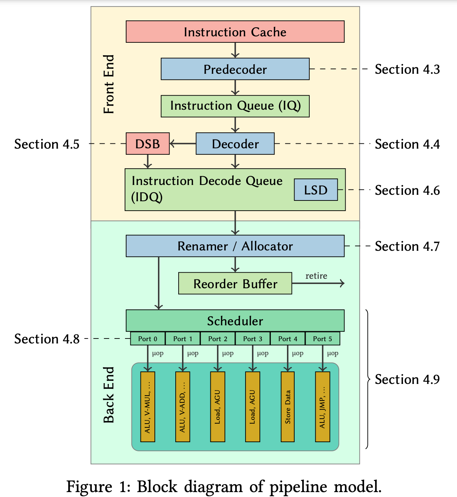

+++
Sources = [
"https://en.wikipedia.org/wiki/Pipeline_stall",
"https://en.wikipedia.org/wiki/Micro-operation",
"https://en.wikipedia.org/wiki/Instruction-level_parallelism",
"https://en.wikipedia.org/wiki/Instruction_cycle",
"https://developer.arm.com/documentation/102336/0100/Memory-barriers",
"https://lwn.net/Articles/256433/",
"https://developer.arm.com/documentation/100236/0100/functional-description/cache-behavior-and-cache-protection/coherency-between-data-caches-with-the-moesi-protocol",
"https://lwn.net/Articles/252125/",
"http://infolab.stanford.edu/pub/cstr/reports/csl/tr/95/685/CSL-TR-95-685.pdf",
"https://en.wikipedia.org/wiki/Instruction_pipelining",
"https://en.wikipedia.org/wiki/Hazard_(computer_architecture)",
"https://en.wikipedia.org/wiki/Out-of-order_execution",
"https://arxiv.org/pdf/1810.04610",
"https://en.wikipedia.org/wiki/Instruction_scheduling",
"https://en.wikipedia.org/wiki/CPU_cache",
"https://en.wikichip.org/wiki/intel/microarchitectures/skylake_(client)",
"https://pages.cs.wisc.edu/~markhill/papers/primer2020_2nd_edition.pdf",
"https://en.wikipedia.org/wiki/Classic_RISC_pipeline",

]
authors = [
"Michael Shalitin",

]
math = true
date = "2025-01-11"
categories = [

]
series = [

]
title = "Pipeline & Hazard"
+++

## מבוא

טכניקה נפוצה במעבדים מודרנים היא pipeline, הטכניקה מאפשרת הרצה של הוראות לא תלויות בו זמנית (concurrency) והיא מאפשרת שיפור ביצועים של המעבד.

הרעיון ב-pipeline הוא שכל הוראה בודדת מורכבת מכמה פעולות שניתן להפריד, ולכל סוג של פעולה כזאת יכול להיות רכיב אחר שמטפל בה, וככה ניתן להתחיל את ההוראה הבאה לביצוע עוד לפני שההוראה הקודמת הסתיימה.

הטכניקה מזכירה את שיטת פס ייצור, בפס ייצור אין מכונה או אדם בודד שמייצרים את המוצר מהתחלה ועד הסוף, כל רכיב אחרי רק על פעולה אחת בודדת ופשוטה יחסית וכל הפעולות האלו מתרחשות בו זמנית.

לדוגמה פשוטה בביצוע של הוראה של קריאת ערך מהזיכרון, אפשר לפרק את ההוראה למספר חלקים:
1. שליפת ההוראה מהזיכרון
2. פענוח ההוראה
3. ביצוע ההוראה עצמה (קריאת הערך מהזיכרון)

שלושת השלבים האלו הם גרסה מאוד כללית של ביצוע הוראות, והיום מאוחרי כל שלב יש עוד הרבה תת-רכיבים שמאפשרים יעול של הביצוע עצמו.

## Hazards

במקרים רבים יש בעיות שמרחשות ואי אפשר להשלים את הביצוע של ההוראות ב-clock cycle הנוכחי, למשל במקרה שצריך לשלוף מהזיכרון מידע, אבל בגלל שהזיכרון איטי בהרבה מהמעבדים היום אז לוקח הרבה clock cycle-ים להשלים או למשל כשיש תלות בין הוראות, למשל כשמבצעים כתיבה למשתנה וישר לאחר מכן קוראים אותו, בגלל שב-pipeline הוראות מתחילות לפני שהוראות קודמות עוד מסתיימות אז יכול לקרות מצב שהוראה מסתמכת על הוראה קודמת ואז יש בעיה כי ההוראה הקודמת לא הסתיימה ולכן הביצוע כמו שהוא יגיע לתוצאה שגויה.

מקרים כאלו מתחלקים למספר סוגי hazard-ים:
- Data hazard
- Structural hazard
- Control hazard

יש כל מיני טכניקות לפתור hazard-ים, כמו stalling (המתנה לפני המשך העיבוד), forwarding (העברת תוצאות ישירות למודול הזקוק להן) ו-branch prediction (ניחוש מוקדם של נתיב ה-branch בתוכנית).

טכניקת ה-stalling היא די פשוטה וכבר קיימת די הרבה זמן אבל לא מאוד יעילה, בכל פעם שמתרחש stall זה יכול לגרום לבועות ב-pipeline, בגלל שהרכיב שתקוע לא מעביר את הביצוע לרכיב הבאה ב-pipeline אז הרכיב שאמור להיות הבא ב-pipeline נשאר פנוי ולא מבצע עבודה.
בעבר בחלק מהארכיטקטורות כדי לבצע stall בביצוע של הוראות שהיה ידוע שיגרמו מראש ל-stalling הקומפיילר הכניס מראש הוראות nop לקובץ הבינארי אבל זה גרם להרחבה מיותרת של הבינארי עצמו (דבר שפוגע בעצמו ב-pipeline בגלל שזה גורם העמסה בשליפה של הוראות מהזיכרון)

### Structural Hazards:

ה-Structural hazards מתרחשים כאשר שתי הוראות מנסות להשתמש באותם משאבים בו-זמנית. במעבדים עם pipeline קלאסי, הבעיה נפתרת על ידי שכפול חומרה, כמו הוספת יחידות חישוב נוספות כדי למנוע התנגשות בשימוש ב-ALU.

### Data Hazards:

ה-Data hazards מתרחשים כאשר הוראה אחת מנסה להשתמש בנתונים שעדיין לא זמינים בקובץ הרגיסטרים או בזיכרון. ניתן לפתור את הבעיה באמצעות שלושה פתרונות עיקריים:

1. העברת מידע (Bypassing או Operand Forwarding): העברת תוצאה של הוראה אחת ישירות להוראה הבאה ב-pipeline, מבלי להמתין לכתיבה ולקריאה לקובץ הרגיסטר.
2. עיכוב ההוראה (Pipeline Interlock): עיכוב ההוראה הבעייתית עד שהנתונים יהיו זמינים. זה מתבצע באמצעות הכנסת בועה (NOP) ב-pipeline.
3. שינוי שם (Register Renaming): תהליך שבו רגיסטרים פיזיים זמניים משמשים להחזקת הערכים של אופרנדים, כך שמספר הוראות יכולות להשתמש בערכים שונים לאותם רגיסטרים לוגיים.

### Control Hazards:

ה-Control hazards קשורים להוראות branch שיכולות לשנות את זרימת התוכנית. ישנן ארבע גישות עיקריות לפתרון בעיה זו:

1. גישת ה-Predict Not Taken: גישה בה מניחים שה-branch לא נלקח, וממשיכים בביצוע ההוראות באופן רציף.
2. גישת ה-Branch Delay Slot: גישה בה הקומפיילר מכניס הוראה בלתי תלויה אחרי branch, כך שהמעבד מבצע אותה במקום להמתין.
3. גישת ה-Branch Prediction: שיטה בה המעבד מנחש מראש אם ה-branch נלקח ולאן יוביל, ואם הגילוי שגוי, התוצאה נשמטת והמעבד טוען מחדש את הכתובת הנכונה.
4. גישת ה-Hazard Detection and Stalling: זיהוי control hazard ועצירת ה-pipeline עד שהנתונים המתאימים יהיו זמינים.

### סוגי Data Hazards:

1. קריאה אחרי כתיבה (RAW): מצב בו קריאה צריכה להחזיר את הערך שנכתב לאחרונה במיקום מסוים. תלות זו מחייבת את ביצוע ההוראות לפי הסדר בתוכנית.
2. כתיבה אחרי כתיבה (WAW): מצב בו כתיבה שנייה על מיקום מסוים צריכה להשאיר את הערך הנכון שנכתב לאחרונה.
3. כתיבה אחרי קריאה (WAR): מצב בו כתיבה יכולה לשנות את הערך שנקרא קודם לכן, ויש למנוע את השינוי עד שהקריאה הושלמה.

כדי להסביר טוב יותר, נציג דוגמה של דיאגרמה כללית ב-high-level של intel core:

בחלק הזה נעבור על המודל ה-pipeline של מעבדי Intel Core האחרונים, תוך התמקדות במבנה ה-front end וה-back end של המעבדים. 

### מבנה ה-pipeline

ה-pipeline של מעבדי Intel Core מורכב משני חלקים עיקריים: ה-front end, שאחראי על שליפת ופענוח הוראות ל-µops, וה-back end, שאחראי על ביצוע ה-µops והוצאתן לפועל. ה-front end כולל מספר רכיבים כגון ה-instruction cache (IC), ה-predecoder, ה-decoder, ה-decode stream buffer (DSB) ו-loop stream detector (LSD). ה-back end מורכב מרכיבים כמו ה-Renamer, המתזמן (scheduler) ויחידות הביצוע (execution units).

### Front End

#### Predecoder

ה-predecoder אחראי על שליפת בלוקים מיושרים מ-instruction cache ופענוח ראשוני של ההוראות. ה-predecoder מפענח מספר הוראות בכל מחזור, אבל קיימות הגבלות במקרים בהם ההוראות חוצות גבול של 16 בתים או כוללות קידומות שינוי אורך (LCP). במקרים אלו, הפענוח עלול להתעכב.

#### Decoder ו-DSB

ה-decoder מפענח את ההוראות ל-µops ושולח אותן ל-IDQ (Instruction Decode Queue). יחידת הפענוח כוללת מפענח מורכב אחד ושלושה מפענחים פשוטים, המאפשרים פענוח של מספר הוראות במקביל. בנוסף, ה-µops המפוענחים נשמרים גם ב-DSB (Decoded Stream Buffer), מה שמאפשר תפוקה גבוהה יותר של לולאות שבהן הפענוח מהווה צוואר בקבוק. ה-DSB פועל על בלוקים של 32 או 64 בתים בהתאם למיקרו-ארכיטקטורה, כאשר ישנם מספר תנאים להגבלת שמירת ה-µops ב-cache.

#### Loop Stream Detector (LSD)

ה-LSD מזהה לולאות שה-µops שלהן מתאימים ל-IDQ, ומזרים אותם ברציפות ללא צורך ב-DSB או במפענחים. המערכת מסוגלת לפתוח את הלולאות במקרים שבהם יש צוואר בקבוק משמעותי, תכונה שנבדקה ונותחה במאמר.

### Back End

#### Renamer

ה-renamer ממפה רגיסטרים ארכיטקטוניים לרגיסטרים פיזיים ומקצה משאבים ל-loads ו-stores. המנגנון כולל גם את טבלת הקצאת המשאבים (RAT), והוא אחראי על הקצאת פורטים ל-µops, תוך שמירה על תלות בין ההוראות.

#### Scheduler

המתזמן עוקב אחר התלות בין ה-µops, ומנפיק אותם לפורטים המתאימים לביצוע ברגע שכל האופרנדים מוכנים. כל פורט מחובר ליחידות פונקציונליות שונות, כמו ALU או AGU, ויכול לקבל µop אחד בכל מחזור.
#### Macro Fusion ו-Micro Fusion

טכניק המיזוג של הוראות בשלב הפענוח, המאפשרת יעילות גבוהה יותר ב-pipeline. 
ה-Macro fusion מאפשר מיזוג של זוגות הוראות, בעוד ש-micro fusion ממזג שני µops מאותה הוראה לטובת ביצוע יעיל יותר.

